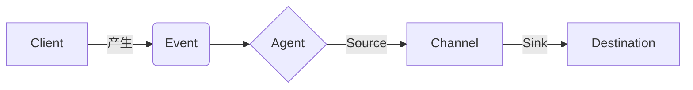

# Flume原理与代码实例讲解

## 1.背景介绍
在大数据时代,海量数据的实时收集与传输是一个巨大的挑战。Apache Flume作为一个分布式、可靠、高可用的海量日志采集、聚合和传输的系统应运而生。本文将深入探讨Flume的原理,并结合代码实例进行讲解,帮助读者全面理解Flume的运作机制和使用方法。

### 1.1 大数据时代数据收集的挑战
#### 1.1.1 数据量大,来源多样
#### 1.1.2 实时性要求高
#### 1.1.3 容错性与可靠性要求高

### 1.2 Flume的诞生
#### 1.2.1 Flume的起源
#### 1.2.2 Flume的定位和特点

## 2.核心概念与联系

### 2.1 数据流
#### 2.1.1 Event
#### 2.1.2 Flow
### 2.2 Agent
#### 2.2.1 Source
#### 2.2.2 Channel
#### 2.2.3 Sink
### 2.3 Flume架构
#### 2.3.1 简单架构
#### 2.3.2 复杂架构
#### 2.3.3 多层级架构

### 2.4 Flume核心概念关系图


## 3.核心算法原理具体操作步骤

### 3.1 数据接收
#### 3.1.1 Exec Source
#### 3.1.2 Spooling Directory Source 
#### 3.1.3 Taildir Source
#### 3.1.4 Kafka Source

### 3.2 数据缓存
#### 3.2.1 Memory Channel
#### 3.2.2 File Channel
#### 3.2.3 Kafka Channel

### 3.3 数据发送
#### 3.3.1 HDFS Sink
#### 3.3.2 Hive Sink  
#### 3.3.3 Logger Sink
#### 3.3.4 Avro Sink

### 3.4 可靠性保证
#### 3.4.1 事务机制
#### 3.4.2 Failover机制
#### 3.4.3 负载均衡

## 4.数学模型和公式详细讲解举例说明

### 4.1 背压模型
Flume使用背压模型来控制源和通道之间的流量。当通道容量达到阈值时,源将被反压以避免通道溢出。
$Pressure = \frac{ChannelSize}{ChannelCapacity} \times 100\%$

### 4.2 事务模型  
Flume的事务保证了数据传输的一致性和可靠性。事务保证原子性、一致性和持久性。
$$Transaction = Begin \rightarrow [Commit \mid Rollback] \rightarrow End$$

## 5.项目实践：代码实例和详细解释说明

### 5.1 配置文件
```properties
a1.sources = s1
a1.channels = c1
a1.sinks = k1

a1.sources.s1.type = netcat
a1.sources.s1.bind = localhost
a1.sources.s1.port = 9999

a1.sinks.k1.type = logger

a1.channels.c1.type = memory
a1.channels.c1.capacity = 1000
a1.channels.c1.transactionCapacity = 100

a1.sources.s1.channels = c1
a1.sinks.k1.channel = c1
```

### 5.2 代码实现
```java
public class MyApp {
  public static void main(String[] args) {
    // 创建配置对象
    Context context = new Context(); 
    context.put("a1.sources", "s1");
    context.put("a1.sinks", "k1");
    context.put("a1.channels", "c1");
        
    // 配置Source
    context.put("a1.sources.s1.type", "netcat");
    context.put("a1.sources.s1.bind", "localhost");
    context.put("a1.sources.s1.port", "9999");
        
    // 配置Sink
    context.put("a1.sinks.k1.type", "logger");
       
    // 配置Channel
    context.put("a1.channels.c1.type", "memory");
    context.put("a1.channels.c1.capacity", "1000");
    context.put("a1.channels.c1.transactionCapacity", "100");
        
    // 绑定关系
    context.put("a1.sources.s1.channels", "c1");
    context.put("a1.sinks.k1.channel", "c1");
        
    // 创建Agent
    Agent agent = new Agent("a1", context);
        
    // 启动Agent
    agent.start();
  }    
}
```

## 6.实际应用场景

### 6.1 日志收集
Flume可用于收集服务器、应用程序产生的日志,并汇总传输到HDFS、Hive等存储与分析系统。

### 6.2 数据库变更捕获
利用Flume监听数据库的变更,实时捕获变更数据流,用于数据同步、数据分析等场景。  

### 6.3 消息队列数据传输
Flume可作为Kafka等消息队列的下游,将消息队列中的数据可靠地传输到大数据存储与分析系统。

## 7.工具和资源推荐

### 7.1 Flume官方文档
Flume官网提供了详尽的用户手册和开发者指南,是学习和使用Flume的权威资料。

### 7.2 Flume UI工具
类似Apache NiFi的数据流监控工具,提供了可视化的Flume数据流监控与管理功能。

### 7.3 Flume插件
Flume拥有丰富的第三方插件,可以扩展Flume的功能,例如ElasticSearch Sink、Cassandra Sink等。

## 8.总结：未来发展趋势与挑战

### 8.1 云原生环境下的Flume
在云原生、容器化的趋势下,Flume需要适应新的部署和运维方式,提供更灵活的配置管理。

### 8.2 流批一体化
随着Lambda架构向Kappa架构演进,Flume在流批一体化方面将扮演重要角色。

### 8.3 数据安全与隐私
在数据安全和隐私日益受到重视的今天,Flume需要提供数据脱敏、加密等安全机制。

## 9.附录：常见问题与解答

### 9.1 Flume如何保证数据不丢失?
通过Channel的持久化存储、事务机制、Failover机制,Flume可以很好地保证数据不丢失。

### 9.2 Flume性能如何调优?  
可以通过调整Source、Channel、Sink的并行度,批处理大小,以及JVM参数等手段对Flume性能进行调优。

### 9.3 Flume与Kafka的区别?
Flume偏重于数据的可靠传输,Kafka则更侧重于数据的发布订阅和缓存。在数据管道中它们可以互补。

作者：禅与计算机程序设计艺术 / Zen and the Art of Computer Programming