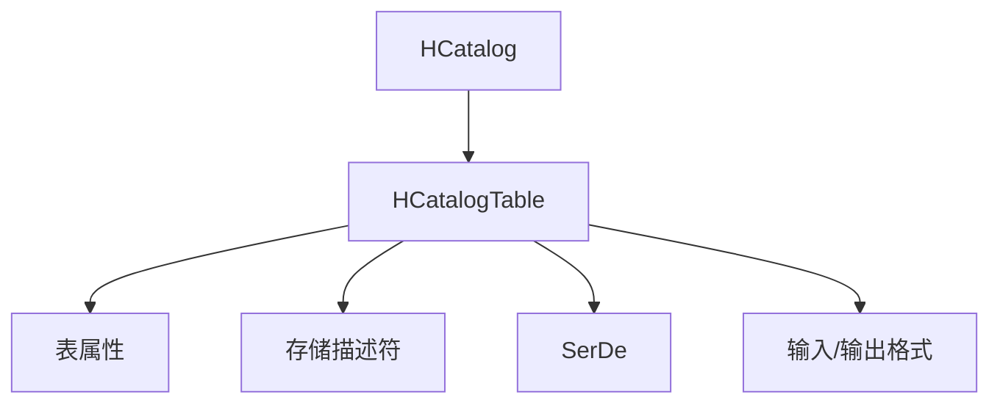
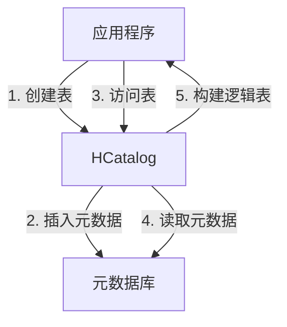
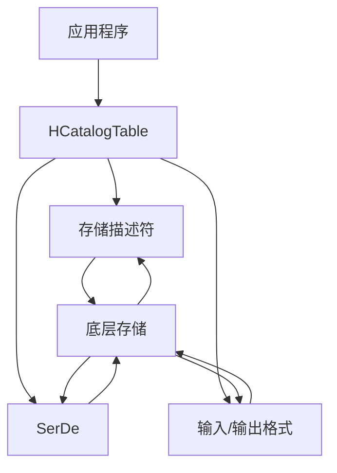
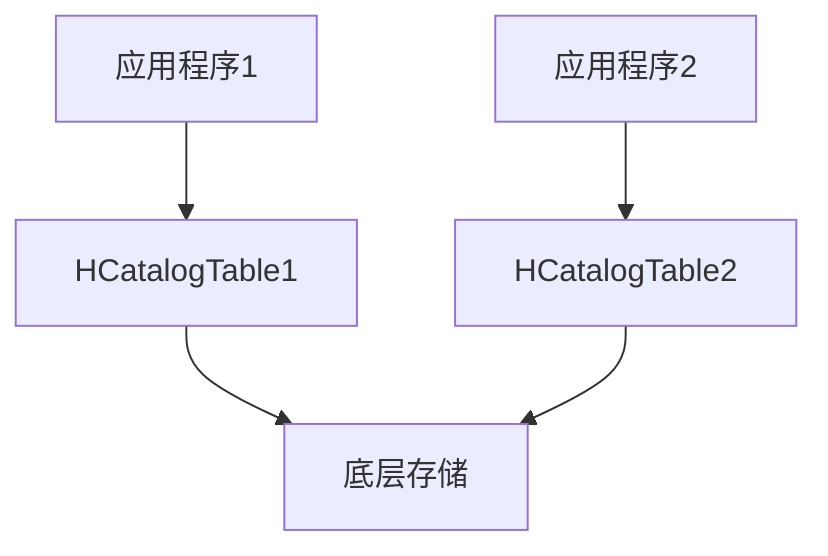

# HCatalogTable：Hive数据抽象化利器

## 1.背景介绍

在大数据时代，数据存储和管理变得前所未有的重要。Apache Hive作为建立在Hadoop之上的数据仓库工具,为结构化数据的存储、查询和分析提供了强大的支持。然而,随着数据量的不断增长和应用场景的多样化,传统的Hive表结构已经无法满足现代数据处理的需求。这就催生了HCatalogTable的诞生,它提供了一种更加灵活和可扩展的数据抽象方式。

HCatalogTable是Hive中的一个关键概念,它将底层存储与数据的逻辑表示分离开来,使得数据可以被多个工具和框架共享和访问。这种抽象不仅提高了数据的可移植性和可重用性,还简化了数据管理和维护的过程。

## 2.核心概念与联系

### 2.1 HCatalog

HCatalog是一个存储管理层,它位于Hive和底层存储系统(如HDFS、HBase等)之间。它提供了一个统一的元数据服务,用于管理不同数据源的元数据,包括表、分区、存储格式等。HCatalog还支持多种编程语言的API,使得不同的应用程序可以轻松地访问和操作数据。

### 2.2 HCatalogTable

HCatalogTable是HCatalog中的核心概念,它代表了一个逻辑表。与传统的Hive表不同,HCatalogTable并不直接绑定到特定的存储格式或位置,而是通过一组元数据来描述数据的结构和属性。这种抽象使得同一份数据可以被不同的应用程序以不同的方式访问和处理。

HCatalogTable由以下几个关键组件组成:

1. **表属性(Table Properties)**: 描述表的元数据信息,如表名、列信息、分区信息等。
2. **存储描述符(Storage Descriptor)**: 定义了数据的存储格式、压缩方式、存储位置等。
3. **SerDe(Serializer/Deserializer)**: 负责将数据序列化和反序列化,支持多种格式如CSV、JSON、Avro等。
4. **输入/输出格式(Input/Output Format)**: 指定了读写数据时使用的格式,如TextInputFormat、SequenceFileInputFormat等。

这些组件共同构建了HCatalogTable的数据抽象层,使得应用程序可以专注于数据处理逻辑,而不必关心底层存储细节。



## 3.核心算法原理具体操作步骤

HCatalogTable的核心算法原理主要体现在以下几个方面:

### 3.1 元数据管理

HCatalog通过一个统一的元数据服务来管理不同数据源的元数据信息。这些元数据信息包括表结构、分区信息、存储格式等,被存储在一个关系数据库中(默认为Derby)。

当创建一个新的HCatalogTable时,相关的元数据信息会被插入到元数据库中。而当需要访问这个表时,HCatalog会从元数据库中读取相应的元数据,并根据这些信息构建出一个逻辑表供应用程序使用。



### 3.2 数据抽象

HCatalogTable通过将底层存储与数据的逻辑表示分离开来,实现了数据的抽象。这种抽象主要依赖于以下几个关键组件:

1. **存储描述符(Storage Descriptor)**: 描述了数据的存储格式、压缩方式、存储位置等信息。
2. **SerDe(Serializer/Deserializer)**: 负责将数据序列化和反序列化,支持多种格式如CSV、JSON、Avro等。
3. **输入/输出格式(Input/Output Format)**: 指定了读写数据时使用的格式,如TextInputFormat、SequenceFileInputFormat等。

应用程序在访问数据时,只需要与HCatalogTable进行交互,而不必关心底层存储的具体细节。HCatalog会根据存储描述符、SerDe和输入/输出格式,自动完成数据的读写操作。



### 3.3 数据共享

由于HCatalogTable将数据的逻辑表示与底层存储分离,因此同一份数据可以被多个应用程序以不同的方式访问和处理。这种数据共享机制极大地提高了数据的可重用性和灵活性。

不同的应用程序可以通过创建不同的HCatalogTable来访问同一份底层数据,每个表可以定义不同的存储格式、SerDe和输入/输出格式,从而满足不同的数据处理需求。



## 4.数学模型和公式详细讲解举例说明

在大数据处理中,常常需要对数据进行一些统计和分析操作。HCatalogTable提供了一种灵活的方式来处理这些操作,可以通过定义不同的SerDe和输入/输出格式来实现各种数学模型和公式。

### 4.1 平均值计算

假设我们需要计算一个数据集的平均值,可以使用以下公式:

$$\overline{x} = \frac{\sum_{i=1}^{n}x_i}{n}$$

其中,$x_i$表示数据集中的第$i$个数值,$n$表示数据集的大小。

在HCatalogTable中,我们可以定义一个自定义的SerDe来实现这个公式。具体步骤如下:

1. 实现一个自定义的SerDe类,在反序列化过程中计算出平均值。
2. 创建一个HCatalogTable,并将自定义的SerDe设置为表的SerDe。
3. 在应用程序中,通过访问这个HCatalogTable来获取平均值。

```java
public class AverageSerDe extends AbstractSerDe {
    // 实现反序列化逻辑,计算平均值
    public Object deserialize(Writable data) {
        // ...
        double sum = 0.0;
        int count = 0;
        for (Object value : values) {
            sum += (Double) value;
            count++;
        }
        double average = sum / count;
        return average;
    }
}
```

### 4.2 线性回归

线性回归是一种常用的机器学习模型,用于预测连续型变量。它的数学模型如下:

$$y = \theta_0 + \theta_1x_1 + \theta_2x_2 + ... + \theta_nx_n$$

其中,$y$是预测值,$x_i$是特征值,$\theta_i$是模型参数。

在HCatalogTable中,我们可以定义一个自定义的SerDe来实现线性回归模型。具体步骤如下:

1. 实现一个自定义的SerDe类,在反序列化过程中计算出线性回归模型的预测值。
2. 创建一个HCatalogTable,并将自定义的SerDe设置为表的SerDe。
3. 在应用程序中,通过访问这个HCatalogTable来获取预测值。

```java
public class LinearRegressionSerDe extends AbstractSerDe {
    // 实现反序列化逻辑,计算线性回归预测值
    public Object deserialize(Writable data) {
        // ...
        double prediction = theta0;
        for (int i = 0; i < n; i++) {
            prediction += theta[i] * features[i];
        }
        return prediction;
    }
}
```

通过上面的示例,我们可以看到HCatalogTable提供了一种灵活的方式来实现各种数学模型和公式。只需要定义合适的SerDe和输入/输出格式,就可以将复杂的数据处理逻辑封装到HCatalogTable中,从而简化应用程序的开发和维护。

## 5.项目实践:代码实例和详细解释说明

为了更好地理解HCatalogTable的使用方式,我们来看一个实际的代码示例。在这个示例中,我们将创建一个HCatalogTable来存储和查询JSON格式的数据。

### 5.1 创建HCatalogTable

首先,我们需要创建一个HCatalogTable来描述数据的结构和属性。以下代码展示了如何使用HCatalog客户端API来创建一个表:

```java
// 创建HCatalog实例
HCatClient client = HCatClient.create(conf);

// 定义表属性
List<HCatFieldSchema> cols = Arrays.asList(
    new HCatFieldSchema("id", HCatFieldSchema.Type.INT, ""),
    new HCatFieldSchema("name", HCatFieldSchema.Type.STRING, ""),
    new HCatFieldSchema("age", HCatFieldSchema.Type.INT, "")
);
HCatSchema schema = new HCatSchema(cols);

// 定义存储描述符
HCatStorageDescriptor storageDescriptor = new HCatStorageDescriptor();
storageDescriptor.setSerdeLib("org.apache.hcatalog.data.JsonSerDe");
storageDescriptor.setInputFormat("org.apache.hadoop.mapred.TextInputFormat");
storageDescriptor.setOutputFormat("org.apache.hadoop.hive.ql.io.HiveIgnoreKeyTextOutputFormat");

// 创建表
String tableName = "users";
HCatCreateTableDesc tableDesc = new HCatCreateTableDesc(schema, storageDescriptor)
    .setLocation("/user/hive/warehouse/users")
    .setTableName(tableName);
client.createTable(tableDesc);
```

在上面的代码中,我们首先定义了表的列结构,包括列名、数据类型等。然后,我们定义了存储描述符,指定了数据的存储格式(JSON)、输入格式(TextInputFormat)和输出格式(HiveIgnoreKeyTextOutputFormat)。最后,我们将这些信息组合成一个HCatCreateTableDesc对象,并使用HCatClient创建了一个名为"users"的HCatalogTable。

### 5.2 插入数据

接下来,我们可以向刚创建的HCatalogTable中插入一些JSON格式的数据。以下代码展示了如何使用Hive客户端API来插入数据:

```java
// 创建Hive客户端
HiveClient client = HiveClient.create(conf);

// 插入数据
String query = "INSERT INTO users (id, name, age) VALUES (1, 'Alice', 25), (2, 'Bob', 30), (3, 'Charlie', 35)";
client.execute(query);
```

在上面的代码中,我们首先创建了一个Hive客户端实例。然后,我们使用一个SQL插入语句向"users"表中插入了三条JSON格式的数据。

### 5.3 查询数据

最后,我们可以使用HCatalogReader来查询HCatalogTable中的数据。以下代码展示了如何查询"users"表中的所有数据:

```java
// 创建HCatalogReader
HCatReader reader = HCatReader.create(conf, "users");

// 查询数据
List<Object> records = new ArrayList<>();
while (reader.next()) {
    records.add(reader.getCurrentValue());
}

// 输出结果
for (Object record : records) {
    System.out.println(record);
}
```

在上面的代码中,我们首先创建了一个HCatalogReader实例,指定要读取的表名为"users"。然后,我们使用reader.next()方法遍历表中的所有记录,并将每条记录添加到一个列表中。最后,我们输出了这个列表中的所有记录。

运行上面的代码,你应该能看到类似如下的输出:

```
{"id":1,"name":"Alice","age":25}
{"id":2,"name":"Bob","age":30}
{"id":3,"name":"Charlie","age":35}
```

通过这个示例,我们可以看到HCatalogTable提供了一种简单而灵活的方式来存储和查询结构化数据。无论底层数据存储在何处,或者使用何种格式,我们都可以通过创建合适的HCatalogTable来访问和操作这些数据。

## 6.实际应用场景

HCatalogTable在实际应用中有着广泛的用途,尤其是在大数据处理和数据湖架构中。以下是一些典型的应用场景:

### 6.1 数据湖

在数据湖架构中,HCatalogTable可以