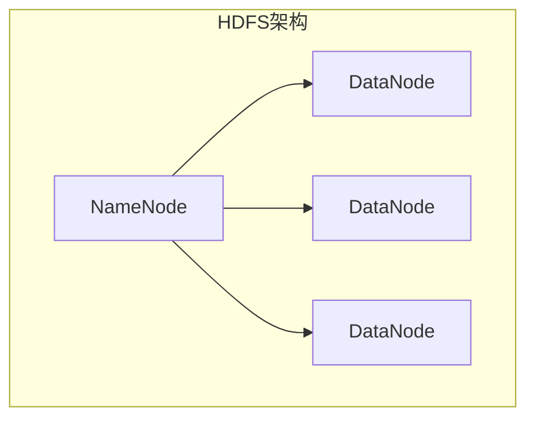
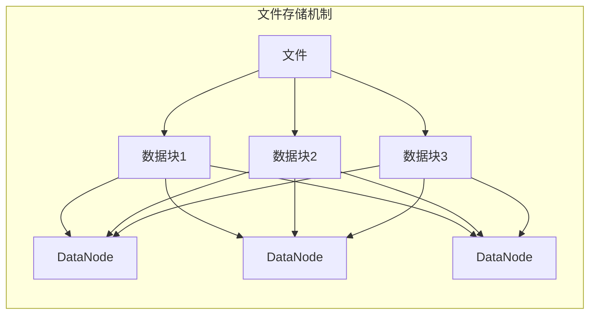
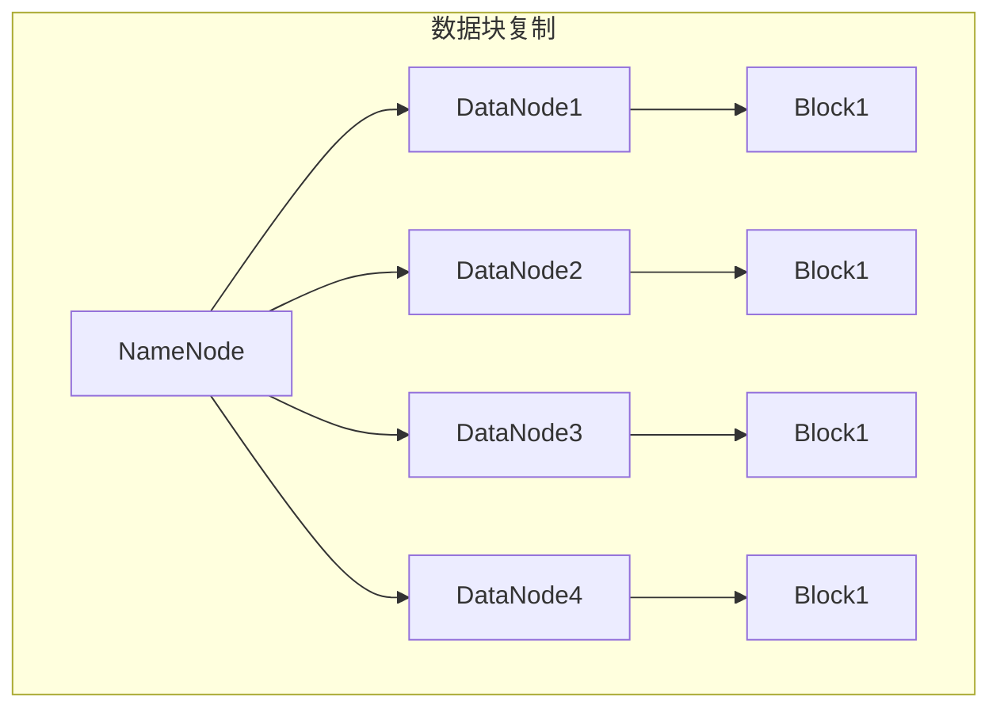
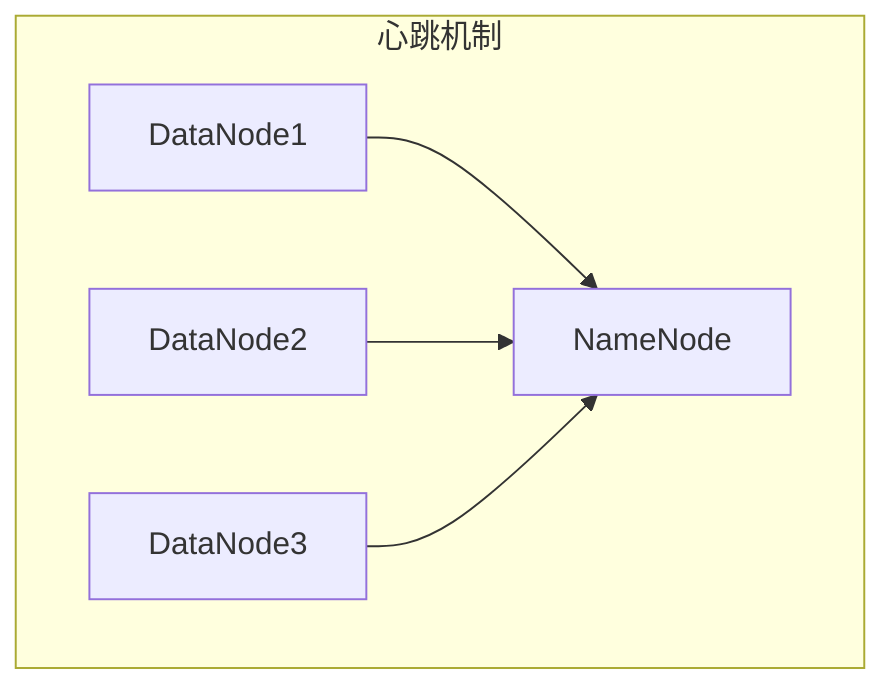

# HDFS原理与代码实例讲解

## 1. 背景介绍

### 1.1 大数据时代的到来

随着互联网、物联网、移动互联网等新兴技术的快速发展,数据呈现出爆炸式增长趋势。传统的数据存储和处理方式已经无法满足日益增长的数据量和计算需求。在这种背景下,大数据时代应运而生。

大数据(Big Data)是指无法使用传统数据库软件工具在合理时间内获取、存储、管理和处理的数据集合。它具有4V特征:Volume(大量)、Variety(多样)、Velocity(高速)和Value(价值)。

### 1.2 分布式存储系统的需求

为了有效地存储和处理大数据,分布式存储系统(Distributed File System)应运而生。它能够将大规模数据集跨多台服务器存储,提供高吞吐量的数据访问能力,并具有良好的容错性和可扩展性。

Apache Hadoop项目是最著名的开源大数据处理平台之一,其中HDFS(Hadoop Distributed File System)是Hadoop生态系统中的核心分布式文件系统,为大数据应用提供可靠、高吞吐量的数据存储服务。

## 2. 核心概念与联系

### 2.1 HDFS架构概览

HDFS采用主从架构,由一个NameNode(名称节点)和多个DataNode(数据节点)组成。

NameNode负责管理整个文件系统的元数据(metadata),如文件目录树、文件与块的映射关系等。它还负责数据块的复制策略和数据块与DataNode的映射关系。

DataNode负责实际存储文件数据块,并定期向NameNode发送心跳信号和块报告,汇报自身状态。



### 2.2 文件存储机制

HDFS将文件划分为一个个数据块(Block),并将这些数据块存储在DataNode上。每个数据块都会有多个副本(默认3个),分布在不同的DataNode上,以提供数据冗余和容错能力。



### 2.3 读写流程

**写数据流程:**

1. 客户端向NameNode请求上传文件
2. NameNode进行文件存储规划,并返回DataNode节点列表
3. 客户端按顺序向DataNode上传数据块
4. 客户端定期通知NameNode上传状态

**读数据流程:**

1. 客户端向NameNode请求读取文件
2. NameNode返回文件元数据和DataNode节点列表
3. 客户端并行从最近的DataNode读取数据块
4. 客户端合并数据块,还原完整文件

## 3. 核心算法原理具体操作步骤

### 3.1 数据块存储策略

HDFS采用固定大小的数据块存储文件,默认数据块大小为128MB。这样做的好处是:

1. 支持存储大文件
2. 提高数据传输吞吐量
3. 提高存储利用率

HDFS会根据副本数量和机架感知策略,将数据块副本分布在不同的DataNode上,以提供容错能力和数据局部性。

### 3.2 数据块复制与容错

HDFS采用主备份复制模式,默认复制因子为3。当某个DataNode节点发生故障时,NameNode会自动在其他DataNode上创建新的数据块副本,以保证数据的可靠性。



### 3.3 心跳机制与数据块复制

每个DataNode会定期向NameNode发送心跳信号,报告自身状态。如果NameNode长时间未收到某个DataNode的心跳,就会认为该节点已经失效,并在其他DataNode上复制数据块,以保证数据的可靠性。



## 4. 数学模型和公式详细讲解举例说明

### 4.1 数据块放置策略

HDFS采用机架感知策略来存放数据块副本,以提高数据局部性和容错能力。具体策略如下:

1. 将第一个副本存放在上传文件的DataNode所在节点
2. 将第二个副本存放在与第一个副本不同的机架上的随机节点
3. 将第三个副本存放在与第二个副本不同的机架上的随机节点

这种策略可以用数学模型表示为:

$$
\begin{aligned}
\text{minimize} \quad & \sum_{i=1}^{N} \sum_{j=1}^{M} c_{ij} x_{ij} \\
\text{subject to} \quad & \sum_{j=1}^{M} x_{ij} = 1, \quad \forall i \\
& \sum_{i=1}^{N} x_{ij} \leq 1, \quad \forall j \\
& x_{ij} \in \{0, 1\}, \quad \forall i, j
\end{aligned}
$$

其中:

- $N$ 是机架数量
- $M$ 是每个机架上的节点数量
- $c_{ij}$ 是将数据块副本存放在第 $i$ 个机架的第 $j$ 个节点上的代价
- $x_{ij}$ 是决策变量,如果第 $i$ 个机架的第 $j$ 个节点存放了数据块副本,则为 1,否则为 0

目标函数是最小化数据块副本的总代价,约束条件保证每个数据块副本只能存放在一个节点上,且每个节点最多只能存放一个副本。

### 4.2 数据块大小选择

HDFS数据块的大小对系统性能有重大影响。一般情况下,较大的数据块可以提高数据传输吞吐量,但也会增加数据块复制的开销。反之,较小的数据块可以提高数据局部性,但会增加元数据管理的开销。

假设文件大小为 $F$,数据块大小为 $B$,则文件被划分为 $\lceil F/B \rceil$ 个数据块。每个数据块的复制开销为 $C_r$,元数据管理开销为 $C_m$,则总开销可表示为:

$$
C_{\text{total}} = \lceil F/B \rceil \times (C_r + C_m)
$$

为了最小化总开销,可以对 $B$ 求导:

$$
\frac{\partial C_{\text{total}}}{\partial B} = -\frac{F}{B^2} \times (C_r + C_m)
$$

令导数等于 0,可以得到最优数据块大小 $B^*$:

$$
B^* = \sqrt{\frac{F \times (C_r + C_m)}{C_r + C_m}}
$$

HDFS默认的数据块大小为 128MB,是基于大量实践经验进行优化的结果。

## 5. 项目实践:代码实例和详细解释说明

下面是一个使用HDFS Java API进行文件上传和下载的示例代码,并对关键步骤进行了详细解释。

### 5.1 上传文件到HDFS

```java
// 1. 获取HDFS文件系统实例
Configuration conf = new Configuration();
FileSystem fs = FileSystem.get(new URI("hdfs://namenode:9000"), conf);

// 2. 创建HDFS输入流
Path src = new Path("/local/path/file.txt"); // 本地文件路径
Path dst = new Path("/hdfs/path/file.txt"); // HDFS目标路径
InputStream in = new BufferedInputStream(new FileInputStream(src.toString()));

// 3. 创建HDFS输出流并写入数据
OutputStream out = fs.create(dst, new Progressable() {
    // 进度回调函数
    public void progress() {
        System.out.print(".");
    }
});

// 4. 复制数据
IOUtils.copyBytes(in, out, conf, true);

// 5. 关闭流
in.close();
out.close();
fs.close();
```

**关键步骤解释:**

1. 获取HDFS文件系统实例,需要提供NameNode的地址和端口号。
2. 创建本地文件输入流和HDFS输出流。
3. 调用 `fs.create()` 方法创建HDFS文件并获取输出流,可以传入进度回调函数。
4. 使用 `IOUtils.copyBytes()` 方法将本地文件数据复制到HDFS输出流。
5. 关闭所有打开的流。

### 5.2 从HDFS下载文件

```java
// 1. 获取HDFS文件系统实例
Configuration conf = new Configuration();
FileSystem fs = FileSystem.get(new URI("hdfs://namenode:9000"), conf);

// 2. 创建HDFS输入流
Path src = new Path("/hdfs/path/file.txt"); // HDFS文件路径
Path dst = new Path("/local/path/file.txt"); // 本地目标路径
InputStream in = fs.open(src);

// 3. 创建本地输出流并写入数据
OutputStream out = new BufferedOutputStream(new FileOutputStream(dst.toString()));

// 4. 复制数据
IOUtils.copyBytes(in, out, conf, false);

// 5. 关闭流
in.close();
out.close();
fs.close();
```

**关键步骤解释:**

1. 获取HDFS文件系统实例。
2. 创建HDFS输入流和本地文件输出流。
3. 调用 `fs.open()` 方法打开HDFS文件并获取输入流。
4. 使用 `IOUtils.copyBytes()` 方法将HDFS文件数据复制到本地输出流。
5. 关闭所有打开的流。

## 6. 实际应用场景

HDFS作为Apache Hadoop生态系统中的核心分布式文件系统,在许多大数据应用场景中发挥着重要作用,包括但不限于:

1. **大数据分析**:HDFS为Hadoop生态系统中的大数据分析工具(如MapReduce、Spark、Hive等)提供可靠、高吞吐量的数据存储服务。
2. **日志处理**:HDFS可以用于存储和处理大规模的日志数据,如Web服务器日志、应用程序日志等。
3. **数据湖**:HDFS可以作为企业数据湖的底层存储层,集中存储各种结构化、半结构化和非结构化数据。
4. **物联网数据**:HDFS可以用于存储和处理来自物联网设备的海量数据,如传感器数据、视频流数据等。
5. **科学计算**:HDFS可以为科学计算领域提供高性能的数据存储和处理能力,如基因组学、气象学等。

## 7. 工具和资源推荐

### 7.1 HDFS命令行工具

HDFS提供了一套命令行工具,可以方便地管理和操作HDFS文件系统。常用命令包括:

- `hdfs dfs -ls` :列出HDFS上的文件和目录
- `hdfs dfs -put` :将本地文件上传到HDFS
- `hdfs dfs -get` :从HDFS下载文件到本地
- `hdfs dfs -rm` :删除HDFS上的文件或目录
- `hdfs dfsadmin -report` :查看HDFS集群状态报告

### 7.2 HDFS Web UI

HDFS提供了基于Web的用户界面,可以直观地查看HDFS集群状态、文件系统信息等。默认情况下,可以通过 `http://namenode:9870` 访问HDFS Web UI。

### 7.3 HDFS监控工具

为了监控HDFS集群的运行状态,可以