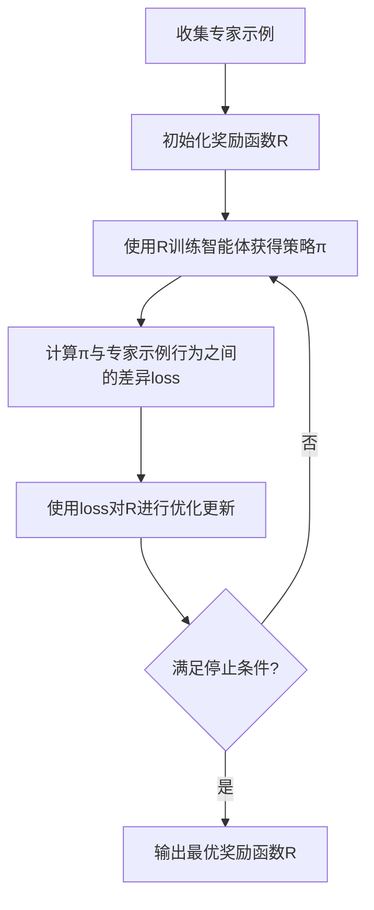

# Inverse Reinforcement Learning原理与代码实例讲解

## 1.背景介绍

### 1.1 强化学习概述

强化学习(Reinforcement Learning, RL)是机器学习的一个重要分支,它关注智能体(Agent)如何通过与环境(Environment)的交互来学习并优化其行为策略,从而最大化预期的累积奖励。在强化学习中,智能体通过尝试不同的行为,观察环境的反馈(奖励或惩罚),并根据这些反馈调整其策略,从而逐步学习到最优的行为方式。

传统的强化学习算法通常假设环境的奖励函数是已知的,并且目标是找到一个策略来最大化这个已知的奖励函数。然而,在很多实际应用场景中,奖励函数往往是未知的或难以精确定义的。这就引出了逆强化学习(Inverse Reinforcement Learning, IRL)的概念。

### 1.2 逆强化学习的定义

逆强化学习是一种从专家示例行为中推断出潜在奖励函数的技术。与传统的强化学习不同,逆强化学习不需要事先明确定义奖励函数,而是通过观察专家的行为示例,来推断出专家在执行这些行为时所优化的潜在奖励函数。一旦推断出这个潜在的奖励函数,就可以将其用于训练智能体,使其学习到与专家相似的行为策略。

## 2.核心概念与联系

### 2.1 马尔可夫决策过程

逆强化学习的理论基础是马尔可夫决策过程(Markov Decision Process, MDP)。MDP是一种用于描述序列决策问题的数学框架,它由以下几个要素组成:

- 状态集合 $\mathcal{S}$: 环境可能处于的所有状态的集合。
- 动作集合 $\mathcal{A}$: 智能体可以执行的所有动作的集合。
- 转移概率 $\mathcal{P}(s'|s,a)$: 在当前状态 $s$ 下执行动作 $a$ 后,转移到下一状态 $s'$ 的概率。
- 奖励函数 $\mathcal{R}(s,a)$: 在状态 $s$ 下执行动作 $a$ 所获得的即时奖励。

在传统的强化学习中,我们假设奖励函数 $\mathcal{R}(s,a)$ 是已知的,目标是找到一个策略 $\pi(a|s)$ 来最大化预期的累积奖励。而在逆强化学习中,我们假设奖励函数是未知的,需要通过观察专家的行为示例来推断出这个潜在的奖励函数。

### 2.2 马尔可夫性假设

逆强化学习中的一个重要假设是马尔可夫性假设,即专家的行为只依赖于当前状态,而与过去的历史无关。这个假设使得我们可以将专家的行为建模为一个马尔可夫决策过程,从而使用逆强化学习算法来推断出潜在的奖励函数。

### 2.3 最优性假设

另一个重要假设是最优性假设,即专家的行为是最优的,或者至少接近最优。这个假设保证了我们推断出的奖励函数能够解释专家的行为,并且可以用于训练智能体学习到与专家相似的行为策略。

## 3.核心算法原理具体操作步骤

### 3.1 算法概述

逆强化学习算法的基本思路是:首先从专家的示例行为中估计出一个初始的奖励函数,然后使用这个奖励函数训练一个智能体,并比较智能体的行为与专家的行为之间的差异。如果差异较大,则需要调整奖励函数,使得训练出的智能体行为更接近专家行为。这个过程反复迭代,直到找到一个能够解释专家行为的最优奖励函数。

### 3.2 算法步骤

1. **收集专家示例**:首先需要收集一组专家在不同状态下执行的行为示例。这些示例可以来自于真实的人类专家,也可以来自于模拟环境中的优化算法生成的示例。

2. **初始化奖励函数**:选择一个合适的函数形式作为初始的奖励函数,例如线性组合函数或神经网络函数。

3. **训练智能体**:使用当前的奖励函数训练一个智能体,使其学习到一个与专家行为相似的策略。常用的训练算法包括策略梯度算法、Q-Learning等。

4. **计算行为差异**:比较智能体的行为与专家的示例行为之间的差异,例如使用某种距离度量或损失函数。

5. **更新奖励函数**:根据行为差异,使用优化算法(如梯度下降)调整奖励函数的参数,使得训练出的智能体行为更接近专家行为。

6. **迭代优化**:重复步骤3-5,直到行为差异足够小或达到其他停止条件。

7. **输出最优奖励函数**:输出经过多次迭代优化后得到的最优奖励函数。

这个过程可以用以下伪代码表示:

```python
初始化奖励函数 R
repeat:
    使用R训练智能体获得策略π
    计算π与专家示例行为之间的差异loss
    使用loss对R进行优化更新
until 满足停止条件
输出最优奖励函数R
```

### 3.3 算法流程图

下面是逆强化学习算法的流程图:



## 4.数学模型和公式详细讲解举例说明

### 4.1 最大熵逆强化学习

最大熵逆强化学习(Maximum Entropy Inverse Reinforcement Learning, MaxEnt IRL)是一种常用的逆强化学习算法,它基于最大熵原理,试图找到一个与专家行为最匹配的奖励函数。

在最大熵逆强化学习中,我们假设专家的行为遵循一个随机策略,并且这个随机策略服从最大熵分布。具体来说,给定一个状态 $s$,专家执行动作 $a$ 的概率为:

$$P(a|s) = \frac{1}{Z(s)}\exp(R(s,a))$$

其中 $R(s,a)$ 是潜在的奖励函数, $Z(s)$ 是配分函数,用于归一化概率值:

$$Z(s) = \sum_{a'\in\mathcal{A}}\exp(R(s,a'))$$

我们的目标是找到一个奖励函数 $R(s,a)$,使得由它导出的策略 $P(a|s)$ 与专家的示例行为最匹配。这可以通过最大化以下似然函数来实现:

$$L(R) = \sum_{\zeta\in\mathcal{D}}\sum_{t=0}^{T}\log P(a_t|s_t)$$

其中 $\mathcal{D}$ 是专家示例轨迹的集合, $\zeta=(s_0,a_0,s_1,a_1,\dots,s_T,a_T)$ 表示一个长度为 $T$ 的示例轨迹, $P(a_t|s_t)$ 是在状态 $s_t$ 下执行动作 $a_t$ 的概率。

为了找到最优的奖励函数 $R^*$,我们可以使用梯度上升法来最大化似然函数:

$$R^* = \arg\max_R L(R)$$

具体的梯度计算公式为:

$$\nabla_R L(R) = \sum_{\zeta\in\mathcal{D}}\sum_{t=0}^{T}(1 - P(a_t|s_t))\nabla_R R(s_t,a_t)$$

通过迭代地更新奖励函数 $R$,直到收敛,我们就可以得到最优的奖励函数 $R^*$。

### 4.2 示例:网格世界中的最大熵逆强化学习

考虑一个简单的网格世界环境,如下图所示:

```
+-----+-----+-----+
|     |     |     |
|  S  |     |     |
|     |     |     |
+-----+-----+-----+
|     |     |     |
|     |     |     |
|     |     |     |
+-----+-----+-----+
|     |     |     |
|     |     |  G  |
|     |     |     |
+-----+-----+-----+
```

在这个环境中,智能体的目标是从起点 S 到达终点 G。我们假设专家的行为是最优的,即总是选择最短路径到达终点。我们的目标是通过观察专家的示例行为,推断出专家在优化的潜在奖励函数。

假设奖励函数的形式为:

$$R(s,a) = \theta_1 f_1(s,a) + \theta_2 f_2(s,a)$$

其中 $f_1(s,a)$ 是一个特征函数,表示当前状态与目标状态之间的距离, $f_2(s,a)$ 是另一个特征函数,表示是否到达了目标状态。$\theta_1$ 和 $\theta_2$ 是需要学习的参数。

我们可以使用最大熵逆强化学习算法来学习这些参数。首先,我们收集专家的示例行为,例如:

```
示例1: S -> 右 -> 右 -> 下 -> G
示例2: S -> 下 -> 下 -> 右 -> 右 -> G
```

然后,我们初始化参数 $\theta_1$ 和 $\theta_2$,并使用它们训练一个智能体。接下来,我们计算智能体的行为与专家示例之间的差异,并使用梯度上升法更新参数 $\theta_1$ 和 $\theta_2$,使得差异最小化。

经过多次迭代,我们可以得到一组最优的参数值,从而推断出专家在优化的潜在奖励函数。在这个简单的示例中,我们期望学习到的奖励函数能够反映出"到达目标状态的奖励很高,距离目标状态越近的奖励也越高"这一直观的规律。

## 5.项目实践:代码实例和详细解释说明

在这一部分,我们将提供一个基于 Python 和 OpenAI Gym 环境的最大熵逆强化学习算法的代码实现示例,并对关键部分进行详细解释。

### 5.1 环境设置

我们使用 OpenAI Gym 中的 FrozenLake 环境作为示例。FrozenLake 是一个简单的网格世界环境,智能体需要从起点到达终点,同时避免掉入冰洞。

```python
import gym
import numpy as np

# 创建 FrozenLake 环境
env = gym.make('FrozenLake-v1')

# 环境参数
n_states = env.observation_space.n  # 状态数量
n_actions = env.action_space.n  # 动作数量
```

### 5.2 收集专家示例

我们使用 Q-Learning 算法训练一个智能体作为专家,并收集它的行为轨迹作为示例数据。

```python
# 使用 Q-Learning 训练专家智能体
expert = ...  # 训练过程省略

# 收集专家示例轨迹
expert_trajectories = []
for _ in range(num_trajectories):
    trajectory = []
    state = env.reset()
    done = False
    while not done:
        action = expert.act(state)
        next_state, reward, done, _ = env.step(action)
        trajectory.append((state, action, reward))
        state = next_state
    expert_trajectories.append(trajectory)
```

### 5.3 最大熵逆强化学习实现

接下来,我们实现最大熵逆强化学习算法。

```python
import torch
import torch.nn as nn
import torch.optim as optim

# 定义奖励函数模型
class RewardModel(nn.Module):
    def __init__(self, n_states, n_actions, hidden_size=32):
        super(RewardModel, self).__init__()
        self.fc1 = nn.Linear(n_states + n_actions, hidden_size)
        self.fc2 = nn.Linear(hidden_size, 1)
        self.relu = nn.ReLU()

    def forward(self, state, action):
        x = torch.cat([state, action], dim=1)
        x = self.relu(self.fc1(x))
        reward = self.fc2(x)
        return reward

# 最大熵逆强化学习算法
def maxent_irl