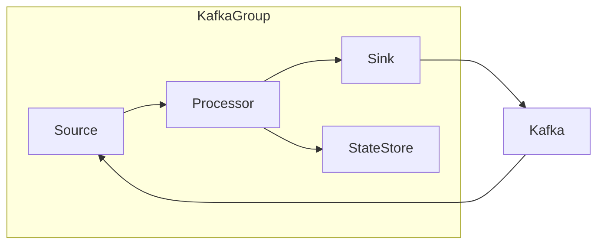

# KafkaGroup：实现高效的数据流处理

## 1.背景介绍

在当今大数据时代，数据是企业的核心资产之一。随着数据量的快速增长,传统的批处理系统已经无法满足实时数据处理的需求。因此,构建高效、可扩展的数据流处理系统变得至关重要。Apache Kafka是一个分布式流处理平台,它提供了一种统一、高吞吐量、低延迟的数据管道,能够实时处理大规模数据流。KafkaGroup是一种基于Kafka的数据流处理框架,旨在简化Kafka的使用,提高数据处理效率。

## 2.核心概念与联系

### 2.1 Kafka核心概念

Kafka是一个分布式流处理平台,主要由以下几个核心概念组成:

1. **Topic**: 一个Topic可以被认为是一个数据流的载体,生产者将消息发送到Topic中,消费者从Topic中消费消息。

2. **Partition**: 每个Topic可以被分为多个Partition,每个Partition中的消息是有序的。Partition可以分布在不同的Broker上,提高了并行处理能力。

3. **Broker**: Kafka集群由多个Broker组成,每个Broker存储部分Topic的Partition。

4. **Producer**: 生产者负责将消息发送到Kafka集群中。

5. **Consumer**: 消费者从Kafka集群中消费消息。

6. **Consumer Group**: 消费者可以组成一个Consumer Group,每个Consumer Group中的消费者只消费Topic的一部分Partition。

### 2.2 KafkaGroup概念

KafkaGroup是一个基于Kafka的数据流处理框架,它提供了以下核心概念:

1. **Source**: 数据源,用于从Kafka中消费数据。

2. **Sink**: 数据目的地,用于将处理后的数据写入Kafka或其他存储系统。

3. **Processor**: 数据处理器,用于对数据进行转换和处理。

4. **Topology**: 定义了数据流的处理流程,包括Source、Processor和Sink的组合。

5. **State Store**: 用于存储处理过程中的状态数据,如窗口聚合等。

这些概念相互关联,构成了KafkaGroup的核心架构,如下图所示:



## 3.核心算法原理具体操作步骤

KafkaGroup的核心算法原理是基于Kafka的消费者组(Consumer Group)和流处理API(Streams API)实现的。下面是具体的操作步骤:

### 3.1 创建Topology

首先,需要定义一个Topology,描述数据流的处理流程。Topology由Source、Processor和Sink组成,可以使用KafkaGroup提供的API进行构建。

```java
StreamsBuilder builder = new StreamsBuilder();
KStream<String, String> stream = builder.stream("input-topic");
KStream<String, String> processed = stream.mapValues(value -> processData(value));
processed.to("output-topic");
Topology topology = builder.build();
```

在上面的示例中,我们从一个名为"input-topic"的Kafka Topic中消费数据,对数据进行处理,然后将处理后的数据写入一个名为"output-topic"的Kafka Topic。

### 3.2 创建KafkaGroup实例

接下来,需要创建一个KafkaGroup实例,并将Topology传入其中。

```java
Properties props = new Properties();
props.put(StreamsConfig.APPLICATION_ID_CONFIG, "my-app");
props.put(StreamsConfig.BOOTSTRAP_SERVERS_CONFIG, "kafka-broker:9092");
KafkaGroup streams = new KafkaGroup(topology, props);
```

在创建KafkaGroup实例时,需要设置一些配置参数,如应用程序ID和Kafka Broker地址等。

### 3.3 启动KafkaGroup

最后,启动KafkaGroup实例,开始处理数据流。

```java
streams.start();
```

KafkaGroup会自动创建消费者组,从Kafka中消费数据,并根据定义的Topology进行处理。处理后的数据会写入到指定的Sink中,如Kafka Topic或其他存储系统。

### 3.4 优雅关闭

在应用程序退出时,需要优雅地关闭KafkaGroup实例,确保数据处理完成并正确地提交偏移量。

```java
streams.close();
```

通过上述步骤,我们可以使用KafkaGroup快速构建基于Kafka的数据流处理应用程序。KafkaGroup提供了简洁的API,屏蔽了底层的复杂性,使开发者能够专注于业务逻辑的实现。

## 4.数学模型和公式详细讲解举例说明

在数据流处理中,常常需要对数据进行聚合和统计分析。KafkaGroup提供了基于窗口的聚合功能,可以对流数据进行滚动聚合。下面我们将介绍窗口聚合的数学模型和公式。

### 4.1 窗口类型

KafkaGroup支持以下几种窗口类型:

1. **Tumbling Window**: 滚动窗口,窗口之间没有重叠。

2. **Hopping Window**: 跳跃窗口,窗口之间可以有重叠。

3. **Sliding Window**: 滑动窗口,每次新数据到来时,窗口向前滑动一个时间单位。

4. **Session Window**: 会话窗口,根据数据的活动时间自动合并窗口。

下面以Tumbling Window为例,介绍窗口聚合的数学模型。

### 4.2 Tumbling Window数学模型

假设我们有一个数据流$\{x_1, x_2, \ldots, x_n\}$,需要对每个窗口大小为$w$的数据进行聚合。我们定义窗口函数$f(x_i, w)$表示将$x_i$映射到对应的窗口编号。

$$f(x_i, w) = \lfloor \frac{t_i}{w} \rfloor$$

其中,$t_i$表示$x_i$的时间戳,$ \lfloor \cdot \rfloor $表示向下取整操作。

对于每个窗口$j$,我们定义聚合函数$g(X_j, \phi)$,其中$X_j$是窗口$j$中的所有数据,$\phi$是聚合操作,如求和、计数等。

$$X_j = \{x_i | f(x_i, w) = j\}$$
$$g(X_j, \phi) = \phi(X_j)$$

通过上述公式,我们可以对流数据进行滚动聚合。例如,如果我们需要计算每个1小时的数据总和,可以定义$w=3600$秒,聚合操作$\phi$为求和操作。

### 4.3 代码示例

下面是一个使用KafkaGroup进行窗口聚合的代码示例:

```java
StreamsBuilder builder = new StreamsBuilder();
KStream<String, Long> stream = builder.stream("input-topic");

// 定义1小时的Tumbling Window
Duration windowSize = Duration.ofHours(1);
TimeWindows timeWindows = TimeWindows.ofSizeWithNoGrace(windowSize);

// 对每个窗口进行求和聚合
KTable<Windowed<String>, Long> aggregated = stream
    .groupByKey()
    .windowedBy(timeWindows)
    .aggregate(
        () -> 0L, // 初始化聚合值为0
        (key, value, aggregate) -> aggregate + value, // 聚合操作为求和
        Materialized.with(Serdes.String(), Serdes.Long())
    );

// 将聚合结果写入Kafka Topic
aggregated.toStream().to("output-topic", Produced.with(windowedSerdes, Serdes.Long()));
```

在上面的示例中,我们定义了一个1小时的Tumbling Window,对每个窗口中的数据进行求和聚合。最后,将聚合结果写入到一个Kafka Topic中。

通过KafkaGroup提供的窗口聚合API,我们可以方便地对流数据进行各种统计分析,满足不同的业务需求。

## 5.项目实践:代码实例和详细解释说明

为了更好地理解KafkaGroup的使用,我们将通过一个实际项目来进行说明。在这个项目中,我们将构建一个实时流量监控系统,用于统计网站的访问量。

### 5.1 项目需求

我们的实时流量监控系统需要满足以下需求:

1. 从Kafka中消费网站访问日志数据。
2. 对访问日志进行解析和清洗,提取出有效的访问信息。
3. 统计每个页面的实时访问量,包括PV(页面浏览量)和UV(独立访客数)。
4. 将统计结果写入Kafka,供其他系统进行进一步处理和展示。

### 5.2 数据模型

我们假设网站访问日志的格式如下:

```
192.168.1.1 - - [01/Jan/2023:00:00:01 +0800] "GET /index.html HTTP/1.1" 200 1024
```

每条日志包含以下字段:

- 客户端IP地址
- 时间戳
- 请求方法和URL
- HTTP状态码
- 响应大小

我们需要从日志中提取出时间戳、URL和IP地址等有效信息。

### 5.3 代码实现

下面是使用KafkaGroup实现实时流量监控系统的代码:

```java
// 定义Topology
StreamsBuilder builder = new StreamsBuilder();
KStream<String, String> stream = builder.stream("access-log-topic");

// 解析和清洗日志数据
KStream<String, AccessLog> accessLogStream = stream.mapValues(logValue -> parseAccessLog(logValue));

// 统计PV
KGroupedStream<String, AccessLog> groupedByUrl = accessLogStream.groupBy(
    (key, value) -> value.getUrl(),
    Grouped.with(Serdes.String(), AccessLogSerde())
);
KTable<Windowed<String>, Long> pvCount = groupedByUrl
    .windowedBy(TimeWindows.ofSizeWithNoGrace(Duration.ofMinutes(1)))
    .count(Materialized.as("pv-count"));

// 统计UV
KGroupedStream<String, AccessLog> groupedByUrlAndIp = accessLogStream.groupBy(
    (key, value) -> value.getUrl() + "|" + value.getIp(),
    Grouped.with(Serdes.String(), AccessLogSerde())
);
KTable<Windowed<String>, Long> uvCount = groupedByUrlAndIp
    .windowedBy(TimeWindows.ofSizeWithNoGrace(Duration.ofMinutes(1)))
    .aggregate(
        () -> 0L,
        (key, value, aggregate) -> 1L, // 计数器加1
        Materialized.with(Serdes.String(), Serdes.Long())
    );

// 将PV和UV结果写入Kafka
pvCount.toStream().to("pv-count-topic", Produced.with(windowedSerdes, Serdes.Long()));
uvCount.toStream().to("uv-count-topic", Produced.with(windowedSerdes, Serdes.Long()));

// 创建KafkaGroup实例并启动
KafkaGroup streams = new KafkaGroup(builder.build(), props);
streams.start();
```

上面的代码实现了以下功能:

1. 从Kafka的"access-log-topic"中消费网站访问日志数据。
2. 使用`parseAccessLog`函数解析和清洗日志数据,提取出有效的访问信息。
3. 使用KafkaGroup的`groupBy`和`windowedBy`操作,对数据进行分组和窗口化处理。
4. 统计每个页面的PV(页面浏览量)和UV(独立访客数)。
5. 将PV和UV统计结果分别写入Kafka的"pv-count-topic"和"uv-count-topic"中。

### 5.4 解释说明

下面我们对代码进行详细解释:

1. **定义Topology**

   我们首先从Kafka的"access-log-topic"中消费原始的访问日志数据,并使用`mapValues`操作对日志进行解析和清洗,提取出有效的访问信息。

2. **统计PV**

   为了统计每个页面的PV,我们使用`groupBy`操作按照URL进行分组,然后使用`windowedBy`操作将数据划分为1分钟的滚动窗口。接着,我们对每个窗口中的数据进行计数,得到PV统计结果。

3. **统计UV**

   统计UV的过程类似,但我们需要同时按照URL和IP地址进行分组,以区分独立访客。我们使用`aggregate`操作对每个窗口中的数据进行计数,得到UV统计结果。

4. **写入Kafka**

   最后,我们将PV和UV统计结果分别写入Kafka的"pv-count-topic"和"uv-count-topic"中,供其他系统进行进一步处理和展示。

通过上述代码,我们成功地使用KafkaGroup构建了一个实时流量监控系统。KafkaGroup提供了简洁的API,使我们能够快速实现复杂的数据流处理逻辑。

## 6.实际应用场景

KafkaGroup作为一个高效的数据流处理框架,在许多领域都有广泛的应用场景,例如:

1. **实时数据