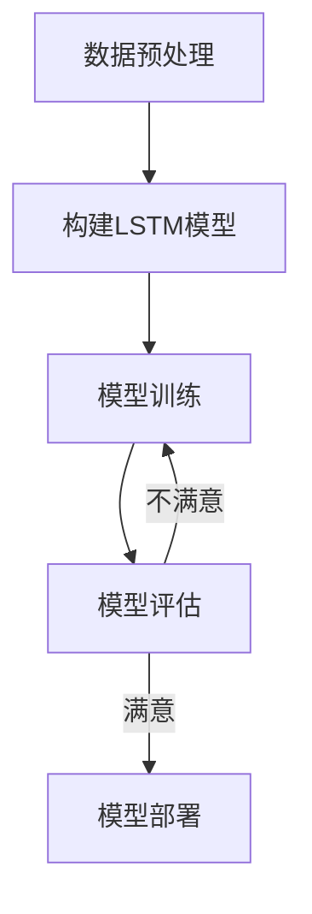

# LSTM的交通应用：智能交通系统的核心

## 1.背景介绍

交通拥堵一直是现代城市面临的一大挑战。随着城市化进程的加速和汽车保有量的不断增长,交通拥堵问题日益严重,给城市的经济发展、环境质量和居民生活带来了诸多负面影响。因此,构建高效、智能的交通系统,实现交通流量的实时监测和预测,对于缓解拥堵、提高道路利用率和交通运营效率至关重要。

在传统的交通管理系统中,交通流量预测主要依赖于历史数据和一些简单的统计模型,难以准确捕捉复杂的交通模式和动态变化。随着人工智能技术的不断发展,尤其是深度学习在时序数据建模方面的突出表现,为交通流量预测提供了新的解决方案。其中,长短期记忆(Long Short-Term Memory,LSTM)神经网络凭借其在处理序列数据方面的优异能力,成为交通流量预测的重要工具。

## 2.核心概念与联系

### 2.1 长短期记忆(LSTM)

LSTM是一种特殊的递归神经网络(Recurrent Neural Network,RNN),专门设计用于处理序列数据,如语音、文本和时序数据。与传统的RNN相比,LSTM通过引入门控机制和记忆单元,可以有效解决梯度消失和梯度爆炸问题,更好地捕捉长期依赖关系。

LSTM的核心组件包括遗忘门(Forget Gate)、输入门(Input Gate)和输出门(Output Gate),它们共同控制着信息的流动和更新。遗忘门决定了从上一时刻传递到当前时刻的信息量,输入门控制着新输入的信息对记忆单元的影响程度,而输出门则确定了输出到下一层的信息。通过这种门控机制,LSTM能够有选择地保留重要信息,忽略无关信息,从而更好地捕捉长期依赖关系。

### 2.2 交通流量预测

交通流量预测是指根据历史交通数据和其他相关因素(如天气、事件等),预测未来某个时间段内道路上的交通流量状况。准确的交通流量预测不仅可以为交通管理部门提供决策依据,还可以为驾驶员提供路线规划和导航服务,从而缓解拥堵、减少燃料消耗和环境污染。

交通流量预测是一个典型的时序预测问题,需要处理复杂的时空数据。传统的预测方法,如历史平均模型、时间序列模型等,难以有效捕捉交通流量的动态变化和非线性特征。而LSTM凭借其在序列建模方面的优势,可以更好地捕捉交通流量的长期依赖关系和周期性模式,从而提高预测精度。

## 3.核心算法原理具体操作步骤

LSTM在交通流量预测中的具体操作步骤如下:

1. **数据预处理**:收集并清洗历史交通流量数据,包括车流量、车速、占有率等指标。同时,也需要收集其他可能影响交通流量的数据,如天气、节假日、工作日等。对这些数据进行标准化或归一化处理,以适应神经网络的输入要求。

2. **构建LSTM模型**:根据问题的具体需求,设计LSTM网络的层数、神经元数量、激活函数等超参数。通常情况下,LSTM网络的输入是一段历史交通流量序列,输出是未来某个时间步的预测值。

3. **模型训练**:将预处理后的数据输入LSTM模型,使用反向传播算法和优化器(如Adam优化器)对模型进行训练,不断调整模型参数,使得预测值和实际值之间的误差最小化。

4. **模型评估**:在独立的测试集上评估模型的预测性能,计算常用的评估指标,如均方根误差(RMSE)、平均绝对百分比误差(MAPE)等。根据评估结果,可以对模型进行进一步调优。

5. **模型部署**:将训练好的LSTM模型部署到实际的交通管理系统中,实时接收新的交通数据,并对未来的交通流量进行预测。预测结果可以用于交通信号优化、路线规划、交通引导等应用场景。

需要注意的是,LSTM模型的性能与数据质量和特征工程密切相关。在实际应用中,还需要考虑数据的时空相关性、周期性等特点,并结合领域知识进行特征提取和模型优化,以获得更好的预测效果。



## 4.数学模型和公式详细讲解举例说明

LSTM的核心是门控机制,通过控制信息的流动来捕捉长期依赖关系。下面我们详细介绍LSTM的数学模型和公式。

假设在时刻 $t$ ,LSTM单元的输入为 $x_t$ ,隐藏状态为 $h_t$ ,记忆单元状态为 $c_t$ 。则LSTM的计算过程如下:

1. **遗忘门(Forget Gate)**: 决定从上一时刻传递到当前时刻的信息量。

$$f_t = \sigma(W_f \cdot [h_{t-1}, x_t] + b_f)$$

其中, $\sigma$ 是sigmoid激活函数, $W_f$ 和 $b_f$ 分别是遗忘门的权重和偏置。

2. **输入门(Input Gate)**: 控制新输入信息对记忆单元的影响程度。

$$i_t = \sigma(W_i \cdot [h_{t-1}, x_t] + b_i)$$
$$\tilde{c}_t = \tanh(W_c \cdot [h_{t-1}, x_t] + b_c)$$

其中, $i_t$ 是输入门的激活值, $\tilde{c}_t$ 是新的候选记忆单元状态。 $W_i$, $W_c$, $b_i$, $b_c$ 分别是对应的权重和偏置。

3. **记忆单元状态更新**:

$$c_t = f_t \odot c_{t-1} + i_t \odot \tilde{c}_t$$

其中, $\odot$ 表示元素wise乘积。新的记忆单元状态 $c_t$ 是上一时刻的记忆单元状态 $c_{t-1}$ 和新的候选记忆单元状态 $\tilde{c}_t$ 的加权和,权重分别由遗忘门 $f_t$ 和输入门 $i_t$ 控制。

4. **输出门(Output Gate)**: 控制输出到下一层的信息。

$$o_t = \sigma(W_o \cdot [h_{t-1}, x_t] + b_o)$$
$$h_t = o_t \odot \tanh(c_t)$$

其中, $o_t$ 是输出门的激活值, $W_o$ 和 $b_o$ 是对应的权重和偏置。隐藏状态 $h_t$ 是记忆单元状态 $c_t$ 经过tanh激活函数和输出门 $o_t$ 的调制。

通过上述公式,LSTM可以有选择地保留重要信息,忽略无关信息,从而更好地捕捉长期依赖关系。在交通流量预测任务中,LSTM可以学习到交通流量的周期性模式、突发事件的影响等长期依赖关系,从而提高预测精度。

## 5.项目实践:代码实例和详细解释说明

为了更好地理解LSTM在交通流量预测中的应用,我们提供了一个基于Python和Keras库的代码示例。该示例使用了加州高速公路性能测量系统(PeMS)的开放数据集,预测洛杉矶市区某条高速公路的交通流量。

### 5.1 数据预处理

```python
import pandas as pd
import numpy as np

# 加载数据
data = pd.read_csv('pems-data.csv')

# 划分训练集和测试集
train_data = data[:'2017']
test_data = data['2018':]

# 标准化数据
scaler = StandardScaler()
train_data_scaled = scaler.fit_transform(train_data)
test_data_scaled = scaler.transform(test_data)
```

首先,我们加载PeMS数据集,并按时间将数据划分为训练集和测试集。然后,使用`StandardScaler`对数据进行标准化,使其均值为0,标准差为1,这有助于提高模型的训练效率和稳定性。

### 5.2 构建LSTM模型

```python
from keras.models import Sequential
from keras.layers import LSTM, Dense

# 定义时间步长和特征维度
time_steps = 24  # 24小时的历史数据
features = 1  # 只有交通流量这一个特征

# 构建LSTM模型
model = Sequential()
model.add(LSTM(64, input_shape=(time_steps, features)))
model.add(Dense(1))

# 编译模型
model.compile(optimizer='adam', loss='mse')
```

我们使用Keras库构建了一个简单的LSTM模型。该模型包含一个LSTM层和一个全连接层。LSTM层的输入形状为`(time_steps, features)`。输出层使用线性激活函数,用于回归任务。我们使用均方误差(MSE)作为损失函数,Adam优化器进行训练。

### 5.3 模型训练和评估

```python
# 生成训练数据和标签
X_train, y_train = create_dataset(train_data_scaled, time_steps)

# 训练模型
model.fit(X_train, y_train, epochs=50, batch_size=32, validation_split=0.2)

# 生成测试数据和标签
X_test, y_test = create_dataset(test_data_scaled, time_steps)

# 评估模型
mse, _ = model.evaluate(X_test, y_test)
rmse = np.sqrt(mse)
print(f'RMSE: {rmse}')
```

我们首先使用`create_dataset`函数从标准化的数据中生成LSTM模型的输入和输出。该函数将数据划分为具有`time_steps`长度的时间窗口,并将每个窗口的数据作为输入,最后一个时间步的值作为输出。

然后,我们使用`model.fit`函数在训练集上训练模型,设置合适的epoch数和batch size。我们还使用20%的训练数据作为验证集,以防止过拟合。

在训练完成后,我们在测试集上评估模型的性能,计算均方根误差(RMSE)。RMSE是一种常用的回归任务评估指标,值越小表示预测越准确。

### 5.4 模型部署和实时预测

在实际应用中,我们需要将训练好的LSTM模型部署到交通管理系统中,实时接收新的交通数据,并对未来的交通流量进行预测。这通常需要将模型保存为可部署的格式(如TensorFlow Serving或ONNX),并与数据管道和前端应用程序集成。

以下是一个简单的示例,展示如何使用训练好的LSTM模型进行实时预测:

```python
# 加载新的交通数据
new_data = get_new_traffic_data()

# 标准化新数据
new_data_scaled = scaler.transform(new_data)

# 生成输入数据
X_new = create_input_sequence(new_data_scaled, time_steps)

# 进行预测
y_pred = model.predict(X_new)

# 反标准化预测结果
y_pred_unscaled = scaler.inverse_transform(y_pred)

# 可视化或存储预测结果
plot_traffic_forecast(y_pred_unscaled)
```

在这个示例中,我们首先获取新的交通数据,并使用之前训练时使用的相同`StandardScaler`对数据进行标准化。然后,我们使用`create_input_sequence`函数从标准化的新数据中生成LSTM模型的输入序列。

接下来,我们使用`model.predict`函数对输入序列进行预测,得到标准化的预测结果。为了获得真实的交通流量值,我们使用`inverse_transform`方法对预测结果进行反标准化。

最后,我们可以将反标准化的预测结果可视化或存储,以供交通管理人员使用。根据预测结果,他们可以采取相应的措施,如调整信号时间、发布交通信息等,从而缓解拥堵,提高道路利用率。

## 6.实际应用场景

LSTM在交通流量预测领域有着广泛的应用前景,可以为智能交通系统提供强大的支持。以下是一些典型的应用场景:

1. **交通信号优化**: 基于对未来交通