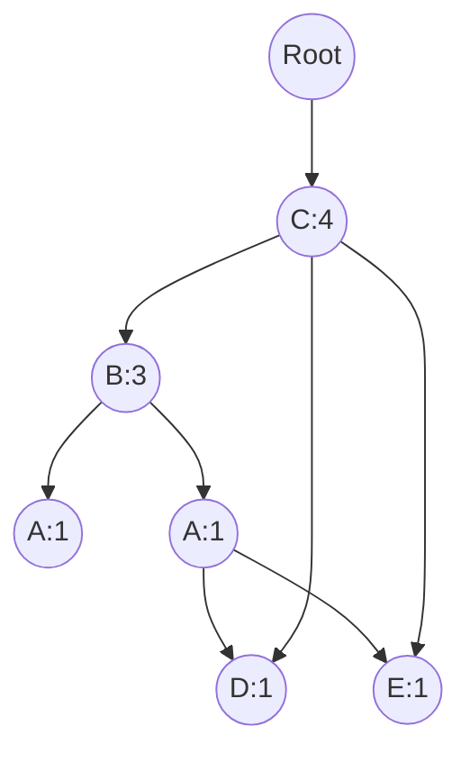

# Mahout频繁项挖掘原理与代码实例讲解

## 1.背景介绍
### 1.1 什么是频繁项挖掘
频繁项挖掘(Frequent Itemset Mining)是数据挖掘领域中一个重要的研究课题,旨在从大规模事务数据集中发现频繁出现的项集。频繁项通常是指在数据集中同时出现的一组项,其支持度(出现的次数)不小于用户指定的最小支持度阈值。

频繁项挖掘在实际应用中有着广泛的需求,如:
- 商品关联分析:通过挖掘顾客购物篮中的商品关联规则,可以更好地进行商品推荐、货架布置等。
- 文本挖掘:将文本看作项集,频繁项挖掘可以用于发现文本主题、热点话题等。
- 序列模式挖掘:在时间序列数据中,频繁项挖掘可以发现频繁出现的序列模式。

### 1.2 Mahout简介
Apache Mahout是一个开源的分布式机器学习库,其目标是让机器学习变得更加简单。Mahout提供了多种机器学习算法的实现,涵盖了聚类、分类、推荐等多个领域,可以与Hadoop、Spark等分布式计算框架无缝集成。

在Mahout中,频繁项挖掘是其重要的组成部分。Mahout实现了多种经典的频繁项挖掘算法,如Apriori、FP-Growth等,可以高效地处理海量数据集。

## 2.核心概念与联系
### 2.1 事务(Transaction)
事务是频繁项挖掘的基本单位,通常表示为一组项(item)的集合。例如,在超市购物篮分析中,每一个顾客的购物清单可以看作一个事务。

### 2.2 项集(Itemset)
项集是一组项的组合。k-项集表示包含k个项的项集。例如,{牛奶,面包}是一个2-项集。 

### 2.3 支持度(Support)
项集X在事务数据集D中的支持度表示为:
$$
Sup(X) = \frac{包含X的事务数}{总事务数}
$$

### 2.4 频繁项集(Frequent Itemset)
如果一个项集的支持度不小于最小支持度阈值(记为min_sup),则称其为频繁项集。即:
$$
Sup(X) \geq min\_sup \Rightarrow X为频繁项集
$$

### 2.5 Apriori性质
频繁项挖掘的一个重要性质是Apriori性质:如果一个项集是频繁的,那么它的所有子集也是频繁的。该性质为频繁项挖掘提供了重要的剪枝策略。

### 2.6 关联规则(Association Rule)  
关联规则挖掘是频繁项挖掘的一个重要应用。一条关联规则形如X→Y,其中X和Y是两个项集且满足X∩Y=∅。

关联规则的强度可以用支持度和置信度来衡量:
- 支持度:$Sup(X \rightarrow Y) = Sup(X \cup Y)$
- 置信度:$Conf(X \rightarrow Y) = \frac{Sup(X \cup Y)}{Sup(X)}$

## 3.核心算法原理具体操作步骤
Mahout中实现了多种频繁项挖掘算法,这里重点介绍经典的Apriori算法和FP-Growth算法。

### 3.1 Apriori算法
Apriori算法基于Apriori性质,采用逐层搜索的思想,具体步骤如下:

1. 扫描事务数据库,得到频繁1-项集的集合L1 
2. k=2
3. while(Lk-1不为空):
   1. 由Lk-1通过连接运算生成k-项集的候选集Ck
   2. 由Apriori性质,删除Ck中所有非频繁的(k-1)-项集,得到Lk
   3. k=k+1
4. 返回所有频繁项集的并集

### 3.2 FP-Growth算法
FP-Growth算法是一种不产生候选项集的频繁项挖掘算法,其核心数据结构是FP-Tree(Frequent Pattern Tree)。

算法主要分为两个步骤:
1. 构建FP-Tree
   1. 扫描事务数据库,得到频繁1-项集和其支持度
   2. 按支持度降序排列频繁项,得到F-List
   3. 再次扫描事务数据库,将每个事务插入FP-Tree
      - 初始时FP-Tree只有一个根节点
      - 对于每个事务,按F-List的顺序选择频繁项
      - 将事务插入FP-Tree,同时记录每个节点的计数
      - 如果有公共前缀,则共享前缀部分的路径
2. 递归挖掘FP-Tree
   1. 对F-List中的每个频繁项ai,构建其条件模式基
   2. 由条件模式基构建ai的条件FP-Tree
   3. 递归挖掘条件FP-Tree,得到所有以ai为后缀的频繁项集

## 4.数学模型和公式详细讲解举例说明
### 4.1 支持度的计算
例如,假设有如下事务数据库:

| TID | Items |
|-----|-------|
| T1  | A,B,C |
| T2  | B,C,D |  
| T3  | A,C,D,E |
| T4  | B,C,E |

则项集{B,C}的支持度为:
$$
Sup(\{B,C\}) = \frac{3}{4} = 0.75
$$

### 4.2 Apriori性质的应用
假设最小支持度为0.5,由Apriori性质可知:
- {A,B}的任意子集{A}和{B}必须也是频繁的
- 如果{A}或{B}是非频繁的,则{A,B}一定是非频繁的

### 4.3 FP-Tree的构建
对于上述事务数据库,假设最小支持度为0.5,F-List为{C:4,B:3,A:2,D:2,E:2}。

构建的FP-Tree如下:



## 5.项目实践：代码实例和详细解释说明
下面以Mahout为例,给出频繁项挖掘的代码实例。

### 5.1 数据准备
首先准备输入数据,每行代表一个事务,项之间用逗号分隔:

```
A,B,C
B,C,D
A,C,D,E
B,C,E
```

### 5.2 Apriori算法
使用Mahout的Apriori算法进行频繁项挖掘:

```java
import org.apache.hadoop.conf.Configuration;
import org.apache.hadoop.fs.Path;
import org.apache.mahout.common.HadoopUtil;
import org.apache.mahout.fpm.pfpgrowth.convertors.string.TopKStringPatterns;
import org.apache.mahout.fpm.pfpgrowth.fpgrowth.FPGrowth;

public class AprioriExample {
  public static void main(String[] args) throws Exception {
    String inputDir = "input";
    String outputDir = "output";
    Configuration conf = new Configuration();
    
    // 设置输入输出路径    
    Path input = new Path(inputDir);
    Path output = new Path(outputDir);
    HadoopUtil.delete(conf, output);
    
    // 设置最小支持度
    int minSupport = 2;
    
    // 运行Apriori算法
    FPGrowth.runPFPGrowth(input,
                          output,
                          minSupport,
                          TopKStringPatterns.class);
  }
}
```

### 5.3 FP-Growth算法
使用Mahout的FP-Growth算法进行频繁项挖掘:

```java
import org.apache.hadoop.conf.Configuration;
import org.apache.hadoop.fs.Path;
import org.apache.mahout.common.HadoopUtil;
import org.apache.mahout.fpm.pfpgrowth.convertors.string.TopKStringPatterns;
import org.apache.mahout.fpm.pfpgrowth.fpgrowth.FPGrowth;

public class FPGrowthExample {
  public static void main(String[] args) throws Exception {
    String inputDir = "input";
    String outputDir = "output";
    Configuration conf = new Configuration();
    
    // 设置输入输出路径
    Path input = new Path(inputDir);
    Path output = new Path(outputDir);
    HadoopUtil.delete(conf, output);
    
    // 设置最小支持度
    int minSupport = 2;
    
    // 设置FP-Growth参数
    int maxHeapSize = 50;
    int numGroups = 1000;
    
    // 运行FP-Growth算法  
    FPGrowth.runPFPGrowth(input,
                          output,
                          minSupport,
                          maxHeapSize,
                          numGroups,
                          TopKStringPatterns.class);
  }
}
```

## 6.实际应用场景
频繁项挖掘在实际中有广泛的应用,例如:

### 6.1 商品关联分析
利用频繁项挖掘技术可以发现商品之间的关联规则,例如"购买面包的顾客有80%也会购买牛奶",这可以帮助商家进行商品推荐、货架布置优化等。

### 6.2 Web点击流分析
将Web点击流看作事务数据,一个Session中的页面序列看作一个事务,频繁项挖掘可以发现频繁访问的页面集合,挖掘用户的访问模式,为网站优化提供依据。

### 6.3 文本主题挖掘
将文本数据集中的每篇文档看作一个事务,词语看作项,频繁项挖掘可以发现文本数据集中的频繁词语组合,进而挖掘文本的主题、热点等。

## 7.工具和资源推荐
- Mahout:http://mahout.apache.org/
- Spark MLlib:https://spark.apache.org/mllib/
- SPMF:http://www.philippe-fournier-viger.com/spmf/
- Kaggle数据集:https://www.kaggle.com/datasets

## 8.总结：未来发展趋势与挑战
频繁项挖掘经过20多年的发展,已经相对成熟,但仍然面临一些挑战和发展机遇:

- 处理海量数据:如何设计高效的分布式频繁项挖掘算法,充分利用MapReduce、Spark等并行计算框架。  
- 挖掘复杂模式:除了传统的频繁项集,如何挖掘频繁子图、频繁子树等更复杂的模式。
- 结果的可解释性:频繁项的数量可能非常庞大,如何提取最有价值的模式,提高结果的可解释性。
- 实时性的提升:如何设计增量式、流式的频繁项挖掘算法,满足实时性需求。

相信通过学界和业界的共同努力,频繁项挖掘技术一定会在更多领域得到广泛应用,为数据价值的挖掘做出更大贡献。

## 9.附录：常见问题与解答
### 9.1 Apriori算法与FP-Growth算法的区别?
- Apriori算法基于Apriori性质,采用逐层搜索的思想,需要产生大量的候选项集。
- FP-Growth算法利用FP-Tree这一紧凑的数据结构来存储频繁项集,避免了候选项集的产生,通常比Apriori算法更高效。

### 9.2 频繁项挖掘与关联规则挖掘的关系?
频繁项挖掘是关联规则挖掘的基础。首先利用频繁项挖掘算法找出所有的频繁项集,然后再由频繁项集产生关联规则。通常关联规则挖掘需要指定最小置信度来过滤规则。

### 9.3 如何设置最小支持度阈值?
最小支持度阈值的选择需要权衡结果的数量和质量。设置过高可能会错失一些有价值但支持度不够高的模式;设置过低则可能产生大量无意义的频繁项集,增加计算开销。通常可以从一个较高的阈值开始,逐步降低直到结果满足需求。

### 9.4 频繁项挖掘的结果如何评估?  
可以采用以下方法评估频繁项挖掘结果的质量:
- 人工检查:抽取一部分频繁项集,由领域专家进行人工评估,判断其是否有意义。
- 覆盖度评估:计算频繁项集