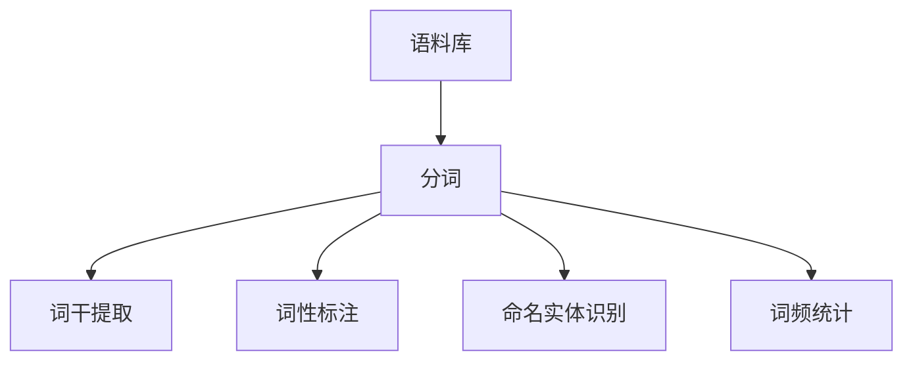

## 1.背景介绍

自从计算机科学的诞生以来，人类一直在寻找一种方法，使得计算机能够理解和处理自然语言。这种需求促使了自然语言处理（Natural Language Processing，简称NLP）领域的发展。在NLP的众多研究和应用中，NLTK（Natural Language Toolkit）库作为一个强大的工具，为我们提供了一种处理文本数据的有效方法。

NLTK是一个领先的平台，用于构建Python程序来处理人类语言数据。它提供了易于使用的接口，用于在超过50种语言中的语料库和词汇资源上进行研究，如WordNet，以及一套丰富的文本处理库，用于分类、标记、语义推理、词干提取和标注等。

## 2.核心概念与联系

在深入了解NLTK之前，我们需要先了解一些核心概念，如语料库、词频、分词、词干提取、词性标注和命名实体识别等。

- **语料库**：语料库是一个大型结构化的文本集合，用于统计分析和语言模型训练。
- **词频**：词频是指一个词在文本中出现的次数，常用于文本分析和信息检索。
- **分词**：分词是将连续的文本分割成一个个独立的词的过程。
- **词干提取**：词干提取是将词的不同形式（如复数、过去式等）归一化到它们的词干或词根的过程。
- **词性标注**：词性标注是为每个词分配一个词性标签（如名词、动词、形容词等）的过程。
- **命名实体识别**：命名实体识别是识别文本中的命名实体，如人名、地名、组织名等。

这些概念在NLTK中都有对应的方法和功能，它们之间的关系可以用下面的Mermaid流程图表示：



## 3.核心算法原理具体操作步骤

接下来，我们将通过一个实例来详细介绍如何使用NLTK进行文本处理。

### 3.1 安装NLTK

首先，我们需要在Python环境中安装NLTK库，可以使用pip进行安装：

```shell
pip install nltk
```

### 3.2 导入语料库

NLTK提供了多种语料库，如Gutenberg、Web和Chat Text等。这些语料库已经被预处理，可以直接用于分析。下面我们导入Gutenberg语料库：

```python
from nltk.corpus import gutenberg
```

### 3.3 分词

分词是NLP的第一步，我们可以使用NLTK的`word_tokenize`函数进行分词：

```python
from nltk.tokenize import word_tokenize

sentence = "NLTK is a leading platform for building Python programs to work with human language data."
tokens = word_tokenize(sentence)
print(tokens)
```

### 3.4 词干提取

词干提取可以通过NLTK的`PorterStemmer`类进行：

```python
from nltk.stem import PorterStemmer

stemmer = PorterStemmer()
stems = [stemmer.stem(token) for token in tokens]
print(stems)
```

### 3.5 词性标注

词性标注可以通过NLTK的`pos_tag`函数进行：

```python
from nltk.tag import pos_tag

tags = pos_tag(tokens)
print(tags)
```

### 3.6 命名实体识别

命名实体识别可以通过NLTK的`ne_chunk`函数进行：

```python
from nltk.chunk import ne_chunk

tree = ne_chunk(tags)
print(tree)
```

### 3.7 词频统计

词频统计可以通过NLTK的`FreqDist`类进行：

```python
from nltk.probability import FreqDist

fdist = FreqDist(tokens)
print(fdist)
```

这就是一个基本的NLTK文本处理流程，通过这个流程，我们可以对文本进行深度分析。

## 4.数学模型和公式详细讲解举例说明

在NLTK中，我们经常需要使用一些数学模型和公式，如TF-IDF、余弦相似度等。

- **TF-IDF**：TF-IDF（Term Frequency-Inverse Document Frequency）是一种用于信息检索和文本挖掘的常用加权技术。TF-IDF是一种统计方法，用以评估一字词对于一个文件集或一个语料库中的其中一份文件的重要程度。字词的重要性随着它在文件中出现的次数成正比增加，但同时会随着它在语料库中出现的频率成反比下降。

  TF-IDF的计算公式如下：

  $$TF(t) = \frac{在某一文档中词条t出现的次数}{所有词条数之和}$$

  $$IDF(t) = log\frac{语料库的文档总数}{包含词条t的文档数+1}$$

  $$TF-IDF(t) = TF(t) \times IDF(t)$$

- **余弦相似度**：余弦相似度是一种用于计算两个非零向量之间的相似度的度量。它的计算公式如下：

  $$cosine\_similarity(A, B) = \frac{A \cdot B}{||A||_2 \times ||B||_2}$$

  其中，$A \cdot B$表示A和B的点积，$||A||_2$和$||B||_2$分别表示A和B的二范数。

这些模型和公式在NLTK中有对应的实现，我们可以直接使用。

## 5.项目实践：代码实例和详细解释说明

接下来，我们将通过一个实例来详细介绍如何使用NLTK进行文本分类。

假设我们有一个电影评论数据集，我们的任务是根据评论的文本内容，预测评论的情感是正面还是负面。

首先，我们需要导入数据集：

```python
from nltk.corpus import movie_reviews

documents = [(list(movie_reviews.words(fileid)), category)
             for category in movie_reviews.categories()
             for fileid in movie_reviews.fileids(category)]
```

然后，我们需要对文本进行预处理，包括分词、词干提取和词性标注等：

```python
from nltk.stem import WordNetLemmatizer
from nltk.corpus import wordnet
from nltk import pos_tag

lemmatizer = WordNetLemmatizer()

def get_simple_pos(tag):
    if tag.startswith('J'):
        return wordnet.ADJ
    elif tag.startswith('V'):
        return wordnet.VERB
    elif tag.startswith('N'):
        return wordnet.NOUN
    elif tag.startswith('R'):
        return wordnet.ADV
    else:
        return wordnet.NOUN

def clean_review(words):
    output_words = []
    for w in words:
        if w.lower() not in stop:
            pos = pos_tag([w])
            clean_word = lemmatizer.lemmatize(w, pos=get_simple_pos(pos[0][1]))
            output_words.append(clean_word.lower())
    return output_words

documents = [(clean_review(document), category) for document, category in documents]
```

接下来，我们需要将文本转换成向量，以便于机器学习模型的训练：

```python
from sklearn.feature_extraction.text import CountVectorizer

categories = [category for document, category in documents]
text_documents = [" ".join(document) for document, category in documents]

count_vec = CountVectorizer(max_features = 2000, ngram_range=(1,2))
x_train_features = count_vec.fit_transform(text_documents)
```

最后，我们可以使用任何机器学习模型来进行训练和预测：

```python
from sklearn.ensemble import RandomForestClassifier

clf = RandomForestClassifier()
clf.fit(x_train_features, categories)
```

这就是一个基本的NLTK项目实践，通过这个实践，我们可以看到NLTK在文本处理和分析中的强大功能。

## 6.实际应用场景

NLTK在许多实际应用场景中都发挥了重要作用，如信息检索、情感分析、文本分类、机器翻译、问答系统等。

- **信息检索**：NLTK可以用于构建索引和查询系统，如搜索引擎。
- **情感分析**：NLTK可以用于分析文本的情感，如分析用户对产品的评价。
- **文本分类**：NLTK可以用于对文本进行分类，如垃圾邮件检测。
- **机器翻译**：NLTK可以用于构建机器翻译系统，如Google翻译。
- **问答系统**：NLTK可以用于构建问答系统，如智能客服。

## 7.工具和资源推荐

在使用NLTK的过程中，有一些工具和资源是非常有用的：

- **Python**：NLTK是一个Python库，因此我们需要熟悉Python语言。
- **Jupyter Notebook**：Jupyter Notebook是一个交互式的编程环境，非常适合数据分析和机器学习。
- **Scikit-learn**：Scikit-learn是一个强大的机器学习库，可以与NLTK配合使用。
- **Gensim**：Gensim是一个用于处理文本数据的库，可以与NLTK配合使用。
- **NLTK官方文档**：NLTK的官方文档是学习NLTK的最好资源。

## 8.总结：未来发展趋势与挑战

随着深度学习和人工智能的发展，NLTK将面临许多新的挑战和机遇。一方面，深度学习提供了一种新的方法来处理文本数据，如词嵌入和神经网络语言模型，这将极大地提高NLP的性能。另一方面，人工智能的应用正在不断扩大，如自动驾驶、智能家居和虚拟助手等，这将带来更多的需求和机会。

在未来，NLTK需要继续发展和完善，以适应这些新的挑战和机会。我们期待NLTK能够提供更多的功能和工具，以满足我们处理和分析文本数据的需求。

## 9.附录：常见问题与解答

在使用NLTK的过程中，可能会遇到一些常见的问题，下面我们来解答一些常见问题：

- **Q: 如何安装NLTK？**
  A: 可以使用pip进行安装：`pip install nltk`。

- **Q: NLTK支持哪些语言？**
  A: NLTK支持超过50种语言，包括英语、法语、德语、西班牙语、葡萄牙语、意大利语、荷兰语、瑞典语、俄语、阿拉伯语、希腊语、希伯来语、土耳其语、日语、韩语、中文等。

- **Q: 如何使用NLTK进行词性标注？**
  A: 可以使用NLTK的`pos_tag`函数进行词性标注。

- **Q: 如何使用NLTK进行命名实体识别？**
  A: 可以使用NLTK的`ne_chunk`函数进行命名实体识别。

以上就是本文的全部内容，希望对你有所帮助。

作者：禅与计算机程序设计艺术 / Zen and the Art of Computer Programming
