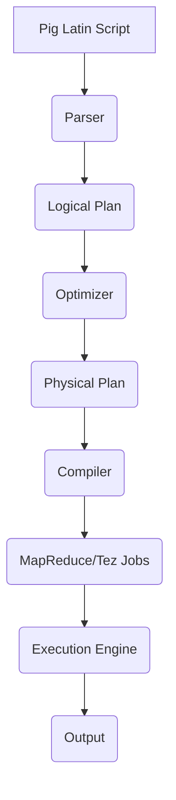

# Pig优化策略原理与代码实例讲解

## 1.背景介绍

### 1.1 什么是Pig

Apache Pig是一种用于并行计算的高级数据流语言和执行框架。它最初由Yahoo!研究院开发,后来捐赠给Apache软件基金会,成为Apache的一个顶级项目。Pig允许开发人员专注于分析任务,而不是编写复杂的MapReduce程序。它提供了一种类似SQL的语言(Pig Latin),用于描述数据分析任务,然后自动将这些任务转换为一系列的MapReduce作业。

### 1.2 Pig的优势

Pig提供了许多优势,使其成为大数据分析的强大工具:

1. **高级语言**: Pig Latin是一种高级语言,比直接编写MapReduce代码更易于理解和编写。

2. **自动优化**: Pig可以自动优化Pig Latin脚本,生成高效的MapReduce作业执行计划。

3. **可扩展性**: Pig在Hadoop集群上运行,可以处理大量数据。

4. **丰富的操作符**: Pig提供了许多内置函数和操作符,用于数据过滤、连接、分组、排序等常见操作。

5. **多种数据格式支持**: Pig支持多种数据格式,如文本文件、SequenceFile、Avro等。

6. **用户定义函数(UDF)**: 开发人员可以编写自定义函数来扩展Pig的功能。

### 1.3 Pig的应用场景

Pig非常适合用于各种大数据分析场景,例如:

- 日志处理和Web数据分析
- 机器学习和数据挖掘
- ETL(提取、转换和加载)
- 数据探索和原型开发

## 2.核心概念与联系

### 2.1 Pig Latin

Pig Latin是Pig的核心,是一种类似SQL的数据流语言。它允许开发人员使用简洁的语句来描述复杂的数据转换和分析任务。Pig Latin语句由一系列操作符组成,每个操作符都接受一个或多个输入数据流,并生成一个或多个输出数据流。

以下是一个简单的Pig Latin示例,用于过滤和投影数据:

```pig
-- 加载数据
records = LOAD 'input.txt' AS (id:int, name:chararray, age:int);

-- 过滤数据
filtered = FILTER records BY age > 30;

-- 投影数据
projected = FOREACH filtered GENERATE name;

-- 存储结果
STORE projected INTO 'output' USING PigStorage();
```

### 2.2 Pig运行架构

Pig运行架构由以下几个主要组件组成:

1. **Parser**: 解析Pig Latin脚本,构建逻辑计划。

2. **Optimizer**: 优化逻辑计划,生成物理计划。

3. **Compiler**: 将物理计划编译为MapReduce作业或Tez作业。

4. **Execution Engine**: 在Hadoop集群上执行MapReduce或Tez作业。

下图展示了Pig的运行架构:



### 2.3 Pig优化策略

Pig的优化器负责将逻辑计划转换为高效的物理计划。它采用了多种优化策略,包括:

1. **投影推导(Projection Pushdown)**: 尽早执行投影操作,减少数据传输。

2. **过滤推导(Filter Pushdown)**: 尽早执行过滤操作,减少数据处理量。

3. **合并MapReduce作业**: 将多个MapReduce作业合并为一个,减少作业启动开销。

4. **分区(Partition)**: 根据分区键对数据进行分区,提高连接效率。

5. **采样(Sampling)**: 在执行昂贵的操作之前,先在数据样本上执行。

6. **索引(Indexing)**: 利用索引加速数据访问。

7. **代数重写(Algebraic Rewrite)**: 重写代数表达式,优化执行计划。

## 3.核心算法原理具体操作步骤

Pig的优化器采用基于规则的优化策略,通过一系列优化规则来转换逻辑计划,生成高效的物理计划。这些优化规则可以分为以下几个阶段:

### 3.1 逻辑计划构建

1. 解析Pig Latin脚本,构建抽象语法树(AST)。
2. 从AST生成初始的逻辑计划。

### 3.2 逻辑计划优化

1. **投影推导(Projection Pushdown)**: 将投影操作尽可能推导到查询计划的早期阶段,减少不必要的数据传输。

2. **过滤推导(Filter Pushdown)**: 将过滤操作尽可能推导到查询计划的早期阶段,减少数据处理量。

3. **合并MapReduce作业**: 将多个MapReduce作业合并为一个,减少作业启动开销。

4. **分区(Partition)**: 根据分区键对数据进行分区,提高连接效率。

5. **采样(Sampling)**: 在执行昂贵的操作之前,先在数据样本上执行,以估计结果大小和执行成本。

6. **索引(Indexing)**: 利用索引加速数据访问。

7. **代数重写(Algebraic Rewrite)**: 重写代数表达式,优化执行计划。

### 3.3 物理计划生成

1. 根据优化后的逻辑计划,生成对应的物理计划。
2. 选择合适的执行引擎(MapReduce或Tez)。
3. 生成执行计划的代码。

### 3.4 执行计划优化

1. **合并MapReduce作业**: 进一步合并MapReduce作业,减少作业启动开销。
2. **选择合适的数据格式**: 根据数据特征选择合适的数据格式,提高I/O效率。
3. **调整作业参数**: 根据数据量和集群资源,调整作业参数(如内存大小、任务数量等)。

### 3.5 执行计划执行

1. 将优化后的执行计划提交到Hadoop集群。
2. 监控作业执行进度和状态。
3. 收集执行结果。

## 4.数学模型和公式详细讲解举例说明

在Pig的优化过程中,涉及到一些数学模型和公式,用于估计执行成本、选择最优执行计划等。下面是一些常见的数学模型和公式:

### 4.1 数据统计信息

Pig会收集数据的统计信息,如记录数、字段大小、数据分布等,这些信息对于优化决策非常重要。常见的统计信息包括:

- $N$: 记录数
- $V$: 不同值的数量
- $\overline{s}$: 平均字段大小(字节)
- $\sigma$: 字段大小的标准差

### 4.2 成本模型

Pig使用基于成本的优化策略,通过估计不同执行计划的成本,选择最优计划。常见的成本模型包括:

1. **I/O成本**:

   $$C_{IO} = N \times \overline{s}$$

   其中$C_{IO}$表示I/O成本,$N$表示记录数,$\overline{s}$表示平均字段大小。

2. **CPU成本**:

   $$C_{CPU} = N \times f(V, \sigma)$$

   其中$C_{CPU}$表示CPU成本,$N$表示记录数,$f(V, \sigma)$是一个与不同值数量$V$和字段大小标准差$\sigma$相关的函数。

3. **网络成本**:

   $$C_{NET} = N \times \overline{s} \times \alpha$$

   其中$C_{NET}$表示网络成本,$N$表示记录数,$\overline{s}$表示平均字段大小,$\alpha$是一个与网络带宽和集群规模相关的系数。

### 4.3 连接策略选择

在执行连接操作时,Pig需要选择合适的连接策略,如基于Hash的重分区连接、基于Replicated连接等。选择策略时,需要估计不同策略的成本,并选择成本最低的策略。

假设有两个关系$R$和$S$,记录数分别为$N_R$和$N_S$,平均字段大小分别为$\overline{s_R}$和$\overline{s_S}$,连接属性的不同值数量分别为$V_R$和$V_S$。则重分区连接的成本估计为:

$$C_{HASH} = N_R \times \overline{s_R} + N_S \times \overline{s_S} + (N_R + N_S) \times \overline{s_R} \times \overline{s_S} \times \max(V_R, V_S)$$

而Replicated连接的成本估计为:

$$C_{REPL} = N_R \times \overline{s_R} + N_S \times \overline{s_S} + N_R \times N_S \times (\overline{s_R} + \overline{s_S})$$

Pig会比较这两种策略的成本,选择成本更低的策略执行连接操作。

## 5.项目实践:代码实例和详细解释说明

接下来,我们通过一个实际的Pig Latin脚本示例,展示Pig的优化策略是如何应用的。假设我们有一个Web服务器日志文件,需要对其进行分析,统计每个IP地址的访问次数。

### 5.1 原始Pig Latin脚本

```pig
-- 加载日志数据
logs = LOAD 'weblog.txt' AS (remoteAddr:chararray, remoteUser:chararray, time:chararray, method:chararray, uri:chararray, status:chararray, bytes:chararray);

-- 过滤出成功的请求
success_logs = FILTER logs BY status == '200';

-- 投影出IP地址
ip_projs = FOREACH success_logs GENERATE remoteAddr;

-- 分组并计数
ip_counts = GROUP ip_projs BY remoteAddr;
ip_counts = FOREACH ip_counts GENERATE group, COUNT(ip_projs);

-- 存储结果
STORE ip_counts INTO 'output' USING PigStorage();
```

### 5.2 逻辑计划优化

Pig的优化器会对上述逻辑计划进行优化,包括投影推导、过滤推导和合并MapReduce作业等策略。

1. **投影推导**:

   由于最终只需要`remoteAddr`字段,因此可以将投影操作推导到查询的早期阶段,减少不必要的数据传输。

2. **过滤推导**:

   同样,过滤操作也可以推导到查询的早期阶段,减少数据处理量。

3. **合并MapReduce作业**:

   原始逻辑计划中包含两个MapReduce作业(过滤+投影和分组+计数),可以将它们合并为一个作业,减少作业启动开销。

优化后的逻辑计划如下:

```pig
-- 加载日志数据
logs = LOAD 'weblog.txt' AS (remoteAddr:chararray, remoteUser:chararray, time:chararray, method:chararray, uri:chararray, status:chararray, bytes:chararray);

-- 过滤出成功的请求,并投影出IP地址
ip_projs = FILTER logs BY status == '200' FOREACH logs GENERATE remoteAddr;

-- 分组并计数
ip_counts = GROUP ip_projs BY remoteAddr;
ip_counts = FOREACH ip_counts GENERATE group, COUNT(ip_projs);

-- 存储结果
STORE ip_counts INTO 'output' USING PigStorage();
```

### 5.3 物理计划生成和执行

根据优化后的逻辑计划,Pig会生成对应的物理计划,选择合适的执行引擎(MapReduce或Tez),并将执行计划提交到Hadoop集群执行。

在执行过程中,Pig还可能进一步优化执行计划,例如合并MapReduce作业、选择合适的数据格式、调整作业参数等。

### 5.4 结果分析

执行完成后,我们可以查看输出结果,获取每个IP地址的访问次数统计信息。同时,也可以分析作业的执行情况,如执行时间、数据处理量等,以评估优化效果。

## 6.实际应用场景

Pig优化策略在许多实际应用场景中发挥着重要作用,帮助提高大数据分析的效率和性能。以下是一些典型的应用场景:

### 6.1 Web日志分析

在Web日志分析中,需要处理大量的Web服务器日志数据,统计访问量、分析用户行为等。Pig可以高效地处理这些数据,并通过优化策略加速分析过程。

### 6.2 推荐系统

推荐系统需要分析大量的用户行为数据,如浏览历史、购买记录等,以生成个性化推荐。Pig可以对这些数据进行高效的处理和分析,为推荐算法