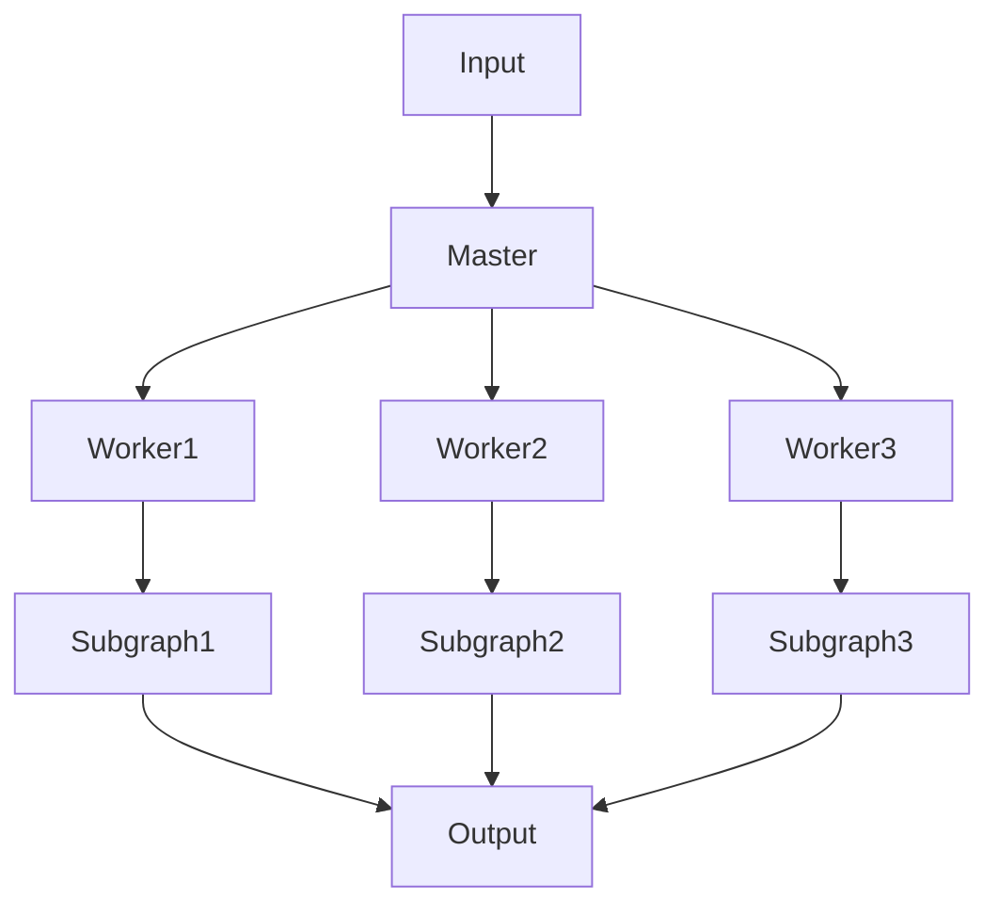
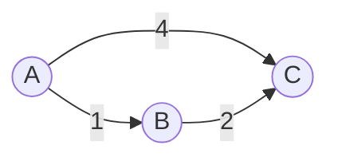

# Pregel实战:开发一个社交网络应用

## 1.背景介绍
### 1.1 图计算的重要性
在当今大数据时代,许多实际问题都可以抽象为图模型,例如社交网络、交通网络、电信网络等。图计算在解决这些问题中扮演着至关重要的角色。然而,传统的计算框架如MapReduce并不适合处理图数据,因为图计算通常需要多次迭代,而MapReduce缺乏高效的迭代机制。

### 1.2 Pregel的诞生
为了更好地支持大规模图计算,Google于2010年提出了Pregel模型。Pregel是一个基于BSP(Bulk Synchronous Parallel)并行计算模型的分布式图处理框架,它为开发者提供了一种编写可扩展、高效的图算法的简单方法。

### 1.3 Pregel的影响力
Pregel的出现极大地推动了图计算技术的发展。许多知名的分布式图处理框架如Apache Giraph、GPS、Mizan等都是基于Pregel模型实现的。同时,Pregel也被应用于解决各种实际问题,如社交网络分析、PageRank计算、最短路径查找等。

## 2.核心概念与联系
### 2.1 Pregel编程模型
#### 2.1.1 顶点
Pregel将图划分为多个顶点(Vertex),每个顶点包含唯一标识符(ID)、当前状态(Value)以及与之相连的出边(Edge)。

#### 2.1.2 超步
Pregel程序由一系列超步(Superstep)组成,类似于MapReduce中的迭代。在每个超步中,所有顶点并行执行相同的用户自定义函数(Compute),并可以向其他顶点发送消息。

#### 2.1.3 消息传递
顶点之间通过发送消息(Message)进行通信。消息将在下一个超步中发送到目标顶点并触发其Compute函数。

#### 2.1.4 同步屏障
每个超步结束时,Pregel引入一个同步屏障(Synchronization Barrier)以确保所有顶点完成当前超步的计算。这种"跃进式"的执行模式简化了并行编程。

### 2.2 Pregel系统架构
#### 2.2.1 Master和Worker
Pregel采用Master-Worker架构。其中Master负责任务调度和全局管理,而多个Worker负责局部子图的存储和计算。



#### 2.2.2 图的划分与分布
Master将输入图数据划分为多个子图(Partition),并分发到不同的Worker上。每个Worker只负责处理自己的局部子图。

#### 2.2.3 容错机制
为了应对Worker失效,Pregel引入了Checkpoint机制。Master会定期让Worker保存计算状态,当某个Worker失效时可以从最近的Checkpoint恢复。

## 3.核心算法原理具体操作步骤
下面以单源最短路径(SSSP)算法为例,讲解Pregel的具体操作步骤。

### 3.1 算法原理
SSSP旨在找到从源顶点到图中所有其他顶点的最短路径。Pregel中的SSSP实现基于Bellman-Ford算法,其核心思想是:每个顶点不断更新自己的距离值,直到所有顶点的距离都收敛。

### 3.2 顶点状态
在SSSP中,每个顶点需要维护以下状态:
- id:顶点ID
- value:当前距离值(源顶点初始为0,其他顶点初始为正无穷)
- edges:出边集合

### 3.3 消息格式
顶点之间传递的消息格式为(targetId,distance),表示由当前顶点出发,到目标顶点targetId的距离为distance。

### 3.4 算法步骤
1. 初始化:将源顶点的value设为0,其他顶点设为正无穷。
2. 第一轮迭代:源顶点向所有邻居发送(targetId,value+edge.weight)的消息。
3. 后续迭代:每个顶点接收上一轮发来的消息,更新自己的value为其中的最小值。如果value有更新,则继续向邻居发送(targetId,value+edge.weight)的消息。
4. 算法终止:当某一轮没有任何消息产生时,说明所有顶点的最短距离都已收敛,算法终止。

### 3.5 Pregel伪代码

```
// 顶点类定义
class Vertex:
    id
    value
    edges[]
    
    Compute(messages[]):
        minDist = value
        for msg in messages:
            minDist = min(minDist, msg.distance)
        if minDist < value:
            value = minDist
            for edge in edges:
                SendMessage(edge.targetId, value+edge.weight)
        VoteToHalt()

// 主程序
Init():
    for v in vertices:
        v.value = INF
    sourceVertex.value = 0

MainLoop():
    repeat:
        for v in vertices:
            v.Compute(incomingMessages[v])
    until NoMessage()
```

## 4.数学模型和公式详细讲解举例说明
SSSP算法可以用如下数学模型来描述:

设图$G=(V,E)$,源顶点为$s$,顶点$v$到源顶点$s$的最短距离为$d(v)$,顶点$u$到$v$的边权重为$w(u,v)$。则对任意顶点$v$,有:

$$
d(v)=
\begin{cases}
0 & v=s \\
min\{d(u)+w(u,v)\,|\,(u,v)\in E\} & v\neq s
\end{cases}
$$

上式表示:源顶点到自身的距离为0;其他顶点的距离等于所有能到达它的邻居顶点的距离加上相应的边权重中的最小值。

举例说明:



设顶点A为源顶点,初始时$d(A)=0,d(B)=d(C)=\infty$。

第一轮迭代后:
- A向B发送(B,1),B更新$d(B)=1$
- A向C发送(C,4),C更新$d(C)=4$

第二轮迭代后:  
- B向C发送(C,3),C更新$d(C)=min(4,3)=3$

此时所有顶点都不再更新,最终结果为$d(A)=0,d(B)=1,d(C)=3$。

## 5.项目实践：代码实例和详细解释说明
下面给出一个使用Apache Giraph(基于Pregel模型的开源图计算框架)实现SSSP的Java代码示例:

```java
// 自定义顶点类
public class SSSPVertex extends Vertex<LongWritable, DoubleWritable, DoubleWritable> {
    @Override
    public void compute(Iterable<DoubleWritable> messages) {
        double minDist = getValue().get();
        for (DoubleWritable msg : messages) {
            minDist = Math.min(minDist, msg.get());
        }
        if (minDist < getValue().get()) {
            setValue(new DoubleWritable(minDist));
            for (Edge<LongWritable, DoubleWritable> edge : getEdges()) {
                double distance = minDist + edge.getValue().get();
                sendMessage(edge.getTargetVertexId(), new DoubleWritable(distance));
            }
        }
        voteToHalt();
    }
}

// 主程序
public class SSSPRunner {
    public static void main(String[] args) throws Exception {
        GiraphConfiguration conf = new GiraphConfiguration();
        conf.setVertexClass(SSSPVertex.class);
        conf.setVertexInputFormatClass(TextVertexInputFormat.class);
        conf.setVertexOutputFormatClass(TextVertexOutputFormat.class);
        GraphJob job = new GraphJob(conf, "Single Source Shortest Path");
        job.run(true);
    }
}
```

代码解释:
- SSSPVertex是自定义的顶点类,继承自Giraph提供的Vertex类。
- compute方法接收上一轮发来的消息,更新自身的最短距离值,并向邻居发送新的消息。
- voteToHalt方法表示当前顶点已经收敛,不再更新。
- SSSPRunner是主程序入口,它配置了作业的各种参数,如顶点类、输入输出格式等,并提交作业运行。

## 6.实际应用场景
Pregel及其变种在许多实际场景中得到了广泛应用,下面列举几个典型案例:

### 6.1 社交网络分析
社交网络可以看作一个图,其中用户是顶点,用户之间的关系是边。基于Pregel可以实现一些常见的社交网络分析算法,如社区发现、影响力计算等。

### 6.2 推荐系统
在推荐系统中,用户和商品可以构成一个二部图。通过在该图上运行随机游走、协同过滤等算法,可以预测用户的潜在兴趣,从而提供个性化推荐。

### 6.3 网页排名
Google的PageRank算法是一种经典的网页排名算法,它基于网页之间的链接关系计算每个网页的重要性。Pregel可以很好地实现分布式PageRank计算。

### 6.4 交通路径规划
将交通网络抽象为图,顶点表示路口,边表示路段,边权重表示路段长度或通行时间。在该图上运行最短路径算法,可以实现实时路径规划和导航。

## 7.工具和资源推荐
### 7.1 Apache Giraph
Apache Giraph是一个成熟的开源分布式图处理框架,完全兼容Pregel模型。它基于Hadoop实现,可以与HDFS、YARN等无缝集成。

官网: http://giraph.apache.org/

### 7.2 Apache Spark GraphX
GraphX是Apache Spark生态系统中的图计算框架,它融合了Pregel和MapReduce的优点,提供了一种基于RDD的图计算模型。

官网: https://spark.apache.org/graphx/

### 7.3 Graph Processing System (GPS)
GPS是斯坦福大学开发的一个开源Pregel实现,用于帮助学生学习Pregel编程模型。它的设计简单紧凑,适合教学和研究使用。

项目主页: http://infolab.stanford.edu/gps/

### 7.4 Pregel+
Pregel+是香港科技大学开发的一个Pregel变种,它在原有模型的基础上进行了一些扩展和优化,如支持动态图处理、增量计算等。

论文: Pregel+: A System for Large-scale Graph Processing

## 8.总结：未来发展趋势与挑战
### 8.1 动态图处理
现实世界中的很多图都是动态变化的,如社交网络中会不断添加新用户和关系。传统的Pregel模型假设图是静态的,无法高效处理动态图。未来需要研究支持动态图处理的增量计算技术。

### 8.2 流式图计算
另一个趋势是将图计算与流计算相结合,以实时处理连续产生的图数据。这对于实时推荐、异常检测等场景非常有价值。如何在Pregel框架中引入流式计算特性,是一个值得探索的方向。

### 8.3 图神经网络
图神经网络(Graph Neural Network, GNN)是深度学习技术与图计算的结合,通过在图上应用类似CNN的卷积操作,可以自动学习顶点的特征表示。GNN与Pregel的融合,有望进一步提升图学习的性能。

### 8.4 高性能图计算引擎
Pregel及其变种在可扩展性、容错性方面表现优异,但在单机性能上还有提升空间。设计高性能的图计算引擎,在减少网络和IO开销的同时提高并行化效率,是未来的一个重要方向。

## 9.附录：常见问题与解答
### Q1: Pregel与MapReduce的区别是什么?
A1: 虽然Pregel和MapReduce都是基于BSP模型的分布式计算框架,但Pregel专门针对图数据进行了优化。具体而言:
- Pregel采用"跃进式"的消息传递方式,更适合迭代计算,而MapReduce缺乏高效的迭代支持。
- Pregel以顶点为中心,顶点之间直接通信;而MapReduce需要通过Shuffle在不同阶段之间传递数据,开销较大。
- Pregel面向图提供了一套顶点中心的API,表达性更强;而MapReduce是通用计算模型,需要用户自己将图算法转化为Map和Reduce操作。

### Q2: Pr