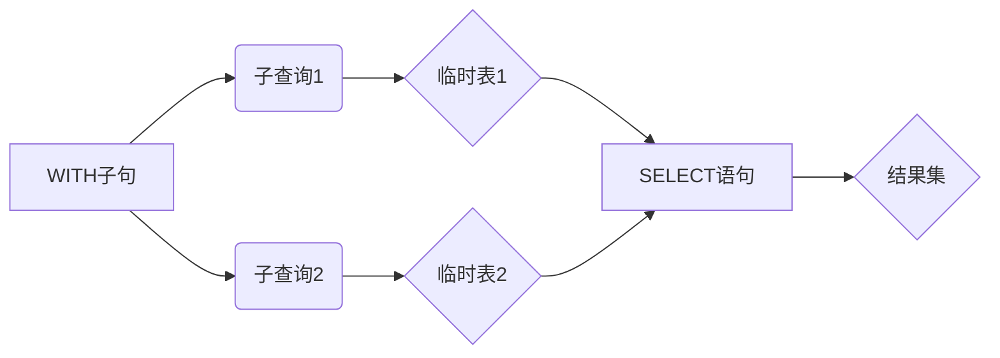

# Presto代码实例：使用WITH，定义临时表

## 1. 背景介绍
在数据分析和查询中，我们经常需要对数据进行多次转换和处理，才能得到最终想要的结果。这种情况下，如果将所有步骤都写在一个SQL语句中，不仅会导致语句过长，难以理解和维护，还会影响查询性能。Presto作为一个分布式SQL查询引擎，提供了WITH子句来解决这个问题，允许我们定义临时表来存储中间结果，使查询逻辑更加清晰和模块化。

### 1.1 Presto简介
Presto是由Facebook开源的一个分布式SQL查询引擎，用于交互式查询海量数据。它可以连接多种数据源，如Hive、Cassandra、关系型数据库等，提供统一的SQL查询接口。Presto的架构由Coordinator、Worker、Catalog等组件组成，支持横向扩展，可以处理PB级别的数据。

### 1.2 WITH子句的作用
WITH子句又称为公用表表达式(Common Table Expression, CTE)，它允许在SQL语句中定义一个临时结果集，该结果集在语句的执行期间一直有效。通过WITH子句，我们可以将复杂的查询分解成多个简单的部分，每一部分都可以单独测试和优化。同时，WITH子句提高了SQL的可读性和可维护性，避免了嵌套子查询导致的复杂度。

### 1.3 使用WITH的优势
- 将复杂查询分解为多个简单、可读的部分
- 避免重复计算，提高查询性能  
- 可以递归调用，处理层次化数据
- 增强SQL的模块化和重用性

## 2. 核心概念与联系
要掌握在Presto中使用WITH定义临时表，需要理解以下几个核心概念：

### 2.1 WITH子句语法
WITH子句位于SELECT语句之前，由一个或多个子查询组成，每个子查询定义一个临时表。语法如下：

```sql
WITH 
  table_name1 AS (query1),
  table_name2 AS (query2),
  ...
SELECT ... FROM table_name1 JOIN table_name2 ...  
```

### 2.2 子查询
WITH子句中的每一部分都是一个独立的子查询，可以包含任意复杂的SELECT、JOIN、GROUP BY等操作。子查询的结果将作为临时表存储在内存中，可以在后续的查询中引用。

### 2.3 临时表
WITH子句定义的临时表只在当前查询的执行期间有效，查询结束后自动释放。临时表可以被多次引用，避免了重复计算。需要注意的是，如果WITH子句中的子查询过于复杂，生成的临时表过大，可能会占用大量内存，影响查询性能。

### 2.4 递归查询
WITH子句还支持递归调用，即子查询可以引用自身定义的临时表。这种特性对于处理层次化数据非常有用，如组织架构、物料清单等。递归查询由一个基础部分和一个递归部分组成，递归部分引用了临时表本身。

下图展示了WITH子句的核心概念及其关系：



## 3. 核心算法原理与具体操作步骤
WITH子句的实现基于查询重写和临时表物化。当Presto解析包含WITH子句的SQL语句时，会按照以下步骤执行：

### 3.1 语法解析
Presto的SQL解析器首先对语句进行语法分析，识别出WITH子句和主查询部分。对于每个子查询，解析器会生成一个对应的逻辑执行计划。

### 3.2 查询重写
接下来，Presto的查询重写器会遍历主查询的执行计划，找到对临时表的引用，将其替换为对应子查询的执行计划。通过这一步骤，WITH子句定义的临时表被"内联"到主查询中。

### 3.3 临时表物化
对于每个子查询，Presto会实际执行该查询，将结果物化为内存中的临时表。临时表的生命周期与当前查询绑定，查询结束后自动释放。

### 3.4 查询执行
重写后的主查询执行计划被传递给Presto的查询执行器，执行器根据执行计划生成具体的任务，分配给集群中的Worker节点执行。Worker节点在执行过程中可以直接访问内存中的临时表数据。

### 3.5 结果合并 
当所有Worker节点完成任务后，Coordinator节点会收集结果数据并进行合并，最终将查询结果返回给客户端。

## 4. 数学模型和公式详细讲解举例说明
WITH子句本身不涉及复杂的数学模型，但在使用WITH子句处理数据时，我们可能会用到一些常见的数学概念和公式，如集合论、关系代数等。

### 4.1 集合论
在关系型数据库中，一张表可以看作一个集合，每行数据是集合的一个元素。WITH子句定义的临时表也可以看作一个集合，子查询的结果集对应临时表的元素。

集合之间可以进行并集(UNION)、交集(INTERSECT)、差集(EXCEPT)等运算。例如，对两个临时表求并集：

```sql
WITH
  tmp1 AS (SELECT * FROM table1 WHERE condition1),
  tmp2 AS (SELECT * FROM table2 WHERE condition2)  
SELECT * FROM tmp1
UNION
SELECT * FROM tmp2;  
```

### 4.2 关系代数
关系代数是一种抽象的查询语言，用于描述关系型数据库的操作。WITH子句中的子查询可以表示为关系代数中的基本操作，如选择(Selection)、投影(Projection)、连接(Join)等。

例如，对一个临时表进行选择和投影操作：

```sql
WITH 
  tmp AS (
    SELECT column1, column2, column3
    FROM table
    WHERE condition
  )
SELECT column1, column2 FROM tmp;
```

可以表示为关系代数：

$$
\pi_{column1, column2}(\sigma_{condition}(table))
$$

其中，$\pi$ 表示投影操作，$\sigma$ 表示选择操作。

### 4.3 聚合函数
在WITH子句中，我们可以使用聚合函数如COUNT、SUM、AVG等对数据进行汇总。例如，计算临时表中某列的平均值：

```sql
WITH
  tmp AS (SELECT * FROM table)
SELECT AVG(column) AS avg_value 
FROM tmp;  
```

AVG函数的数学定义为：

$$
AVG(X) = \frac{\sum_{i=1}^{n} x_i}{n}
$$

其中，$X$ 表示数据集，$x_i$ 表示第 $i$ 个元素，$n$ 为元素总数。 

## 5. 项目实践：代码实例和详细解释说明
下面通过一个具体的例子来说明如何在Presto中使用WITH子句定义临时表。假设我们有两张表，订单表(orders)和产品表(products)，结构如下：

```sql
-- 订单表
CREATE TABLE orders (
  order_id INT,
  customer_id INT,
  product_id INT,
  quantity INT,
  order_date DATE
);

-- 产品表  
CREATE TABLE products (
  product_id INT,
  product_name VARCHAR,
  category VARCHAR,
  price DECIMAL(10, 2)
);
```

现在，我们要统计每个类别中销量前3的产品，并计算它们的总销售额。

### 5.1 定义临时表

首先，使用WITH子句定义两个临时表，一个用于计算每个产品的销量，另一个用于筛选出每个类别的前3名产品。

```sql
WITH
  product_sales AS (
    SELECT 
      p.product_id,
      p.product_name,
      p.category,
      SUM(o.quantity) AS sales
    FROM orders o
    JOIN products p ON o.product_id = p.product_id
    GROUP BY p.product_id, p.product_name, p.category
  ),
  
  top3_products AS (
    SELECT 
      product_id,
      product_name,
      category,
      sales,
      RANK() OVER (PARTITION BY category ORDER BY sales DESC) AS rank
    FROM product_sales  
  )
```

在第一个临时表`product_sales`中，我们通过JOIN操作将订单表和产品表关联起来，然后按照产品ID、产品名称和类别进行分组，计算每个产品的总销量。

在第二个临时表`top3_products`中，我们使用窗口函数RANK()对每个类别中的产品按照销量进行排名。PARTITION BY子句指定按类别进行分区，ORDER BY子句指定按销量降序排列。

### 5.2 查询结果
有了上面定义的两个临时表，我们可以很容易地得到最终的查询结果：

```sql
SELECT
  p.category,
  p.product_name,
  p.sales,
  p.price,
  p.sales * p.price AS total_revenue
FROM top3_products t
JOIN products p ON t.product_id = p.product_id
WHERE t.rank <= 3
ORDER BY p.category, t.rank;  
```

这里，我们将`top3_products`临时表与`products`表再次进行JOIN，筛选出排名前3的产品，并计算它们的总销售额。最后按照类别和排名进行排序。

### 5.3 代码解释
通过使用WITH子句，我们将复杂的查询逻辑分解为两个部分：计算产品销量和筛选前3名产品。每一部分都是一个独立的子查询，生成一个临时表。

在主查询中，我们直接引用了临时表，避免了嵌套的子查询。这种方式使得SQL语句更加清晰和易于理解。同时，临时表的结果可以复用，不需要重复计算，提高了查询效率。

Presto会自动管理临时表的生命周期，在查询结束后自动释放内存。这种方式避免了手动管理中间结果的麻烦，使得开发者可以专注于业务逻辑。

## 6. 实际应用场景
WITH子句在实际的数据分析和查询中有广泛的应用，以下是一些常见的场景：

### 6.1 报表生成
在生成复杂报表时，我们通常需要对数据进行多次转换和汇总。使用WITH子句可以将报表的生成过程分解为多个步骤，每个步骤生成一个临时表，最后将临时表组合起来生成最终的报表。这种方式使得报表的逻辑更加清晰，便于维护和调试。

### 6.2 数据清洗
在进行数据分析之前，我们通常需要对原始数据进行清洗和转换，如去重、填充缺失值、格式化等。使用WITH子句可以将数据清洗的过程分解为多个步骤，每个步骤处理一个具体的任务，生成一个临时表。这种方式使得数据清洗的逻辑更加模块化，便于复用和测试。

### 6.3 数据集成
在数据集成场景中，我们需要将多个数据源的数据合并到一起，进行统一的分析和查询。使用WITH子句可以将不同数据源的数据提取出来，生成临时表，然后在临时表上进行JOIN、UNION等操作，得到最终的结果集。这种方式避免了在主查询中嵌套多个子查询，提高了查询性能。

### 6.4 递归查询
对于一些层次化的数据，如组织架构、物料清单等，我们需要使用递归查询来处理。WITH子句支持递归调用，可以定义一个递归的临时表。在递归查询中，临时表的定义分为两部分：基础部分和递归部分。基础部分定义递归的起始条件，递归部分引用临时表本身，定义递归的终止条件。

## 7. 工具和资源推荐
要熟练掌握在Presto中使用WITH子句，除了理解基本概念和语法外，还需要一些实践和学习资源。以下是一些推荐的工具和资源：

### 7.1 Presto官方文档
Presto官方网站提供了详尽的文档，包括安装指南、SQL语法参考、函数和操作符列表等。其中的"Query语法"部分对WITH子句进行了详细的说明，并给出了一些示例。

官方文档地址：https://prestodb.io/docs/current/

### 7.2 Presto Github仓库
Presto的源代码托管在Github上，仓库中除了代码外，还有一些示例查询和性能测试脚本。通过阅读这些示例，可以加深对Presto查询语法和最佳实践的理解。

Github仓库地址：https://github.com/prestodb/presto

### 7.3 Presto社区
Presto有{"msg_type":"generate_answer_finish","data":"","from_module":null,"from_unit":null}