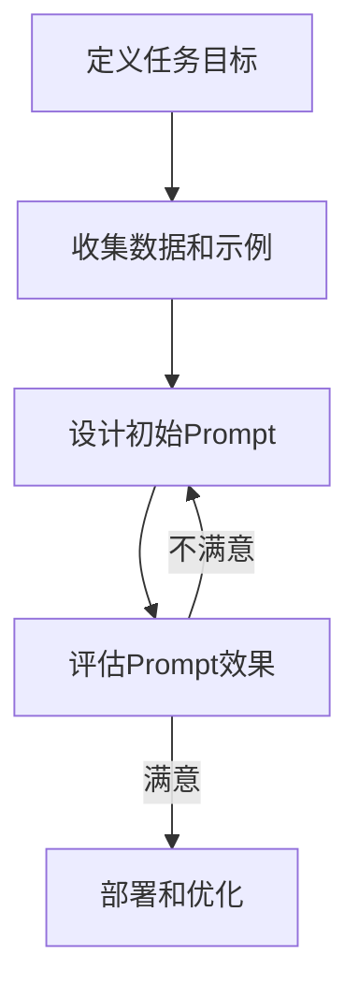

# PromptEngineering：探索大语言模型的无限潜力

## 1.背景介绍

### 1.1 人工智能的崛起

人工智能(AI)技术在过去几年中取得了长足的进步,尤其是在自然语言处理(NLP)和深度学习领域。大型语言模型(LLM)的出现,使得人工智能系统能够更好地理解和生成人类语言,为各种应用场景带来了全新的可能性。

### 1.2 大语言模型的兴起

大语言模型是一种基于深度学习的技术,通过在海量文本数据上进行训练,学习语言的语义和语法规则。这些模型能够生成看似人类写作的连贯文本,并对输入的自然语言查询做出合理响应。GPT-3、PaLM、ChatGPT等知名模型展现了大语言模型在多个领域的强大能力。

### 1.3 Prompt Engineering的重要性

尽管大语言模型表现出色,但如何有效地与它们交互并充分发挥其潜力,是一个新的挑战。Prompt Engineering(提示词工程)应运而生,旨在设计高质量的提示词(Prompt),引导语言模型生成所需的输出。优秀的Prompt不仅能提高模型的性能,还能扩展其应用范围。

## 2.核心概念与联系

### 2.1 什么是Prompt

Prompt是输入给语言模型的文本提示,用于指导模型生成所需的输出。它可以是一个简单的问题、指令或上下文信息。Prompt的设计对模型的表现至关重要,因为模型会根据提示词来调整其输出。


### 2.2 Prompt Engineering的目标

Prompt Engineering的目标是设计高质量的Prompt,以实现以下目的:

1. **改善模型输出质量**: 通过优化Prompt,可以提高模型生成的文本的相关性、连贯性和准确性。
2. **扩展模型应用范围**: 通过设计特定领域的Prompt,可以将语言模型应用于新的场景,如编码、数学推理等。
3. **提高模型可控性**: 通过精心设计的Prompt,可以更好地控制模型的输出方向和风格。
4. **减少模型偏差**: 通过包含多样性和公平性的Prompt,可以缓解模型在某些方面的偏差。

### 2.3 Prompt Engineering的挑战

尽管Prompt Engineering带来了诸多好处,但它也面临一些挑战:

1. **Prompt设计的复杂性**: 设计高质量的Prompt需要深入理解语言模型的工作原理和局限性,这是一项艰巨的任务。
2. **Prompt的可解释性**: 很难解释为什么某个Prompt能够产生良好的结果,而另一个则失败了。
3. **Prompt的可扩展性**: 为每个新应用场景设计Prompt是一个耗时且重复的过程。
4. **Prompt的安全性**: 存在恶意利用Prompt来误导模型的风险,需要采取适当的安全措施。

## 3.核心算法原理具体操作步骤

### 3.1 Prompt Engineering的基本流程

Prompt Engineering通常遵循以下基本流程:



1. **定义任务目标**: 明确Prompt的目的,例如文本生成、问答、代码生成等。
2. **收集数据和示例**: 收集与任务相关的数据和示例,用于Prompt设计和评估。
3. **设计初始Prompt**: 根据任务目标和数据,设计初始的Prompt。
4. **评估Prompt效果**: 使用评估指标(如准确率、流畅度等)评估Prompt的效果。
5. **部署和优化**: 如果Prompt效果满意,则部署到实际应用中;否则,根据评估结果优化Prompt,重复上述步骤。

### 3.2 Prompt设计技术

设计高质量Prompt的技术包括但不限于:

1. **Few-shot Learning**: 在Prompt中提供少量标注好的示例,引导模型学习任务。
2. **Prompt模板**: 使用预定义的Prompt模板,并根据任务需求进行填充和调整。
3. **Prompt注入**: 在Prompt中注入特定的指令或约束,以控制模型的输出。
4. **Prompt组合**: 将多个Prompt组合在一起,以捕获更多的语境信息。
5. **Prompt微调**: 在特定任务上对语言模型进行微调,以提高Prompt的效果。

### 3.3 Prompt评估方法

评估Prompt质量的常用方法包括:

1. **自动评估指标**: 使用如BLEU、ROUGE等指标,评估生成文本与参考文本的相似度。
2. **人工评估**: 由人类专家评估生成文本的质量,如相关性、连贯性、创新性等。
3. **在线评估**: 将Prompt部署到实际应用中,收集用户反馈和使用数据进行评估。
4. **对比评估**: 将不同Prompt的效果进行对比,选择表现最佳的Prompt。

## 4.数学模型和公式详细讲解举例说明

大语言模型通常基于Transformer架构,使用自注意力(Self-Attention)机制来捕获输入序列中的长程依赖关系。自注意力机制的核心是计算查询(Query)、键(Key)和值(Value)之间的相似性分数,并根据这些分数对值进行加权求和。

假设输入序列为$X = (x_1, x_2, \dots, x_n)$,我们需要计算序列中每个位置$i$的新表示$y_i$。自注意力的计算过程如下:

$$\begin{aligned}
Q_i &= X_iW^Q \\
K_i &= X_iW^K \\
V_i &= X_iW^V \\
\text{Attention}(Q_i, K, V) &= \text{softmax}\left(\frac{Q_iK^T}{\sqrt{d_k}}\right)V \\
y_i &= \text{Attention}(Q_i, K, V) + X_i
\end{aligned}$$

其中$W^Q$、$W^K$和$W^V$分别是查询、键和值的线性变换矩阵,$d_k$是缩放因子,用于防止点积过大导致softmax函数梯度较小。

自注意力机制允许每个位置的表示与序列中其他位置的表示进行交互,捕获长程依赖关系。通过堆叠多个自注意力层,模型可以学习更复杂的表示。

此外,大语言模型还采用了其他技术,如残差连接、层归一化等,以提高模型的性能和稳定性。

## 5.项目实践:代码实例和详细解释说明

为了更好地理解Prompt Engineering,我们来看一个实际的代码示例。在这个示例中,我们将使用HuggingFace的Transformers库,并基于GPT-2模型生成文本。

### 5.1 导入必要的库

```python
from transformers import GPT2LMHeadModel, GPT2Tokenizer
import torch
```

### 5.2 加载预训练模型和分词器

```python
model_name = "gpt2"
tokenizer = GPT2Tokenizer.from_pretrained(model_name)
model = GPT2LMHeadModel.from_pretrained(model_name)
```

### 5.3 定义Prompt和生成函数

```python
prompt = "Once upon a time, there was a"

def generate_text(prompt, max_length=100, num_beams=5, early_stopping=True):
    input_ids = tokenizer.encode(prompt, return_tensors="pt")
    output = model.generate(input_ids, max_length=max_length, num_beams=num_beams, early_stopping=early_stopping)
    generated_text = tokenizer.decode(output[0], skip_special_tokens=True)
    return generated_text
```

在这个示例中,我们定义了一个`generate_text`函数,它接受一个Prompt作为输入,并使用预训练的GPT-2模型生成文本。函数的参数包括:

- `prompt`: 输入的Prompt文本。
- `max_length`: 生成文本的最大长度。
- `num_beams`: 束搜索(Beam Search)的束大小,用于控制生成质量和多样性。
- `early_stopping`: 是否在生成结束符时提前停止生成。

### 5.4 生成文本并输出结果

```python
generated_text = generate_text(prompt)
print(f"Prompt: {prompt}")
print(f"Generated Text: {generated_text}")
```

运行上述代码,我们可以得到类似以下的输出:

```
Prompt: Once upon a time, there was a
Generated Text: Once upon a time, there was a young prince who lived in a grand castle with his parents, the king and queen. He had everything a young boy could want – toys, servants, and a vast library filled with books on every subject imaginable. But the prince was not content. He longed for adventure and to see the world beyond the castle walls.

One day, the prince decided to sneak out of the castle grounds and explore the nearby forest. As he wandered deeper into the woods, he came across an old
```

在这个示例中,我们使用了一个简单的Prompt "Once upon a time, there was a",GPT-2模型基于这个Prompt生成了一个童话故事的开头。通过调整Prompt、生成参数和模型,我们可以获得不同风格和主题的文本输出。

## 6.实际应用场景

Prompt Engineering为大语言模型带来了广泛的应用前景,包括但不限于:

1. **内容创作**: 使用Prompt生成高质量的文章、故事、诗歌、新闻报道等内容。
2. **问答系统**: 设计合适的Prompt,使语言模型能够回答各种问题,构建智能问答系统。
3. **代码生成**: 通过Prompt指导模型生成特定编程语言的代码,提高开发效率。
4. **数据增强**: 利用Prompt生成多样化的数据,扩充训练数据集,提高模型的泛化能力。
5. **文本摘要**: 使用Prompt指导模型生成文本摘要,提高信息检索和理解效率。
6. **机器翻译**: 将Prompt Engineering与机器翻译模型相结合,提高翻译质量。
7. **教育和培训**: 设计交互式Prompt,将语言模型应用于教育和培训领域。

## 7.工具和资源推荐

为了帮助开发者和研究人员更好地进行Prompt Engineering,以下是一些推荐的工具和资源:

1. **HuggingFace Transformers**: 一个流行的自然语言处理库,提供了各种预训练语言模型和工具。
2. **Anthropic Constitutional AI**: 一个专注于Prompt Engineering的公司,提供了许多相关资源和工具。
3. **OpenAI Playground**: OpenAI提供的在线Playground,可以与GPT-3等大型语言模型进行交互。
4. **Prompt Source**: 一个开源的Prompt库,收集了各种任务的高质量Prompt。
5. **Awesome Prompting**: 一个GitHub仓库,收集了与Prompt Engineering相关的论文、博客和代码。
6. **Prompt Engineering Course**: 由Andrew Ng等人开设的Prompt Engineering在线课程。

## 8.总结:未来发展趋势与挑战

### 8.1 未来发展趋势

Prompt Engineering作为一个新兴领域,未来将会有更多的发展和创新:

1. **自动Prompt生成**: 开发算法自动生成高质量Prompt,减少人工设计的工作量。
2. **Prompt优化技术**: 探索新的Prompt优化技术,提高Prompt的效率和可解释性。
3. **多模态Prompt**: 将Prompt扩展到多模态数据,如图像、视频和音频。
4. **Prompt安全性**: 加强Prompt的安全性,防止被误导或滥用。
5. **Prompt标准化**: 制定Prompt设计的标准和最佳实践,促进行业发展。

### 8.2 挑战与限制

尽管Prompt Engineering前景广阔,但它也面临一些挑战和限制:

1. **计算资源需求**: 训练和优化大型语言模型需要大量的计算资源,成本高昂。
2. **数据隐私和伦理**: 语言模型训练数据可能包含敏感信息,需要注意隐私和伦理问题。
3. **模型偏差和不公平性**: 语言模型可能存在偏见和不公平性,需要采取措施缓解这些问题。
4. **可解释性和可控性**: 语言模型的决策过程通常是黑盒,缺乏可解释性和可控性。
5. **创新性和原创性**: 语言模型生成的内容可能缺乏真正的创新性和原创性。

## 9.附录:常见问题