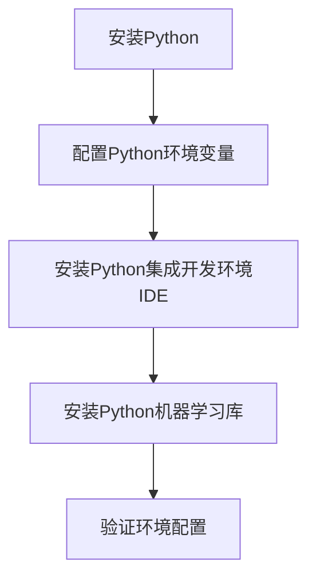

# Python机器学习实战：从零开始构建机器学习环境

## 1.背景介绍

在当今数据主导的世界中,机器学习已成为各行业不可或缺的核心技术。无论是推荐系统、语音识别、计算机视觉还是自然语言处理,机器学习无处不在。Python凭借其简洁易学的语法、强大的生态系统和丰富的机器学习库,成为构建机器学习应用的首选语言。本文将带你从零开始,一步步构建Python机器学习开发环境,为未来的机器学习之旅打下坚实基础。

## 2.核心概念与联系

在深入探讨环境搭建之前,我们先了解几个核心概念:

### 2.1 机器学习

机器学习是一门研究赋予计算机从数据中自动学习和优化的能力的科学。它通过建立数学模型,利用算法从海量数据中发现潜在规律,并对未知数据做出预测或决策。

### 2.2 Python

Python是一种简单、优雅且功能强大的编程语言,具有广泛的应用领域。它的可读性强、开发效率高,同时拥有庞大的开源社区和丰富的第三方库,使其成为机器学习领域的不二之选。

### 2.3 机器学习库

Python拥有多种优秀的机器学习库,如NumPy、SciPy、Pandas、Matplotlib、Scikit-learn等。这些库提供了高效的数值计算、数据处理、可视化以及各种机器学习算法的实现,极大简化了机器学习应用的开发过程。

### 2.4 集成开发环境(IDE)

IDE为开发者提供了代码编辑、调试、测试等一体化工具,可以显著提高开发效率。对于Python机器学习开发,常用的IDE包括PyCharm、Visual Studio Code、Spyder等。

## 3.核心算法原理具体操作步骤

构建Python机器学习环境的核心步骤包括:



### 3.1 安装Python

首先,需要从官方网站 https://www.python.org 下载适合您操作系统的Python版本并安装。推荐安装最新的Python 3.x版本,因为它具有更好的性能和更多特性。

### 3.2 配置Python环境变量

安装完成后,需要将Python可执行文件所在路径添加到系统环境变量PATH中,以便在命令行中直接调用Python解释器。

### 3.3 安装Python集成开发环境IDE  

虽然可以直接使用文本编辑器编写Python代码,但使用IDE可以极大提高开发效率。常用的Python IDE包括:

1. **PyCharm**: 功能强大的Python IDE,提供智能代码补全、调试、测试等功能,拥有专业版和免费的社区版。

2. **Visual Studio Code**: 微软开发的轻量级代码编辑器,通过安装Python扩展可支持Python开发。

3. **Spyder**: 专门为数据科学家和工程师设计的Python IDE,与NumPy、Pandas等库集成良好。

您可以根据个人喜好选择合适的IDE。本文以PyCharm为例进行介绍。

### 3.4 安装Python机器学习库

机器学习库为Python提供了强大的数值计算、数据处理和机器学习算法支持。常用的机器学习库包括:

1. **NumPy**: 提供高性能的多维数组对象及相关操作函数。
2. **Pandas**: 用于数据清洗和分析,提供高性能、易用的数据结构和数据分析工具。
3. **Matplotlib**: 用于绘制高质量的2D和3D图形。
4. **Scikit-learn**: 集成了常用的机器学习算法,如分类、回归、聚类等。
5. **TensorFlow**/**PyTorch**: 用于构建和训练深度神经网络模型。

您可以使用Python的包管理器pip安装这些库。例如,在命令行中运行:

```
pip install numpy pandas matplotlib scikit-learn
```

### 3.5 验证环境配置

安装完成后,可以在Python交互式shell或IDE中导入相关库,验证是否安装成功。如果没有报错,说明环境配置正确。例如:

```python
import numpy as np
import pandas as pd
import matplotlib.pyplot as plt
from sklearn import datasets
```

## 4.数学模型和公式详细讲解举例说明

机器学习算法通常基于数学模型和公式,本节将介绍一些常见的模型和公式。

### 4.1 线性回归

线性回归是一种常用的监督学习算法,用于预测连续值的目标变量。它的目标是找到一条最佳拟合直线,使预测值与实际值之间的误差最小化。

线性回归模型可表示为:

$$y = \theta_0 + \theta_1x_1 + \theta_2x_2 + ... + \theta_nx_n$$

其中,$y$是目标变量,$x_i$是特征变量,$\theta_i$是模型参数。

我们可以使用最小二乘法来估计模型参数$\theta$,目标是最小化代价函数:

$$J(\theta) = \frac{1}{2m}\sum_{i=1}^m(h_\theta(x^{(i)}) - y^{(i)})^2$$

其中,$m$是训练样本数量,$h_\theta(x^{(i)})$是模型对第$i$个样本的预测值。

### 4.2 逻辑回归

逻辑回归是一种常用的分类算法,用于预测二元或多元离散值的目标变量。它的核心思想是将线性回归的输出通过逻辑sigmoid函数映射到(0,1)范围内,作为样本属于某个类别的概率估计。

逻辑回归模型可表示为:

$$h_\theta(x) = \frac{1}{1 + e^{-\theta^Tx}}$$

其中,$h_\theta(x)$是样本$x$属于正例的概率估计,$\theta$是模型参数向量。

我们可以使用最大似然估计来求解模型参数$\theta$,目标是最大化似然函数:

$$l(\theta) = \prod_{i=1}^m[h_\theta(x^{(i)})]^{y^{(i)}}[1-h_\theta(x^{(i)})]^{1-y^{(i)}}$$

### 4.3 决策树

决策树是一种常用的监督学习算法,可用于分类和回归任务。它通过递归地构建决策树模型,将特征空间划分为互不相交的区域,每个区域对应一个预测值。

决策树的构建过程可以使用信息增益或基尼系数作为选择最优特征的标准。对于分类任务,信息增益可以表示为:

$$\text{Gain}(D, a) = \text{Entropy}(D) - \sum_{v\in\text{Values}(a)}\frac{|D^v|}{|D|}\text{Entropy}(D^v)$$

其中,$D$是数据集,$a$是特征,$D^v$是根据特征$a$的值$v$划分的子数据集。$\text{Entropy}(D)$表示数据集$D$的信息熵,用于衡量数据集的纯度。

## 5.项目实践:代码实例和详细解释说明

为了加深对机器学习概念的理解,我们将通过一个实际项目来演示如何使用Python进行机器学习建模。本例使用著名的鸢尾花数据集,通过逻辑回归算法对鸢尾花品种进行分类预测。

### 5.1 导入所需库

```python
import numpy as np
import pandas as pd
from sklearn.datasets import load_iris
from sklearn.linear_model import LogisticRegression
from sklearn.model_selection import train_test_split
from sklearn.metrics import accuracy_score
```

### 5.2 加载数据集

```python
# 加载鸢尾花数据集
iris = load_iris()
X = iris.data
y = iris.target
```

### 5.3 划分训练集和测试集

```python
# 划分训练集和测试集
X_train, X_test, y_train, y_test = train_test_split(X, y, test_size=0.2, random_state=42)
```

### 5.4 创建逻辑回归模型并训练

```python
# 创建逻辑回归模型
clf = LogisticRegression()

# 训练模型
clf.fit(X_train, y_train)
```

### 5.5 模型评估

```python
# 对测试集进行预测
y_pred = clf.predict(X_test)

# 计算准确率
accuracy = accuracy_score(y_test, y_pred)
print(f"Accuracy: {accuracy:.2f}")
```

输出结果:

```
Accuracy: 0.97
```

可以看到,在鸢尾花数据集上,逻辑回归模型的准确率达到了97%,表现非常出色。

## 6.实际应用场景

机器学习在现实世界中有着广泛的应用,包括但不限于:

1. **推荐系统**: 电子商务网站、视频流媒体等平台利用机器学习算法分析用户行为,为用户提供个性化的推荐。

2. **计算机视觉**: 机器学习在图像分类、目标检测、人脸识别等计算机视觉任务中发挥着关键作用。

3. **自然语言处理(NLP)**: 机器学习算法可以帮助计算机理解和生成人类语言,应用于机器翻译、文本分类、情感分析等领域。

4. **金融风险管理**: 银行和金融机构利用机器学习模型评估贷款风险、检测欺诈行为。

5. **医疗健康**: 机器学习可以辅助医生诊断疾病、发现药物潜在靶点,提高医疗水平。

6. **交通运输**: 自动驾驶汽车、智能交通管理系统等都离不开机器学习技术。

7. **能源和环境**: 机器学习可以优化能源利用、预测天气模式,助力可持续发展。

## 7.工具和资源推荐

构建Python机器学习环境时,有许多优秀的工具和资源可以为您提供帮助:

1. **Anaconda**: 一个开源的Python发行版,预装了众多科学计算和数据科学库,提供了方便的包管理和环境管理功能。

2. **Jupyter Notebook**: 一种基于Web的交互式计算环境,支持实时代码、可视化、说明文档等,非常适合数据探索和模型开发。

3. **Google Colab**: 一个免费的云端Jupyter Notebook环境,无需本地配置,可直接在浏览器中编写和运行Python代码。

4. **Scikit-learn用户指南**: Scikit-learn官方提供的详细文档,涵盖了各种机器学习算法的使用方法和示例。

5. **Kaggle**: 一个面向数据科学家和机器学习爱好者的在线社区,提供大量数据集、教程和竞赛项目。

6. **Python机器学习书籍**: 如《Python机器学习》、《Python数据分析与挖掘实战》等经典书籍,为初学者提供了全面的理论基础和实践指导。

7. **在线课程**: 像Coursera、edX等平台上有许多优质的Python机器学习在线课程,可以系统地学习相关知识。

## 8.总结:未来发展趋势与挑战

机器学习正在快速发展,未来将会有更多令人兴奋的进展和应用场景。同时,我们也面临一些挑战和问题需要解决:

1. **算力需求不断增长**: 随着深度学习模型越来越复杂,对计算能力和硬件资源的需求也在不断增长,需要更强大的GPU和专用硬件加速。

2. **数据质量和隐私**: 高质量的训练数据对于机器学习模型的性能至关重要。同时,如何在保护个人隐私的前提下利用数据,也是一个亟待解决的问题。

3. **模型可解释性**: 许多机器学习模型存在"黑箱"问题,难以解释其内部决策过程,这在一些关键领域(如医疗)可能会带来风险。提高模型的可解释性是未来的一个重要方向。

4. **人工智能伦理**: 随着人工智能系统在越来越多领域得到应用,我们需要考虑它们可能带来的潜在风险和伦理问题,制定相应的规范和准则。

5. **人机协作**: 未来,人工智能系统将与人类更加紧密地协作,如何实现人机有效互动,充分发挥各自的优势,是一个值得探索的课题。

机器学习的发展离不开持续的创新和探索。相信通