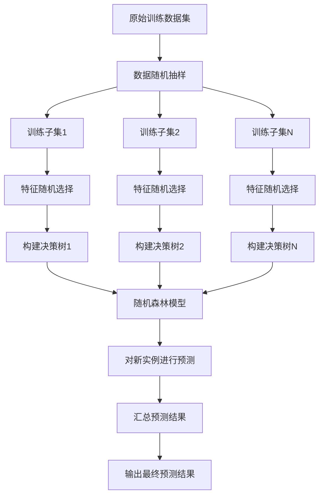

# Random Forest 原理与代码实战案例讲解

## 1. 背景介绍

### 1.1 机器学习中的分类与回归问题

在机器学习领域中,分类和回归问题是两大核心任务。分类问题旨在根据输入数据的特征对其进行分类,将其归入有限的几个类别中。而回归问题则是预测一个连续的数值输出。

### 1.2 决策树算法及其局限性  

决策树是一种流行的机器学习算法,可用于解决分类和回归问题。它通过学习训练数据构建一个决策树模型,并基于特征对实例进行递归分区,最终将实例归入叶节点的类别或产生一个数值预测。

然而,单一决策树存在过拟合的风险,其泛化能力有限。为了提高模型的性能和稳健性,集成学习方法应运而生,其中随机森林(Random Forest)就是一种非常成功的集成算法。

## 2. 核心概念与联系

### 2.1 集成学习的概念

集成学习(Ensemble Learning)是将多个基础模型组合起来,形成一个更强大的模型的过程。其核心思想是通过构建并结合多个学习器来完成预测任务,从而获得比单一学习器更有效和更准确的预测结果。

### 2.2 随机森林算法概述

随机森林(Random Forest)是一种基于决策树的集成学习算法。它通过构建多个决策树,并将它们的预测结果进行组合,从而获得更加准确和稳健的模型。每棵决策树在构建过程中都会引入随机性,使得每棵树的差异性增大,这有助于降低过拟合风险,提高模型的泛化能力。

## 3. 核心算法原理具体操作步骤

### 3.1 构建随机森林的步骤

构建随机森林的过程可以概括为以下几个步骤:

1. 从原始训练集中通过有放回抽样的方式随机抽取 N 个训练子集。
2. 对于每个训练子集,根据特征随机选择一个特征子集,利用该特征子集构建一个决策树。
3. 重复步骤 2,构建 K 棵决策树。
4. 对于新的测试实例,将其输入到这 K 棵决策树中,收集每棵树的预测结果。
5. 对于分类问题,选择票数最多的类别作为最终预测结果;对于回归问题,将每棵树的预测结果取平均值作为最终预测结果。

### 3.2 随机性的引入

随机森林算法在构建过程中引入了两个主要的随机性:

1. **数据随机抽样**: 通过有放回抽样的方式从原始训练集中随机抽取训练子集,使得每棵决策树的训练数据不同。
2. **特征随机选择**: 在构建每棵决策树时,不是使用所有特征,而是从所有特征中随机选择一个特征子集。

这两种随机性的引入使得每棵决策树之间存在差异,从而提高了模型的多样性,降低了过拟合的风险。

### 3.3 算法流程图

以下是随机森林算法构建过程的流程图:



## 4. 数学模型和公式详细讲解举例说明

### 4.1 基尼系数

在构建决策树时,需要选择一个最优特征进行分裂。随机森林算法通常使用基尼系数(Gini Impurity)来评估特征的分裂质量。基尼系数衡量的是数据集的不纯度,值越小表示数据集越纯。

对于一个包含 $K$ 个类别的数据集 $D$,其基尼系数定义为:

$$Gini(D) = 1 - \sum_{k=1}^{K}p_k^2$$

其中 $p_k$ 表示数据集 $D$ 中属于第 $k$ 类的比例。

在特征 $A$ 的条件下,数据集 $D$ 被分割为 $D_1, D_2, \dots, D_m$,则在特征 $A$ 上的基尼系数为:

$$Gini(D, A) = \sum_{j=1}^{m}\frac{|D_j|}{|D|}Gini(D_j)$$

选择基尼系数最小的特征作为分裂特征,从而构建决策树。

### 4.2 Out-Of-Bag 误差估计

随机森林算法还提供了一种称为 Out-Of-Bag (OOB) 的内置误差估计方法,用于评估模型的泛化能力。

在构建每棵决策树时,由于使用了有放回抽样,因此总会有部分实例未被选中作为训练数据。这些未被选中的实例就称为 OOB 数据。对于每棵决策树,我们可以使用其 OOB 数据来测试该树的性能,并将所有树的 OOB 误差取平均值作为随机森林模型的 OOB 误差估计。

OOB 误差估计的优点是无需额外的测试集,可以在训练过程中同时获得模型性能的评估。

## 5. 项目实践:代码实例和详细解释说明

以下是使用 Python 中的 scikit-learn 库实现随机森林分类器的示例代码:

```python
from sklearn.ensemble import RandomForestClassifier
from sklearn.datasets import make_classification
from sklearn.model_selection import train_test_split
from sklearn.metrics import accuracy_score

# 生成模拟数据
X, y = make_classification(n_samples=1000, n_features=10, n_informative=5, random_state=42)

# 划分训练集和测试集
X_train, X_test, y_train, y_test = train_test_split(X, y, test_size=0.2, random_state=42)

# 创建随机森林分类器
rf = RandomForestClassifier(n_estimators=100, random_state=42)

# 训练模型
rf.fit(X_train, y_train)

# 对测试集进行预测
y_pred = rf.predict(X_test)

# 计算准确率
accuracy = accuracy_score(y_test, y_pred)
print(f"Accuracy: {accuracy:.2f}")
```

代码解释:

1. 首先,我们从 scikit-learn 中导入所需的模块和函数。
2. 使用 `make_classification` 函数生成模拟的分类数据集,包含 1000 个样本,10 个特征,其中 5 个特征是信息特征。
3. 将数据集划分为训练集和测试集,测试集占 20%。
4. 创建一个随机森林分类器实例,设置 `n_estimators=100` 表示构建 100 棵决策树。
5. 使用训练集 `X_train` 和 `y_train` 训练随机森林模型。
6. 对测试集 `X_test` 进行预测,得到预测结果 `y_pred`。
7. 使用 `accuracy_score` 函数计算预测结果与真实标签 `y_test` 的准确率。

在这个示例中,我们还可以进一步探索随机森林的其他参数,如 `max_depth` 控制决策树的最大深度, `max_features` 控制每棵树在构建时考虑的最大特征数等。通过调整这些参数,可以进一步优化模型的性能。

## 6. 实际应用场景

随机森林算法由于其优秀的性能和易用性,在各种领域都有广泛的应用,包括但不限于:

1. **金融风险评估**: 使用随机森林模型预测客户的违约风险或欺诈风险。
2. **计算机视觉**: 在图像分类、目标检测等任务中使用随机森林作为基础模型。
3. **生物信息学**: 应用于基因表达数据分析、蛋白质结构预测等任务。
4. **自然语言处理**: 用于文本分类、情感分析等任务。
5. **推荐系统**: 通过随机森林模型对用户进行分类,提供个性化推荐。
6. **异常检测**: 利用随机森林模型检测异常数据点或异常行为。

随机森林算法的优点在于它能够处理高维数据、缺失值和异常值,并且对于不平衡数据集也有较好的表现。此外,它还具有可解释性,可以计算每个特征对预测结果的重要性。

## 7. 工具和资源推荐

在实践中,有许多工具和资源可以帮助您更好地理解和使用随机森林算法:

1. **Python 库**:
   - scikit-learn: 提供了随机森林分类器和回归器的实现。
   - XGBoost: 一种高效的梯度提升决策树库,也支持随机森林模式。
   - LightGBM: 另一种高性能的梯度提升决策树框架,同样支持随机森林。

2. **在线课程**:
   - Coursera 上的 "机器学习" 课程由 Andrew Ng 教授讲解,包含随机森林的理论和实践。
   - Udacity 的 "机器学习工程师纳米学位" 项目中也涉及了随机森林算法。

3. **书籍资源**:
   - "机器学习" by Tom M. Mitchell
   - "模式分类" by Richard O. Duda, Peter E. Hart 和 David G. Stork
   - "An Introduction to Statistical Learning" by Gareth James, Daniela Witten, Trevor Hastie 和 Robert Tibshirani

4. **在线社区**:
   - Stack Overflow: 可以在这里提问并获得来自全球开发者的帮助。
   - Kaggle: 一个数据科学竞赛平台,可以参与各种机器学习挑战并学习他人的解决方案。

利用这些资源,您可以更深入地了解随机森林算法的原理和实现细节,并将其应用于实际项目中。

## 8. 总结:未来发展趋势与挑战

随机森林算法凭借其出色的性能和易用性,已经成为机器学习领域中最成功和最广泛使用的算法之一。然而,它也面临一些挑战和发展趋势:

1. **高维数据处理**: 随着数据维度的不断增加,随机森林在构建和预测过程中会变得更加计算密集。需要探索更高效的算法和并行计算技术来加速训练和预测过程。

2. **在线学习和增量学习**: 当前的随机森林算法主要是基于批量学习的,无法有效地处理动态变化的数据流。未来需要研究在线学习和增量学习的随机森林算法,以适应不断变化的数据环境。

3. **解释性和可解释性**: 虽然随机森林具有一定的可解释性,但与一些其他模型相比,它的解释性仍然有限。提高模型的可解释性将有助于人们更好地理解模型的决策过程,从而提高信任度和可接受性。

4. **深度集成学习**: 将深度学习与集成学习相结合,形成深度集成学习模型,可能会带来更好的性能和泛化能力。这是一个值得探索的研究方向。

5. **隐私保护和公平性**: 随着隐私保护和算法公平性问题越来越受到重视,需要研究如何在保护隐私和确保公平性的同时,构建高性能的随机森林模型。

总的来说,随机森林算法未来仍有广阔的发展空间,需要持续地改进和创新,以满足不断变化的需求和挑战。

## 9. 附录:常见问题与解答

1. **随机森林与决策树相比,有什么优缺点?**

优点:
- 随机森林通过集成多棵决策树,降低了过拟合的风险,提高了模型的泛化能力。
- 随机森林具有很好的鲁棒性,对异常值和缺失值的敏感性较低。
- 随机森林可以处理高维数据,并自动处理特征之间的交互作用。
- 随机森林可以计算每个特征对预测结果的重要性,提供一定的可解释性。

缺点:
- 随机森林模型相对复杂,需要更多的计算资源和内