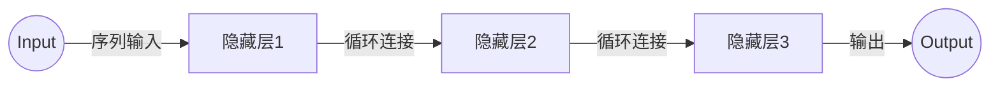

好的，我会严格遵循您提出的要求和约束条件，以《Recurrent Neural Networks (RNN)原理与代码实例讲解》为题目，撰写一篇专业的技术博客文章。

# Recurrent Neural Networks (RNN)原理与代码实例讲解

## 1.背景介绍

### 1.1 序列数据的重要性

在现实世界中,大量的数据都呈现出序列形式,如自然语言处理中的句子、语音识别中的语音信号、视频分析中的图像序列等。传统的机器学习算法如支持向量机、决策树等,在处理这种序列数据时往往表现不佳,因为它们无法很好地捕捉数据内在的时序模式和长期依赖关系。

### 1.2 循环神经网络的产生

为了更好地处理序列数据,循环神经网络(Recurrent Neural Networks,RNN)应运而生。与前馈神经网络不同,RNN在隐藏层之间增加了循环连接,使得网络具有"记忆"能力,能够捕捉序列数据中的长期依赖关系。

### 1.3 RNN的应用领域

循环神经网络已广泛应用于自然语言处理、语音识别、机器翻译、手写识别、基因序列分析等领域,取得了卓越的成绩。本文将重点介绍RNN的基本原理、常见变体、训练技巧以及实际应用。

## 2.核心概念与联系

### 2.1 RNN的基本结构



如上图所示,RNN由输入层、隐藏层和输出层组成。与传统神经网络不同,隐藏层之间存在循环连接,使得网络能够捕捉序列数据的时序模式。每个时间步,隐藏层的状态不仅取决于当前输入,还取决于上一时间步的隐藏状态,从而实现了"记忆"功能。

### 2.2 RNN的计算过程

在时间步t,RNN的计算过程可表示为:

$$
h_t = f_W(x_t, h_{t-1})\\
y_t = g_U(h_t)
$$

其中:
- $x_t$是时间步t的输入
- $h_t$是时间步t的隐藏状态
- $h_{t-1}$是前一时间步的隐藏状态
- $f_W$是确定隐藏状态的函数,通常为非线性函数如tanh或ReLU
- $y_t$是时间步t的输出
- $g_U$是从隐藏状态计算输出的函数

可见,RNN能够基于当前输入和前一时间步的"记忆"(隐藏状态)来更新隐藏状态,从而捕捉长期依赖关系。

### 2.3 RNN的变体

基本RNN存在梯度消失/爆炸问题,难以学习长期依赖关系。研究人员提出了多种变体来解决这一问题,如:

- 长短期记忆网络(LSTM)
- 门控循环单元(GRU)
- 双向RNN
- 深层RNN

这些变体通过改进网络结构、引入门控机制等方式,提高了RNN捕捉长期依赖关系的能力。

## 3.核心算法原理具体操作步骤

### 3.1 RNN的前向传播

在时间步t,RNN的前向传播过程如下:

1. 获取输入$x_t$
2. 从上一时间步获取隐藏状态$h_{t-1}$
3. 计算当前隐藏状态:
   $$h_t = f_W(x_t, h_{t-1})$$
4. 计算当前输出:
   $$y_t = g_U(h_t)$$
5. 将$h_t$传递到下一时间步作为$h_{t+1}$的初始状态

该过程对每个时间步重复执行,直至序列结束。

### 3.2 RNN的反向传播

RNN的反向传播过程采用反向递推的方式,计算每个时间步的误差梯度。具体步骤如下:

1. 初始化输出层权重$U$的梯度:
   $$\frac{\partial E}{\partial U} = 0$$
2. 初始化隐藏层权重$W$的梯度:
   $$\frac{\partial E}{\partial W} = 0$$
3. 对每个时间步t:
   1) 计算输出误差:
      $$\delta_t^{(o)} = \frac{\partial E}{\partial y_t}$$
   2) 计算隐藏层误差:
      $$\delta_t^{(h)} = \frac{\partial E}{\partial h_t} = \delta_t^{(o)}U^T + \frac{\partial E}{\partial h_{t+1}}\frac{\partial h_{t+1}}{\partial h_t}$$
   3) 累加权重梯度:
      $$\frac{\partial E}{\partial U} += \delta_t^{(o)}h_t^T$$
      $$\frac{\partial E}{\partial W} += \delta_t^{(h)}[x_t, h_{t-1}]^T$$
4. 使用优化算法(如SGD)更新权重

需要注意的是,由于RNN的循环结构,误差梯度需要通过时间步进行传播,这可能导致梯度消失或爆炸问题。

## 4.数学模型和公式详细讲解举例说明

### 4.1 RNN的数学模型

我们以一个简单的RNN模型为例,详细解释其数学原理。假设RNN只有一个隐藏层,隐藏层有H个神经元。在时间步t,模型的计算过程为:

1. 输入层到隐藏层:
   $$a_t = Wx_t + Uh_{t-1}$$
   其中$W$是输入到隐藏层的权重矩阵,U是隐藏层的循环权重矩阵。

2. 隐藏层激活函数:
   $$h_t = \tanh(a_t)$$
   这里使用tanh作为激活函数。

3. 隐藏层到输出层:
   $$o_t = Vh_t$$
   其中V是隐藏层到输出层的权重矩阵。

4. 输出层激活函数:
   $$y_t = \text{softmax}(o_t)$$
   对于分类问题,通常使用softmax作为输出层激活函数。

该模型的关键在于隐藏层的计算式$a_t$,它不仅依赖于当前输入$x_t$,还依赖于上一时间步的隐藏状态$h_{t-1}$,从而捕捉了序列数据的时序模式。

### 4.2 梯度计算示例

我们以一个简单的序列数据为例,计算RNN在该数据上的梯度。假设输入序列为$[x_1, x_2]$,目标输出为$[y_1, y_2]$。

在时间步1,RNN的计算过程为:

$$
a_1 = Wx_1\\
h_1 = \tanh(a_1)\\
o_1 = Vh_1\\
y_1 = \text{softmax}(o_1)
$$

在时间步2,计算过程为:

$$
a_2 = Wx_2 + Uh_1\\
h_2 = \tanh(a_2)\\
o_2 = Vh_2\\
y_2 = \text{softmax}(o_2)
$$

我们定义损失函数为:

$$E = -\sum_t \log P(y_t|x_t)$$

其中$P(y_t|x_t)$是在给定输入$x_t$的情况下,正确输出$y_t$的概率。

对于时间步2,我们有:

$$
\frac{\partial E}{\partial o_2} = y_2 - t_2\\
\frac{\partial E}{\partial h_2} = V^T\frac{\partial E}{\partial o_2}\\
\frac{\partial E}{\partial a_2} = (1 - h_2^2)\frac{\partial E}{\partial h_2}\\
\frac{\partial E}{\partial W} = \frac{\partial E}{\partial a_2}x_2^T\\
\frac{\partial E}{\partial U} = \frac{\partial E}{\partial a_2}h_1^T
$$

其中$t_2$是时间步2的目标输出。

对于时间步1,我们有:

$$
\frac{\partial E}{\partial o_1} = y_1 - t_1\\
\frac{\partial E}{\partial h_1} = V^T\frac{\partial E}{\partial o_1} + U^T\frac{\partial E}{\partial a_2}\\
\frac{\partial E}{\partial a_1} = (1 - h_1^2)\frac{\partial E}{\partial h_1}\\
\frac{\partial E}{\partial W} += \frac{\partial E}{\partial a_1}x_1^T
$$

其中$t_1$是时间步1的目标输出。

通过上述计算,我们可以获得RNN在该序列数据上的权重梯度,并使用优化算法(如SGD)更新权重。

## 5.项目实践:代码实例和详细解释说明

以下是一个使用PyTorch实现基本RNN的代码示例,用于对IMDB电影评论数据进行二分类(正面/负面评论):

```python
import torch
import torch.nn as nn

# 定义RNN模型
class RNNModel(nn.Module):
    def __init__(self, input_size, hidden_size, output_size):
        super(RNNModel, self).__init__()
        self.hidden_size = hidden_size
        self.rnn = nn.RNN(input_size, hidden_size, batch_first=True)
        self.fc = nn.Linear(hidden_size, output_size)

    def forward(self, x):
        # 初始化隐藏状态
        h0 = torch.zeros(1, x.size(0), self.hidden_size)
        
        # 前向传播
        out, _ = self.rnn(x, h0)
        out = out[:, -1, :]  # 取最后一个时间步的输出
        out = self.fc(out)
        return out

# 加载数据
# ...

# 创建模型实例
model = RNNModel(input_size, hidden_size, output_size)

# 定义损失函数和优化器
criterion = nn.CrossEntropyLoss()
optimizer = torch.optim.Adam(model.parameters())

# 训练循环
for epoch in range(num_epochs):
    for inputs, labels in train_loader:
        # 前向传播
        outputs = model(inputs)
        loss = criterion(outputs, labels)
        
        # 反向传播和优化
        optimizer.zero_grad()
        loss.backward()
        optimizer.step()
        
    # 评估模型
    # ...
```

代码解释:

1. 定义RNN模型类`RNNModel`,包含一个RNN层和一个全连接层。
2. 在`forward`函数中,首先初始化隐藏状态`h0`为全0张量。然后进行前向传播,将输入`x`和`h0`传入RNN层,获得输出`out`和最终隐藏状态。我们只取最后一个时间步的输出`out[:, -1, :]`,并通过全连接层得到最终输出。
3. 加载IMDB数据集,创建模型实例。
4. 定义交叉熵损失函数和Adam优化器。
5. 在训练循环中,对每个批次的输入进行前向传播,计算损失。然后进行反向传播,计算梯度并使用优化器更新模型参数。
6. 在每个epoch结束时,可以评估模型在验证集或测试集上的性能。

上述代码展示了如何使用PyTorch构建和训练一个基本的RNN模型。在实际应用中,你可能需要使用更复杂的RNN变体(如LSTM或GRU)、调整超参数、添加正则化等,以获得更好的性能。

## 6.实际应用场景

循环神经网络在以下领域有着广泛的应用:

### 6.1 自然语言处理

- 机器翻译: 将一种语言的句子翻译成另一种语言
- 文本生成: 根据给定的上下文,生成连贯的自然语言文本
- 情感分析: 分析文本的情感倾向(正面/负面)
- 命名实体识别: 识别文本中的人名、地名、组织机构名等

### 6.2 语音识别

将语音信号转录为文本,广泛应用于智能助手、语音输入等场景。

### 6.3 时序预测

- 股票预测: 基于历史股价数据预测未来走势
- 天气预报: 预测未来一段时间的天气状况
- 流量预测: 预测网络流量的变化趋势

### 6.4 手写识别

将手写字符或单词转换为计算机可识别的文本。

### 6.5 基因序列分析

分析DNA或蛋白质序列,预测基因功能、结构等。

总的来说,