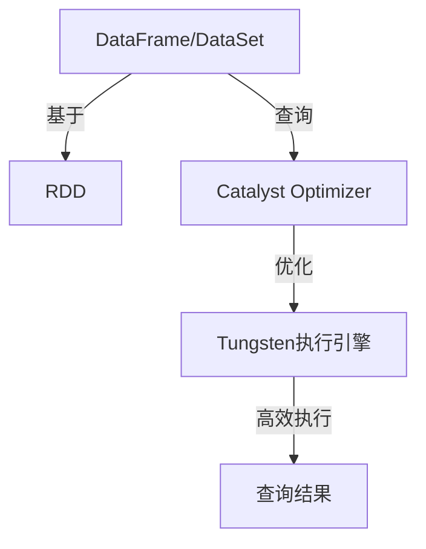

# Spark SQL结构化数据处理原理与代码实例讲解

## 1.背景介绍

在当今大数据时代，数据处理和分析成为了一项关键的任务。Apache Spark作为一个开源的大数据处理框架,凭借其高效、易用和通用性,成为了业界的热门选择。Spark SQL作为Spark的一个重要模块,专门用于结构化数据的处理,提供了一种高效、统一的方式来查询和处理各种数据源。

Spark SQL不仅支持SQL查询,还支持多种编程语言(Scala、Java、Python和R)的DataFrame API,使得开发人员可以使用熟悉的语言进行数据处理。它底层基于Spark的RDD(Resilient Distributed Dataset)抽象,能够高效地处理海量数据,并提供了丰富的数据源连接器,可以轻松地与Hive、Parquet、JSON等多种数据格式进行集成。

## 2.核心概念与联系

### 2.1 DataFrame

DataFrame是Spark SQL中的核心概念,它是一种分布式的、不可变的数据集合,由命名列组成。DataFrame可以从各种数据源(如文件、数据库表、RDD等)创建,也可以通过转换现有的DataFrame得到新的DataFrame。

DataFrame提供了类似关系型数据库的概念,如列、行、模式等,同时也支持各种复杂的数据类型,如结构体、数组等。它的设计目标是使大数据处理更加高效、统一和易用。

### 2.2 DataSet

DataSet是Spark 1.6中引入的新概念,它是DataFrame的一种特例,提供了对静态类型数据的支持。DataSet在DataFrame的基础上增加了对编译时类型安全的支持,可以避免一些运行时异常,提高代码的可靠性。

### 2.3 Catalyst Optimizer

Catalyst Optimizer是Spark SQL的查询优化器,它负责优化逻辑执行计划,以提高查询性能。Catalyst Optimizer包括多个阶段,如逻辑优化、物理优化和代码生成等,通过一系列规则和策略来优化查询计划。

### 2.4 Tungsten

Tungsten是Spark SQL的另一个重要组件,它专注于提高内存计算和CPU效率。Tungsten引入了多种优化技术,如缓存数据的二进制格式、代码生成等,以减少内存开销和提高CPU利用率。

### 2.5 核心概念关系

上述核心概念之间存在紧密的联系,如下Mermaid流程图所示:



## 3.核心算法原理具体操作步骤

Spark SQL在处理结构化数据时,主要包括以下几个关键步骤:

1. **数据源解析**:首先需要将输入数据源解析为Spark SQL可以理解的格式,如Parquet、JSON等。Spark SQL提供了多种内置和外部数据源连接器,支持解析各种格式的数据。

2. **逻辑计划生成**:根据用户的查询语句,生成对应的逻辑执行计划。逻辑计划描述了查询的高级语义,而不考虑具体的执行细节。

3. **逻辑优化**:Catalyst Optimizer对逻辑计划进行一系列优化,如投影剪裁、谓词下推、常量折叠等,以减少不必要的计算。

4. **物理计划生成**:将优化后的逻辑计划转换为物理执行计划,物理计划描述了具体的执行策略和操作。

5. **物理优化**:Catalyst Optimizer对物理计划进行进一步优化,如连接重排序、数据倾斜处理等,以提高执行效率。

6. **代码生成**:Tungsten基于优化后的物理计划,生成高效的内存计算代码,并利用代码生成技术消除虚拟函数调用开销。

7. **任务调度**:将生成的代码分发到各个Executor上,并通过Spark的任务调度系统进行并行执行。

8. **结果收集**:收集各个Executor的计算结果,进行最终的结果整理和返回。

整个过程中,Spark SQL的核心组件紧密协作,通过查询优化和代码生成等技术,实现了高效的结构化数据处理。

## 4.数学模型和公式详细讲解举例说明

在Spark SQL中,常见的数学模型和公式主要用于查询优化和代码生成等方面,以提高查询性能。下面将对几个典型的模型和公式进行详细讲解。

### 4.1 代价模型

代价模型是查询优化器中的一个重要组成部分,用于估计不同执行计划的代价,从而选择最优的执行计划。Spark SQL中的代价模型主要考虑以下几个因素:

- 数据量:输入数据的大小
- 数据分布:数据在各个分区的分布情况
- 计算复杂度:算子的计算复杂度
- 内存/IO开销:内存使用和IO操作的开销

代价模型通常使用代价函数来量化上述因素,代价函数的形式可以是简单的线性模型,也可以是更复杂的非线性模型。以下是一个简单的代价函数示例:

$$
Cost = \alpha * DataSize + \beta * ComputationCost + \gamma * MemoryCost + \delta * IOCost
$$

其中,$\alpha$、$\beta$、$\gamma$、$\delta$是权重系数,根据具体场景进行调整。

### 4.2 代数重写规则

Catalyst Optimizer通过一系列代数重写规则对逻辑计划进行优化。这些规则基于关系代数的等价变换,如投影剪裁、谓词下推、常量折叠等。以下是一个常见的投影剪裁规则:

$$
\pi_{A,B}(E) = \pi_{A,B}(\pi_{A,B,C}(E))
$$

该规则表示,如果投影列表中的列是另一个投影的子集,则可以先执行外层投影,减少不必要的计算。

### 4.3 代码生成模型

Tungsten使用代码生成技术来优化内存计算,避免虚拟函数调用的开销。代码生成模型通常基于中间表示(IR)和目标代码模板,将查询计划转换为高效的本地代码。

以下是一个简单的代码生成示例,将投影操作转换为Java代码:

```java
// 投影计划: PROJECT [col1, col2] FROM input
Object[] project(InternalRow input) {
    Object[] result = new Object[2];
    result[0] = input.get(0, dataType0); // col1
    result[1] = input.get(1, dataType1); // col2
    return result;
}
```

在该示例中,代码生成器根据投影列和数据类型,生成了一个`project`方法,该方法从输入行中提取指定列的值,并返回一个新的对象数组。

通过代码生成,Spark SQL可以避免虚拟函数调用的开销,从而提高内存计算的效率。

## 5.项目实践:代码实例和详细解释说明

为了更好地理解Spark SQL的使用,我们将通过一个实际项目案例来演示其核心功能和API。在本例中,我们将使用Spark SQL处理一个包含用户浏览记录的数据集,统计每个用户的浏览量并输出结果。

### 5.1 准备工作

首先,我们需要创建一个Spark会话,并导入必要的类和隐式转换:

```scala
import org.apache.spark.sql.SparkSession

val spark = SparkSession.builder()
  .appName("SparkSQLExample")
  .getOrCreate()

import spark.implicits._
```

### 5.2 创建DataFrame

接下来,我们将从一个JSON文件中创建DataFrame:

```scala
val viewsDF = spark.read.json("views.json")
viewsDF.show()
```

`views.json`文件的内容如下:

```json
{"user":"user1", "url":"www.example.com", "timestamp":1623456789}
{"user":"user2", "url":"www.example.com", "timestamp":1623456790}
{"user":"user1", "url":"www.example.org", "timestamp":1623456791}
{"user":"user2", "url":"www.example.net", "timestamp":1623456792}
```

执行`show()`操作后,我们可以看到DataFrame的结构和部分数据:

```
+-----+-------------+----------+
|user |url          |timestamp |
+-----+-------------+----------+
|user1|www.example.com|1623456789|
|user2|www.example.com|1623456790|
|user1|www.example.org|1623456791|
|user2|www.example.net|1623456792|
+-----+-------------+----------+
```

### 5.3 数据转换

接下来,我们将对DataFrame进行一系列转换操作,以统计每个用户的浏览量:

```scala
val viewsCountDF = viewsDF
  .groupBy("user")
  .agg(count("*").alias("viewCount"))
  .sort(desc("viewCount"))

viewsCountDF.show()
```

上述代码执行了以下操作:

1. 按`user`列对DataFrame进行分组
2. 对每个分组应用`count(*)`聚合函数,计算每个用户的浏览量,并使用`alias`为该列重命名为`viewCount`
3. 按`viewCount`列降序排序

执行`show()`后,我们可以看到统计结果:

```
+-----+--------+
| user|viewCount|
+-----+--------+
|user1|       2|
|user2|       2|
+-----+--------+
```

### 5.4 结果输出

最后,我们可以将结果保存到不同的数据源中,如Parquet文件或Hive表:

```scala
// 保存为Parquet文件
viewsCountDF.write.mode("overwrite").parquet("viewsCount.parquet")

// 保存为Hive表
viewsCountDF.write.mode("overwrite").saveAsTable("viewsCount")
```

通过上述示例,我们展示了如何使用Spark SQL进行结构化数据处理,包括创建DataFrame、执行转换操作、聚合统计以及结果输出等核心功能。

## 6.实际应用场景

Spark SQL广泛应用于各种领域的结构化数据处理,下面列举了一些典型的应用场景:

1. **数据分析**:Spark SQL可以高效地处理海量数据,支持各种分析操作,如聚合、连接、窗口函数等,因此非常适合用于数据分析和商业智能领域。

2. **数据湖**:Spark SQL可以与多种数据源(如HDFS、S3、Hive等)无缝集成,支持读写各种格式的数据,因此常被用作数据湖的核心处理引擎。

3. **ETL**:Spark SQL提供了强大的数据转换能力,可以用于构建高效的ETL(提取、转换、加载)管道,实现数据的清洗、转换和加载。

4. **流处理**:Spark Structured Streaming基于Spark SQL,支持对流式数据进行结构化的查询和处理,可以应用于实时数据分析、监控和警报等场景。

5. **机器学习**:Spark SQL可以与Spark MLlib无缝集成,为机器学习任务提供高效的数据预处理和特征工程能力。

6. **交互式分析**:Spark SQL支持SQL查询和DataFrame API,并提供了交互式Shell,可以用于交互式数据探索和分析。

总的来说,Spark SQL凭借其高效、统一和易用的特性,成为了大数据处理和分析的重要工具,在各个领域都有广泛的应用。

## 7.工具和资源推荐

为了更好地学习和使用Spark SQL,以下是一些推荐的工具和资源:

1. **Apache Spark官网**:Spark官网提供了丰富的文档、教程和示例代码,是学习Spark SQL的重要资源。地址:https://spark.apache.org/

2. **Spark官方文档**:Spark SQL的官方文档详细介绍了其架构、API和使用方法,是必读资料。地址:https://spark.apache.org/docs/latest/sql-programming-guide.html

3. **Databricks社区版**:Databricks是一家专注于Spark的公司,其社区版提供了基于云的Spark环境,非常适合学习和尝试Spark SQL。地址:https://community.cloud.databricks.com/

4. **Spark编程指南**:这本由Databricks员工撰写的书籍,全面介绍了Spark的核心概念和编程模型,对于深入理解Spark SQL很有帮助。

5. **Spark Summit视频**:Spark Summit是Spark社区的年度大会,会议视频涵盖了Spark SQL的最新进展和实践案例,值得关注。

6. **Spark用户邮件列表**:加入Spark用户邮件列表,可以及时了解Spark的最新动态,并与社区成员交流讨论。地址:https://