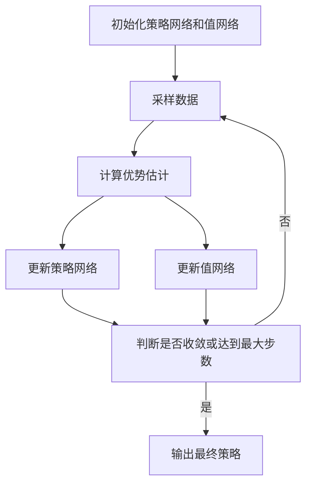

# StableBaselines3：易于使用的强化学习库

## 1.背景介绍

强化学习(Reinforcement Learning, RL)是机器学习中一个重要的研究方向,它关注基于环境反馈来学习行为策略的问题。与监督学习和无监督学习不同,强化学习的目标是通过与环境的交互来最大化一个累积奖励。近年来,强化学习在多个领域取得了突破性进展,如游戏、机器人控制、自动驾驶等。

StableBaselines3(SB3)是一个由OpenAI、Meta、Microsoft等公司的研究人员共同开发的开源强化学习库。它建立在流行的PyTorch和TensorFlow之上,提供了一系列经过充分测试和可靠的强化学习算法实现。SB3的目标是提供一个统一、高性能且易于使用的强化学习框架,以加速研究和应用的发展。

## 2.核心概念与联系

在深入探讨SB3之前,我们先回顾一下强化学习的核心概念:

- **环境(Environment)**:强化学习问题中的环境,代表了智能体所处的外部世界。环境会提供当前的状态,并接收智能体的行为作为输入,然后转移到下一个状态并返回相应的奖励。
- **状态(State)**:描述环境的当前情况。
- **行为(Action)**:智能体在当前状态下可以采取的操作。
- **奖励(Reward)**:环境对智能体行为的反馈,指导智能体朝着正确的方向学习。
- **策略(Policy)**:智能体在每个状态下选择行为的策略,是强化学习算法需要学习的目标。

强化学习的目标是找到一个最优策略,使得在环境中执行该策略时能获得最大的累积奖励。

## 3.核心算法原理具体操作步骤

SB3实现了多种流行的强化学习算法,包括:

1. **DQN(Deep Q-Network)**:结合深度神经网络和Q-learning,用于处理离散动作空间的问题。
2. **DDPG(Deep Deterministic Policy Gradient)**:基于确定性策略梯度的算法,用于连续动作空间的问题。
3. **A2C(Advantage Actor-Critic)**:同时训练策略网络和值网络的on-policy算法。
4. **PPO(Proximal Policy Optimization)**:在A2C的基础上提出的另一种on-policy算法,提高了数据效率和稳定性。
5. **SAC(Soft Actor-Critic)**:基于最大熵框架的off-policy算法,适用于连续动作空间。

以PPO为例,其核心步骤如下:

1. **收集数据**:利用当前策略在环境中采样数据,构建数据集。
2. **计算优势估计**:利用值网络估计每个状态的值函数,并计算优势函数。
3. **更新策略**:使用采样数据和优势估计,通过策略梯度上升的方式更新策略网络的参数。
4. **更新值函数**:利用采样数据,最小化值网络的均方误差,更新值网络参数。
5. **重复上述过程**:直到策略收敛或达到最大训练步数。

PPO算法的关键在于通过限制新旧策略之间的差异,来平衡数据效率和策略改进的幅度,从而实现稳定的训练过程。



## 4.数学模型和公式详细讲解举例说明

在强化学习算法中,通常需要估计状态值函数$V(s)$和状态-行为值函数$Q(s,a)$。其中:

$$V(s) = \mathbb{E}_\pi[\sum_{t=0}^\infty \gamma^t r_{t+1} | s_0=s]$$

表示在策略$\pi$下,从状态$s$开始,获得的累积折现奖励的期望值。$\gamma$是折现因子,用于平衡即时奖励和长期奖励的权重。

$$Q(s,a) = \mathbb{E}_\pi[\sum_{t=0}^\infty \gamma^t r_{t+1} | s_0=s, a_0=a]$$

表示在策略$\pi$下,从状态$s$执行行为$a$开始,获得的累积折现奖励的期望值。

在PPO算法中,我们定义一个比例裁剪的目标函数:

$$L^{CLIP}(\theta) = \hat{\mathbb{E}}_t \left[ \min\left(r_t(\theta)\hat{A}_t, \text{clip}(r_t(\theta), 1-\epsilon, 1+\epsilon)\hat{A}_t\right) \right]$$

其中$r_t(\theta) = \frac{\pi_\theta(a_t|s_t)}{\pi_{\theta_{old}}(a_t|s_t)}$是新旧策略的比值,$\hat{A}_t$是优势估计值,$\epsilon$是裁剪参数。这个目标函数限制了新旧策略之间的差异,从而实现了稳定的策略更新。

对于值函数的更新,我们最小化均方误差:

$$L^{VF}(\phi) = \hat{\mathbb{E}}_t \left[ \left(V_\phi(s_t) - V_t^{targ}\right)^2 \right]$$

其中$V_\phi(s_t)$是值网络的输出,$V_t^{targ}$是目标值,可以由蒙特卡罗返回或时序差分目标计算得到。

通过交替优化策略网络和值网络,PPO算法能够逐步提高策略的性能。

## 5.项目实践:代码实例和详细解释说明

下面我们通过一个简单的例子,展示如何使用SB3来训练一个强化学习智能体。我们将使用经典的CartPole环境,目标是通过水平移动力矩来保持杆子直立。

```python
import gym
from stable_baselines3 import PPO

# 创建环境
env = gym.make('CartPole-v1')

# 实例化PPO模型
model = PPO('MlpPolicy', env, verbose=1)

# 训练模型
model.learn(total_timesteps=100000)

# 测试模型
obs = env.reset()
for i in range(1000):
    action, _states = model.predict(obs)
    obs, rewards, dones, info = env.step(action)
    env.render()
    if dones:
        break

env.close()
```

这段代码首先导入了gym和SB3库,然后创建了一个CartPole环境实例。接下来,我们实例化了一个PPO模型,并使用`learn`函数进行训练。在训练过程中,模型会与环境交互,采样数据并更新策略网络和值网络。

训练完成后,我们可以使用`predict`函数让模型在环境中执行,并通过`env.render()`观察智能体的行为。在这个例子中,我们希望智能体能够尽可能长时间地保持杆子直立。

SB3提供了统一的接口,使得训练和测试强化学习模型变得非常简单。除了PPO,我们也可以使用其他算法,只需要将`PPO`替换为相应的算法名称即可。

## 6.实际应用场景

强化学习在许多实际应用场景中发挥着重要作用,例如:

1. **游戏AI**:强化学习被广泛应用于训练游戏AI,如AlphaGo、Dota2等。游戏提供了一个理想的环境,智能体可以通过与环境交互来学习最优策略。

2. **机器人控制**:在机器人控制领域,强化学习可以帮助机器人学习如何在复杂环境中导航、操作物体等任务。例如,Boston Dynamics的机器狗就是通过强化学习训练而来。

3. **自动驾驶**:自动驾驶系统可以被视为一个强化学习问题,智能体需要根据实时环境信息作出合理的驾驶决策,以安全到达目的地。

4. **推荐系统**:在推荐系统中,强化学习可以用于个性化推荐,根据用户的反馈动态调整推荐策略。

5. **金融交易**:强化学习也被应用于自动化交易系统,智能体通过学习来制定最优的交易策略。

总的来说,强化学习擅长解决序列决策问题,在任何需要根据环境做出一系列决策的场景中,都可以尝试使用强化学习方法。

## 7.工具和资源推荐

除了SB3之外,还有一些其他流行的强化学习库和资源值得关注:

1. **RLlib**:Ray项目下的分布式强化学习库,支持多种算法和环境。
2. **Gym**:OpenAI开发的强化学习环境集合,提供了多种经典和现代环境。
3. **Spinning Up**:由OpenAI开发的强化学习教程和资源,包括理论、代码和练习。
4. **Rainbow**:由谷歌开发的强化学习算法集合,包括DQN、C51、QR-DQN等。
5. **RL Baselines**:OpenAI开发的强化学习基线算法实现,包括DQN、TRPO、PPO等。

此外,还有一些优秀的书籍和在线课程可以学习强化学习理论和实践,如"强化学习导论"、吴恩达的"深度强化学习"课程等。

## 8.总结:未来发展趋势与挑战

强化学习是一个充满活力和挑战的领域,未来的发展趋势包括:

1. **更强大的算法**:随着研究的不断深入,我们可以期待更加通用、高效和稳定的强化学习算法出现。
2. **多智能体强化学习**:当前的强化学习主要关注单智能体场景,未来可能会有更多关注多智能体协作和竞争的研究。
3. **离线强化学习**:传统的强化学习需要大量的在线交互数据,离线强化学习可以利用已有的数据集进行训练,更加高效。
4. **安全强化学习**:如何保证强化学习系统的安全性和可靠性是一个重要的挑战,需要更多的研究和探索。
5. **泛化能力**:提高强化学习算法在不同环境和任务之间的泛化能力,是实现通用人工智能的关键。

总的来说,强化学习正在成为人工智能领域最活跃和前沿的研究方向之一,未来的发展值得我们拭目以待。

## 9.附录:常见问题与解答

1. **强化学习和监督学习/无监督学习有什么区别?**

强化学习与监督学习和无监督学习的主要区别在于学习目标和数据形式。监督学习旨在从标注数据中学习映射函数,而无监督学习则是从未标注数据中发现潜在模式。强化学习则是通过与环境交互来学习一个最优策略,以获得最大化的累积奖励。强化学习的数据是由智能体与环境的交互过程生成的。

2. **为什么强化学习算法容易不稳定?**

强化学习算法的不稳定性主要来自于以下几个方面:1)序列决策问题本身的复杂性;2)奖励信号的延迟性和稀疏性;3)探索与利用之间的权衡;4)数据相关性导致的偏差。因此,设计稳定的强化学习算法一直是研究的重点。

3. **什么是策略梯度算法?**

策略梯度算法是强化学习中一类重要的算法,它们直接对策略进行参数化,并通过梯度上升的方式优化策略参数,以最大化累积奖励。典型的策略梯度算法包括REINFORCE、A2C、PPO等。

4. **什么是值函数近似?**

在强化学习中,我们通常无法精确计算状态值函数或状态-行为值函数,因此需要使用函数近似的方法来估计它们。常见的函数近似方法包括线性函数近似和基于深度神经网络的非线性函数近似。

5. **什么是探索与利用的权衡?**

在强化学习过程中,智能体需要在探索(尝试新的行为以获取更多信息)和利用(根据已有信息选择当前最优行为)之间进行权衡。过多的探索会导致效率低下,而过多的利用则可能陷入次优解。设计合理的探索策略对算法的性能至关重要。

作者:禅与计算机程序设计艺术 / Zen and the Art of Computer