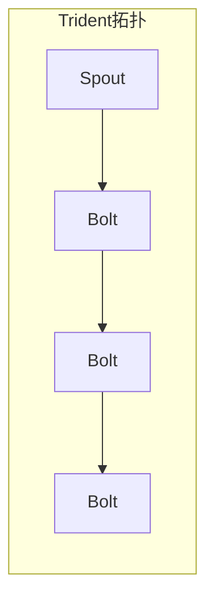

# Storm Trident原理与代码实例讲解

## 1.背景介绍

在当今大数据时代，实时处理海量数据流成为了一个迫切的需求。Apache Storm作为一个分布式实时计算系统,为大规模流式数据处理提供了强大的支持。Storm Trident是Storm的一个高级抽象,它引入了状态持久化、事务的精确一次语义(Exactly-Once)、有序处理等关键特性,使得开发人员能够更加专注于业务逻辑的实现,而不必过多关注底层的细节。

## 2.核心概念与联系

### 2.1 Trident拓扑(Topology)

Trident拓扑是一个有向无环图,由Spout(数据源)和Bolt(处理单元)组成。数据从Spout进入,经过一系列Bolt的处理,最终形成输出结果。



### 2.2 流(Stream)

Stream是Trident中的核心概念,表示一个无边界的数据流。每个Spout和Bolt都会生成一个或多个Stream,供后续的Bolt进行处理。

### 2.3 分组(Grouping)

分组决定了如何将数据从一个Bolt的输出Stream分发到下一个Bolt的任务。Trident支持多种分组策略,如Fields分组(按字段值分组)、Shuffle分组(随机分组)等。

### 2.4 状态(State)

Trident支持将中间计算结果存储在State中,并在后续的计算中重用。这种状态持久化机制使得Trident能够实现精确一次语义。常用的State包括OpaqueState(不透明状态)、PersistedMapState(持久化Map状态)等。

## 3.核心算法原理具体操作步骤

Trident的核心算法是通过引入批处理和微批处理的概念,将无边界的流数据切分为一个个有边界的小批次(Batch),从而将流式计算转化为批处理。每个小批次内部使用有向无环图进行计算,批次之间则通过State进行状态传递。这种设计使得Trident能够实现精确一次语义、有序处理等特性。

Trident的具体操作步骤如下:

1. **定义输入源(Spout)**: 通过实现`IBatchSpout`接口定义输入数据源。

2. **定义处理单元(Bolt)**: 通过实现`IBasicBolt`接口定义处理单元。

3. **构建拓扑(Topology)**: 使用`TridentTopology`类构建拓扑,将Spout和Bolt按照业务逻辑连接起来。

4. **指定分组策略**: 使用`groupBy`等方法指定Bolt之间的分组策略。

5. **应用计算操作**: 使用各种计算操作(如`filter`、`project`、`aggregate`等)对流数据进行转换和处理。

6. **指定持久化机制**: 使用`persistentAggregate`等方法指定状态持久化机制,确保精确一次语义。

7. **提交拓扑运行**: 使用`StormSubmitter`将构建好的拓扑提交到Storm集群运行。

## 4.数学模型和公式详细讲解举例说明

在Trident中,常用的数学模型和公式包括:

### 4.1 Count函数

Count函数用于计算流中元素的个数,公式如下:

$$count(S) = \sum_{x \in S} 1$$

其中,S表示输入流,x表示流中的元素。

例如,对于输入流`[1, 2, 3, 4, 5]`,执行`count`操作后的结果为5。

### 4.2 Sum函数

Sum函数用于计算流中元素的求和,公式如下:

$$sum(S) = \sum_{x \in S} x$$

其中,S表示输入流,x表示流中的元素。

例如,对于输入流`[1, 2, 3, 4, 5]`,执行`sum`操作后的结果为15。

### 4.3 平均值函数

平均值函数用于计算流中元素的算术平均值,公式如下:

$$avg(S) = \frac{\sum_{x \in S} x}{count(S)}$$

其中,S表示输入流,x表示流中的元素。

例如,对于输入流`[1, 2, 3, 4, 5]`,执行`avg`操作后的结果为3。

### 4.4 Top-N函数

Top-N函数用于从流中选取前N个最大(或最小)的元素,公式如下:

$$topN(S, n, order) = \{x_1, x_2, \cdots, x_n \in S | \forall y \in S - \{x_1, x_2, \cdots, x_n\}, order(x_i) \geq order(y)\}$$

其中,S表示输入流,n表示选取的元素个数,order表示排序函数。

例如,对于输入流`[5, 1, 9, 3, 7]`,执行`topN(3, reverseOrder)`操作后的结果为`[9, 7, 5]`。

## 5.项目实践:代码实例和详细解释说明

下面通过一个简单的单词计数(Word Count)示例,展示如何使用Trident进行实时流式计算。

### 5.1 定义Spout

```java
public class WordSpout extends BaseRichSpout {
    private SpoutOutputCollector collector;
    private String[] sentences = {
        "hello world",
        "hello trident",
        "hello storm"
    };
    private int index = 0;

    @Override
    public void open(Map conf, TopologyContext context, SpoutOutputCollector collector) {
        this.collector = collector;
    }

    @Override
    public void nextTuple() {
        String sentence = sentences[index];
        Collections.list(Arrays.asList(sentence.split(" ")).iterator())
            .forEach(word -> collector.emit(new Values(word)));
        index = (index + 1) % sentences.length;
        Thread.sleep(1000);
    }

    @Override
    public void ack(Object msgId) {}

    @Override
    public void fail(Object msgId) {}

    @Override
    public void declareOutputFields(OutputFieldsDeclarer declarer) {
        declarer.declare(new Fields("word"));
    }
}
```

`WordSpout`是一个简单的Spout实现,它每隔1秒会发射一个句子,并将句子拆分为单词,作为输出流发送出去。

### 5.2 定义Bolt

```java
public class WordCounter extends BaseBasicBolt {
    private Map<String, Integer> counts = new HashMap<>();

    @Override
    public void execute(Tuple tuple, BasicOutputCollector collector) {
        String word = tuple.getString(0);
        Integer count = counts.get(word);
        if (count == null) {
            count = 0;
        }
        count++;
        counts.put(word, count);
        collector.emit(new Values(word, count));
    }

    @Override
    public void declareOutputFields(OutputFieldsDeclarer declarer) {
        declarer.declare(new Fields("word", "count"));
    }
}
```

`WordCounter`是一个简单的Bolt实现,它接收单词作为输入,统计每个单词出现的次数,并将结果作为输出流发送出去。

### 5.3 构建Trident拓扑

```java
TridentTopology topology = new TridentTopology();
IBatchSpout spout = new BatchSpoutWrapper(new WordSpout());
TridentState wordCounts =
    topology.newStream("spoutStream", spout)
        .parallelismHint(16)
        .shuffle()
        .persistentAggregate(new MemoryMapState.opaque(), new Count(), new Fields("word"))
        .parallelismHint(16);
```

在这个示例中,我们首先使用`BatchSpoutWrapper`将`WordSpout`包装为Trident可识别的`IBatchSpout`。然后,我们使用`newStream`方法从Spout创建一个新的流,并指定并行度为16。

接下来,我们使用`shuffle`方法对流进行重新分组,然后使用`persistentAggregate`方法对每个单词计数。`persistentAggregate`方法的第一个参数是一个`State`实现,用于存储中间结果;第二个参数是一个`Aggregator`实现,用于定义聚合逻辑;第三个参数指定了要聚合的字段。在这个示例中,我们使用`MemoryMapState.opaque()`作为内存中的State实现,使用`Count`作为Aggregator实现,对"word"字段进行计数。

最后,我们再次调用`parallelismHint(16)`设置并行度为16。

### 5.4 运行Trident拓扑

```java
Config conf = new Config();
conf.setMaxSpoutPending(20);
if (args.length == 0) {
    LocalCluster cluster = new LocalCluster();
    cluster.submitTopology("word-count", conf, topology.build());
} else {
    conf.setNumWorkers(3);
    StormSubmitter.submitTopology(args[0], conf, topology.build());
}
```

在这个示例中,我们首先创建一个`Config`对象,设置`maxSpoutPending`为20(表示Spout最多可以有20个未确认的Tuple)。

如果没有命令行参数,我们就在本地模式下运行Trident拓扑;否则,我们将拓扑提交到Storm集群运行,并设置Worker数量为3。

运行这个示例后,您将看到类似如下的输出:

```
[......]
(hello, 1)
(world, 1)
(hello, 2)
(trident, 1)
(hello, 3)
(storm, 1)
[......]
```

输出显示了每个单词及其出现的次数。

## 6.实际应用场景

Trident由于其精确一次语义、有序处理等特性,在实际应用中非常广泛,包括但不限于:

- **实时数据处理**: 对实时日志、网络流量、传感器数据等进行实时处理和分析。
- **实时计算**: 实现实时计算模型,如实时推荐、实时报表等。
- **数据集成**: 从各种数据源收集数据,进行清洗、转换和加载。
- **复杂事件处理(CEP)**: 检测和响应复杂的事件模式。
- **物联网(IoT)**: 处理来自各种设备和传感器的实时数据流。

## 7.工具和资源推荐

- **Apache Storm**: Trident的底层实现,官网提供了丰富的文档和资源。
- **Trident实战**: Packt出版社的一本专门介绍Trident的书籍,对Trident有深入的讲解。
- **Trident-ml**: 一个基于Trident的机器学习库,支持在流式数据上进行实时建模和预测。
- **Trident-kafka**: 一个Kafka集成包,方便从Kafka读取和写入数据。
- **Trident-HBase**: 一个HBase集成包,支持将计算结果持久化到HBase中。

## 8.总结:未来发展趋势与挑战

Trident为实时流式计算提供了强大的支持,但仍然面临一些挑战和发展趋势:

- **低延迟**: 随着5G、物联网等技术的发展,对实时性和低延迟的要求将越来越高。Trident需要进一步优化,以满足毫秒级延迟的需求。
- **流批一体化**: 未来可能会出现一种统一的计算模型,将流式计算和批处理融合在一起,提供无缝的计算体验。
- **机器学习集成**: 将机器学习算法与流式计算深度集成,实现实时建模和预测,是一个重要的发展方向。
- **可解释性**: 对于一些关键任务,需要提高流式计算的可解释性,以确保结果的可靠性和可信度。
- **资源优化**: 随着计算规模的不断扩大,如何高效利用计算资源,优化资源分配和调度,将是一个重要的挑战。

## 9.附录:常见问题与解答

### 9.1 Trident与Storm的区别是什么?

Storm是一个分布式实时计算系统,提供了低延迟、高吞吐量的流式数据处理能力。Trident是构建在Storm之上的一个高级抽象层,引入了状态持久化、事务的精确一次语义、有序处理等关键特性,使得开发人员能够更加专注于业务逻辑的实现,而不必过多关注底层的细节。

### 9.2 Trident是如何实现精确一次语义的?

Trident通过将无边界的流数据切分为一个个有边界的小批次(Batch),并在每个批次内部使用有向无环图进行计算,从而将流式计算转化为批处理。同时,Trident利用State机制在批次之间传递状态,确保每个消息只被处理一次。这种设计使得Trident能够实现精确一次语义。

### 9.3 如何在Trident中实现有序处理?

Trident默认情况下是无序的,但可以通过指定特定的分组策略来实现有序处理。例如,使用`partitionBy`方法按照某个字段进行