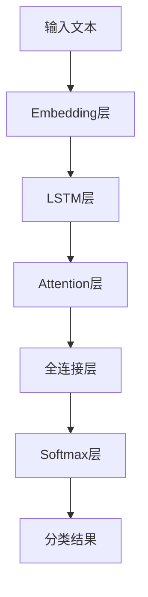

# Text Classification原理与代码实例讲解

## 1.背景介绍

文本分类是自然语言处理(NLP)领域的一个核心任务,广泛应用于垃圾邮件检测、新闻分类、情感分析等场景。随着深度学习技术的发展,基于神经网络的文本分类模型逐渐取代了传统的机器学习方法,展现出卓越的性能。本文将全面介绍文本分类的核心原理、算法流程,并提供代码实例,帮助读者深入理解这一领域。

## 2.核心概念与联系

### 2.1 文本表示

将文本数据转换为机器可以理解的数值向量是文本分类的基础。常用的文本表示方法包括:

1. **One-Hot编码**: 将每个单词映射为一个向量,向量维度等于词表大小,该单词位置为1,其他位置为0。缺点是维度过高,导致向量稀疏。

2. **Word Embedding**: 通过神经网络模型将单词映射到低维密集向量,能捕捉单词之间的语义关系。常用的Word Embedding方法有Word2Vec、GloVe等。

3. **序列编码**: 将文本序列直接输入神经网络模型,由模型自动学习文本表示,例如使用RNN、LSTM、Transformer等序列模型。

### 2.2 分类模型

文本分类常用的模型有:

1. **传统机器学习模型**: 如朴素贝叶斯、逻辑回归、支持向量机等,需要先对文本进行特征工程。

2. **神经网络模型**:
   - **CNN**: 能够有效捕捉局部特征,常用于文本分类任务。
   - **RNN/LSTM**: 能够捕捉序列依赖关系,适用于长文本分类。
   - **Attention机制**: 通过自注意力机制,模型可以自动学习文本中的关键信息。
   - **Transformer**: 全注意力架构,在长文本分类任务中表现优异。
   - **BERT等预训练语言模型**: 通过自监督方式预训练,能够捕捉通用的语义和语法知识,在下游任务中表现出色。

### 2.3 评估指标

常用的文本分类评估指标包括:准确率(Accuracy)、精确率(Precision)、召回率(Recall)、F1分数等。对于多分类任务,也可以使用宏平均(Macro-Averaging)或微平均(Micro-Averaging)的方式计算这些指标。

## 3.核心算法原理具体操作步骤  

以LSTM+Attention模型为例,介绍文本分类的核心算法原理和具体操作步骤:



1. **输入层**: 将文本序列输入模型。

2. **Embedding层**: 将每个单词映射为低维密集向量表示,常用预训练的Word Embedding或通过模型自身训练获得。

3. **LSTM层**: 对embedding序列进行编码,捕捉文本的上下文语义信息。LSTM是一种改进的RNN结构,能够有效解决梯度消失/爆炸问题。

4. **Attention层**: 通过自注意力机制,模型可以自动学习对输入序列中不同位置的词汇赋予不同的权重,从而更好地捕捉关键信息。

5. **全连接层**: 对LSTM的输出进行线性变换,得到分类任务所需的特征表示。

6. **Softmax层**: 将全连接层的输出映射到(0,1)范围内,得到每个类别的概率值。

7. **分类结果**: 选择概率值最大的类别作为最终分类结果。

在训练过程中,通过反向传播算法和优化器(如Adam),不断调整模型参数,使得模型在训练集上的损失函数(如交叉熵损失)最小化。

## 4.数学模型和公式详细讲解举例说明

### 4.1 Word Embedding

Word Embedding将单词映射到低维密集向量空间,其中相似的单词在向量空间中彼此靠近。常用的Word Embedding方法是Word2Vec,包含两种模型:CBOW(Continuous Bag-of-Words)和Skip-gram。

**CBOW模型**试图基于上下文词语的向量之和,预测目标单词。其目标函数为:

$$\underset{\theta}{\mathrm{max}}\frac{1}{T}\sum_{t=1}^{T}\log P(w_t|w_{t-c},\dots,w_{t-1},w_{t+1},\dots,w_{t+c})$$

其中 $\theta$ 为模型参数, $T$ 为语料库中的单词总数, $c$ 为上下文窗口大小, $w_t$ 为目标单词, $w_{t-c},\dots,w_{t-1},w_{t+1},\dots,w_{t+c}$ 为上下文单词。

**Skip-gram模型**则是基于目标单词,预测其上下文词语的分布:

$$\underset{\theta}{\mathrm{max}}\frac{1}{T}\sum_{t=1}^{T}\sum_{j=-c,j\neq 0}^{c}\log P(w_{t+j}|w_t)$$

通过优化上述目标函数,可以学习到单词的Embedding向量表示。

### 4.2 LSTM

LSTM(Long Short-Term Memory)是一种改进的RNN结构,能够有效解决梯度消失/爆炸问题,捕捉长期依赖关系。

对于时间步 $t$,LSTM的计算过程如下:

1. 忘记门(Forget Gate):
   $$f_t = \sigma(W_f\cdot[h_{t-1}, x_t] + b_f)$$
   决定遗忘上一时间步的什么信息。

2. 输入门(Input Gate):
   $$i_t = \sigma(W_i\cdot[h_{t-1}, x_t] + b_i)$$
   $$\tilde{C}_t = \tanh(W_C\cdot[h_{t-1}, x_t] + b_C)$$
   决定记住什么新的信息。

3. 更新细胞状态(Update Cell State):
   $$C_t = f_t * C_{t-1} + i_t * \tilde{C}_t$$
   根据遗忘门和输入门,更新细胞状态。

4. 输出门(Output Gate): 
   $$o_t = \sigma(W_o\cdot[h_{t-1}, x_t] + b_o)$$
   $$h_t = o_t * \tanh(C_t)$$
   决定输出什么信息。

其中 $\sigma$ 为sigmoid函数, $*$ 为元素乘积, $W$ 和 $b$ 为权重和偏置参数。

通过以上门控机制,LSTM能够灵活控制信息的流动,从而更好地捕捉长期依赖关系。

### 4.3 Attention机制

Attention机制能够自动学习输入序列中不同位置的词汇对预测结果的重要程度,从而更好地捕捉关键信息。

对于输入序列 $\boldsymbol{X} = (x_1, x_2, \dots, x_n)$,其Attention分数计算如下:

$$e_i = \mathrm{score}(x_i, h)$$
$$\alpha_i = \frac{\exp(e_i)}{\sum_{j=1}^{n}\exp(e_j)}$$

其中 $h$ 为LSTM的隐状态, $\mathrm{score}$ 为评分函数(如点乘或多层感知机),用于计算每个输入词与隐状态的相关性分数 $e_i$。然后通过Softmax函数,得到每个位置的权重 $\alpha_i$。

最终的Attention输出为:

$$\boldsymbol{c} = \sum_{i=1}^{n}\alpha_i x_i$$

即对输入序列进行加权求和,权重由Attention机制自动学习得到。

通过将Attention输出 $\boldsymbol{c}$ 与LSTM隐状态 $h$ 拼接,送入后续的全连接层,模型可以更好地捕捉关键信息,提高分类性能。

## 5.项目实践:代码实例和详细解释说明

以下是使用PyTorch实现LSTM+Attention文本分类模型的代码示例,并对关键步骤进行详细解释:

```python
import torch
import torch.nn as nn

# 1. 数据预处理
# 省略...

# 2. 模型定义
class TextClassifier(nn.Module):
    def __init__(self, vocab_size, embedding_dim, hidden_dim, output_dim, dropout_rate):
        super(TextClassifier, self).__init__()
        self.embedding = nn.Embedding(vocab_size, embedding_dim)
        self.lstm = nn.LSTM(embedding_dim, hidden_dim, batch_first=True)
        self.attention = Attention(hidden_dim)
        self.fc = nn.Linear(hidden_dim, output_dim)
        self.dropout = nn.Dropout(dropout_rate)

    def forward(self, x):
        embedded = self.embedding(x)
        output, (hidden, cell) = self.lstm(embedded)
        attn_output, attn_weights = self.attention(output, hidden)
        logits = self.fc(self.dropout(attn_output))
        return logits

class Attention(nn.Module):
    def __init__(self, hidden_dim):
        super(Attention, self).__init__()
        self.weight = nn.Parameter(torch.Tensor(hidden_dim, hidden_dim))
        self.bias = nn.Parameter(torch.Tensor(hidden_dim))
        self.reset_parameters()

    def reset_parameters(self):
        stdv = 1.0 / math.sqrt(self.weight.size(1))
        self.weight.data.uniform_(-stdv, stdv)
        self.bias.data.uniform_(-stdv, stdv)

    def forward(self, output, hidden):
        attn_scores = torch.matmul(output, self.weight.transpose(0, 1)) + self.bias
        attn_weights = F.softmax(attn_scores, dim=1)
        attn_output = torch.bmm(attn_weights.transpose(1, 2), output)
        return attn_output.squeeze(1), attn_weights

# 3. 模型训练
# 省略...

# 4. 模型评估
# 省略...
```

**代码解释**:

1. **数据预处理**: 将原始文本数据转换为模型可接受的格式,包括构建词表、序列填充等步骤。

2. **模型定义**:
   - `TextClassifier`是文本分类模型的主体,包含Embedding层、LSTM层、Attention层和全连接层。
   - `Attention`类实现了Attention机制,计算每个位置的权重,并对输出进行加权求和。

3. **模型训练**: 定义损失函数(如交叉熵损失)和优化器(如Adam),通过反向传播算法不断更新模型参数,使得模型在训练集上的损失最小化。

4. **模型评估**: 在测试集或验证集上评估模型的性能,计算相关指标(如准确率、F1分数等)。

通过上述代码,我们可以快速构建和训练一个LSTM+Attention文本分类模型。在实际应用中,您可以根据具体需求调整模型结构、超参数等,以获得更好的性能。

## 6.实际应用场景

文本分类技术在现实生活中有着广泛的应用,包括但不限于:

1. **垃圾邮件检测**: 自动识别和过滤垃圾邮件,提高工作效率。

2. **新闻分类**: 根据新闻内容自动分类,方便用户浏览感兴趣的新闻类别。

3. **情感分析**: 分析用户在社交媒体上的评论、评价,了解用户对产品或服务的态度。企业可以根据分析结果调整营销策略。

4. **智能客服**: 通过分析用户的问题,自动将其分类并给出相应的解决方案,提高客户服务效率。

5. **内容审核**: 自动识别并过滤不当内容,如色情、暴力、仇恨言论等,维护网络环境健康有序。

6. **法律文书分类**: 对大量的法律文书进行自动分类,方便律师快速查找相关案例。

7. **科研论文分类**: 根据论文内容自动分类,帮助研究人员快速找到感兴趣的论文。

总的来说,文本分类技术可以极大地提高信息处理效率,在各个领域都有广阔的应用前景。

## 7.工具和资源推荐

以下是一些常用的文本分类工具和资源,可以帮助您更好地学习和实践:

1. **开源框架**:
   - PyTorch: 深度学习框架,提供了强大的文本处理功能。
   - TensorFlow: 另一个流行的深度学习框架,也支持NLP任务。
   - Hugging Face Transformers: 集成了多种预训练语言模型,提供了统一的API。
   - scikit-learn: 机器学习框架{"msg_type":"generate_answer_finish","data":"","from_module":null,"from_unit":null}