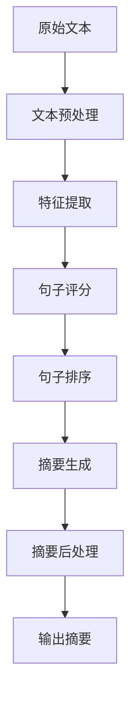
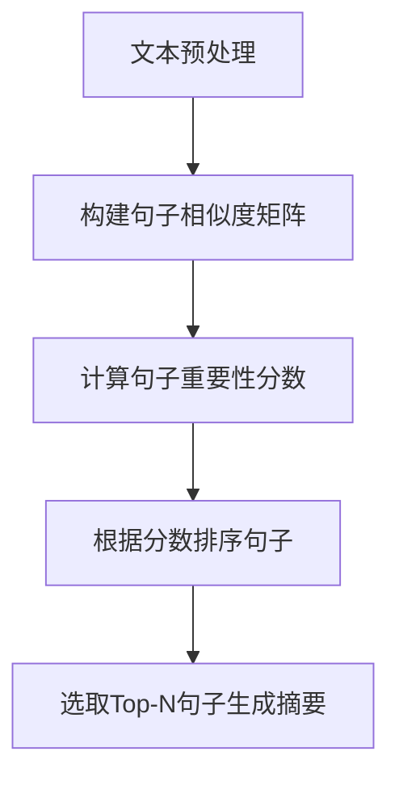
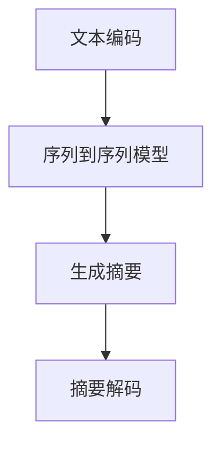

# Text Summarization原理与代码实例讲解

## 1.背景介绍

在当今信息时代,我们每天都会接触到大量的文本数据,从新闻报道、社交媒体帖子到技术文档等。然而,人类的认知能力是有限的,很难完全吸收如此庞大的信息量。这就催生了自动文本摘要技术的需求,它能够从冗长的文本中提取出最核心、最重要的内容,为用户提供信息的精华。

文本摘要技术可以广泛应用于多个领域,如新闻媒体、科研文献、客户服务等,帮助用户快速获取所需信息。此外,它还可以作为深度学习模型理解和处理自然语言的一个重要评估手段。

## 2.核心概念与联系

### 2.1 文本摘要的类型

根据生成方式的不同,文本摘要可分为**抽取式摘要**和**生成式摘要**两大类:

- **抽取式摘要(Extractive Summarization)**: 从原文中抽取出一些重要的句子或语句,拼接成摘要。这种方法简单直接,但可能会导致摘要缺乏连贯性。

- **生成式摘要(Abstractive Summarization)**: 深入理解原文的语义,并生成一个全新的摘要文本。这种方法可以产生更加流畅、连贯的摘要,但实现难度较大。

### 2.2 评估指标

评估文本摘要质量的常用指标包括:

- **ROUGE(Recall-Oriented Understudy for Gisting Evaluation)**: 计算系统生成摘要与参考摘要之间的n-gram重叠程度。

- **BLEU(Bilingual Evaluation Understudy)**: 原本用于机器翻译评估,也可用于评价摘要的语言流畅度。

此外,人工评估也是必不可少的补充,可以更全面地评价摘要质量。

### 2.3 文本摘要系统架构

一个典型的文本摘要系统通常包括以下几个模块:



## 3.核心算法原理具体操作步骤  

### 3.1 抽取式摘要算法

抽取式摘要的核心思想是为每个句子打分,选取得分最高的句子作为摘要。常用的算法包括:

1. **TextRank**

   基于图论的无监督算法,将文本看作是个加权有向图,句子是节点,相似度是边的权重。通过计算每个句子的"重要性",选取重要性最高的句子。

2. **LexRank**

   TextRank的改进版,使用了更复杂的相似度计算方法,效果更好。

3. **领域特定特征算法**

   根据特定领域的特征(如新闻领域的5W1H),为句子设计启发式规则,计算其重要性分数。

算法步骤:



### 3.2 生成式摘要算法

生成式摘要主要基于序列到序列(Seq2Seq)模型,将原文看作是源序列,摘要为目标序列。算法步骤:



常用的Seq2Seq模型包括:

1. **RNN+Attention**

   使用RNN编码器-解码器结构,Attention机制帮助模型更好地捕捉长距离依赖关系。

2. **Transformer**

   完全基于Attention的Seq2Seq模型,避免了RNN的一些缺陷,在长文本任务上表现更好。

3. **BERT等预训练模型**

   使用大规模无监督预训练的BERT等模型作为编码器,显著提升了性能。

## 4.数学模型和公式详细讲解举例说明

### 4.1 Attention机制

Attention是序列模型中的关键机制之一,它赋予模型"注意力"能力,使其可以更好地捕捉输入序列中不同位置的信息。

在Seq2Seq模型的解码器中,Attention的计算公式为:

$$\begin{aligned}
    \text{Attention}(Q, K, V) &= \text{softmax}(\frac{Q K^T}{\sqrt{d_k}}) V \\
    \text{head}_i &= \text{Attention}(QW_i^Q, KW_i^K, VW_i^V) \\
    \text{MultiHead}(Q, K, V) &= \text{Concat}(\text{head}_1, \ldots, \text{head}_h) W^O
\end{aligned}$$

其中 $Q、K、V$ 分别表示查询(Query)、键(Key)和值(Value)向量。$d_k$ 为缩放因子,防止点积的结果过大导致梯度消失。MultiHead Attention则是将多个注意力头的结果拼接在一起。

Attention机制使模型可以灵活地关注输入序列的不同部分,极大提高了模型性能。

### 4.2 Transformer

Transformer是一种全新的基于Attention的Seq2Seq架构,完全舍弃了RNN,使用多头自注意力(Multi-Head Self-Attention)来捕捉序列中元素之间的依赖关系。

Transformer的核心组件包括:

- **多头自注意力层(Multi-Head Self-Attention)**
- **位置编码(Positional Encoding)**
- **层归一化(Layer Normalization)**
- **前馈全连接层(Feed-Forward)**

编码器和解码器都由上述组件构成,只是解码器还增加了"遮挡(Masking)"机制,确保每个位置的单词只能注意之前的单词。

Transformer架构展现了卓越的并行计算能力,在长序列任务上表现优异,成为当前主流的Seq2Seq模型。

## 5.项目实践:代码实例和详细解释说明

以下是一个使用Hugging Face的Transformers库实现抽取式文本摘要的Python代码示例:

```python
from transformers import PegasusForConditionalGeneration, PegasusTokenizer

model = PegasusForConditionalGeneration.from_pretrained("google/pegasus-xsum")
tokenizer = PegasusTokenizer.from_pretrained("google/pegasus-xsum")

article = """
...输入待摘要的长文本...
"""

tokens = tokenizer(article, truncation=True, padding="longest", return_tensors="pt")
summary = model.generate(**tokens)

summary_text = tokenizer.decode(summary[0], skip_special_tokens=True)
print(summary_text)
```

代码解释:

1. 导入Pegasus模型和Tokenizer。Pegasus是Google推出的用于文本摘要任务的预训练模型。

2. 加载预训练的Pegasus模型和Tokenizer。

3. 输入待摘要的长文本。

4. 使用Tokenizer对文本进行编码,生成模型输入所需的张量。

5. 调用`model.generate()`方法生成摘要,传入编码后的文本张量。

6. 使用Tokenizer将生成的摘要张量解码为可读的文本。

7. 打印输出生成的摘要文本。

上述代码利用了Hugging Face强大的自然语言处理工具集,可以快速实现文本摘要任务。当然,在实际应用中还需要根据具体需求进行调整和优化。

## 6.实际应用场景

文本摘要技术在诸多领域都有广泛的应用前景:

1. **新闻媒体**

   自动生成新闻文章的摘要,方便读者快速获取核心内容。

2. **科研文献**

   对论文、专利等文献生成摘要,帮助研究人员快速了解最新进展。

3. **电子邮件**

   自动摘要邮件内容,提高工作效率。

4. **客户服务**

   对用户反馈进行自动摘要,快速发现问题。

5. **智能助手**

   结合语音识别,为用户生成对话内容的摘要,提升交互体验。

6. **评论分析**

   对海量评论生成摘要,洞察用户反馈。

总的来说,文本摘要技术可以广泛应用于需要快速获取文本核心内容的场景,大幅提升信息处理效率。

## 7.工具和资源推荐

以下是一些流行的文本摘要工具和资源:

1. **Hugging Face Transformers**

   强大的自然语言处理工具库,提供了多种预训练模型,如BART、Pegasus等,可用于文本摘要任务。

2. **Gensim**

   Python中流行的主题建模工具包,包含TextRank等抽取式摘要算法的实现。

3. **NLTK**

   Python自然语言处理工具包,提供了基本的文本预处理功能。

4. **CNN/Daily Mail数据集**

   常用的文本摘要数据集,包含大量新闻文章及其对应的摘要。

5. **arXiv和PubMed论文数据集**

   可用于科研文献摘要任务。

6. **Amazon产品评论数据集**

   包含大量真实的产品评论数据,可用于评论摘要任务。

利用这些工具和资源,可以快速构建和评估文本摘要系统。

## 8.总结:未来发展趋势与挑战

文本摘要技术正在不断发展,未来可期的趋势包括:

1. **多模态摘要**

   除了文本,还可以对图像、视频等多模态数据生成摘要,提供更丰富的信息。

2. **长文本摘要**

   现有模型在处理长文本时仍有不足,需要进一步提升长序列建模能力。

3. **多语种支持**

   扩展到更多语种,实现跨语言文本摘要。

4. **领域自适应**

   根据特定领域自动调整模型,生成更加专业的摘要。

5. **交互式摘要**

   将人机交互引入摘要过程,生成符合用户需求的个性化摘要。

与此同时,也面临一些挑战:

- 如何生成更加信息丰富、连贯流畅的摘要?
- 如何确保摘要的一致性和无偏差性?
- 如何评估摘要的质量和可读性?
- 如何处理罕见词和新词?

未来,随着深度学习等技术的发展,相信这些挑战终将被攻克,文本摘要将为人类高效获取信息提供更好的支持。

## 9.附录:常见问题与解答

1. **抽取式摘要和生成式摘要有什么区别?**

   抽取式摘要是从原文中抽取出一些句子拼接而成,而生成式摘要则是生成一个全新的摘要文本。前者简单直接但可能缺乏连贯性,后者语言更加流畅但实现难度较大。

2. **如何选择合适的文本摘要方法?**

   这取决于你的具体需求。如果追求高效简单,可以选择抽取式方法;如果对摘要质量和可读性要求较高,生成式方法会是更好的选择。此外,数据量、硬件资源等因素也需要考虑。

3. **文本摘要的质量如何评估?**

   常用的自动评估指标包括ROUGE(测量n-gram重叠程度)和BLEU(测量语言流畅度)等。但最终还需要人工评估,全面考虑摘要的信息完整性、连贯性、无偏差性等多个维度。

4. **文本摘要系统的应用场景有哪些?**

   文本摘要可以广泛应用于新闻媒体、科研文献、客户服务、智能助手、评论分析等多个领域,帮助用户高效获取核心信息。

5. **未来文本摘要技术会有哪些发展趋势?**

   未来或将出现多模态摘要、长文本摘要、多语种支持、领域自适应、交互式摘要等新的发展方向,以满足不同场景的需求。同时,生成更高质量摘要、处理新词、评估摘要质量等仍是亟待解决的挑战。

作者:禅与计算机程序设计艺术 / Zen and the Art of Computer Programming