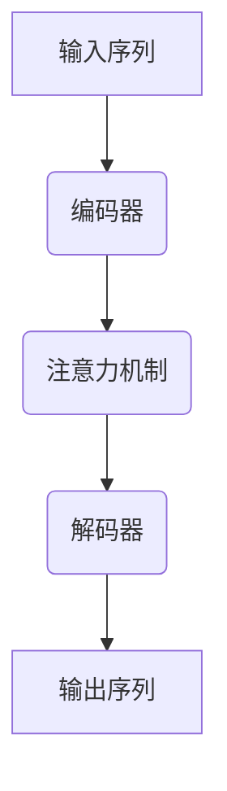

# Transformer大模型实战 加载自定义模型

## 1.背景介绍

随着人工智能和深度学习技术的不断发展,Transformer模型在自然语言处理(NLP)、计算机视觉(CV)等领域取得了卓越的成就。作为一种全新的基于注意力机制(Attention Mechanism)的神经网络架构,Transformer彻底改变了序列数据的处理方式,摆脱了传统循环神经网络(RNN)的局限性,展现出了令人惊艳的性能表现。

大型预训练语言模型(Large Pre-trained Language Models)如BERT、GPT、XLNet等,都是基于Transformer架构构建的。这些模型通过在大规模语料库上进行预训练,学习到了丰富的语义和上下文知识,为下游的NLP任务提供了强大的语义表示能力。然而,直接使用预训练模型并不能满足所有场景的需求,因此加载自定义数据并在此基础上对模型进行微调(Fine-tuning)成为了一种常见的做法。

本文将详细介绍如何加载自定义数据集,并基于Transformer大模型进行微调训练,以适应特定的应用场景。我们将探讨数据预处理、模型微调的关键步骤,并提供实际的代码示例,帮助读者掌握这一重要技能。

## 2.核心概念与联系

### 2.1 Transformer模型架构

Transformer模型由编码器(Encoder)和解码器(Decoder)两个主要部分组成。编码器负责处理输入序列,而解码器则生成目标输出序列。两者之间通过注意力机制建立联系,实现了高效的序列到序列(Seq2Seq)映射。



编码器和解码器内部都采用了多头注意力机制(Multi-Head Attention)和前馈神经网络(Feed-Forward Neural Network)的结构,通过层与层之间的残差连接(Residual Connection)和层归一化(Layer Normalization)操作,实现了高效的特征提取和信息传递。

### 2.2 微调(Fine-tuning)

微调是指在大规模预训练模型的基础上,利用特定任务的数据进行进一步的训练,以使模型更好地适应目标任务。这种方式可以有效地利用预训练模型学习到的知识,同时针对特定任务进行优化,提高模型的性能表现。

在微调过程中,通常会冻结预训练模型的部分层参数,只对最后几层进行训练,以避免破坏预训练模型已经学习到的有用知识。同时,还需要对学习率、批大小等超参数进行调整,以确保模型的收敛性和泛化能力。

## 3.核心算法原理具体操作步骤

### 3.1 数据预处理

在加载自定义数据集进行微调之前,需要对数据进行适当的预处理,以确保其符合Transformer模型的输入格式要求。主要步骤包括:

1. **文本清理**: 去除无用的标点符号、HTML标签等,并进行大小写统一、分词等操作。
2. **编码**: 将文本转换为模型可以识别的token序列,通常使用预训练模型提供的tokenizer工具。
3. **填充(Padding)**: 将不同长度的序列填充到相同长度,以满足批处理的要求。
4. **掩码(Masking)**: 对于需要预测的目标序列,可以使用特殊的掩码token进行替换,以便模型进行预测。

### 3.2 模型微调

经过数据预处理后,我们可以开始对Transformer模型进行微调训练。具体步骤如下:

1. **加载预训练模型**: 使用深度学习框架(如PyTorch或TensorFlow)加载预训练的Transformer模型权重。
2. **设置训练参数**: 确定需要微调的层数、学习率、批大小等超参数。
3. **定义损失函数和优化器**: 根据任务类型选择合适的损失函数(如交叉熵损失),并选择优化算法(如Adam)。
4. **训练循环**: 将预处理后的数据分成批次,并进行多轮迭代训练,更新模型参数。
5. **模型评估**: 在验证集上评估模型性能,并根据需要调整超参数或停止训练。
6. **模型保存**: 将训练好的模型权重保存下来,以备后续使用。

以下是一个基于PyTorch实现Transformer模型微调的简化示例代码:

```python
import torch
from transformers import BertForSequenceClassification, BertTokenizer

# 加载预训练模型和tokenizer
model = BertForSequenceClassification.from_pretrained('bert-base-uncased')
tokenizer = BertTokenizer.from_pretrained('bert-base-uncased')

# 数据预处理
texts = ["This is a great movie.", "I didn't like the ending."]
inputs = tokenizer(texts, padding=True, truncation=True, return_tensors="pt")

# 设置训练参数
optimizer = torch.optim.Adam(model.parameters(), lr=2e-5)
epochs = 3

# 训练循环
for epoch in range(epochs):
    outputs = model(**inputs)
    loss = outputs.loss
    loss.backward()
    optimizer.step()
    optimizer.zero_grad()

# 模型评估和保存
# ...
```

在实际应用中,您可能需要处理更复杂的数据格式、定制损失函数、实现评估指标等,但基本原理是相似的。

## 4.数学模型和公式详细讲解举例说明

### 4.1 注意力机制(Attention Mechanism)

注意力机制是Transformer模型的核心部分,它允许模型在处理序列数据时,动态地关注输入序列的不同部分,并根据它们的重要性对应地分配注意力权重。这种机制使得模型能够更好地捕捉长距离依赖关系,克服了RNN在处理长序列时的梯度消失问题。

注意力机制的数学表达式如下:

$$\text{Attention}(Q, K, V) = \text{softmax}(\frac{QK^T}{\sqrt{d_k}})V$$

其中:

- $Q$ 表示查询(Query)向量
- $K$ 表示键(Key)向量
- $V$ 表示值(Value)向量
- $d_k$ 是键向量的维度,用于缩放点积的值

首先,查询向量 $Q$ 与所有键向量 $K$ 进行点积运算,得到一个注意力分数向量。然后,这个向量通过 softmax 函数进行归一化,得到注意力权重向量。最后,注意力权重向量与值向量 $V$ 进行加权求和,得到最终的注意力输出。

多头注意力机制(Multi-Head Attention)是对单一注意力机制的扩展,它将查询、键和值向量进行线性变换,得到多组查询、键和值向量,分别计算注意力输出,然后将这些输出进行拼接,最后再经过一次线性变换,得到最终的多头注意力输出。这种机制可以让模型从不同的子空间捕捉不同的特征,提高了模型的表达能力。

### 4.2 位置编码(Positional Encoding)

由于Transformer模型没有像RNN那样的递归结构,因此需要一种机制来捕捉序列中token的位置信息。位置编码就是为了解决这个问题而设计的。

位置编码是一个向量,其中每个元素都是一个正弦或余弦函数,用于编码token在序列中的位置。具体来说,对于序列中的第 $i$ 个token,它的位置编码向量 $\text{PE}_{(pos, 2i)}$ 和 $\text{PE}_{(pos, 2i+1)}$ 分别由以下公式计算:

$$\begin{aligned}
\text{PE}_{(pos, 2i)} &= \sin\left(\frac{pos}{10000^{2i/d_\text{model}}}\right) \\
\text{PE}_{(pos, 2i+1)} &= \cos\left(\frac{pos}{10000^{2i/d_\text{model}}}\right)
\end{aligned}$$

其中 $pos$ 表示token的位置索引, $d_\text{model}$ 是模型的embedding维度, $i$ 是维度的索引。

通过这种方式,每个位置都会对应一个唯一的位置编码向量,并且由于使用了不同的波长的正弦和余弦函数,这些向量之间是正交的,可以很好地编码位置信息而不会相互干扰。

在Transformer模型中,位置编码向量会直接加到输入的embedding向量上,以提供位置信息。

## 5.项目实践: 代码实例和详细解释说明

在这一部分,我们将提供一个基于Hugging Face的Transformers库,加载自定义数据集并对BERT模型进行微调的实际代码示例。我们将使用一个情感分析任务作为示例,目标是根据给定的文本,预测其情感极性(正面或负面)。

### 5.1 导入所需库

```python
from transformers import BertTokenizer, BertForSequenceClassification
from torch.utils.data import DataLoader
from torch import cuda
```

我们从Transformers库中导入BERT的tokenizer和模型类,以及PyTorch中的DataLoader用于构建数据批次。

### 5.2 数据预处理

```python
# 示例数据
texts = [
    "I loved this movie, it was amazing!",
    "This book was terrible, I don't recommend it.",
    # ...
]
labels = [1, 0]  # 1表示正面情感,0表示负面情感

# 使用BERT的tokenizer对文本进行编码
tokenizer = BertTokenizer.from_pretrained('bert-base-uncased')
encodings = tokenizer(texts, truncation=True, padding=True)

# 将编码后的数据转换为PyTorch张量
import torch
input_ids = torch.tensor(encodings['input_ids'])
attention_masks = torch.tensor(encodings['attention_mask'])
labels = torch.tensor(labels)

# 创建PyTorch数据集
from torch.utils.data import TensorDataset
dataset = TensorDataset(input_ids, attention_masks, labels)

# 创建数据加载器
batch_size = 32
dataloader = DataLoader(dataset, batch_size=batch_size, shuffle=True)
```

在这个示例中,我们首先定义了一些示例文本及其对应的情感标签。然后,我们使用BERT的tokenizer对文本进行编码,得到输入id和注意力掩码张量。接下来,我们将编码后的数据和标签组合成PyTorch的TensorDataset,并使用DataLoader创建数据批次加载器。

### 5.3 模型微调

```python
# 加载预训练的BERT模型
device = 'cuda' if cuda.is_available() else 'cpu'
model = BertForSequenceClassification.from_pretrained('bert-base-uncased').to(device)

# 设置训练参数
optimizer = torch.optim.AdamW(model.parameters(), lr=2e-5)
epochs = 3

# 训练循环
for epoch in range(epochs):
    model.train()
    for batch in dataloader:
        batch = tuple(b.to(device) for b in batch)
        inputs = {
            'input_ids': batch[0],
            'attention_mask': batch[1],
            'labels': batch[2]
        }
        outputs = model(**inputs)
        loss = outputs.loss
        loss.backward()
        optimizer.step()
        optimizer.zero_grad()

# 模型评估
# ...

# 模型保存
model.save_pretrained('my_model')
```

在这个代码示例中,我们首先加载预训练的BERT模型,并将其移动到GPU或CPU设备上。接下来,我们定义优化器和训练轮数,然后开始训练循环。

在每个训练批次中,我们将数据移动到相应的设备上,并将输入id、注意力掩码和标签组合成模型所需的输入字典。然后,我们调用模型并计算损失,执行反向传播和优化器更新。

训练结束后,您可以对模型进行评估,并使用`model.save_pretrained`方法保存微调后的模型权重,以备将来使用。

通过这个示例,您应该能够掌握如何加载自定义数据集,并基于Transformer模型(如BERT)进行微调训练的基本流程。在实际应用中,您可能需要根据具体任务和数据集进行一些调整和优化,但总体原理是相似的。

## 6.实际应用场景

加载自定义数据并对Transformer大模型进行微调,在各种NLP任务中都有广泛的应用,例如:

1. **文本分类**: 根据文本内容对其进行分类,如情感分析、新闻主题分类等。
2. **序列标注**: 对文本序列中的每个token进行标注,如命名实体识别(NER)、关系抽取等。
3. **机器翻译**: 将一种语言的文本翻译成另一种语言。
4. **文本摘要**: 自动生成文本