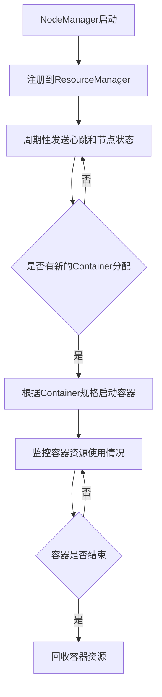

# YARN Node Manager原理与代码实例讲解

## 1.背景介绍

### 1.1 YARN架构概述

Apache Hadoop YARN (Yet Another Resource Negotiator) 是Hadoop的资源管理和任务调度框架。它将资源管理和作业调度/监控分离,使得Hadoop可以支持除了MapReduce之外的其他分布式计算模型。YARN由ResourceManager、NodeManager、ApplicationMaster和Container等组件构成。

### 1.2 NodeManager作用

NodeManager是每个节点上的资源和任务管理器,它负责管理节点上的资源(CPU、内存、磁盘、网络等)和运行在容器中的任务。NodeManager定期与ResourceManager通信,汇报本节点的资源使用情况并接收来自ResourceManager的指令。

## 2.核心概念与联系

### 2.1 Container

Container是YARN中的资源抽象,它封装了一定数量的资源(CPU、内存等),用于运行任务。每个Container对应一个执行容器,如Docker容器或Java进程。

### 2.2 NodeManager与Container

NodeManager负责管理和监控节点上的Container,包括启动、监控和终止Container。它还负责资源隔离和限制,确保每个Container使用分配的资源。

### 2.3 NodeManager与ApplicationMaster

ApplicationMaster是应用程序的"大脑",负责与ResourceManager协调资源,并与NodeManager通信以启动和监控容器。NodeManager向ApplicationMaster提供运行容器的操作接口。

### 2.4 NodeManager与ResourceManager

NodeManager与ResourceManager通过心跳机制保持通信,汇报节点资源使用情况并接收指令。ResourceManager根据集群资源状况为应用分配Container,并指示NodeManager启动相应的容器。

## 3.核心算法原理具体操作步骤  

NodeManager的核心功能包括容器启动、监控和资源管理。下面是主要的操作步骤:



1. **NodeManager启动**:NodeManager作为服务启动时,会加载本地资源配置信息。

2. **注册到ResourceManager**:NodeManager启动后向ResourceManager注册,汇报节点的硬件规格和可用资源。

3. **周期性发送心跳和节点状态**:NodeManager周期性(默认3秒)向ResourceManager发送心跳和节点状态信息,包括资源使用情况、运行中的容器等。

4. **是否有新的Container分配**:ResourceManager根据集群资源情况和应用需求,决定是否为该节点分配新的Container。

5. **根据Container规格启动容器**:如果有新的Container分配,NodeManager会根据Container的资源规格(CPU、内存等),在节点上启动相应的容器。容器可以是进程容器或Docker容器。

6. **监控容器资源使用情况**:NodeManager会持续监控容器的资源使用情况,包括CPU、内存、磁盘、网络等,并将信息汇报给ResourceManager。

7. **容器是否结束**:NodeManager检测容器是否结束。如果容器正常结束或异常退出,进入下一步。

8. **回收容器资源**:NodeManager回收容器占用的资源,并将资源状态汇报给ResourceManager。

以上是NodeManager的核心操作流程。在实际运行中,NodeManager还需要处理容器启动失败、节点失效、资源过度使用等异常情况。

## 4.数学模型和公式详细讲解举例说明

NodeManager在管理容器资源时,需要考虑资源隔离和资源限制。这涉及到一些数学模型和公式。

### 4.1 CPU资源管理

NodeManager使用CGroups(Control Groups)实现CPU资源隔离和限制。CGroups提供了cpu.shares和cpu.cfs_quota_us两个关键参数。

**cpu.shares**:表示CPU共享权重,用于控制CPU周期分配。假设节点上有n个容器,容器i的cpu.shares为$w_i$,则容器i获得的CPU周期比例为:

$$\frac{w_i}{\sum_{j=1}^{n}w_j}$$

**cpu.cfs_quota_us**:表示每个CPU周期内容器可以使用的最大CPU时间,单位为微秒(us)。假设节点有m个CPU核心,CPU周期为$T_{cpu}$,容器i的cpu.cfs_quota_us为$q_i$,则容器i在每个CPU周期内可使用的最大CPU时间为:

$$\min\left(q_i, \frac{T_{cpu}}{m}\right)$$

通过合理设置这两个参数,NodeManager可以实现CPU资源的隔离和限制。

### 4.2 内存资源管理

NodeManager使用cgroups实现内存资源隔离和限制。关键参数是memory.limit_in_bytes,表示容器可使用的最大内存量。

假设节点的总内存为$M$,容器i的memory.limit_in_bytes为$L_i$,则有:

$$\sum_{i=1}^{n}L_i \leq M$$

如果容器内存使用超过限制,NodeManager会触发内存回收机制,如终止容器或激活内存交换。

### 4.3 磁盘IO资源管理

NodeManager使用Cgroups的blkio子系统管理磁盘IO资源。关键参数包括:

- blkio.weight:磁盘IO权重,类似于CPU的cpu.shares
- blkio.throttle.read_bps_device:读带宽限制(bytes/s)
- blkio.throttle.write_bps_device:写带宽限制(bytes/s)

通过设置这些参数,NodeManager可以实现磁盘IO资源的隔离和限制。

### 4.4 网络资源管理

NodeManager使用Linux的网络命名空间(Network Namespace)和流量控制(Traffic Control)实现网络资源隔离和限制。关键参数包括:

- 网络命名空间:为每个容器创建独立的网络命名空间,实现网络隔离
- tc(Traffic Control):限制容器的网络带宽

通过这些机制,NodeManager可以为每个容器分配独立的网络资源,并限制网络带宽使用。

以上是NodeManager在资源管理中使用的一些数学模型和公式。通过合理配置这些参数,NodeManager可以实现资源的隔离和限制,确保每个容器获得公平的资源份额,并防止资源过度使用。

## 5.项目实践:代码实例和详细解释说明

下面是一个简化的NodeManager代码示例,展示了容器启动和监控的核心流程:

```java
// ContainerManager.java
public class ContainerManager {
    private Map<ContainerId, Container> containers = new HashMap<>();

    public void startContainer(ContainerLaunchContext context) {
        // 根据context创建Container
        Container container = new Container(context);
        containers.put(container.getId(), container);

        // 启动Container
        container.launch();
    }

    public void monitorContainers() {
        for (Container container : containers.values()) {
            // 监控容器资源使用情况
            ContainerStatus status = container.getStatus();
            reportToRM(status);

            // 检查容器是否结束
            if (container.isCompleted()) {
                containers.remove(container.getId());
                container.cleanup();
            }
        }
    }
}

// Container.java
public class Container {
    private ContainerId id;
    private Resource resource; // CPU、内存等资源配置
    private ContainerStatus status;

    public Container(ContainerLaunchContext context) {
        this.id = context.getContainerId();
        this.resource = context.getResource();
        this.status = ContainerStatus.REQUESTED;
    }

    public void launch() {
        // 1. 创建Cgroup
        String cgroupPath = createCgroup(resource);

        // 2. 启动容器进程
        Process process = startContainerProcess(cgroupPath);

        // 3. 设置容器状态
        this.status = ContainerStatus.RUNNING;

        // 4. 监控容器进程
        monitorProcess(process);
    }

    private String createCgroup(Resource resource) {
        // 根据资源配置创建Cgroup
        // 设置cpu.shares、cpu.cfs_quota_us、memory.limit_in_bytes等参数
        ...
    }

    private Process startContainerProcess(String cgroupPath) {
        // 在指定的Cgroup中启动容器进程
        ...
    }

    private void monitorProcess(Process process) {
        // 监控容器进程,获取资源使用情况
        ...
    }

    public ContainerStatus getStatus() {
        return status;
    }

    public boolean isCompleted() {
        // 检查容器是否结束
        ...
    }

    public void cleanup() {
        // 清理容器资源
        ...
    }
}
```

上面的代码展示了NodeManager启动和监控容器的核心流程:

1. **ContainerManager**是容器管理器,维护了运行中的所有容器。
2. `startContainer`方法根据`ContainerLaunchContext`创建`Container`对象,并调用`Container.launch()`启动容器。
3. `Container.launch()`方法首先根据容器资源配置创建Cgroup,设置相应的资源限制参数。然后在指定的Cgroup中启动容器进程,并进入监控状态。
4. `monitorContainers`方法周期性遍历所有容器,获取容器状态并汇报给ResourceManager。如果容器结束,则从容器列表中移除并执行清理操作。

以上代码展示了NodeManager管理容器的基本流程,包括容器启动、资源限制、监控和清理等步骤。在实际实现中,NodeManager还需要处理更多的异常情况和边界条件,如容器启动失败、节点失效、资源过度使用等。

## 6.实际应用场景

NodeManager作为YARN的核心组件,在Hadoop生态系统中扮演着重要角色。以下是一些典型的应用场景:

### 6.1 大数据计算框架

Hadoop MapReduce、Apache Spark、Apache Flink等大数据计算框架都依赖于YARN进行资源管理和任务调度。NodeManager负责在每个节点上启动和监控计算任务的容器。

### 6.2 机器学习和深度学习

机器学习和深度学习任务通常需要大量的计算资源。YARN可以为这些任务动态分配CPU、GPU和内存资源,而NodeManager则负责在每个节点上启动和监控计算容器。

### 6.3 流处理系统

Apache Kafka、Apache Storm等流处理系统可以在YARN上运行,利用NodeManager管理流处理任务的容器。这样可以实现流处理任务的弹性扩展和故障恢复。

### 6.4 数据湖和数据仓库

Apache Hive、Apache Impala等数据湖和数据仓库系统可以在YARN上运行SQL查询。NodeManager负责启动和监控这些查询任务的容器,确保查询任务获得所需的资源。

### 6.5 容器云

YARN可以作为一种容器云平台,为各种应用程序提供资源管理和调度服务。NodeManager在每个节点上管理应用容器,实现资源隔离和限制。

总的来说,NodeManager是YARN的核心组件,为各种大数据、机器学习、流处理、数据分析等应用程序提供了可靠的资源管理和任务执行环境。

## 7.工具和资源推荐

### 7.1 YARN Web UI

YARN提供了Web UI界面,可以方便地查看集群资源使用情况、运行中的应用程序和容器等信息。通过Web UI,我们可以实时监控NodeManager的状态和容器资源使用情况。

### 7.2 YARN命令行工具

Hadoop提供了一系列命令行工具,如`yarn`命令,可以用于查看和管理YARN集群。例如,`yarn node -status`命令可以查看每个NodeManager的状态和容器信息。

### 7.3 YARN日志

YARN的日志文件记录了ResourceManager、NodeManager和ApplicationMaster的运行信息,对于排查问题和优化性能非常有帮助。日志文件通常位于`$HADOOP_LOG_DIR`目录下。

### 7.4 Cgroups工具

由于NodeManager广泛使用Cgroups进行资源管理,因此掌握Cgroups相关的工具和命令非常重要。例如,`cgcreate`、`cgexec`、`cgget`等命令可以用于创建、执行和查看Cgroup信息。

### 7.5 Linux命令行工具

NodeManager运行在Linux环境中,因此熟练掌握Linux命令行工具对于监控和故障排查非常有帮助。例如,`top`、`htop`、`iotop`、`nethogs`等命令可以查看CPU、内存、磁盘IO和网络使用情况。

### 7.6 开源社区和文档

Apache Hadoop项目拥有活跃的开源社区和详细的文档,是学习和解决问题的宝贵资源。可以通过邮件列表、问答网站和官方文档获取帮助和最新信息。{"msg_type":"generate_answer_finish","data":"","from_module":null,"from_unit":null}