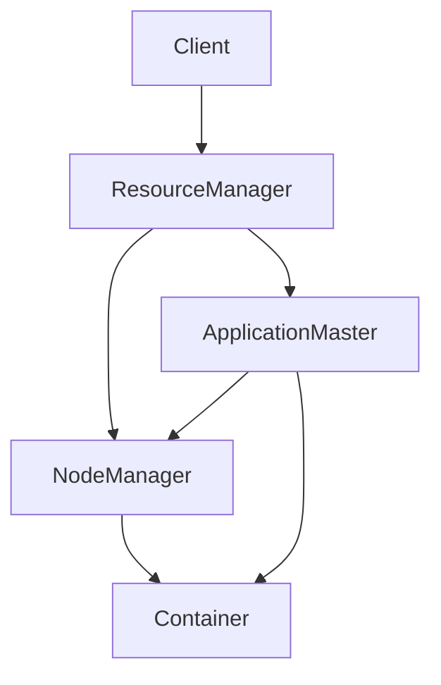

# Yarn原理与代码实例讲解

## 1. 背景介绍
### 1.1 Yarn的起源与发展历程
### 1.2 Yarn在大数据生态系统中的地位
### 1.3 Yarn相比传统资源管理系统的优势

## 2. 核心概念与联系
### 2.1 ResourceManager
#### 2.1.1 ResourceManager的功能与职责
#### 2.1.2 ResourceManager的工作原理
#### 2.1.3 ResourceManager的高可用性设计
### 2.2 NodeManager  
#### 2.2.1 NodeManager的功能与职责
#### 2.2.2 NodeManager的工作原理
#### 2.2.3 NodeManager与ResourceManager的交互
### 2.3 ApplicationMaster
#### 2.3.1 ApplicationMaster的功能与职责 
#### 2.3.2 ApplicationMaster的工作原理
#### 2.3.3 ApplicationMaster与ResourceManager、NodeManager的交互
### 2.4 Container
#### 2.4.1 Container的概念与特点
#### 2.4.2 Container的资源分配与隔离机制
#### 2.4.3 Container的生命周期管理

## 3. 核心算法原理具体操作步骤
### 3.1 资源请求与分配算法
#### 3.1.1 资源请求的表示方法
#### 3.1.2 资源分配的约束条件
#### 3.1.3 资源分配算法的核心思想与步骤
### 3.2 任务调度算法
#### 3.2.1 任务提交与初始化过程
#### 3.2.2 任务调度队列的管理 
#### 3.2.3 任务调度算法的核心思想与步骤
### 3.3 容错与故障恢复机制
#### 3.3.1 ApplicationMaster的容错机制
#### 3.3.2 NodeManager的容错机制
#### 3.3.3 任务重试与恢复策略

## 4. 数学模型和公式详细讲解举例说明
### 4.1 资源需求量估算模型
#### 4.1.1 资源需求的影响因素分析
#### 4.1.2 资源需求量估算公式推导
#### 4.1.3 资源需求量估算实例演示
### 4.2 资源利用率优化模型 
#### 4.2.1 资源利用率的定义与度量
#### 4.2.2 资源利用率优化目标函数构建
#### 4.2.3 资源利用率优化约束条件设定
#### 4.2.4 资源利用率优化求解算法与实例

## 5. 项目实践：代码实例和详细解释说明
### 5.1 Yarn集群环境搭建
#### 5.1.1 前置条件与准备工作
#### 5.1.2 ResourceManager部署与配置
#### 5.1.3 NodeManager部署与配置
### 5.2 提交Yarn应用程序
#### 5.2.1 Yarn应用程序开发流程
#### 5.2.2 Yarn Client模式提交应用
#### 5.2.3 Yarn Cluster模式提交应用
### 5.3 Yarn应用程序运行过程跟踪
#### 5.3.1 应用程序状态查询
#### 5.3.2 应用程序日志查看
#### 5.3.3 应用程序进度监控

## 6. 实际应用场景
### 6.1 Hadoop MapReduce on Yarn 
#### 6.1.1 MapReduce任务运行机制
#### 6.1.2 MapReduce on Yarn任务提交流程
#### 6.1.3 MapReduce on Yarn任务执行过程
### 6.2 Spark on Yarn
#### 6.2.1 Spark应用特点
#### 6.2.2 Spark on Yarn部署模式
#### 6.2.3 Spark作业在Yarn上的执行流程
### 6.3 Flink on Yarn
#### 6.3.1 Flink架构与Yarn的集成方式
#### 6.3.2 Flink on Yarn Session模式
#### 6.3.3 Flink on Yarn Per-Job模式
#### 6.3.4 Flink任务在Yarn上的执行流程

## 7. 工具和资源推荐
### 7.1 Yarn常用配置参数解析
### 7.2 Yarn集群监控工具
### 7.3 Yarn生态系统常用组件
### 7.4 社区学习资源推荐

## 8. 总结：未来发展趋势与挑战
### 8.1 Yarn技术的发展现状
### 8.2 Yarn在新场景下面临的机遇与挑战
### 8.3 Yarn未来的演进方向和路线图展望

## 9. 附录：常见问题与解答
### 9.1 Yarn应用程序启动速度慢的问题分析与优化
### 9.2 Yarn任务调度不均衡的问题分析与优化
### 9.3 Yarn内存资源超用、泄露的问题分析与优化
### 9.4 Yarn重复下载、移动数据的问题分析与优化



Yarn是Hadoop生态系统中的核心组件之一，作为一个通用的资源管理和调度平台，为上层应用提供统一的资源分配和任务调度服务。Yarn的出现，打破了Hadoop 1.0时代MapReduce一家独大的局面，使得Hadoop可以支持多种计算框架，极大地释放了Hadoop的潜力，促进了整个大数据生态的繁荣发展。

Yarn采用了主从架构设计，由一个中心的ResourceManager和多个NodeManager组成。ResourceManager负责整个集群的资源管理和调度，NodeManager负责单个节点的资源管理和任务执行。每个应用程序在Yarn上运行时，都会有一个ApplicationMaster进程，负责与ResourceManager协商资源，并与NodeManager通信来执行任务。Yarn引入了Container的概念，代表一个资源分配单位，封装了一定量的CPU、内存等资源。

在资源调度方面，Yarn采用了两阶段资源请求和分配机制。第一阶段，ApplicationMaster向ResourceManager请求所需的资源量，ResourceManager根据集群的整体资源状况，决定是否满足这个请求。第二阶段，ApplicationMaster拿到资源后，进一步将资源分配请求下发到具体的NodeManager，NodeManager根据本节点的实际情况，在本地启动Container来执行任务。这种两阶段的设计，在提高资源利用率的同时，也兼顾了灵活性。

Yarn的任务调度采用了基于队列和容量的调度策略。ResourceManager会为每个队列分配一定的资源量，并对提交到队列中的应用按照一定规则排序。常见的调度器包括FIFO调度器、Capacity调度器、Fair调度器等。调度器会综合考虑资源请求量、优先级、提交时间、用户配额等因素，动态地为各个应用分配资源。

为了提高Yarn的容错性，Yarn在多个层面都设计了恢复机制。ApplicationMaster发生异常时，可以由ResourceManager重新启动。NodeManager发生异常时，可以由ResourceManager将其上运行的任务转移到其他NodeManager上执行。任务本身也支持重试和恢复，可以从最近的检查点或者task尝试中恢复。

下面我们通过一个简单的数学模型，来说明Yarn是如何提高集群的资源利用率的。假设一个集群有M个NodeManager，每个NodeManager有N个Container，Container有K种规格(resource profile)可选。我们的优化目标是最小化资源分配与实际使用的差距，可以表示为：

$$
\min \sum_{i=1}^{M} \sum_{j=1}^{N} \sum_{k=1}^{K} (a_{ijk} - u_{ijk})
$$

其中$a_{ijk}$表示在第i个NodeManager上，第j个Container分配的第k种规格的资源量，$u_{ijk}$表示实际使用量。

约束条件包括：
1. 每个NodeManager上分配的资源总量不能超过其容量$C_i$：

$$
\sum_{j=1}^{N} \sum_{k=1}^{K} a_{ijk} \leq C_i, \forall i \in [1,M] 
$$

2. 满足所有应用的资源请求：

$$
\sum_{i=1}^{M} \sum_{j=1}^{N} a_{ijk} \geq R_k, \forall k \in [1, K]
$$

其中$R_k$代表对第k种规格资源的总请求量。

这个优化问题可以用线性规划或者启发式算法求解。Yarn的调度器实现了多种策略，在保证约束条件的前提下，动态调整资源分配，以在全局尺度上获得最优的资源利用率。

下面给出一个简单的Yarn应用程序示例，演示在Yarn上提交和运行一个应用的基本流程。

1. 配置Yarn客户端
```java
Configuration conf = new Configuration();
conf.set("fs.defaultFS", "hdfs://localhost:9000");
conf.set("yarn.resourcemanager.hostname", "localhost");
YarnClient yarnClient = YarnClient.createYarnClient();
yarnClient.init(conf);
yarnClient.start();
```

2. 创建应用程序并提交
```java
YarnClientApplication app = yarnClient.createApplication();
GetNewApplicationResponse appResponse = app.getNewApplicationResponse();
ApplicationSubmissionContext appContext = app.getApplicationSubmissionContext();

ApplicationId appId = appContext.getApplicationId();
appContext.setApplicationName("My Yarn App");

// 设置ApplicationMaster资源需求
Resource resource = Resource.newInstance(1024, 1);
appContext.setResource(resource);

// 设置ApplicationMaster启动命令 
ContainerLaunchContext amContainer = ContainerLaunchContext.newInstance(
        localResources, env, commands, null, null, null);
appContext.setAMContainerSpec(amContainer);

// 提交应用程序
yarnClient.submitApplication(appContext);
```

3. 检查应用程序状态
```java
ApplicationReport appReport = yarnClient.getApplicationReport(appId);
YarnApplicationState appState = appReport.getYarnApplicationState();
FinalApplicationStatus appStatus = appReport.getFinalApplicationStatus();

while (appState != YarnApplicationState.FINISHED 
       && appState != YarnApplicationState.KILLED 
       && appState != YarnApplicationState.FAILED) {
    Thread.sleep(1000);
    appReport = yarnClient.getApplicationReport(appId);
    appState = appReport.getYarnApplicationState();
}
```

以上就是在Yarn上提交和监控一个简单应用的基本流程。实际的应用程序通常还需要在ApplicationMaster中请求更多的资源，并在获得的Container中启动真正的任务进程。

Yarn现已成为大数据领域资源管理和调度的事实标准，被众多计算框架所支持。Hadoop MapReduce、Spark、Flink等都可以无缝运行在Yarn之上，极大地方便了不同框架的统一管理和资源共享。未来Yarn还将不断演进，以适应机器学习、流计算、云原生等新的应用场景和技术需求，让大数据处理更加高效和智能。

作者：禅与计算机程序设计艺术 / Zen and the Art of Computer Programming