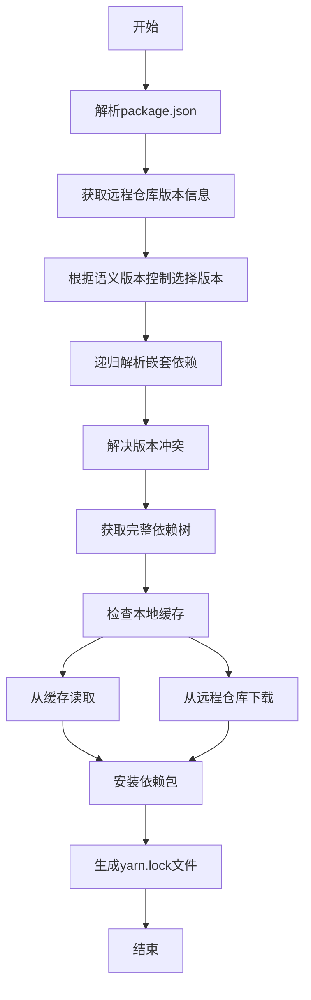

# Yarn的配置文件详解

## 1.背景介绍

Yarn是一个流行的JavaScript包管理器,由Facebook公司开发和维护。它被广泛用于管理Node.js项目的依赖关系,以及运行脚本、发布包等任务。Yarn的配置文件是一个名为`yarn.lock`的文件,它记录了项目所有已安装的依赖包的确切版本,以及这些包之间的嵌套依赖关系。

配置文件的作用是确保在不同的开发环境中,项目能够获得完全相同的依赖包版本,从而避免"它在我的机器上可以运行"的问题。此外,它还可以加快依赖包的安装速度,因为Yarn会从缓存中读取已经下载过的包,而不是每次都从远程仓库重新下载。

## 2.核心概念与联系

### 2.1 语义版本控制

Yarn使用语义版本控制(Semantic Versioning)来管理依赖包的版本。语义版本号由三个数字组成,例如`1.2.3`,分别表示主版本号(major)、次版本号(minor)和修订版本号(patch)。当进行了不向下兼容的更改时,主版本号会增加;当以向下兼容的方式添加了新功能时,次版本号会增加;当进行了向下兼容的问题修复时,修订版本号会增加。

### 2.2 依赖包锁定

`yarn.lock`文件记录了项目所有已安装的依赖包的确切版本,包括直接依赖和嵌套依赖。这种锁定机制确保了在不同的开发环境中,项目能够获得完全相同的依赖包版本,从而避免了"它在我的机器上可以运行"的问题。

### 2.3 缓存机制

Yarn会在本地缓存已经下载过的依赖包,以加快后续的安装速度。当安装新的依赖包时,Yarn会首先检查本地缓存,如果缓存中存在所需的版本,就会直接从缓存中读取,而不是从远程仓库重新下载。

## 3.核心算法原理具体操作步骤

Yarn的核心算法原理基于依赖解析和优化安装两个主要步骤:

1. **依赖解析**

   Yarn会根据项目的`package.json`文件中列出的依赖包及其版本范围,从远程仓库(如npm registry)获取所有可用的版本信息。然后,它会根据语义版本控制规则,选择满足版本范围要求的最新版本。

   对于嵌套依赖,Yarn会递归地解析每个依赖包的依赖关系,直到获取到一个完整的依赖树。在这个过程中,Yarn会自动解决版本冲突,确保整个依赖树中的包版本是兼容的。

2. **优化安装**

   获取到完整的依赖树后,Yarn会进行优化安装。它会首先检查本地缓存,如果缓存中存在所需的版本,就会直接从缓存中读取,而不是从远程仓库重新下载。这大大加快了安装速度。

   对于缓存中不存在的包,Yarn会从远程仓库下载,并将其存储到本地缓存中,以备将来使用。

   安装完成后,Yarn会生成`yarn.lock`文件,记录所有已安装的依赖包的确切版本,以及它们之间的嵌套依赖关系。

下面是Yarn的核心算法原理的流程图:



## 4.数学模型和公式详细讲解举例说明

在依赖解析过程中,Yarn需要解决版本范围和版本冲突的问题。为了更好地理解这个过程,我们可以使用一些数学模型和公式。

### 4.1 版本范围表示

Yarn使用一种特殊的语法来表示版本范围,例如`^1.2.3`、`~1.2.3`、`>=1.2.3 <2.0.0`等。这些范围可以用数学集合的形式来表示。

例如,`^1.2.3`表示"与版本1.2.3相关联的所有版本,但不包括2.0.0及更高版本"。我们可以用下面的集合来表示:

$$
V = \{v | v \geq 1.2.3 \land v < 2.0.0\}
$$

其中,`v`表示版本号,`\geq`表示大于等于,`\land`表示逻辑与。

同理,`~1.2.3`表示"与版本1.2.3相关联的所有版本,但只允许修订版本号(patch)增加"。它可以用下面的集合来表示:

$$
V = \{v | v \geq 1.2.3 \land v < 1.3.0\}
$$

### 4.2 版本冲突解决

当存在多个依赖包对同一个包有不同的版本要求时,就会发生版本冲突。Yarn使用一种称为"最近可行版本"(nearest satisfying version)的策略来解决这个问题。

假设有两个依赖包A和B,它们对包C的版本要求分别是`^1.2.3`和`^1.4.0`。我们可以用集合的交集来表示满足两个版本范围的版本集合:

$$
V_A \cap V_B = \{v | v \geq 1.4.0 \land v < 2.0.0\}
$$

Yarn会选择这个集合中的最大版本作为包C的安装版本。

## 5.项目实践:代码实例和详细解释说明

让我们通过一个实际的项目来演示Yarn的配置文件是如何工作的。

### 5.1 初始化项目

首先,我们创建一个新的Node.js项目并初始化`package.json`文件:

```bash
mkdir yarn-demo
cd yarn-demo
yarn init
```

### 5.2 安装依赖包

接下来,我们安装一些依赖包,例如`lodash`和`axios`:

```bash
yarn add lodash@^4.17.21
yarn add axios@^0.21.1
```

安装完成后,我们可以看到项目根目录下生成了`yarn.lock`文件。

### 5.3 查看yarn.lock文件

打开`yarn.lock`文件,我们可以看到它记录了所有已安装的依赖包的确切版本,以及它们之间的嵌套依赖关系。例如:

```
lodash@^4.17.21:
  version "4.17.21"
  resolved "https://registry.yarnpkg.com/lodash/-/lodash-4.17.21.tgz#679591c564c3bffaae8454cf0b3df370c3d6911c"
  integrity sha512-v2kDEe57lecTulaDIuNTPy3Ry4gLGJ6Z1O3vE1krgXZNrsQ+LFTGHVxVjcXPs17LhbZVGedAJv8XZ1tvj5FvSg==

axios@^0.21.1:
  version "0.21.4"
  resolved "https://registry.yarnpkg.com/axios/-/axios-0.21.4.tgz#78e309e9d0c5d5d1a85d4c99d96d3e93a732f5b1"
  integrity sha512-ut5vewkiu8jjGBdqpM44XxjuCjq9LAKeHVmoVfHVzy8eHgxxq8SbAVQNovDA8mVi05kP0Ea/n/UzcSHcTJQfNg==
  dependencies:
    follow-redirects "^1.14.0"

follow-redirects@^1.14.0:
  version "1.14.9"
  resolved "https://registry.yarnpkg.com/follow-redirects/-/follow-redirects-1.14.9.tgz#e579e7a3a83e2e2f6e7e09c1a2ba8155689c3db6"
  integrity sha512-MQDfihBQYMcyBydEd3E+GjOwl3ij+RhEJc0/2ziEY3LHj3tnHm9XYIESNUkbV5YcMfexAkgzd0vm5lFdgS9HjA==
```

每个依赖包都记录了以下信息:

- `version`: 安装的确切版本号
- `resolved`: 包的下载地址
- `integrity`: 包的哈希值,用于验证包的完整性
- `dependencies`: 该包的嵌套依赖

### 5.4 重新安装依赖包

现在,让我们删除`node_modules`目录,并尝试重新安装依赖包:

```bash
rm -rf node_modules
yarn install
```

Yarn会从`yarn.lock`文件中读取已安装的依赖包版本信息,并从本地缓存或远程仓库下载相应的包。由于版本信息已经被锁定,因此重新安装的依赖包版本将与之前完全相同。

## 6.实际应用场景

Yarn的配置文件在以下场景中发挥着重要作用:

1. **团队协作开发**

   在团队协作开发中,不同开发人员可能使用不同的开发环境。通过共享`yarn.lock`文件,团队成员可以确保在不同环境中安装相同版本的依赖包,从而避免了"它在我的机器上可以运行"的问题。

2. **持续集成/持续部署(CI/CD)**

   在CI/CD流程中,项目需要在不同的构建环境中进行构建和部署。使用`yarn.lock`文件可以确保在每个环境中安装相同版本的依赖包,从而提高了构建的可重复性和稳定性。

3. **依赖包升级**

   当需要升级依赖包时,开发人员可以手动编辑`package.json`文件,更新包的版本范围。然后,Yarn会根据新的版本范围选择合适的版本,并更新`yarn.lock`文件。这种方式可以确保依赖包的升级是可控的,并且不会意外地破坏现有的功能。

4. **包缓存**

   Yarn的本地缓存机制可以显著加快依赖包的安装速度,特别是在大型项目或网络环境较差的情况下。这对于提高开发效率和构建速度非常有帮助。

## 7.工具和资源推荐

以下是一些与Yarn相关的有用工具和资源:

1. **Yarn官方网站和文档**

   Yarn的官方网站(https://classic.yarnpkg.com)提供了详细的文档、教程和参考资料,是学习和使用Yarn的绝佳资源。

2. **npm-install-webpack-plugin**

   这是一个Webpack插件,可以在构建过程中自动安装和缓存依赖包,提高了构建速度和一致性。

3. **Yarn Berry**

   Yarn Berry是Yarn的下一代版本,它引入了一些新的特性和改进,如更好的性能、更强大的工作空间管理和更友好的monorepo支持。

4. **Yarn PnP**

   Yarn PnP(Plug'n'Play)是Yarn的一个实验性功能,它通过一种新的方式来管理依赖包,可以显著提高安装和运行时的性能。

5. **Yarn Workspaces**

   Yarn Workspaces是一个用于管理monorepo的功能,它允许您在一个存储库中维护多个包,并轻松管理它们之间的依赖关系。

6. **社区论坛和Stack Overflow**

   Yarn拥有一个活跃的社区,您可以在论坛和Stack Overflow上寻求帮助、分享经验或参与讨论。

## 8.总结:未来发展趋势与挑战

Yarn作为一个流行的JavaScript包管理器,在未来仍将继续发展和完善。以下是一些可能的发展趋势和挑战:

1. **性能优化**

   随着JavaScript生态系统的不断发展,依赖包的数量和规模也在不断增长。因此,提高依赖包安装和管理的性能将是一个持续的挑战。Yarn团队正在探索新的技术和策略,如Yarn PnP,以进一步优化性能。

2. **monorepo支持**

   monorepo(单一代码库)架构在大型项目中越来越流行,它允许多个相关的包共享一个存储库。Yarn Workspaces已经提供了一些基本的monorepo支持,但未来可能会有更多的功能和改进,以更好地支持这种架构。

3. **生态系统集成**

   随着JavaScript生态系统的不断扩展,Yarn需要与