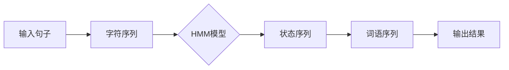

# 【AI大数据计算原理与代码实例讲解】分词

## 1. 背景介绍
### 1.1 分词的定义与意义
分词(Word Segmentation)是自然语言处理(NLP)的基础和重要环节。它指的是将一个句子切分成有意义的词语序列的过程。在英文等语言中,词语之间天然地以空格作为分隔,而在中文、日文等语言中,词语之间没有明显的分隔符号,需要通过分词来确定词语的边界。准确的分词是文本挖掘、信息检索、机器翻译等NLP任务的前提。

### 1.2 分词的挑战
中文分词面临着一些特有的挑战:

1. 歧义性:有些字符串可以有多种切分方式,如"花生奶油"可以切分为"花生/奶油"(两种食材)或"花/生奶/油"(一种化妆品) 
2. 未登录词:语料库中不存在的新词,如人名、地名、新兴概念等。
3. 分词粒度:是切分成最小的语义单元还是较大的短语,取决于应用场景。

### 1.3 分词的方法分类
分词方法主要分为三大类:

1. 基于规则的方法:利用人工定义的规则,如正向最大匹配、逆向最大匹配等。
2. 基于统计的方法:利用语料库中的统计信息,如N-gram、HMM、CRF等。 
3. 基于深度学习的方法:利用神经网络自动学习分词特征,如BiLSTM-CRF等。

本文将重点介绍基于统计的分词方法,并给出HMM分词的原理解析和代码实现。

## 2. 核心概念与联系
### 2.1 语言模型
语言模型用于刻画语言单元(如字、词)之间的依赖关系和组合规律,是统计分词的基础。N-gram是最常见的语言模型,通过计算一个词后面跟着另一个词的概率,来评估一个切分序列的合理性。

### 2.2 隐马尔可夫模型(HMM)
HMM由状态序列和观测序列组成,状态序列是隐藏的,观测序列是可见的。在分词任务中,状态对应词的边界标签(如B/M/E/S),观测对应句子中的字符。HMM包含三要素:

1. 初始概率矩阵$\pi$:描述初始时刻每个状态的概率。
2. 转移概率矩阵$A$:描述状态之间转移的概率。
3. 发射概率矩阵$B$:描述每个状态生成观测的概率。

利用这三个参数,HMM可以用维特比算法求解最优的状态序列,实现分词。

### 2.3 条件随机场(CRF)
CRF是一种判别式概率图模型,可以看作HMM的推广。它不仅考虑当前观测对状态的影响,还考虑额外的特征函数。在分词任务中,特征可以是字符的词性、上下文信息等。CRF需要更大的训练语料,但分词准确率更高。

下图展示了HMM分词的基本流程:



## 3. 核心算法原理具体操作步骤
下面以HMM为例,详细介绍基于统计的分词算法的原理和步骤。

### 3.1 HMM分词的原理
HMM分词的目标是找到一个状态序列$S=(s_1,s_2,...,s_n)$,使其生成观测序列$O=(o_1,o_2,...,o_n)$的概率最大。数学表达式为:

$$\hat{S} = \arg\max_{S} P(S|O) = \arg\max_{S} \frac{P(O|S)P(S)}{P(O)} = \arg\max_{S} P(O|S)P(S)$$

其中,$P(O|S)$对应发射概率,$P(S)$对应初始概率和转移概率的乘积。

### 3.2 HMM分词的步骤
1. 模型训练:根据带标注的语料,统计计算初始概率矩阵、转移概率矩阵和发射概率矩阵。

2. 序列标注:对于输入句子,将其转化为观测序列$O$,然后用维特比算法求解最优状态序列$\hat{S}$:

$$\hat{S} = \arg\max_{S} \prod_{i=1}^n P(o_i|s_i) \prod_{i=1}^{n-1} P(s_{i+1}|s_i)$$

3. 标签映射:根据状态序列$\hat{S}$,将其映射为词的边界,得到最终的分词结果。

常见的标签集如下:

- S:单字词
- B:词的开头
- M:词的中间
- E:词的结尾

例如,"今天天气真好啊"的标注序列为"B/E/B/E/B/E/S",对应的分词结果为"今天/天气/真/好/啊"。

## 4. 数学模型和公式详细讲解举例说明
这里对HMM的三个核心参数进行更详细的讲解和举例。

### 4.1 初始概率矩阵$\pi$
$\pi_i$表示初始时刻状态$s_i$的概率,满足$\sum_i \pi_i=1$。例如:

$$\pi = \begin{bmatrix} 0.5 & 0.3 & 0.2 & 0 \end{bmatrix}$$

表示初始时刻状态B/M/E/S的概率分别为0.5/0.3/0.2/0。

### 4.2 转移概率矩阵$A$
$A_{ij}$表示从状态$s_i$转移到状态$s_j$的概率,满足$\sum_j A_{ij}=1$。例如:

$$A = \begin{bmatrix} 
0.1 & 0.3 & 0.4 & 0.2 \\ 
0 & 0.5 & 0.5 & 0 \\
0 & 0 & 0.6 & 0.4 \\
0.7 & 0 & 0 & 0.3
\end{bmatrix}$$

表示B后面跟B/M/E/S的概率分别为0.1/0.3/0.4/0.2,M后面只能跟M/E,E后面只能跟E/S,S后面只能跟B/S。

### 4.3 发射概率矩阵$B$  
$B_{ij}$表示状态$s_i$生成观测$o_j$的概率。例如:

$$B = \begin{bmatrix}
0.5 & 0.3 & 0.2 \\
0.2 & 0.4 & 0.4 \\ 
0.1 & 0.1 & 0.8 \\
0.7 & 0.2 & 0.1
\end{bmatrix}$$

表示B/M/E/S生成某个字的概率。在实际中,B的维度非常大,需要平滑处理。

## 5. 项目实践：代码实例和详细解释说明
下面给出了HMM分词的Python实现代码,并对关键步骤进行注释说明。

```python
import numpy as np

class HmmSegment:
    def __init__(self, train_file):
        self.train_file = train_file
        self.state_list = ['B', 'M', 'E', 'S'] 
        self.load_model()
        
    # 加载HMM模型参数
    def load_model(self):  
        self.A = np.zeros((4, 4))
        self.B = np.zeros((4, 65536)) 
        self.Pi = np.zeros(4)
        self.word_dict = {'B':0, 'M':1, 'E':2, 'S':3}
        self.count_dict = {}
        
        with open(self.train_file, encoding='utf8') as f:
            for line in f:
                words = line.strip().split()
                self.train(words) 
        
        self.A /= np.sum(self.A, axis=1, keepdims=True)
        self.B /= np.sum(self.B, axis=1, keepdims=True)
        self.Pi /= np.sum(self.Pi)
        
    # 基于人工标注语料训练HMM模型参数
    def train(self, words): 
        last_label = 'S'
        for word in words:
            if len(word) == 1:
                label = 'S'
            else:
                label = 'B' + 'M'*(len(word)-2) + 'E'
            
            self.Pi[self.word_dict[label[0]]] += 1
            self.A[self.word_dict[last_label], self.word_dict[label[0]]] += 1
            last_label = label[-1]
            
            for i, char in enumerate(word):
                self.B[self.word_dict[label[i]], ord(char)] += 1
                self.count_dict[char] = self.count_dict.get(char, 0) + 1
                
    # 维特比算法求解最优状态序列
    def viterbi(self, text):
        V = np.zeros((4, len(text)))
        path = np.zeros((4, len(text)), dtype=int)
        
        for i in range(4):
            V[i, 0] = self.Pi[i] * self.B[i, ord(text[0])]
            path[i, 0] = 0
        
        for i in range(1, len(text)):
            for j in range(4):
                prob_list = V[:, i-1] * self.A[:, j] * self.B[j, ord(text[i])]
                V[j, i] = np.max(prob_list)
                path[j, i] = np.argmax(prob_list)
        
        last_prob = -1
        last_state = 0
        for i in range(4):
            if last_prob < V[i, -1]:
                last_prob = V[i, -1]
                last_state = i
                
        state_list = []
        state_list.append(last_state)
        for i in range(len(text)-1, 0, -1):
            state_list.append(path[last_state, i])
            last_state = path[last_state, i]
        state_list.reverse()
        
        return [self.state_list[i] for i in state_list]
    
    # 根据状态序列进行分词
    def segment(self, text):
        state_list = self.viterbi(text)
        begin, next = 0, 0
        for i, char in enumerate(text):
            state = state_list[i]
            if state == 'B':
                begin = i
            elif state == 'E':
                yield text[begin: i+1]
                next = i+1
            elif state == 'S':
                yield char
                next = i+1
        if next < len(text):
            yield text[next:]
                
if __name__ == '__main__':
    text = '今天天气真好啊'
    segment = HmmSegment('trainCorpus.txt_utf8')
    print(list(segment.segment(text)))
```

代码说明:

1. `__init__`方法初始化HMM模型,并加载训练数据。
2. `load_model`方法从训练数据中统计计算HMM的三个参数。
3. `train`方法对每个已标注的词进行遍历,统计状态序列和观测序列的频次。
4. `viterbi`方法实现维特比算法,求解最优状态序列。
5. `segment`方法根据状态序列进行切词,将词语yield出来。

## 6. 实际应用场景
分词技术在NLP领域有广泛的应用,主要场景包括:

1. 搜索引擎:对用户的查询和网页内容进行分词,提高检索的准确率。
2. 文本分类:将文本切分成词,再提取词的特征,训练分类器。
3. 情感分析:对评论等主观性文本进行分词,挖掘情感倾向。
4. 机器翻译:将源语言切分成词,再进行翻译和重组,生成目标语言。
5. 知识图谱:从文本中抽取实体和关系,构建实体间的语义网络。
6. 问答系统:对问题和候选答案进行分词,计算它们的相似度。

总之,分词是文本处理不可或缺的基础步骤,是后续NLP任务的重要前提。

## 7. 工具和资源推荐
### 7.1 分词工具
1. [Jieba](https://github.com/fxsjy/jieba):Python中最流行的分词工具,支持多种分词模式。
2. [THULAC](http://thulac.thunlp.org/):清华大学自然语言处理与社会人文计算实验室研制的分词和词性标注工具。
3. [LTP](https://github.com/HIT-SCIR/ltp):哈工大社会计算与信息检索研究中心开发的语言技术平台。
4. [FudanNLP](https://github.com/FudanNLP/fnlp):复旦大学计算机学院开发的中文自然语言处理工具包。

### 7.