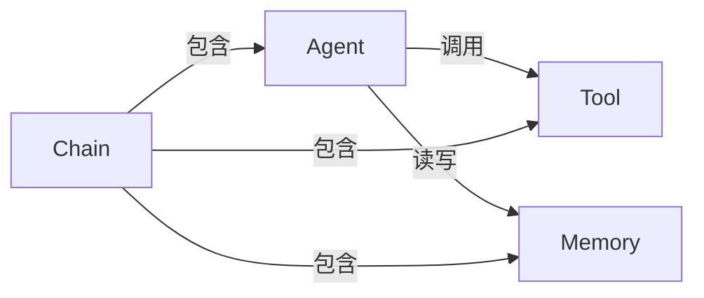

# 【LangChain编程：从入门到实践】代码实践

## 1. 背景介绍

### 1.1 人工智能的发展历程

人工智能(Artificial Intelligence, AI)是当代科技领域最具革命性和颠覆性的技术之一。自20世纪50年代诞生以来,AI经历了起伏跌宕的发展历程。在早期,AI主要集中于基于规则的系统和专家系统,试图模拟人类的推理过程。然而,随着大数据时代的到来和计算能力的飞速提升,机器学习和深度学习技术开始占据主导地位。

### 1.2 大语言模型的崛起

近年来,大型语言模型(Large Language Models, LLMs)的出现,标志着AI发展进入了一个新的里程碑。LLMs通过在海量文本数据上进行预训练,能够掌握丰富的语言知识和上下文信息,展现出惊人的自然语言理解和生成能力。GPT-3、BERT、PALM等知名语言模型,为各种自然语言处理任务提供了强大的解决方案。

### 1.3 LangChain的诞生

在这一背景下,LangChain应运而生。作为一个开源的AI框架,LangChain旨在简化LLMs的应用开发过程,提供了一套统一的编程接口和工具链,使开发者能够轻松地将LLMs集成到各种应用程序中。无论是构建智能助手、知识库系统,还是实现自动化任务流程,LangChain都提供了强大的支持。

## 2. 核心概念与联系

### 2.1 LangChain的核心概念

LangChain的核心概念包括Agent、Tool、Memory和Chain等。

- **Agent**:代表一个具有特定功能的智能体,可以执行各种任务。
- **Tool**:封装了各种工具或API,供Agent调用以完成特定任务。
- **Memory**:用于存储Agent在执行任务过程中的中间状态和上下文信息。
- **Chain**:将多个Agent、Tool和Memory组合在一起,构建复杂的任务流程。

### 2.2 概念之间的关系

Agent、Tool、Memory和Chain之间存在紧密的联系和协作关系。Agent作为智能体的核心,负责规划和执行任务流程。在执行任务时,Agent可以调用各种Tool来完成特定的子任务,同时利用Memory来存储和检索相关的上下文信息。Chain则将这些组件有机地组合在一起,形成一个完整的任务流程。



## 3. 核心算法原理具体操作步骤

LangChain的核心算法原理主要体现在Agent的决策和执行过程中。下面将详细介绍Agent的工作流程。

### 3.1 任务分解

Agent首先需要将复杂的任务分解为一系列可执行的子任务。这个过程通常涉及自然语言理解、任务规划和逻辑推理等技术。Agent需要分析输入的任务描述,识别出关键信息和目标,并将其转化为一系列具体的操作步骤。

### 3.2 工具选择

在完成每个子任务时,Agent需要选择合适的Tool来执行具体的操作。Agent会根据子任务的性质和要求,从可用的Tool集合中选择最合适的一个或多个Tool。这个过程需要Agent对每个Tool的功能和使用场景有深入的理解。

### 3.3 工具调用

确定了要使用的Tool之后,Agent需要正确地调用这些Tool,并将必要的参数传递给它们。在调用Tool的过程中,Agent可能需要从Memory中读取相关的上下文信息,或者将中间结果存储到Memory中,以供后续使用。

### 3.4 结果处理

Tool执行完成后,Agent需要处理返回的结果。这可能涉及对结果进行解析、整合、过滤或转换等操作,以便将结果用于下一步的任务执行或最终输出。

### 3.5 反馈与优化

在完成整个任务流程后,Agent可以根据实际执行情况和反馈,对自身的决策策略和行为进行优化。这可能包括调整任务分解方式、改进工具选择算法、优化参数设置等,从而提高Agent在未来任务执行中的效率和准确性。

## 4. 数学模型和公式详细讲解举例说明

在LangChain的实现中,数学模型和公式主要应用于以下几个方面:

### 4.1 自然语言处理

自然语言处理是LangChain的核心功能之一。在这一领域,常见的数学模型包括:

1. **N-gram语言模型**

N-gram语言模型是一种基于统计的语言模型,它根据前n-1个词来预测第n个词的概率。N-gram模型的核心公式如下:

$$P(w_1, w_2, \ldots, w_n) = \prod_{i=1}^n P(w_i|w_1, \ldots, w_{i-1})$$

其中,$ P(w_i|w_1, \ldots, w_{i-1}) $表示在给定前i-1个词的情况下,第i个词出现的条件概率。

2. **神经网络语言模型**

神经网络语言模型利用神经网络来建模语言序列,通常使用循环神经网络(RNN)或transformer等架构。这些模型通过学习词嵌入和上下文信息,来预测下一个词或序列的概率。

### 4.2 知识表示与推理

在处理结构化知识和进行推理时,LangChain可能会使用以下数学模型:

1. **知识图谱嵌入**

知识图谱嵌入是将实体和关系映射到低维连续向量空间的技术。常见的嵌入模型包括TransE、DistMult等,它们通过优化特定的损失函数来学习实体和关系的向量表示。

$$L = \sum_{(h,r,t) \in \mathcal{S}} \sum_{(h',r',t') \in \mathcal{S}^{neg}} [\gamma + f_r(h,t) - f_r(h',t')]_+$$

上式是TransE模型的损失函数,其中$ f_r(h,t) $是头实体嵌入$ h $和尾实体嵌入$ t $之间的打分函数,$ \mathcal{S} $是正例三元组集合,$ \mathcal{S}^{neg} $是负例三元组集合,$ \gamma $是边距超参数。

2. **逻辑规则推理**

在某些场景下,LangChain可能需要利用逻辑规则进行推理。这种情况下,常用的数学模型包括一阶逻辑、模态逻辑等。这些逻辑系统通过定义一组公理和推理规则,来推导出新的结论。

### 4.3 机器学习模型

LangChain还可以集成各种机器学习模型,用于执行特定的任务。例如,在文本分类、实体识别等任务中,可以使用支持向量机(SVM)、决策树、逻辑回归等模型。这些模型的数学原理和公式在机器学习领域中有广泛的应用。

以逻辑回归为例,其核心公式如下:

$$\begin{align}
P(Y=1|X) &= \sigma(\beta_0 + \beta_1X_1 + \beta_2X_2 + \ldots + \beta_nX_n) \\
&= \frac{1}{1 + e^{-(\beta_0 + \beta_1X_1 + \beta_2X_2 + \ldots + \beta_nX_n)}}
\end{align}$$

其中,$ \sigma(z) $是sigmoid函数,$ \beta_i $是模型参数,$ X_i $是特征向量的第i个分量。

## 5. 项目实践:代码实例和详细解释说明

为了更好地理解LangChain的使用方式,我们将通过一个实际项目实践来演示如何利用LangChain构建一个智能问答系统。

### 5.1 项目概述

在本项目中,我们将构建一个基于LangChain的智能问答系统,能够回答有关Python编程的各种问题。系统将利用Wikipedia作为知识源,并使用LangChain提供的各种组件来实现自然语言理解、知识检索、答案生成等功能。

### 5.2 环境配置

首先,我们需要安装LangChain及其依赖项。可以使用pip进行安装:

```bash
pip install langchain openai wikipedia
```

### 5.3 加载知识库

我们将使用Wikipedia作为知识库,因此需要先加载相关的数据。LangChain提供了一个`WikipediaLoader`工具,可以方便地从Wikipedia获取文本数据。

```python
from langchain.utilities import WikipediaAPIWrapper
wikipedia_loader = WikipediaAPIWrapper()
```

接下来,我们可以使用`load`方法加载特定主题的文章。在本例中,我们将加载与Python编程相关的文章。

```python
docs = wikipedia_loader.load(["Python (programming language)"])
```

### 5.4 创建向量存储

为了提高知识检索的效率,我们需要将文本数据转换为向量表示,并存储在向量数据库中。LangChain支持多种向量存储后端,例如Chroma、FAISS、Weaviate等。这里我们使用Chroma作为示例。

```python
from langchain.vectorstores import Chroma
from langchain.embeddings.openai import OpenAIEmbeddings

embeddings = OpenAIEmbeddings()
vector_store = Chroma.from_documents(docs, embeddings)
```

### 5.5 创建检索器

检索器用于从向量存储中查找与查询相关的文档。LangChain提供了多种检索器,例如`VectorDBQARetriever`、`ConversationalRetrievalChain`等。我们将使用`VectorDBQARetriever`作为示例。

```python
from langchain.retrievers import VectorDBQARetriever

retriever = VectorDBQARetriever(vectorstore=vector_store, search_quality_reflection=True)
```

### 5.6 创建LLM链

LLM链用于将检索到的相关文档与用户查询结合,生成最终的答案。我们将使用OpenAI的GPT-3作为语言模型。

```python
from langchain.llms import OpenAI
from langchain.chains import RetrievalQA

llm = OpenAI()
qa_chain = RetrievalQA.from_chain_type(llm=llm, chain_type="stuff", retriever=retriever)
```

### 5.7 问答交互

现在,我们可以开始与智能问答系统进行交互了。用户可以输入与Python编程相关的问题,系统将根据检索到的相关文档生成答案。

```python
query = "What is Python used for?"
result = qa_chain(query)
print(result['result'])
```

输出结果可能如下:

```
Python is a versatile programming language that is used for a wide range of applications, including:

- Web development: Python is widely used for building web applications and frameworks like Django, Flask, and Pyramid.

- Data analysis and scientific computing: Python has powerful libraries like NumPy, Pandas, and SciPy for numerical computing, data manipulation, and scientific calculations.

- Artificial Intelligence and Machine Learning: Python provides libraries like TensorFlow, Keras, and scikit-learn for developing AI and ML models.

- Automation and scripting: Python's simplicity and readability make it a popular choice for automating tasks and writing scripts.

- Game development: Python can be used for developing games with libraries like Pygame and PyOpenGL.

- Desktop applications: Python offers libraries like Tkinter, PyQt, and wxPython for building desktop applications with graphical user interfaces.

Python's versatility, ease of use, and large community make it a popular choice for a wide range of applications across various domains.
```

### 5.8 进一步优化

上述代码展示了一个基本的智能问答系统。在实际应用中,我们可以进一步优化和扩展该系统,例如:

- 使用更多的知识源,如PDF文件、网页等。
- 添加更多的检索器和LLM链,以支持不同类型的查询和任务。
- 集成更多的工具和API,如计算器、日历、天气API等,以提供更丰富的功能。
- 实现对话历史跟踪和上下文管理,以支持多轮对话。
- 添加用户界面和部署选项,方便用户使用和访问。

## 6. 实际应用场景

LangChain的应用场景非常广泛,涵盖了各个领域。以下是一些典型的应用场景:

### 6.1 智能助手

利用LangChain,我们可以构建智能助手系统,为用户提供问答服务、任务协助、信息查询等功能。这些助手可以应用于客户服务、办公自动化、个人助理等场景。

### 6.2 知识管理

LangChain可以帮助企业和组织更好地管理和利用知识资产。通过集成各种知识源(如文档、数据库、网页等),并提供智能检索和推理功能,Lang