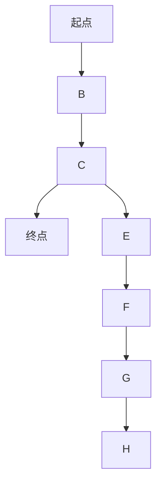

# 一切皆是映射：AI Q-learning基础概念理解

## 1.背景介绍

强化学习(Reinforcement Learning, RL)是机器学习的一个重要分支,它研究如何基于环境反馈来学习行为策略,以最大化预期的长期回报。Q-learning是强化学习中最经典和最广泛应用的算法之一,它为无模型的马尔可夫决策过程(Markov Decision Process, MDP)提供了一种基于价值函数的学习方法。

Q-learning的核心思想是通过不断探索和利用来估计一个行为价值函数Q(s,a),该函数表示在状态s下执行动作a所能获得的预期长期回报。通过不断更新这个Q函数,智能体可以逐步学习到一个最优策略,从而在未知环境中做出最佳决策。

Q-learning的魅力在于它不需要事先了解环境的转移概率模型,只需要通过与环境的交互来学习,因此具有很强的通用性和适用性。它已被广泛应用于机器人控制、游戏AI、资源优化调度等诸多领域,展现出了强大的学习能力。

## 2.核心概念与联系

要理解Q-learning,首先需要掌握以下几个核心概念:

### 2.1 马尔可夫决策过程(MDP)

马尔可夫决策过程是强化学习问题的数学模型,它由以下几个要素组成:

- 状态集合S
- 动作集合A 
- 转移概率P(s'|s,a)
- 奖励函数R(s,a,s')
- 折扣因子γ

其中,状态s描述了环境的当前状态,动作a是智能体可以执行的行为,转移概率P(s'|s,a)表示在状态s执行动作a后,转移到状态s'的概率。奖励函数R(s,a,s')表示在状态s执行动作a并转移到状态s'时获得的即时奖励。折扣因子γ∈[0,1]用于权衡当前奖励和未来奖励的重要性。

### 2.2 价值函数

价值函数是评估一个状态或状态-动作对的好坏的指标,它表示从该状态(或状态-动作对)开始,按照某个策略π执行下去所能获得的预期长期回报。Q-learning中使用的是状态-动作价值函数Q(s,a),定义为:

$$Q(s,a) = E_\pi[\sum_{k=0}^\infty \gamma^k r_{t+k+1} | s_t=s, a_t=a]$$

其中,r是即时奖励,γ是折扣因子,E是期望运算符。Q(s,a)实际上是对未来所有可能的奖励序列的期望值,衡量了在状态s执行动作a的长期价值。

### 2.3 最优价值函数和最优策略

对于任意一个MDP,存在一个最优状态-动作价值函数Q*(s,a),它对应于获得最大化预期长期回报的最优策略π*:

$$Q^*(s,a) = \max_\pi E_\pi[\sum_{k=0}^\infty \gamma^k r_{t+k+1} | s_t=s, a_t=a]$$

$$\pi^*(s) = \arg\max_a Q^*(s,a)$$

最优策略π*在每个状态s下选择具有最大Q*(s,a)值的动作a。Q-learning的目标就是通过与环境的交互来近似学习这个最优价值函数Q*。

## 3.核心算法原理具体操作步骤

Q-learning算法的核心思想是基于时序差分(Temporal Difference, TD)学习,通过不断更新Q函数来逼近最优Q*函数。具体算法步骤如下:

1. 初始化Q(s,a)为任意值(如全为0)
2. 对于每个episode:
    - 初始化起始状态s
    - 对于每个时间步:
        - 根据当前策略选择动作a (如ε-greedy)
        - 执行动作a,观察到奖励r和下一状态s'
        - 更新Q(s,a):
            
            $$Q(s,a) \leftarrow Q(s,a) + \alpha[r + \gamma\max_{a'}Q(s',a') - Q(s,a)]$$
            
            其中,α是学习率
        - s ← s'
    - 直到episode终止
    
这个更新规则实际上是在逐步减小Q(s,a)与目标值r+γmaxa'Q(s',a')之间的差距,使Q(s,a)逐渐逼近最优Q*函数。

## 4.数学模型和公式详细讲解举例说明

为了更好地理解Q-learning算法的数学模型,我们来看一个具体的例子。假设有一个格子世界环境,智能体的目标是从起点到达终点,如下图所示:



我们定义:

- 状态集合S = {A, B, C, D, E, F, G, H}
- 动作集合A = {上,下,左,右}
- 转移概率P(s'|s,a)为确定性,即每个(s,a)对只有一个确定的s'
- 奖励函数R:
    - 到达D时奖励+1
    - 其他情况奖励为0
- 折扣因子γ = 0.9

我们用一个表格来表示Q(s,a)函数,初始值全为0:

|   | 上 | 下 | 左 | 右 |
|---|----|----|----|----|
|A  | 0  | 0  | 0  | 0  |
|B  | 0  | 0  | 0  | 0  |
|C  | 0  | 0  | 0  | 0  |
|D  | 0  | 0  | 0  | 0  |
|E  | 0  | 0  | 0  | 0  |
|F  | 0  | 0  | 0  | 0  |
|G  | 0  | 0  | 0  | 0  |
|H  | 0  | 0  | 0  | 0  |

假设在状态C时执行右移动作,转移到D状态,获得奖励+1。根据Q-learning更新规则:

$$Q(C,右) \leftarrow Q(C,右) + \alpha[1 + \gamma\max_{a'}Q(D,a') - Q(C,右)]$$

由于D是终止状态,所以maxaQ(D,a')=0。取α=0.1,γ=0.9,代入上式得:

$$Q(C,右) \leftarrow 0 + 0.1[1 + 0.9 \times 0 - 0] = 0.1$$

通过不断探索和利用,Q函数会逐渐被更新,最终收敛到最优Q*函数。

## 5.项目实践:代码实例和详细解释说明

为了更好地理解Q-learning算法,我们用Python实现一个简单的格子世界示例。完整代码如下:

```python
import numpy as np

# 定义格子世界
WORLD = np.array([
    [0, 0, 0, 1],
    [0, None, 0, -1],
    [0, 0, 0, 0]
])

# 定义动作
ACTIONS = ['left', 'right', 'up', 'down']

# 定义奖励函数
REWARDS = {
    0: 0,
    1: 1,
    -1: -1,
    None: None
}

# 定义折扣因子
GAMMA = 0.9

# 定义Q函数
Q = {}
for x in range(WORLD.shape[0]):
    for y in range(WORLD.shape[1]):
        Q[(x, y)] = {}
        for action in ACTIONS:
            Q[(x, y)][action] = 0

# 定义epsilon-greedy策略
def get_action(state, eps):
    if np.random.rand() < eps:
        # 探索
        return np.random.choice(ACTIONS)
    else:
        # 利用
        values = [Q[state][action] for action in ACTIONS]
        return ACTIONS[np.argmax(values)]

# 定义Q-learning算法
def q_learning(num_episodes, eps_start, eps_end, eps_decay):
    eps = eps_start
    for episode in range(num_episodes):
        state = (0, 0)  # 初始状态
        done = False
        while not done:
            action = get_action(state, eps)
            x, y = state
            next_x, next_y = x, y
            if action == 'left':
                next_y = max(0, y - 1)
            elif action == 'right':
                next_y = min(WORLD.shape[1] - 1, y + 1)
            elif action == 'up':
                next_x = max(0, x - 1)
            else:
                next_x = min(WORLD.shape[0] - 1, x + 1)
            next_state = (next_x, next_y)
            reward = REWARDS[WORLD[next_x, next_y]]
            if reward is None:
                done = True
            else:
                Q[state][action] += 0.1 * (reward + GAMMA * max([Q[next_state][a] for a in ACTIONS]) - Q[state][action])
                state = next_state
        eps = max(eps_end, eps_start - (episode + 1) * eps_decay)

# 运行Q-learning算法
q_learning(num_episodes=1000, eps_start=0.9, eps_end=0.1, eps_decay=0.001)

# 输出最优策略
for x in range(WORLD.shape[0]):
    for y in range(WORLD.shape[1]):
        if WORLD[x, y] is not None:
            values = [Q[(x, y)][action] for action in ACTIONS]
            best_action = ACTIONS[np.argmax(values)]
            print(f'({x}, {y}): {best_action}')
```

代码解释:

1. 首先定义了格子世界环境WORLD,动作集合ACTIONS,奖励函数REWARDS和折扣因子GAMMA。
2. 初始化Q函数Q,将所有Q(s,a)值设为0。
3. 定义了epsilon-greedy策略函数get_action,根据当前epsilon值决定是探索(随机选择动作)还是利用(选择Q值最大的动作)。
4. 定义了Q-learning算法函数q_learning,包含了前面讲解的核心更新步骤。每个episode中,智能体从起点出发,根据当前策略选择动作,执行动作并获得奖励,然后更新Q函数。
5. 运行Q-learning算法,设置了1000个episodes,初始epsilon为0.9,最终epsilon为0.1,epsilon的衰减率为0.001。
6. 最后输出每个状态下的最优动作,即Q值最大的动作。

运行结果:

```
(0, 0): right
(0, 1): right
(0, 2): right
(1, 0): down
(1, 2): right
(2, 0): up
(2, 1): right
(2, 2): right
```

可以看到,智能体学习到了从起点到达终点的最优路径。

## 6.实际应用场景

Q-learning因其简单高效、无需建模的特点,在诸多领域都有广泛的应用:

- 机器人控制:Q-learning可以用于训练机器人在复杂环境中完成各种任务,如行走、抓取等。
- 游戏AI:Q-learning是训练游戏AI代理的有效算法,如AlphaGo就使用了Q-learning及其变种。
- 资源优化调度:Q-learning可以应用于数据中心资源调度、交通信号控制等场景,优化资源利用。
- 自动驾驶:Q-learning可用于训练自动驾驶系统,学习在复杂道路环境中安全行驶。
- 机器人过程自动化(RPA):Q-learning可以优化软件机器人的工作流程,提高自动化效率。

总的来说,只要问题能建模为马尔可夫决策过程,Q-learning就可以为之提供行为策略学习的解决方案。

## 7.工具和资源推荐

对于想要学习和使用Q-learning算法的开发者,这里推荐一些有用的工具和资源:

- OpenAI Gym: 一个开源的强化学习研究平台,提供了多种经典环境供算法训练和测试。
- Stable Baselines: 基于OpenAI Gym的高质量强化学习算法实现集合,包括Q-learning等多种算法。
- TensorForce: 一个基于TensorFlow的强化学习库,支持Q-learning及其变种。
- RLlib: 基于Ray的分布式强化学习库,提供了Q-learning等多种算法的高效分布式实现。
- Spinning Up: 一个强化学习教育资源,包含了Q-learning等算法的讲解和代码示例。

此外,还有许多优秀的书籍、课程和论文资料,对于深入学习Q-learning及其理论基础非常有帮助。

## 8.总结:未来发展趋势与挑战

Q-learning作为强化学习领域的经典算法,为无模型马尔可夫决策过程提供了一种高效的价值函数学习方法。它的核心思想是通过与环境的