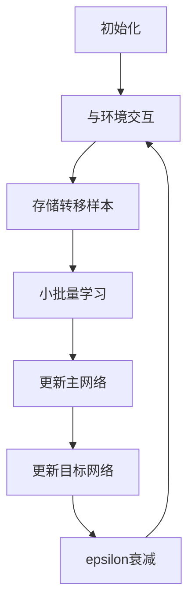

# 一切皆是映射：DQN的模型评估与性能监控方法

## 1.背景介绍

### 1.1 强化学习与DQN简介

强化学习(Reinforcement Learning)是机器学习的一个重要分支,旨在让智能体(Agent)通过与环境(Environment)的交互来学习如何采取最优策略,从而最大化预期的长期回报。在强化学习中,智能体会根据当前状态采取行动,然后接收来自环境的反馈(奖励或惩罚),并据此调整其策略。

深度Q网络(Deep Q-Network, DQN)是一种结合深度神经网络和Q学习的强化学习算法,由DeepMind公司在2015年提出。DQN算法能够直接从高维原始输入(如视频游戏画面)中学习出优秀的控制策略,并在多个经典视频游戏中取得超过人类水平的成绩,开启了将深度学习应用于强化学习的新时代。

### 1.2 DQN模型评估与性能监控的重要性

随着DQN在越来越多的实际应用场景中被采用,对DQN模型的评估和性能监控变得越来越重要。模型评估可以帮助我们了解模型的泛化能力、鲁棒性和可解释性,从而指导模型的优化和改进。而性能监控则可以实时跟踪模型在生产环境中的表现,及时发现和诊断潜在的问题。

有效的模型评估和性能监控不仅可以提高DQN模型的可靠性和稳定性,还能够促进算法的持续改进,推动强化学习技术在更多领域的应用。然而,由于DQN算法的特殊性,其模型评估和性能监控面临着一些独特的挑战,需要采用专门的方法和工具。

## 2.核心概念与联系

### 2.1 DQN算法核心概念

为了更好地理解DQN模型评估与性能监控,我们首先需要了解DQN算法的一些核心概念:

1. **Q函数(Q-function)**: Q函数是强化学习中的一个关键概念,它表示在给定状态下采取某个行动所能获得的预期长期回报。在DQN中,Q函数由一个深度神经网络来近似拟合。

2. **经验回放(Experience Replay)**: 为了提高样本利用效率和算法稳定性,DQN引入了经验回放机制。智能体与环境交互时产生的状态转移样本会被存储在经验回放池中,训练时从中随机采样进行小批量学习。

3. **目标网络(Target Network)**: DQN使用两个神经网络,一个是在线更新的主网络,另一个是定期复制主网络参数的目标网络。目标网络用于计算目标Q值,以提高训练稳定性。

4. **$\epsilon$-贪婪策略($\epsilon$-greedy policy)**: DQN在训练时采用$\epsilon$-贪婪策略,以平衡探索(选择估计Q值最大的行动)和利用(随机选择行动以探索未知区域)。

### 2.2 DQN模型评估与性能监控的关键指标

评估DQN模型性能和监控模型运行状况需要关注以下几个关键指标:

1. **累计奖励(Cumulative Reward)**: 反映智能体在一个环节中获得的总体奖励,是评估DQN模型性能的重要指标之一。

2. **损失函数(Loss Function)**: DQN通常采用均方误差损失函数来衡量当前Q网络的预测值与目标Q值之间的差距,损失函数值的变化可以反映模型的训练进度。

3. **$\epsilon$值(Epsilon Value)**: $\epsilon$值控制了探索与利用的平衡,通常会在训练过程中逐渐衰减。监控$\epsilon$值有助于了解模型是否处于合理的探索阶段。

4. **经验回放池大小(Replay Buffer Size)**: 经验回放池的大小会影响样本的多样性,进而影响模型的泛化能力。监控回放池大小有助于调整经验回放机制的参数。

5. **计算资源使用情况(Computational Resource Usage)**: 由于DQN模型通常采用深度神经网络,因此需要监控GPU/CPU使用率、内存占用等指标,以确保计算资源的充分利用和高效运行。

## 3.核心算法原理具体操作步骤

DQN算法的核心操作步骤如下:

1. **初始化**: 初始化两个神经网络(主网络和目标网络),经验回放池,以及相关超参数。

2. **与环境交互**: 对于每一个时间步:
    - 根据当前状态$s_t$,采用$\epsilon$-贪婪策略选择行动$a_t$。
    - 在环境中执行选择的行动$a_t$,观测到新的状态$s_{t+1}$和奖励$r_t$。
    - 将转移样本$(s_t, a_t, r_t, s_{t+1})$存储到经验回放池中。

3. **小批量学习**:
    - 从经验回放池中随机采样一个小批量的转移样本。
    - 计算目标Q值:
        $$
        y_j = \begin{cases}
            r_j & \text{for terminal } s_{j+1} \\
            r_j + \gamma \max_{a'} Q(s_{j+1}, a'; \theta^-) & \text{for non-terminal } s_{j+1}
        \end{cases}
        $$
        其中$\theta^-$表示目标网络的参数,用于计算下一状态的最大Q值;$\gamma$是折扣因子。
    - 计算当前Q网络的预测值$Q(s_j, a_j; \theta)$,其中$\theta$表示主网络的参数。
    - 计算损失函数,通常采用均方误差损失:
        $$
        L(\theta) = \mathbb{E}_{(s, a, r, s')\sim U(D)}\left[(y - Q(s, a; \theta))^2\right]
        $$
        其中$U(D)$表示从经验回放池$D$中均匀采样。
    - 使用优化算法(如随机梯度下降)更新主网络的参数$\theta$,最小化损失函数。

4. **目标网络更新**: 每隔一定步数,将主网络的参数复制到目标网络,以提高训练稳定性。

5. **$\epsilon$衰减**: 逐步降低$\epsilon$值,增加利用行为的概率。

6. **重复2-5步骤**,直至模型收敛或达到预期性能。

上图展示了DQN算法的核心操作流程。首先初始化相关参数和网络,然后与环境交互并存储转移样本。接着进行小批量学习,更新主网络参数。每隔一定步数,将主网络的参数复制到目标网络。同时,逐步降低$\epsilon$值以增加利用行为的概率。重复这个循环直至算法收敛。

## 4.数学模型和公式详细讲解举例说明

### 4.1 Q学习与Bellman方程

Q学习是一种基于时间差分的强化学习算法,其核心思想是通过不断更新Q函数(状态-行动值函数)来寻找最优策略。Q函数定义为在给定状态$s$下采取行动$a$所能获得的预期长期回报,可以表示为:

$$
Q^{\pi}(s, a) = \mathbb{E}_{\pi}\left[\sum_{t=0}^{\infty}\gamma^tr_{t+1} | s_0=s, a_0=a\right]
$$

其中$\pi$是策略函数,决定了在每个状态下选择行动的概率;$r_t$是在时间步$t$获得的即时奖励;$\gamma$是折扣因子,用于平衡即时奖励和长期回报。

根据Bellman方程,最优Q函数$Q^*(s, a)$满足以下等式:

$$
Q^*(s, a) = \mathbb{E}_{s'}\left[r + \gamma\max_{a'}Q^*(s', a') | s, a\right]
$$

也就是说,最优Q值等于在当前状态$s$下采取行动$a$所获得的即时奖励$r$,加上下一状态$s'$中最大Q值的折现值。我们可以通过不断更新Q函数,使其逼近最优Q函数$Q^*$,从而找到最优策略。

### 4.2 DQN中的Q函数近似

在DQN算法中,我们使用一个深度神经网络来近似拟合Q函数,即:

$$
Q(s, a; \theta) \approx Q^*(s, a)
$$

其中$\theta$表示神经网络的参数。通过训练,我们希望神经网络能够学习到一个近似于最优Q函数的Q函数近似值。

为了训练神经网络,我们需要最小化损失函数,即Q网络的预测值与目标Q值之间的差距。目标Q值可以根据Bellman方程计算:

$$
y_j = \begin{cases}
    r_j & \text{for terminal } s_{j+1} \\
    r_j + \gamma \max_{a'} Q(s_{j+1}, a'; \theta^-) & \text{for non-terminal } s_{j+1}
\end{cases}
$$

其中$\theta^-$表示目标网络的参数,用于计算下一状态的最大Q值。我们采用均方误差损失函数:

$$
L(\theta) = \mathbb{E}_{(s, a, r, s')\sim U(D)}\left[(y - Q(s, a; \theta))^2\right]
$$

通过优化算法(如随机梯度下降)最小化损失函数,可以不断更新主网络的参数$\theta$,使Q网络的预测值逼近目标Q值。

### 4.3 示例:计算目标Q值

假设我们有一个简单的网格世界环境,智能体的目标是从起点到达终点。在某个时间步,智能体处于状态$s_t$,采取行动$a_t$后转移到新状态$s_{t+1}$,获得即时奖励$r_t=1$(如果到达终点,奖励为10)。我们来计算这个时间步的目标Q值$y_t$。

假设$s_{t+1}$不是终止状态,根据Bellman方程:

$$
\begin{aligned}
y_t &= r_t + \gamma \max_{a'} Q(s_{t+1}, a'; \theta^-) \\
    &= 1 + 0.9 \max_{a'} Q(s_{t+1}, a'; \theta^-)
\end{aligned}
$$

其中$\gamma=0.9$是折扣因子。假设目标网络在状态$s_{t+1}$下,对应不同行动$a'$的Q值预测为:

- $Q(s_{t+1}, \text{上}; \theta^-) = 5.2$
- $Q(s_{t+1}, \text{下}; \theta^-) = 6.1$
- $Q(s_{t+1}, \text{左}; \theta^-) = 4.8$
- $Q(s_{t+1}, \text{右}; \theta^-) = 5.5$

那么$\max_{a'} Q(s_{t+1}, a'; \theta^-) = 6.1$,对应的行动是"下"。

因此,目标Q值为:

$$
y_t = 1 + 0.9 \times 6.1 = 6.49
$$

在训练过程中,我们会最小化主网络在$(s_t, a_t)$处的预测值$Q(s_t, a_t; \theta)$与目标Q值$y_t=6.49$之间的均方误差损失,从而不断更新主网络的参数$\theta$,使其逼近最优Q函数。

## 5.项目实践:代码实例和详细解释说明

为了更好地理解DQN算法,我们将使用PyTorch框架实现一个简单的DQN代理,并在经典的CartPole环境中进行训练和测试。

### 5.1 环境介绍

CartPole是一个经典的强化学习环境,目标是通过向左或向右施加力,使杆子保持直立并使小车在轨道上尽可能长时间地平衡。该环境有4个连续的状态变量(小车位置、小车速度、杆子角度、杆子角速度),以及2个离散的行动(向左施力或向右施力)。

我们将使用OpenAI Gym库来创建和交互CartPole环境。

### 5.2 DQN代理实现

我们将实现一个基本的DQN代理,包括以下几个核心组件:

1. **QNetwork**: 一个简单的全连接神经网络,用