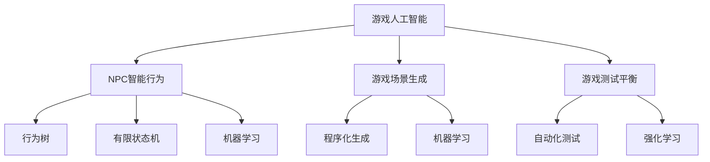

# 人工智能在游戏开发中的应用

## 1. 背景介绍
### 1.1 游戏行业的发展现状
#### 1.1.1 游戏市场规模不断扩大
#### 1.1.2 游戏类型日益丰富多样
#### 1.1.3 游戏技术不断革新升级

### 1.2 人工智能技术的发展现状  
#### 1.2.1 人工智能的概念与内涵
#### 1.2.2 人工智能的发展历程
#### 1.2.3 人工智能的主要分支领域

### 1.3 人工智能与游戏开发的结合 
#### 1.3.1 人工智能在游戏中的应用价值
#### 1.3.2 人工智能给游戏开发带来的机遇
#### 1.3.3 人工智能在游戏开发中面临的挑战

## 2. 核心概念与联系
### 2.1 游戏人工智能的定义
#### 2.1.1 游戏AI的内涵
#### 2.1.2 游戏AI与传统AI的区别
#### 2.1.3 游戏AI的发展现状

### 2.2 游戏人工智能的主要应用领域
#### 2.2.1 游戏NPC的智能行为
#### 2.2.2 游戏场景的智能生成
#### 2.2.3 游戏测试与平衡性调整

### 2.3 游戏人工智能与其他技术的联系
#### 2.3.1 游戏AI与计算机图形学
#### 2.3.2 游戏AI与物理引擎 
#### 2.3.3 游戏AI与网络通信



## 3. 核心算法原理具体操作步骤
### 3.1 游戏NPC智能行为算法
#### 3.1.1 行为树
1) 定义行为树节点类型
2) 构建行为树结构
3) 行为树运行机制
4) 行为树的优化方法

#### 3.1.2 有限状态机
1) 定义有限状态机状态
2) 构建状态转移关系
3) 状态机运行机制
4) 分层有限状态机

#### 3.1.3 机器学习
1) 监督学习应用
2) 无监督学习应用
3) 强化学习应用
4) 深度学习应用

### 3.2 游戏场景智能生成算法
#### 3.2.1 程序化生成
1) 随机数生成
2) 分形算法
3) 元胞自动机
4) 波函数坍缩算法

#### 3.2.2 机器学习生成
1) GAN场景生成
2) VAE场景生成
3) PCGML场景生成

### 3.3 游戏测试平衡性调整算法
#### 3.3.1 自动化测试
1) 脚本自动化测试
2) 基于AI的自动化测试

#### 3.3.2 强化学习平衡性调整
1) 基于蒙特卡洛树搜索的平衡性调整
2) 基于进化算法的平衡性调整

## 4. 数学模型和公式详细讲解举例说明
### 4.1 马尔可夫决策过程(MDP)
游戏AI中，马尔可夫决策过程常用于建模强化学习问题。一个MDP由状态集合$S$，动作集合$A$，状态转移概率$P$，奖励函数$R$和折扣因子$\gamma$组成。

在状态$s$下选择动作$a$，环境根据$P$转移到下一个状态$s'$并获得奖励$r$。强化学习的目标是学习一个最优策略$\pi^*$使得期望累积奖励最大化：

$$\pi^* = \arg\max_{\pi} \mathbb{E}\left[\sum_{t=0}^{\infty} \gamma^t r_t | \pi \right]$$

其中$r_t$表示在时刻$t$获得的奖励，$\gamma \in [0,1]$为折扣因子。

### 4.2 蒙特卡洛树搜索(MCTS)
蒙特卡洛树搜索常用于游戏AI的博弈决策，如五子棋AI、星际争霸AI等。MCTS通过随机模拟的方式在博弈树上进行采样搜索，逐步找到最优决策。

MCTS的一次迭代分为4个步骤：选择、扩展、模拟、回溯。

1) 选择：从根节点出发，依据一定策略（如UCB）选择最优子节点，直到叶子节点。UCB公式如下：

$$UCB(s,a) = Q(s,a) + c \sqrt{\frac{\ln N(s)}{N(s,a)}}$$

其中$Q(s,a)$为状态动作值函数，$N(s)$和$N(s,a)$分别为状态$s$和状态动作对$(s,a)$的访问次数，$c$为探索常数。

2) 扩展：如果叶子节点不是终止状态，随机扩展一个子节点。
3) 模拟：从新扩展的节点开始，进行随机模拟对弈直到终止状态。  
4) 回溯：将模拟结果反向传播更新树上各个节点的统计信息。

经过多次迭代后，访问次数最高的根节点子节点即为最优决策。

### 4.3 对抗生成网络(GAN)
GAN由生成器$G$和判别器$D$组成，通过二者的博弈学习来生成接近真实数据分布的样本。判别器$D$试图将真实样本和生成样本区分开，而生成器$G$试图欺骗判别器。

GAN的目标函数可表示为：

$$\min_G \max_D V(D,G) = \mathbb{E}_{x \sim p_{data}(x)} [\log D(x)] + \mathbb{E}_{z \sim p_z(z)} [\log (1-D(G(z)))]$$

其中$x$为真实样本，$z$为随机噪声，$p_{data}$和$p_z$分别为真实数据分布和随机噪声分布。$D(x)$表示判别器将样本$x$判为真实样本的概率，$G(z)$表示生成器将噪声$z$生成的样本。

在游戏场景生成中，可以利用GAN从随机噪声生成逼真的游戏场景图像。判别器负责判断生成的场景是否真实，生成器负责生成以假乱真的场景。

## 5. 项目实践：代码实例和详细解释说明
下面以Python为例，给出游戏AI常用算法的简单代码实现。

### 5.1 行为树
```python
class BehaviorTree:
    def __init__(self, root_node):
        self.root = root_node
        
    def run(self):
        self.root.run()

class Node:
    def __init__(self, name):
        self.name = name
        self.children = []
        
    def add_child(self, child_node):
        self.children.append(child_node)
        
    def run(self):
        pass

class SelectorNode(Node):
    def run(self):
        for child in self.children:
            result = child.run()
            if result:
                return True
        return False

class SequenceNode(Node):
    def run(self):
        for child in self.children:
            result = child.run()
            if not result:
                return False
        return True
      
class ActionNode(Node):  
    def run(self):
        # 执行具体动作
        print(f"Executing action: {self.name}")
        return True
```

上述代码定义了行为树的基本节点类型，包括Selector节点（只要有一个子节点返回True则返回True）、Sequence节点（所有子节点都返回True才返回True）和Action节点（执行具体动作）。通过组合这些节点就可以构建复杂的NPC行为逻辑。

### 5.2 DQN强化学习
```python
import numpy as np
import tensorflow as tf

class DQN:
    def __init__(self, state_dim, action_dim, learning_rate, gamma, epsilon):
        self.state_dim = state_dim
        self.action_dim = action_dim
        self.learning_rate = learning_rate
        self.gamma = gamma
        self.epsilon = epsilon
        
        self.model = self._build_model()
        self.target_model = self._build_model()
        
    def _build_model(self):
        model = tf.keras.Sequential([
            tf.keras.layers.Dense(64, input_shape=(self.state_dim,), activation='relu'),
            tf.keras.layers.Dense(64, activation='relu'),
            tf.keras.layers.Dense(self.action_dim)
        ])
        model.compile(loss='mse', optimizer=tf.keras.optimizers.Adam(lr=self.learning_rate))
        return model
    
    def choose_action(self, state):
        if np.random.rand() < self.epsilon:
            return np.random.choice(self.action_dim)
        else:
            q_values = self.model.predict(state)[0]
            return np.argmax(q_values)
        
    def train(self, state, action, reward, next_state, done):
        target = self.model.predict(state)
        if done:
            target[0][action] = reward
        else:
            target[0][action] = reward + self.gamma * np.amax(self.target_model.predict(next_state)[0])
        
        self.model.fit(state, target, epochs=1, verbose=0)
```

上述代码实现了DQN算法，包括创建Q网络、依据epsilon-greedy策略选择动作、利用时序差分目标训练Q网络等。其中损失函数使用均方误差，优化器使用Adam。通过不断与环境交互并训练网络，最终可以学习到最优策略。

### 5.3 MCTS游戏博弈
```python
import numpy as np

class Node:
    def __init__(self, state, parent=None):
        self.state = state
        self.parent = parent
        self.children = []
        self.visits = 0
        self.value = 0.0
        
    def expand(self, action_probs):
        for action, prob in action_probs:
            child_state = self.state.take_action(action)
            child_node = Node(child_state, self)
            child_node.value = prob
            self.children.append(child_node)
            
    def select(self, c_puct):
        return max(self.children, key=lambda node: node.value + c_puct * np.sqrt(self.visits) / (1 + node.visits))
    
    def update(self, leaf_value):
        self.visits += 1
        self.value += (leaf_value - self.value) / self.visits
        
    def backpropagate(self, leaf_value):
        if self.parent:
            self.parent.backpropagate(leaf_value)
        self.update(leaf_value)
        
class MCTS:
    def __init__(self, c_puct=5, n_playout=2000):
        self.root = None
        self.c_puct = c_puct
        self.n_playout = n_playout
        
    def playout(self, state):
        node = self.root
        while not state.is_terminal():
            if not node.children:
                action_probs = state.get_action_probs()
                return self.expand_and_evaluate(node, state, action_probs)
            else:
                node = node.select(self.c_puct)
                state.take_action(node.action)
                
        leaf_value = state.get_value()
        node.backpropagate(leaf_value)
        return leaf_value
    
    def expand_and_evaluate(self, parent, state, action_probs):
        parent.expand(action_probs)
        leaf_value = state.get_value()
        parent.backpropagate(leaf_value)
        return leaf_value
        
    def get_move_probs(self, state):
        for _ in range(self.n_playout):
            state_copy = state.copy()
            self.playout(state_copy)
            
        act_visits = [(act, node.visits) for act, node in self.root.children.items()]
        acts, visits = zip(*act_visits)
        act_probs = visits / np.sum(visits)
        return acts, act_probs
    
    def update_with_move(self, last_move):
        if last_move in self.root.children:
            self.root = self.root.children[last_move]
            self.root.parent = None
        else:
            self.root = Node(state)
```

上述代码实现了蒙特卡洛树搜索算法，包括选择、扩展、模拟、回溯四个步骤。其中选择时使用UCB公式平衡探索和利用，扩展时根据状态的可用动作创建新节点，模拟时随机对弈至终局并获得评估值，回溯时将评估值反向传播更新树上节点统计信息。最终根据根节点处的访问次数分布选择最优动作。

## 6. 实际应用场景
### 6.1 游戏NPC的智能行为
- 在RPG游戏中，利用行为树和有限状态