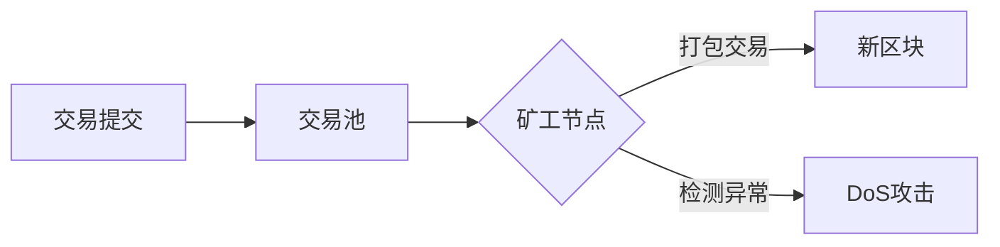

# 以太坊拒绝服务攻击检测

## 1. 背景介绍
### 1.1 以太坊概述
以太坊是一个开源的、基于区块链的分布式计算平台，允许开发者在其上构建和部署去中心化应用（DApps）。以太坊提供了一种称为智能合约的机制，使得在没有第三方可信中介的情况下执行可信的计算成为可能。
### 1.2 拒绝服务攻击
拒绝服务（DoS）攻击是一种网络攻击，其目的是使目标计算机或网络资源对合法用户不可用。攻击者通过大量请求淹没目标系统，耗尽其计算资源，导致服务中断。
### 1.3 以太坊面临的DoS攻击威胁
作为一个公开的分布式系统，以太坊网络容易受到DoS攻击。恶意节点可能会发送大量无效或恶意交易，消耗网络资源，降低网络性能。智能合约中的漏洞也可能被利用发起DoS攻击。检测和防御DoS攻击对于保障以太坊网络的安全和可靠性至关重要。

## 2. 核心概念与联系
### 2.1 Gas机制
以太坊引入Gas机制来衡量交易执行的计算工作量，并为资源使用定价。每个操作码都有相应的Gas消耗。Gas限制了单个交易的最大计算步骤，防止无限循环等异常计算行为。
### 2.2 交易池
交易在被打包进区块前，会先进入交易池（mempool）。交易池保存了网络中待确认的交易。矿工从交易池中选择Gas价格高的交易进行打包。
### 2.3 共识机制
以太坊当前使用工作量证明（PoW）共识机制，矿工通过解决密码学难题来争夺区块的记账权和奖励。为防止少数算力垄断，以太坊对区块Gas上限、出块时间等进行了动态调节。
### 2.4 攻击检测的必要性
DoS攻击会导致正常交易延迟打包，影响用户体验。恶意交易还会浪费网络资源，提高节点的运行开销。及时检测DoS攻击有助于快速响应和处置，维护系统稳定性。



## 3. 核心算法原理与具体操作步骤
### 3.1 交易特征分析
DoS攻击交易通常具有一些异常特征：
1. Gas价格明显低于平均水平
2. 交易字节数较大，执行时间长
3. 短时间内来自同一地址的交易数量暴增
4. 反复执行相同或类似的无效操作

根据这些特征，可以对进入交易池的交易进行筛查，识别出疑似DoS攻击交易。
### 3.2 动态调整交易门槛
为应对DoS攻击，以太坊节点可动态调整交易接受门槛：
1. 设定合理的最低Gas价格
2. 限制单一地址的交易频率
3. 优先接受执行时间短的交易
4. 对可疑交易进行额外验证

通过这些措施，可以降低DoS交易被接受进交易池的概率。
### 3.3 区块Gas上限管理
以太坊对区块的Gas上限进行动态调节，以适应网络状况变化：
1. 根据前一区块的实际Gas使用量调整当前区块的Gas上限
2. 若连续多个区块接近满额，适度提高Gas上限
3. 若连续多个区块使用量较低，适度降低Gas上限
4. 超大交易可分解为多个子交易处理

合理的区块Gas上限能防止少数大额交易占满区块，为更多交易留出空间。
### 3.4 可疑交易行为监控
节点应持续监控交易执行过程，及时发现异常行为：
1. 监控单个交易的Gas消耗，对超出限制的交易终止执行
2. 监控单个地址的交易行为，对反复执行无效操作的地址降低优先级
3. 跟踪智能合约的运行情况，对可能导致DoS的漏洞及时预警
4. 引入机器学习等智能算法，实时学习DoS攻击的新特征

综合运用多种监控手段，可以构建立体的DoS攻击检测防线。

## 4. 数学模型和公式详细讲解举例说明
### 4.1 Gas计算模型
以太坊中的每一个操作码都被赋予了一个固定的Gas消耗值，一次交易的总Gas消耗为所有操作码Gas之和：

$GasCost_{tx} = \sum_{i=1}^{n} GasCost_{op_i}$

其中，$GasCost_{tx}$ 表示交易的总Gas消耗，$GasCost_{op_i}$ 表示第 $i$ 个操作码的Gas消耗，$n$ 为操作码总数。

交易的实际费用为Gas消耗与Gas价格的乘积：

$Fee_{tx} = GasCost_{tx} \times GasPrice_{tx}$

其中，$Fee_{tx}$ 表示交易费用，$GasPrice_{tx}$ 表示交易的Gas价格。

### 4.2 区块Gas上限调节公式
以太坊根据前一区块的实际Gas使用量，动态调整当前区块的Gas上限：

$GasLimit_{cur} = GasLimit_{prev} \times (1 + \frac{GasUsed_{prev} - GasTarget}{GasTarget \times 1024})$

其中，$GasLimit_{cur}$ 表示当前区块的Gas上限，$GasLimit_{prev}$ 表示前一区块的Gas上限，$GasUsed_{prev}$ 表示前一区块实际使用的Gas量，$GasTarget$ 为区块Gas使用量的目标值（当前为 4,700,000）。

若前一区块使用量接近目标值，当前Gas上限变化不大；若前一区块使用量远高于目标值，当前Gas上限会适度提高；反之亦然。

### 4.3 交易优先级计算
交易池中的交易按照优先级排序，优先级由Gas价格和等待时间共同决定：

$Priority_{tx} = \frac{GasPrice_{tx}}{GasPrice_{avg}} \times (1 + \frac{WaitTime_{tx}}{WaitTime_{avg}})$

其中，$Priority_{tx}$ 表示交易的优先级，$GasPrice_{tx}$ 表示交易的Gas价格，$GasPrice_{avg}$ 表示交易池中的平均Gas价格，$WaitTime_{tx}$ 表示交易在交易池中的等待时间，$WaitTime_{avg}$ 表示交易的平均等待时间。

Gas价格高、等待时间长的交易，优先级较高，更容易被矿工选中打包。DoS交易由于Gas价格低，会长时间滞留在交易池后部。

## 5. 项目实践：代码实例和详细解释说明
下面以Go语言为例，演示以太坊节点中DoS攻击检测的关键代码。

### 5.1 交易验证
```go
func (pool *TxPool) validateTx(tx *types.Transaction) error {
    // 检查交易的Gas价格是否低于节点接受的最低价格
    if tx.GasPrice().Cmp(pool.minGasPrice) < 0 {
        return ErrUnderpriced
    }
    
    // 检查交易的Gas限制是否超过区块的Gas上限
    if tx.Gas() > pool.currentMaxGas {
        return ErrGasLimit
    }
    
    // 检查交易的数据长度是否超过限制
    if tx.Size() > MaxTxDataSize {
        return ErrOversizedData
    }
    
    // 检查交易的签名是否有效
    from, err := types.Sender(pool.signer, tx)
    if err != nil {
        return ErrInvalidSender
    }
    
    // 检查发送方账户的余额是否足够支付交易费用
    if pool.currentState.GetBalance(from).Cmp(tx.Cost()) < 0 {
        return ErrInsufficientFunds
    }
    
    // 检查交易nonce是否合法
    if pool.currentState.GetNonce(from) > tx.Nonce() {
        return ErrNonceTooLow
    }
    
    return nil
}
```

节点收到新交易时，先进行一系列验证，包括Gas价格、Gas限制、数据长度、签名有效性、账户余额、交易nonce等。只有通过验证的交易才能进入交易池。

### 5.2 动态调整Gas上限
```go
func (b *BlockChain) adjustGasLimit(parent *types.Block) uint64 {
    // 计算当前区块的Gas目标值
    gasTarget := parent.GasLimit() / params.GasLimitBoundDivisor
    
    // 计算当前区块的Gas上限调整系数
    gasLimit := parent.GasLimit()
    if parent.GasUsed() > gasTarget {
        gasLimit = parent.GasLimit() * params.GasLimitMultiplier
    } else {
        gasLimit = parent.GasLimit() * params.GasLimitDivisor
    }
    
    // 确保Gas上限在合理范围内
    if gasLimit < params.MinGasLimit {
        gasLimit = params.MinGasLimit
    }
    if gasLimit > params.MaxGasLimit {
        gasLimit = params.MaxGasLimit
    }
    
    return gasLimit
}
```

在生成新区块时，节点根据前一区块的实际Gas使用量，动态调整当前区块的Gas上限。若前一区块使用量超过目标值，当前Gas上限提高；反之则降低。同时确保Gas上限在合理的范围内。

### 5.3 可疑交易监控
```go
func (pool *TxPool) monitorTx(tx *types.Transaction) {
    // 检查交易的Gas消耗是否超出限制
    if tx.Gas() > pool.maxTxGas {
        pool.removeTx(tx.Hash())
        log.Warn("Transaction exceeds gas limit", "hash", tx.Hash())
    }
    
    // 检查发送方地址的交易频率是否过高
    count := pool.beats[tx.From()]
    if count > maxTxPerAddress {
        pool.addressFilter[tx.From()] = true
        log.Warn("Address exceeds transaction limit", "address", tx.From())
    }
    
    // 检查交易的执行是否触发可疑操作码
    if tx.To() == nil {
        pool.monitorContract(tx)
    }
}

func (pool *TxPool) monitorContract(tx *types.Transaction) {
    // 模拟执行交易，检查是否触发可疑操作码
    vmConfig := vm.Config{EnablePreimageRecording: false}
    gp := new(GasPool).AddGas(tx.Gas())
    statedb := pool.currentState.Copy()
    _, _, err := ApplyMessage(vmConfig, statedb, tx, gp)
    if err != nil {
        // 记录可疑交易和合约地址
        log.Warn("Suspicious transaction detected", "hash", tx.Hash(), "contract", tx.To())
    }
}
```

节点持续监控进入交易池的交易，对一些可疑交易行为进行检查和记录，包括：
1. 单笔交易的Gas消耗是否超出限制
2. 单个地址的交易频率是否过高
3. 交易执行是否触发了危险的操作码

一旦发现异常情况，相关交易会被移出交易池，同时记录可疑地址和合约，供进一步分析。

## 6. 实际应用场景
DoS攻击检测在以太坊生态中有广泛的应用场景，包括：
### 6.1 公链安全防护
公共以太坊网络是DoS攻击的主要目标。通过部署高效的DoS检测机制，公链节点可以及时发现和应对恶意攻击，保障网络的稳定运行和数据安全。
### 6.2 企业级联盟链
许多企业基于以太坊构建联盟链，服务于供应链管理、跨境支付、产品溯源等商业场景。DoS攻击检测有助于识别内部恶意节点，提升联盟链的可信度。
### 6.3 DApp安全审计
基于以太坊的去中心化应用大量涌现。智能合约的安全漏洞可能被DoS攻击利用。借助攻击检测工具，DApp开发者可在部署前对代码进行全面审计，消除潜在风险。
### 6.4 矿池安全管理
以太坊矿工普遍加入矿池进行联合挖矿。DoS攻击可能导致矿池算力下降，影响收益。成熟的矿池会采用专业的检测方案，及时隔离恶意矿工，维护矿池的稳定性。
### 6.5 交易所风控
数字货币交易所承载了大量以太坊资产交易。DoS攻击可能引发交易延迟、资金损失等问题。交易所