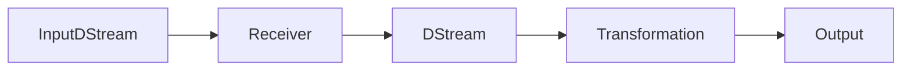
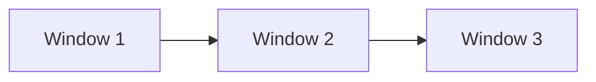

# 使用SparkStreaming进行实时日志分析

## 1.背景介绍
### 1.1 实时日志分析的重要性
在当今数据驱动的世界中,实时日志分析扮演着至关重要的角色。无论是电商平台、社交网络还是金融机构,海量的日志数据每时每刻都在产生。如何高效、准确地分析这些实时数据,已经成为企业获取商业洞察、优化系统性能、检测异常行为的关键。
### 1.2 传统日志分析方式的局限性
传统的日志分析方式通常采用离线批处理的模式,将日志数据定期导入数据仓库或Hadoop集群进行分析。然而,这种方式存在明显的局限性:
- 时效性差:离线处理无法实时响应业务需求,存在较大的延迟。
- 成本高:需要大量的存储和计算资源,运维成本高昂。 
- 扩展性差:难以应对数据量和并发量的快速增长。
### 1.3 SparkStreaming的优势
SparkStreaming是Apache Spark生态系统中的实时数据处理组件,具有如下优势:
- 低延迟:支持毫秒级的流数据处理,实现近乎实时的分析。
- 高吞吐:基于Spark的内存计算引擎,处理速度快。
- 易用性:提供高级API,支持Java、Scala、Python等多种语言。
- 容错性:自动处理节点失效,保证数据处理的高可靠性。
- 可扩展:可轻松扩展到上百个节点,满足大规模数据处理需求。

## 2.核心概念与联系
### 2.1 SparkStreaming的核心概念
- DStream:Discretized Stream的简称,表示SparkStreaming的基本抽象。DStream是一系列连续的RDD(弹性分布式数据集),每个RDD包含一个时间间隔内的数据。
- InputDStream和Receiver:InputDStream是输入源数据的DStream,代表从数据源接收的输入数据流。Receiver是用于接收数据的组件。
- Transformation:对DStream进行各种转换操作,如map、filter、reduceByKey等,生成新的DStream。
- Output:将转换后的DStream输出到外部系统,如HDFS、Kafka、数据库等。
### 2.2 核心概念之间的关系
下图展示了SparkStreaming核心概念之间的关系:



InputDStream通过Receiver不断接收输入数据并生成DStream,DStream经过一系列Transformation操作后,将结果输出到外部系统。

## 3.核心算法原理具体操作步骤
SparkStreaming的核心算法主要包括以下几个步骤:
### 3.1 数据接收与分发
- Receiver从数据源接收数据,并将数据分成一系列的数据块。
- 数据块被发送到SparkStreaming的Worker节点,形成DStream。
- 多个Receiver可以并行接收数据,提高吞吐量。
### 3.2 数据处理与转换  
- DStream经过一系列Transformation操作,如map、filter、reduceByKey等,生成新的DStream。
- 转换操作是即时执行的,但转换后的数据只有在Output操作中才会真正计算。
- 转换操作支持窗口计算,如reduceByKeyAndWindow,可以在一个滑动窗口内进行聚合。
### 3.3 数据输出
- 使用Output操作将转换后的数据输出到外部系统,如foreachRDD。
- 输出操作触发SparkStreaming的实际计算。
- 输出操作是阻塞的,只有前一个批次完成后才能开始下一个批次。
### 3.4 容错处理
- SparkStreaming自动处理Worker节点失效,将失效节点上的任务重新调度到其他节点。
- 数据接收采用Write Ahead Log机制,保证数据不丢失。
- Transformation操作生成的RDD是可容错的,支持数据重放。

## 4.数学模型和公式详细讲解举例说明
### 4.1 滑动窗口模型
SparkStreaming支持在滑动窗口上进行实时聚合计算,如下图所示:



每个窗口包含一个时间段内的DStream数据,窗口按固定的时间间隔滑动。例如,设窗口长度为60秒,滑动间隔为10秒,那么每10秒就会生成一个新的窗口,包含最近60秒的数据。
### 4.2 窗口聚合计算
在窗口上可以进行各种聚合计算,如sum、count、average等。以sum为例,假设窗口内的数据为$\{x_1, x_2, ..., x_n\}$,那么窗口的sum值为:

$$\sum_{i=1}^{n} x_i$$

### 4.3 TopN算法
TopN算法用于计算窗口内出现频率最高的N个元素。假设窗口内的数据为$\{x_1, x_2, ..., x_n\}$,每个元素$x_i$出现的次数为$c_i$,那么TopN算法的步骤如下:
1. 对每个元素$x_i$进行计数,得到$(x_i, c_i)$。
2. 按照$c_i$对$(x_i, c_i)$进行降序排序。
3. 取前N个$(x_i, c_i)$作为TopN结果。

例如,窗口内的数据为$\{a, b, a, c, a, b\}$,按照上述步骤计算Top2结果如下:
1. 计数后得到$(a, 3), (b, 2), (c, 1)$。
2. 排序后得到$(a, 3), (b, 2), (c, 1)$。 
3. 取前2个元素,得到Top2结果为$\{a, b\}$。

## 5.项目实践：代码实例和详细解释说明
下面以实时统计Nginx日志中每分钟HTTP响应码数量为例,演示如何使用SparkStreaming进行实时日志分析。
### 5.1 日志格式
假设Nginx日志的格式如下:

```
[时间] [HTTP方法] [URL] [HTTP响应码] [响应时间]
```

例如:

```
2023-06-03 10:00:01 GET /index.html 200 100
2023-06-03 10:00:02 POST /login 401 150
```

### 5.2 编写Spark Streaming程序
使用Scala编写SparkStreaming程序,代码如下:

```scala
import org.apache.spark.SparkConf
import org.apache.spark.streaming.{Seconds, StreamingContext}

object NginxLogAnalysis {
  def main(args: Array[String]): Unit = {
    // 创建SparkConf
    val conf = new SparkConf().setAppName("NginxLogAnalysis").setMaster("local[2]")
    // 创建StreamingContext,批次间隔为10秒
    val ssc = new StreamingContext(conf, Seconds(10))
    
    // 从指定目录读取Nginx日志
    val logDirectory = "/path/to/nginx/logs"
    val logData = ssc.textFileStream(logDirectory)
    
    // 解析日志,提取HTTP响应码
    val responseCodeDStream = logData.map(line => {
      val fields = line.split(" ")
      val responseCode = fields(3)
      (responseCode, 1)
    })
    
    // 统计每个批次内HTTP响应码的数量
    val responseCodeCountDStream = responseCodeDStream.reduceByKey(_ + _)
    
    // 打印结果
    responseCodeCountDStream.print()
    
    // 启动流式计算
    ssc.start()
    ssc.awaitTermination()
  }
}
```

### 5.3 代码说明
- 首先创建SparkConf和StreamingContext,设置批次间隔为10秒。
- 使用textFileStream从指定目录读取Nginx日志,生成DStream。
- 对DStream进行map操作,解析每行日志,提取HTTP响应码,并转换为(响应码, 1)的形式。
- 使用reduceByKey对每个批次内的数据进行聚合,统计每个HTTP响应码的数量。
- 使用print将结果打印到控制台。
- 启动流式计算,并等待终止。

### 5.4 运行结果
假设Nginx日志不断生成,每隔10秒就会输出一次结果,如下所示:

```
---------- 2023-06-03 10:00:10 ----------
(200, 100)
(401, 20)
(404, 5)

---------- 2023-06-03 10:00:20 ----------
(200, 120)
(401, 30)
(404, 8)
```

可以看到,每个批次内HTTP响应码的数量被实时统计出来了。

## 6.实际应用场景
SparkStreaming实时日志分析可以应用于多个场景,例如:
### 6.1 网站实时监控
对网站的访问日志进行实时分析,可以实时统计PV、UV、响应时间、错误率等指标,及时发现和解决问题,保证网站的稳定运行。
### 6.2 应用性能监控
对应用程序的日志进行实时分析,可以实时统计接口的响应时间、请求量、错误率等指标,及时优化性能瓶颈,提升用户体验。
### 6.3 安全监控
对系统日志、网络日志进行实时分析,可以及时发现恶意请求、异常登录等安全威胁,防范黑客入侵。
### 6.4 用户行为分析
对用户行为日志进行实时分析,可以实时统计用户的点击、浏览、搜索等行为,优化产品设计,提升转化率。

## 7.工具和资源推荐
### 7.1 编程语言
- Scala:SparkStreaming的原生语言,函数式编程,表达力强。
- Java:可以与现有的Java项目很好地集成。
- Python:使用PySpark API,适合数据分析场景。
### 7.2 开发工具
- IDEA:Scala和Java开发的首选IDE。
- Jupyter Notebook:适合Python开发,交互式编程。
### 7.3 部署工具 
- YARN:Hadoop生态的资源管理系统,可以方便地管理SparkStreaming作业。
- Mesos:跨平台的集群资源管理系统,支持多种计算框架。
- Kubernetes:容器化部署工具,可以实现SparkStreaming作业的弹性伸缩。
### 7.4 学习资源
- Spark官方文档:https://spark.apache.org/docs/latest/streaming-programming-guide.html
- Spark Streaming源码:https://github.com/apache/spark/tree/master/streaming
- Spark Streaming论文:https://people.csail.mit.edu/matei/papers/2013/sosp_spark_streaming.pdf

## 8.总结：未来发展趋势与挑战
SparkStreaming已经成为实时日志分析领域的主流工具之一,在可预见的未来仍将扮演重要角色。未来的发展趋势包括:
- 与机器学习、图计算等技术的深度融合,支持更智能的分析。
- 基于Structured Streaming的统一流批处理,简化编程模型。
- 支持更多的数据源和下游存储系统,提供端到端的解决方案。

同时,SparkStreaming也面临一些挑战:
- 低延迟场景下如何权衡吞吐量和延迟。
- 动态扩容、数据倾斜等生产环境问题。
- 与Flink、Kafka Streams等其他流计算框架的竞争。

SparkStreaming仍在不断发展和完善,相信通过社区的共同努力,一定能够克服这些挑战,让实时日志分析变得更加高效、智能、易用。让我们一起期待SparkStreaming的美好未来!

## 9.附录：常见问题与解答
### 9.1 SparkStreaming和Storm的区别是什么?
- SparkStreaming是微批次模式,将数据流切分成一个个批次进行处理,延迟通常在秒级。Storm是纯实时模式,每个元组都会触发计算,延迟在毫秒级。 
- SparkStreaming基于Spark生态,可以无缝集成批处理、SQL、机器学习等。Storm是独立的流计算框架。
- SparkStreaming通过RDD实现高效容错。Storm通过Record Ack和Topology Ack实现容错。
### 9.2 SparkStreaming如何保证数据不丢失?
- 数据接收端采用WAL(Write Ahead Log)机制,将数据写入日志后再提交。
- 在Transformation过程中,RDD之间有依赖关系,可以重新计算丢失的RDD。
- 在输出端,可以采用幂等写入或事务机制,保证数据只被处理一次。
### 9.3 SparkStreaming如何实现动态扩容?
- 可以