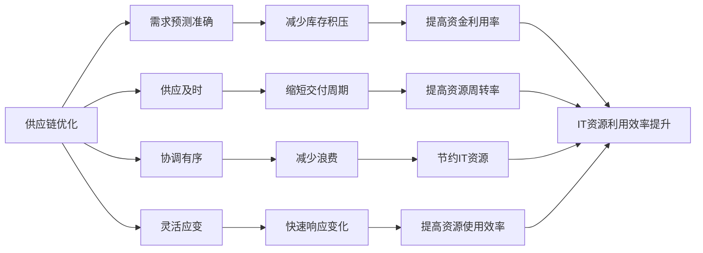

# 供应链管理优化:提高IT资源利用效率

## 1.背景介绍

### 1.1 供应链管理的重要性
在当今高度互联和全球化的商业环境中,供应链管理(Supply Chain Management, SCM)扮演着至关重要的角色。有效的供应链管理可以帮助企业优化资源配置,降低成本,提高效率,增强竞争力。特别是在IT行业,供应链管理对于确保IT资源的高效利用和及时交付至关重要。

### 1.2 IT资源利用效率面临的挑战
然而,IT行业的供应链管理也面临着诸多挑战:
- IT产品和服务的生命周期越来越短,需求变化快
- 全球化导致供应链日益复杂,协调难度加大  
- 各环节信息不对称,缺乏透明度和可视性
- 供需预测不准确,导致库存积压或短缺
- 缺乏灵活性,难以应对突发事件和市场变化

这些挑战导致IT资源利用效率低下,浪费严重。因此,亟需优化IT供应链管理,提高资源利用效率。

### 1.3 供应链优化的目标
供应链优化的核心目标是在保证服务水平的同时,最大限度地提高资源利用效率,具体包括:
- 降低库存,减少占用资金
- 缩短交付周期,提高响应速度  
- 减少浪费,节约资源
- 提高预测准确性,平衡供需
- 增强灵活性和韧性,快速应对变化

## 2.核心概念与联系

### 2.1 供应链的定义与组成
供应链是指从原材料到最终产品交付给消费者的整个过程中,涉及的所有直接或间接参与者所组成的网络。它包括供应商、制造商、分销商、零售商以及最终用户。

### 2.2 供应链管理的定义与目标
供应链管理是对供应链中的物流、信息流、资金流进行计划、组织、协调和控制,以实现供应链整体效益最大化的管理过程。其目标是通过优化供应链各环节,提高整个供应链的效率和效益。

### 2.3 IT供应链的特点
相比其他行业,IT供应链具有一些独特的特点:
- 产品生命周期短,更新换代快
- 需求波动大,难以准确预测
- 全球化程度高,供应链复杂
- 对交付时间和服务质量要求高
- 涉及硬件、软件、服务等多种要素

### 2.4 供应链优化与IT资源利用效率的关系  
IT供应链的优化对提高IT资源利用效率至关重要:
- 需求预测准确,减少库存积压,提高资金利用率
- 供应及时,缩短交付周期,提高资源周转率
- 协调有序,减少浪费,节约IT资源  
- 灵活应变,快速响应,提高资源使用效率

下图展示了供应链优化与IT资源利用效率提升的关系:


## 3.核心算法原理具体操作步骤

供应链优化涉及多个环节和流程,需要运用多种优化算法。以下重点介绍几种核心算法:

### 3.1 需求预测算法
需求预测是供应链优化的基础,常用的算法包括:
1. 移动平均法:根据过去一段时间的平均需求量来预测未来需求。
2. 指数平滑法:根据历史数据,分配不同权重,越近期的数据权重越大。
3. 时间序列分析:通过分析需求的长期趋势、季节性、循环性等特征进行预测。
4. 机器学习算法:如支持向量机、神经网络等,通过训练历史数据构建预测模型。

### 3.2 库存优化算法
库存优化旨在以最低的库存成本,满足一定的服务水平,常见算法有:
1. 经济订货批量(EOQ)模型:通过平衡订货成本和持有成本,计算最优订货量。
2. 再订货点(ROP)模型:确定当库存降至某一水平时触发补货的时间点。
3. ABC分类法:根据产品的重要性,采取不同的库存策略。
4. 供应商管理库存(VMI):供应商根据零售商的销售数据和库存水平,自主决定补货。

### 3.3 物流优化算法
物流优化目标是以最低的物流成本,满足交付时间要求,主要算法包括:
1. 运输路径优化:如最短路径算法、旅行商问题算法等,优化运输线路。
2. 装载优化:如装箱问题算法,优化运载工具的装载方式,提高装载率。
3. 配送优化:如车辆路径问题(VRP)算法,优化配送线路和时间表。
4. 仓储优化:如ABC分类法,优化仓库布局和拣选路线。

### 3.4 供应商选择算法 
供应商选择优化需要考虑多个指标,常用的算法有:
1. 层次分析法(AHP):通过两两比较,确定指标权重,对供应商进行综合评价排序。
2. 数据包络分析(DEA):通过评价供应商的相对效率,筛选出最佳供应商组合。
3. 模糊综合评价:用模糊数学方法,将定性指标量化,对供应商进行综合评价。
4. 遗传算法:通过适者生存、优胜劣汰的进化机制,搜索最优的供应商组合。

## 4.数学模型和公式详细讲解举例说明

下面以经济订货批量(EOQ)模型为例,详细讲解其数学模型和公式。

### 4.1 EOQ模型假设
- 需求速率恒定
- 不允许缺货
- 补货无时间延迟
- 每次订货成本固定
- 单位时间库存持有成本固定

### 4.2 EOQ模型符号定义
- D:年需求量
- S:每次订货成本 
- H:单位商品的年持有成本
- Q:订货批量
- TC:年总成本
- T:两次订货之间的时间间隔

### 4.3 EOQ模型推导
在上述假设下,年总成本TC由两部分组成:订货成本和库存持有成本。
$$TC = \frac{D}{Q}S + \frac{Q}{2}H$$

其中,$\frac{D}{Q}$表示一年订货次数,$\frac{Q}{2}$表示平均库存量。

要使总成本最小,对TC求Q的导数,并令其等于0:
$$\frac{dTC}{dQ} = -\frac{DS}{Q^2} + \frac{H}{2} = 0$$

解得最优订货批量$Q^*$:
$$Q^* = \sqrt{\frac{2DS}{H}}$$

将$Q^*$代入TC公式,得到最小总成本$TC^*$:
$$TC^* = \sqrt{2DSH}$$

订货时间间隔$T^*$为:
$$T^* = \frac{Q^*}{D} = \sqrt{\frac{2S}{DH}}$$

### 4.4 EOQ模型算例
假设某IT设备年需求量为1000台,每次订货成本为200元,年持有成本为每台设备100元,求最优订货批量和订货时间间隔。

代入EOQ公式计算:
$$Q^* = \sqrt{\frac{2\times1000\times200}{100}} = 200(台)$$
$$T^* = \sqrt{\frac{2\times200}{1000\times100}} = 0.2(年) = 2.4(月)$$

即每次订购200台设备,每2.4个月订购一次,可使总成本最小。

## 5.项目实践:代码实例和详细解释说明

下面以Python代码为例,演示如何实现EOQ模型:

```python
import math

def eoq(D,S,H):
    """
    计算EOQ模型的最优订货批量和订货时间间隔
    :param D: 年需求量
    :param S: 每次订货成本
    :param H: 单位商品的年持有成本
    :return: 最优订货批量和订货时间间隔
    """
    # 计算最优订货批量
    Q = math.sqrt(2*D*S/H)
    # 计算订货时间间隔(年)
    T = math.sqrt(2*S/(D*H)) 
    return Q,T

# 测试
D = 1000
S = 200
H = 100
Q,T = eoq(D,S,H)
print(f"最优订货批量为:{Q:.0f}(台)")
print(f"订货时间间隔为:{T*12:.1f}(月)")
```

运行结果:
```
最优订货批量为:200(台)
订货时间间隔为:2.4(月)
```

代码解释:
1. 定义了`eoq`函数,接收年需求量`D`,订货成本`S`和持有成本`H`作为参数。
2. 根据EOQ公式,用`math.sqrt`函数计算最优订货批量`Q`和订货时间间隔`T`。
3. 返回计算结果`Q`和`T`。
4. 设置测试参数,调用`eoq`函数,将结果打印输出。
5. 为了方便理解,订货时间间隔由年转换为月。

该代码封装了EOQ模型的计算过程,可以直接调用`eoq`函数,输入相关参数,即可得到优化的订货策略。

## 6.实际应用场景

供应链优化在IT行业有广泛的应用,以下是一些具体场景:

### 6.1 电商企业供应链优化
- 需求预测:利用大数据分析用户行为,预测销量趋势,优化采购和备货。
- 库存管理:根据预测结果和库存成本,确定最优库存水平和补货策略。
- 物流优化:优化仓储布局和拣选策略,提高出库效率;优化配送路线和时间表,提高配送效率。
- 供应商管理:建立供应商评估体系,优选高质量供应商;实施VMI,提高供应链协同水平。

### 6.2 IT制造企业供应链优化  
- 需求计划:根据客户订单和市场预测,制定生产计划和物料需求计划。
- 采购管理:优化采购时间和批量,平衡采购成本和缺货风险;寻源全球最优供应商。
- 生产优化:优化生产计划和调度,提高设备利用率;实施精益生产,消除浪费。
- 库存控制:优化安全库存和再订货点,降低库存成本;实施准时制(JIT),减少在制品。

### 6.3 IT服务企业供应链优化
- 服务需求管理:收集和分析客户服务请求,预测服务需求,优化资源配置。  
- 服务交付:优化服务交付流程,提高交付效率和质量;实施敏捷开发,缩短交付周期。
- 服务级别管理:制定服务级别协议(SLA),平衡服务质量和成本;优化服务绩效指标和考核机制。
- 服务供应商管理:优选外包服务供应商,建立战略合作伙伴关系;实施服务集成,提高供应链协同水平。

## 7.工具和资源推荐

### 7.1 供应链优化软件
- SAP SCM:全球领先的供应链管理软件,提供需求计划、采购、库存、物流、供应商管理等全流程解决方案。
- Oracle SCM Cloud:甲骨文推出的云供应链管理平台,利用大数据和机器学习提供智能优化方案。
- JDA:专业的供应链计划和执行软件,在需求预测、库存优化、供应商协同等方面表现突出。
- Kinaxis RapidResponse:提供实时供应链可视化和决策优化功能,能够快速应对供应链中断事件。

### 7.2 算法工具库
- Python Scipy:提供优化、统计、数学等科学计算库,可用于供应链优化算法的实现。
- Google OR-Tools:谷歌开源的运筹优化工具库,提供多种优化算法,可用于