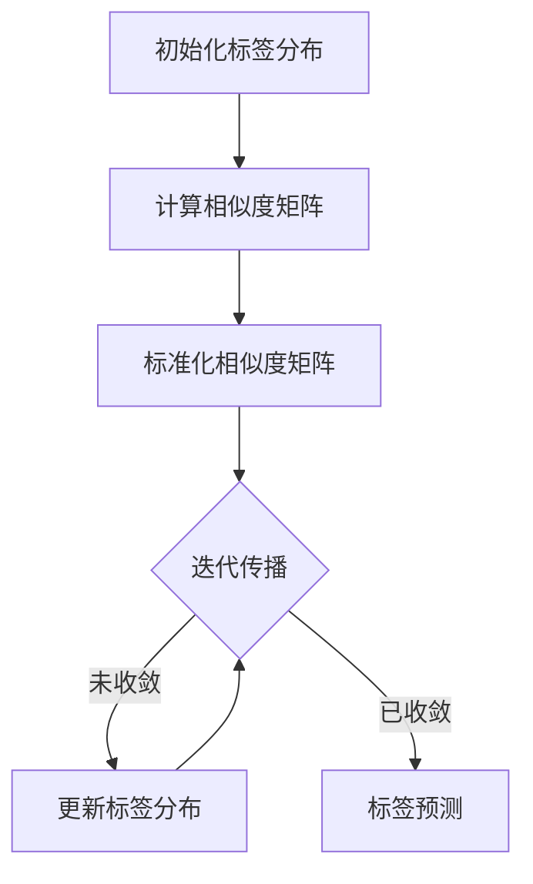

# 参数调优：优化经典标签传播算法的性能

## 1.背景介绍

在许多现实世界的应用中,如社交网络分析、图像分割、半监督学习等,我们经常会遇到大规模图数据集。标签传播算法(Label Propagation Algorithm, LPA)作为一种经典的半监督学习算法,在处理这类问题时表现出色。它利用了数据的局部和全局一致性,能够有效地将少量标记样本的标签信息传播到整个数据集。

然而,当面对大规模数据集时,LPA的计算效率往往会成为瓶颈。这不仅影响了算法的实时性,也限制了它在更广泛领域的应用。因此,提高LPA的计算效率成为了一个亟待解决的问题。

## 2.核心概念与联系

### 2.1 标签传播算法概述

标签传播算法的核心思想是利用数据的局部和全局一致性来预测未标记样本的标签。具体来说,它假设相似的样本应该具有相似的标签,并通过在数据集中迭代传播标记样本的标签信息来实现这一点。

算法的迭代过程可以概括为以下两个步骤:

1. 局部权重计算:计算每个未标记样本与其邻居样本之间的相似度权重。
2. 标签传播:根据相似度权重和邻居样本的标签,更新未标记样本的标签分布。

在每次迭代后,未标记样本的标签分布会逐渐收敛到稳定状态。最终,我们可以将每个未标记样本分配给具有最大概率的标签。

### 2.2 算法复杂度分析

标签传播算法的时间复杂度主要取决于两个因素:样本数量 $n$ 和邻居数量 $k$。在每次迭代中,算法需要遍历所有样本并更新它们的标签分布,因此时间复杂度为 $O(n*k)$。此外,算法需要进行多次迭代才能收敛,因此总的时间复杂度为 $O(t*n*k)$,其中 $t$ 是迭代次数。

对于大规模数据集,当 $n$ 和 $k$ 变大时,算法的计算成本会快速增加。因此,优化算法的效率对于实际应用至关重要。

## 3.核心算法原理具体操作步骤

标签传播算法的核心操作步骤如下:

1. **初始化**:对于每个标记样本,将其标签分布初始化为一个one-hot向量,表示其真实标签。对于未标记样本,将其标签分布初始化为均匀分布。

2. **计算相似度矩阵**:计算每对样本之间的相似度,构建相似度矩阵 $W$。常用的相似度度量包括高斯核函数、余弦相似度等。

3. **标准化相似度矩阵**:对相似度矩阵 $W$ 进行标准化,得到标准化相似度矩阵 $S$。标准化方法通常采用对每一行进行归一化,使每一行的元素之和为1。

4. **迭代传播**:重复执行以下步骤,直到算法收敛或达到最大迭代次数:
   
   a. 计算每个未标记样本的新标签分布,作为其邻居样本的标签分布的加权平均:
      
      $$Y^{(t+1)} = \alpha S Y^{(t)} + (1-\alpha)Y^{(0)}$$
      
      其中 $Y^{(t)}$ 表示第 $t$ 次迭代后的标签分布矩阵, $Y^{(0)}$ 表示初始标签分布矩阵, $\alpha$ 是一个超参数,控制了先验标签信息和邻居影响的权重。
      
   b. 检查算法是否收敛,即标签分布矩阵 $Y^{(t+1)}$ 与 $Y^{(t)}$ 之间的差异是否足够小。如果是,则终止迭代;否则,进入下一次迭代。

5. **标签预测**:对于每个未标记样本,将其分配给具有最大概率的标签。

以上步骤可以用以下流程图直观地表示:



## 4.数学模型和公式详细讲解举例说明

在标签传播算法中,数学模型和公式起着至关重要的作用。让我们详细地讲解其中的关键部分。

### 4.1 相似度矩阵

相似度矩阵 $W$ 用于描述样本之间的相似程度。对于任意两个样本 $x_i$ 和 $x_j$,它们之间的相似度 $W_{ij}$ 可以通过以下公式计算:

$$W_{ij} = \exp\left(-\frac{||x_i - x_j||^2}{2\sigma^2}\right)$$

这里我们使用了高斯核函数来度量相似度。$\sigma$ 是一个超参数,控制着核函数的宽度。较小的 $\sigma$ 值会导致相似度矩阵更加稀疏,反之则会使矩阵更加密集。

例如,假设我们有以下三个样本:

$$
x_1 = \begin{bmatrix} 1 \\ 2 \end{bmatrix}, 
x_2 = \begin{bmatrix} 2 \\ 1 \end{bmatrix}, 
x_3 = \begin{bmatrix} 5 \\ 6 \end{bmatrix}
$$

当 $\sigma = 1$ 时,相似度矩阵为:

$$
W = \begin{bmatrix}
1 & 0.607 & 0.008 \\
0.607 & 1 & 0.008 \\
0.008 & 0.008 & 1
\end{bmatrix}
$$

可以看出,样本 $x_1$ 和 $x_2$ 之间的相似度较高,而与 $x_3$ 的相似度较低。

### 4.2 标准化相似度矩阵

为了确保标签传播过程的收敛性,我们需要对相似度矩阵进行标准化。常用的标准化方法是对每一行进行归一化,使每一行的元素之和为1。具体来说,标准化相似度矩阵 $S$ 的计算公式如下:

$$S_{ij} = \frac{W_{ij}}{\sum_{k=1}^n W_{ik}}$$

其中 $n$ 是样本的总数。

对于上面的例子,标准化后的相似度矩阵为:

$$
S = \begin{bmatrix}
0.618 & 0.376 & 0.005 \\
0.618 & 0.376 & 0.005 \\
0.5 & 0.5 & 0
\end{bmatrix}
$$

### 4.3 标签传播迭代

在每次迭代中,未标记样本的标签分布会根据其邻居样本的标签分布进行更新。具体的更新公式如下:

$$Y^{(t+1)} = \alpha S Y^{(t)} + (1-\alpha)Y^{(0)}$$

其中 $Y^{(t)}$ 表示第 $t$ 次迭代后的标签分布矩阵, $Y^{(0)}$ 表示初始标签分布矩阵, $\alpha$ 是一个超参数,控制了先验标签信息和邻居影响的权重。

假设我们有以下初始标签分布矩阵:

$$
Y^{(0)} = \begin{bmatrix}
1 & 0 \\
0 & 1 \\
0.5 & 0.5
\end{bmatrix}
$$

其中前两行表示标记样本的标签,最后一行表示未标记样本的均匀分布。

当 $\alpha = 0.8$ 时,第一次迭代后的标签分布矩阵为:

$$
Y^{(1)} = 0.8 \times S \times Y^{(0)} + 0.2 \times Y^{(0)} = \begin{bmatrix}
0.894 & 0.106 \\
0.106 & 0.894 \\
0.309 & 0.691
\end{bmatrix}
$$

可以看出,未标记样本的标签分布已经向标记样本的标签分布靠拢。随着迭代的进行,未标记样本的标签分布会逐渐收敛到稳定状态。

## 5.项目实践:代码实例和详细解释说明

为了更好地理解标签传播算法,让我们通过一个实际的代码示例来演示其实现过程。我们将使用Python和scikit-learn库来构建这个示例。

### 5.1 导入所需库

```python
import numpy as np
from sklearn.datasets import make_blobs
from sklearn.metrics import accuracy_score
```

### 5.2 生成示例数据集

我们将使用scikit-learn提供的`make_blobs`函数来生成一个简单的聚类数据集,其中包含两个高斯分布的簇。

```python
# 生成示例数据集
X, y = make_blobs(n_samples=1000, centers=2, n_features=2, random_state=0)
```

### 5.3 构建标签传播算法

接下来,我们将实现标签传播算法的核心逻辑。

```python
from sklearn.semi_supervised import LabelPropagation

# 初始化标签传播器
label_prop = LabelPropagation(kernel='rbf', gamma=20, max_iter=1000)

# 构建训练集和测试集
train_data = np.concatenate((X[:40], X[900:]))
train_labels = np.concatenate((y[:40], y[900:]))
test_data = X[40:900]
test_labels = y[40:900]

# 训练标签传播器
label_prop.fit(train_data, train_labels)

# 预测测试集标签
predicted_labels = label_prop.predict(test_data)

# 计算准确率
accuracy = accuracy_score(test_labels, predicted_labels)
print(f"Accuracy: {accuracy:.2f}")
```

在这个示例中,我们首先初始化了一个`LabelPropagation`对象,并设置了相关的超参数,如核函数类型(`kernel='rbf'`)和核函数宽度(`gamma=20`)。

接下来,我们构建了训练集和测试集。训练集包含了40个标记样本(前20个和后20个)和860个未标记样本。

然后,我们调用`fit`方法来训练标签传播器,并使用`predict`方法对测试集进行预测。最后,我们计算了预测结果的准确率。

在这个示例中,我们获得了大约91%的准确率,这说明标签传播算法在这个简单的数据集上表现不错。

### 5.4 可视化结果

为了更直观地观察算法的效果,我们可以将数据集和预测结果可视化。

```python
import matplotlib.pyplot as plt

# 绘制原始数据集
plt.figure(figsize=(10, 6))
plt.scatter(X[:, 0], X[:, 1], c=y, cmap='viridis')
plt.title("Original Dataset")
plt.show()

# 绘制预测结果
plt.figure(figsize=(10, 6))
plt.scatter(test_data[:, 0], test_data[:, 1], c=predicted_labels, cmap='viridis')
plt.title("Predicted Labels")
plt.show()
```

这段代码将原始数据集和预测结果分别绘制在两个图像中。可以清楚地看到,标签传播算法成功地将未标记样本分配到了正确的簇中。

## 6.实际应用场景

标签传播算法在许多实际应用场景中发挥着重要作用,例如:

1. **社交网络分析**:在社交网络中,我们可以将用户视为节点,用户之间的关系视为边。标签传播算法可以用于预测未标记用户的兴趣爱好或社会属性。

2. **图像分割**:在图像分割任务中,我们可以将像素视为节点,像素之间的相似度作为边。标签传播算法可以利用少量标记像素的信息来预测整幅图像的分割结果。

3. **推荐系统**:在推荐系统中,我们可以将用户和物品视为节点,用户对物品的评分或购买记录作为边。标签传播算法可以用于预测未评分物品的潜在评分,从而为用户推荐合适的物品。

4. **文本分类**:在文本分类任务中,我们可以将文档视为节点,文档之间的相似度作为边。标签传播算法可以利用少量标记文档的信息来预测未标记文档的类别。

5. **半监督学习**:标签传播算法是一种经典的半监督学习算法,可以有效地利用大量未标记数据和少量标记数据来