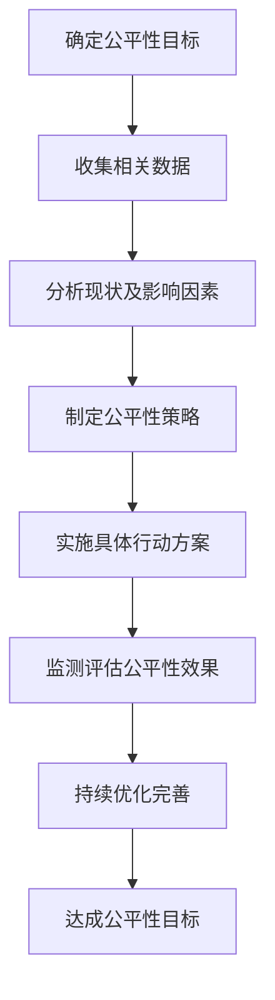

# 哲学思辨：公平性的本质与价值

## 1. 背景介绍

### 1.1 公平性的重要性

公平性是人类社会的基石,是维系社会秩序、促进和谐发展的关键因素。它体现了人与人之间的基本尊重,彰显了每个个体的价值和尊严。在法律、教育、就业、社会保障等各个领域,公平性都扮演着至关重要的角色。

一个缺乏公平性的社会,必然导致矛盾加剧、冲突不断、发展停滞。相反,一个注重公平正义的社会,才能实现持续发展,让每个个体都有机会施展才能、追求幸福生活。

### 1.2 公平性的挑战

然而,在现实中,实现绝对公平是一个巨大的挑战。不同群体的历史文化背景、经济地位、教育水平等因素的差异,导致了对公平性的不同理解和诉求。同时,人性的复杂性、利益的多元化,也使得公平性的实现变得异常艰难。

此外,技术的发展也给公平性带来了新的挑战。人工智能、大数据等新兴技术,虽然在提高效率、优化资源配置等方面发挥了重要作用,但也可能加剧不公平,甚至产生新的歧视形式。

因此,探讨公平性的本质,厘清公平性的内涵外延,对于构建更加公正合理的社会秩序至关重要。

## 2. 核心概念与联系

### 2.1 公平性的内涵

公平性的核心内涵包括:

1. **平等原则**:即在同等条件下,每个个体都应获得平等的对待,不受任何非理性因素的歧视。
2. **机会均等**:每个个体都应当拥有平等的机会,能够根据自身的努力和能力获得应得的回报。
3. **正义**:公平性蕴含着对正义的追求,即按照一定的价值标准对待每个个体,实现利益的合理分配。
4. **尊重**:公平性要求尊重每个个体的人格尊严,尊重个体的独特性和差异性。

### 2.2 相关概念辨析

公平性与其他一些相关概念有着密切联系,但也有区别:

1. **平等**:平等强调对待的"同等",而公平性更注重"合理性"。
2. **正义**:正义是公平性的高阶体现,但公平性也可能存在于非正义场景。
3. **自由**:自由是实现公平的前提条件,但过度的自由也可能导致不公。
4. **效率**:有时为了提高效率,不得不在一定程度上牺牲公平性。

### 2.3 公平性的基本原理

实现公平性需要遵循以下几个基本原理:

1. **程序公正原则**:决策和分配过程本身就应当是公平的。
2. **结果中立原则**:关注结果的公平性,而非过程的细节。
3. **机会均等原则**:为所有个体提供平等的起点和机会。
4. **按需分配原则**:根据个体的实际需求进行合理分配。
5. **功过相当原则**:回报与贡献成正比,过失与惩罚相当。

## 3. 核心算法原理具体操作步骤

公平性的实现需要一套科学、系统的方法论,这里给出一种通用的算法流程:



1. **确定公平性目标**:明确在特定场景下需要实现的公平性目标,如机会均等、结果公平等。
2. **收集相关数据**:全面收集影响公平性的各种数据,包括个体特征、历史数据、环境因素等。
3. **分析现状及影响因素**:运用数据分析、统计学等方法,分析当前公平性状况及影响因素。
4. **制定公平性策略**:根据分析结果,制定切实可行的公平性策略,明确实施路径。
5. **实施具体行动方案**:将策略落实为具体的行动方案,并有序实施。
6. **监测评估公平性效果**:持续监测实施效果,评估是否达成公平性目标。
7. **持续优化完善**:根据监测评估结果,对策略和行动方案进行优化调整。
8. **达成公平性目标**:经过不断努力,最终实现既定的公平性目标。

## 4. 数学模型和公式详细讲解举例说明

在评估和实现公平性时,我们常常需要借助数学模型和公式,以量化和优化公平性水平。下面介绍几种常用的公平性度量模型:

### 4.1 机会均等模型

机会均等模型关注的是不同群体获得某种"机会"(如就业、入学等)的概率是否相等。常用的度量方法是**群体机会分数**(Group Opportunity Score)$GOS$:

$$GOS = \frac{实际获得机会的群体比例}{该群体在总体中的比例}$$

当$GOS=1$时,表示该群体获得机会的概率与其在总体中的比例相当,即实现了机会均等。$GOS>1$表示获得机会的概率过高,反之则过低。

例如,在一项录取中,A群体在总体中占20%,但录取人数中A群体占40%,则A群体的$GOS=\frac{40\%}{20\%}=2$,说明A群体获得录取机会的概率过高。

### 4.2 离散型公平性指数

离散型公平性指数(Disparate Impact)常用于评估选拔过程(如招聘、录取等)中的潜在歧视程度。它计算两个群体在"通过"概率上的比值:

$$DI = \frac{较小群体的通过率}{较大群体的通过率}$$

根据美国平等就业委员会的指导,如果$DI<0.8$,则存在严重的潜在歧视;如果$0.8\leq DI<1$,则存在中度潜在歧视。

例如,在一场招聘中,A群体的通过率为30%,B群体为40%,则$DI=\frac{30\%}{40\%}=0.75<0.8$,说明存在严重的潜在歧视问题。

### 4.3 连续型公平性指数

对于连续型数据(如工资、分数等),我们可以使用**标准化指数**(Normalized Index)来衡量公平性:

$$NI = \frac{实际值-最小值}{最大值-最小值}$$

其中,最大值和最小值分别为该指标在所有群体中的最大值和最小值。$NI$越接近1,说明该群体的分数越高;越接近0,则越低。

如果不同群体的$NI$存在较大差异,则说明存在潜在的不公平情况。我们可以进一步计算**公平性损失**(Fairness Loss):

$$FL = \sum_{i=1}^{n}w_i(NI_i-\overline{NI})^2$$

其中,$w_i$为第$i$个群体的权重,$NI_i$为该群体的标准化指数,$\overline{NI}$为所有群体的平均标准化指数。$FL$值越小,说明公平性水平越高。

以上仅是公平性度量的一些常见模型,在实际应用中,还需要结合具体场景选择合适的模型,并充分考虑模型的局限性,防止放大或遗漏某些不公平因素。

## 5. 项目实践:代码实例和详细解释说明

下面通过一个简单的代码实例,演示如何评估和优化公平性水平。假设有一个贷款申请审批系统,我们需要确保不同性别、种族的申请人获得批准的概率是相等的。

```python
import pandas as pd
from aif360.datasets import BinaryLabelDataset
from aif360.metrics import ClassificationMetricDataset, utils

# 加载示例数据集
dataset = BinaryLabelDataset(df=pd.read_csv('data/compas-scores-two-years.csv'),
                             label_names=['is_recid'],
                             protected_attribute_names=['race', 'sex'])

# 计算各群体的获批概率
metrics = ClassificationMetricDataset(dataset, dataset.unprivileged_groups,
                                      dataset.privileged_groups)

# 输出各群体的群体机会分数
for group in dataset.privileged_groups:
    print(f"Group: {group.value}")
    print(f"Group Opportunity Score: {utils.compute_group_opportunity_score(metrics, group)}")

# 计算离散型公平性指数
disparity_index = utils.compute_disparate_impact(metrics)
print(f"Disparate Impact: {disparity_index}")
```

上述代码使用了 `aif360` 这个流行的公平性评估工具包。

1. 首先加载了一个示例数据集 `compas-scores-two-years.csv`。
2. 通过 `ClassificationMetricDataset` 计算了不同性别和种族群体在获得批准的概率。
3. 使用 `compute_group_opportunity_score` 计算了每个群体的群体机会分数 `GOS`。
4. 使用 `compute_disparate_impact` 计算了离散型公平性指数 `DI`。

如果发现某些群体的 `GOS` 偏离1,或者 `DI` 过低,则说明存在潜在的不公平情况。此时,我们可以对模型进行调整,例如:

- 增加训练数据的多样性,减少数据中的偏差。
- 在模型中引入公平性正则化项,惩罚不公平的预测结果。
- 采用预测后处理技术,对模型输出进行修正,提高公平性。

通过不断迭代优化,直至各项公平性指标达到可接受的水平。

## 6. 实际应用场景

公平性在现实生活中有着广泛的应用场景,例如:

1. **法律领域**:确保法律的制定和执行过程中坚持公平正义,消除一切形式的歧视。
2. **教育领域**:为每个学生提供均等的受教育机会,根据学生的实际需求提供相应的教育资源。
3. **就业领域**:在招聘、晋升、薪酬等方面,杜绝基于种族、性别、年龄等非理性因素的歧视。
4. **社会保障**:公平分配社会资源,让每个公民都能获得基本的生活保障。
5. **人工智能**:消除算法决策中的潜在偏见,避免人工智能系统加剧不公平现象。

以人工智能为例,公平性已经成为该领域的重点研究方向。很多知名科技公司都在开发各种公平性评估和优化工具,以确保其人工智能产品和服务的公平性。

## 7. 工具和资源推荐

对于希望深入研究和实践公平性的读者,这里推荐一些有用的工具和资源:

1. **Python 工具包**:
   - `aif360`: 由 IBM 开发的开源工具包,提供了多种公平性指标和算法。
   - `Fairlearn`: Microsoft 开发的公平性工具包,支持多种任务和评估方法。
   - `FairML`: 来自加州大学的工具包,侧重于机器学习模型的公平性。

2. **在线课程**:
   - 哈佛大学的《公平机器学习》(Fair Machine Learning)
   - 斯坦福大学的《算法公平性》(Algorithmic Fairness)

3. **学术会议**:
   - FAccT: 公平性、问责制和透明度领域顶级会议
   - AIES: 人工智能伦理与社会影响领域权威会议

4. **政府指南**:
   - 欧盟《人工智能伦理准则》
   - 美国《机器学习系统公平性指南》

通过利用这些工具和资源,我们可以更好地理解和实践公平性,为构建更加公正合理的社会贡献自己的力量。

## 8. 总结:未来发展趋势与挑战

公平性将是未来社会发展的重中之重。随着技术的不断进步,公平性问题也将变得更加复杂。我们需要在以下几个方面继续努力:

1. **理论基础**:加强对公平性本质的深入探讨,建立更加完备的公平性理论体系。
2. **量化方法**:发展更精确、更全面的公平性评估模型,准确度量不同场景下的公平