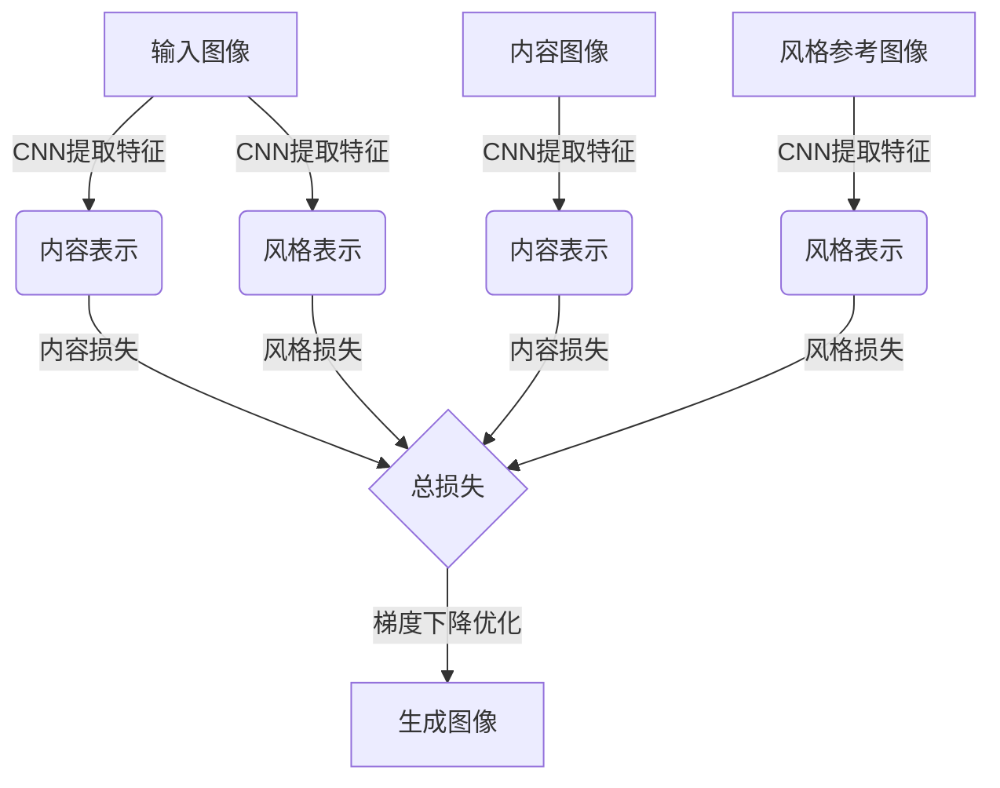

# 图像风格迁移(Style Transfer)原理与代码实战案例讲解

## 1.背景介绍

### 1.1 什么是图像风格迁移？

图像风格迁移(Style Transfer)是一种将一种图像的视觉风格迁移到另一种图像上的技术。简单来说,它可以将一幅内容图像(如风景照片)与一幅风格参考图像(如梵高的画作)相结合,生成一幅保留了内容图像内容的同时具有风格参考图像风格特征的新图像。

### 1.2 图像风格迁移的应用

图像风格迁移技术在多个领域都有广泛应用,例如:

- 艺术创作: 艺术家可以借助该技术快速创作出具有独特风格的艺术作品。
- 图像/视频编辑: 可以为图像或视频添加特殊的视觉效果和艺术风格。
- 广告/营销: 为产品图像添加独特的视觉效果,增强吸引力。
- 摄影后期处理: 摄影师可对照片进行风格化处理,营造出独特的视觉体验。

### 1.3 发展历程

图像风格迁移技术最早可追溯到2015年,Leon A. Gatys等人发表了题为"A Neural Algorithm of Artistic Style"的论文,提出了基于卷积神经网络(CNN)实现图像风格迁移的方法。此后,该领域出现了多种改进算法,效果也不断提升。

## 2.核心概念与联系

### 2.1 卷积神经网络

卷积神经网络(Convolutional Neural Network, CNN)是一种常用于图像识别和处理任务的深度学习模型。CNN由多个卷积层、池化层和全连接层组成,具有局部连接、权值共享等特点,能够自动学习图像的低级特征(如边缘、纹理等)和高级语义特征。

### 2.2 图像内容表示与风格表示

在图像风格迁移中,需要将图像分解为内容表示和风格表示两个部分:

- 内容表示(Content Representation): 描述了图像的内容和语义信息,即"图像是什么"。通常使用CNN中较深层的特征图来表示。
- 风格表示(Style Representation): 描述了图像的纹理、颜色分布等风格信息,即"图像长什么样"。通常使用CNN中较浅层的特征图来表示。

### 2.3 损失函数

图像风格迁移的目标是生成一幅新图像,使其内容接近于内容图像,风格接近于风格参考图像。这通过最小化内容损失(Content Loss)和风格损失(Style Loss)两个损失函数来实现:

- 内容损失: 衡量生成图像与内容图像的内容表示之间的差异。
- 风格损失: 衡量生成图像与风格参考图像的风格表示之间的差异。

通过梯度下降等优化算法,可以找到一个输入图像,使总损失函数最小化,从而生成所需的风格迁移图像。



## 3.核心算法原理具体操作步骤

图像风格迁移算法的核心步骤如下:

1. **准备输入数据**
   - 内容图像(Content Image): 需要保留内容的输入图像。
   - 风格参考图像(Style Image): 提供所需风格特征的参考图像。
   - 输入噪声图像(Input Noise Image): 作为优化的初始值,通常使用高斯噪声图像。

2. **提取图像特征**
   - 使用预训练的CNN模型(如VGG19)分别提取内容图像、风格参考图像和输入噪声图像的内容表示和风格表示。

3. **计算损失函数**
   - 内容损失: 通过计算输入噪声图像与内容图像的内容表示之间的均方差,得到内容损失。
   - 风格损失: 通过计算输入噪声图像与风格参考图像的风格表示之间的格拉姆矩阵(Gram Matrix)差异,得到风格损失。
   - 总损失 = 内容损失 * 内容权重 + 风格损失 * 风格权重

4. **优化输入噪声图像**
   - 使用梯度下降等优化算法,不断调整输入噪声图像的像素值,使总损失函数最小化。
   - 在每一次迭代中,计算总损失相对于输入噪声图像的梯度,并按照梯度的反方向更新输入噪声图像。

5. **生成风格迁移图像**
   - 经过足够多次迭代后,输入噪声图像将逐渐转变为具有所需内容和风格特征的风格迁移图像。

需要注意的是,上述算法涉及到一些超参数的设置,如内容损失权重、风格损失权重、内容层选择、风格层选择等,这些参数的选择会影响最终的风格迁移效果。

## 4.数学模型和公式详细讲解举例说明

### 4.1 内容损失

内容损失衡量生成图像与内容图像在内容表示上的差异,通常使用均方误差(Mean Squared Error, MSE)来计算:

$$J_\text{content}(G) = \frac{1}{2} \sum_{i,j} (F_{ij}^\text{content}(G) - P_{ij}^\text{content})^2$$

其中:
- $G$是生成图像
- $F_{ij}^\text{content}(G)$是生成图像$G$在内容层上的特征图
- $P_{ij}^\text{content}$是内容图像在内容层上的特征图
- 求和是对特征图的所有元素进行的

例如,假设内容图像是一张风景照片,生成图像的内容表示应该尽可能接近风景照片的内容表示,从而保留了原始内容。

### 4.2 风格损失

风格损失衡量生成图像与风格参考图像在风格表示上的差异,通常使用格拉姆矩阵(Gram Matrix)来计算:

$$G_{ij}^\text{style} = \sum_k F_{ik}^\text{style} F_{jk}^\text{style}$$

其中:
- $G_{ij}^\text{style}$是风格参考图像在某一风格层上的格拉姆矩阵
- $F_{ik}^\text{style}$是风格参考图像在该风格层上的特征图
- 求和是对特征图的所有位置$k$进行的

格拉姆矩阵能够捕捉风格参考图像中不同特征之间的相关性,从而表征图像的风格信息。

风格损失则是生成图像与风格参考图像的格拉姆矩阵之间的均方误差:

$$J_\text{style}(G) = \frac{1}{4n_ln_m} \sum_{l=1}^{n_l} w_l \sum_{i,j} (G_{ij}^\text{style}(G) - A_{ij}^\text{style})^2$$

其中:
- $G$是生成图像
- $G_{ij}^\text{style}(G)$是生成图像$G$在某一风格层上的格拉姆矩阵
- $A_{ij}^\text{style}$是风格参考图像在该风格层上的格拉姆矩阵
- $n_l$是风格层的数量
- $w_l$是每一风格层的权重
- 求和是对所有风格层和格拉姆矩阵元素进行的

通过最小化风格损失,可以使生成图像具有与风格参考图像相似的纹理、颜色分布等风格特征。

### 4.3 总损失函数

最终的总损失函数是内容损失和风格损失的加权和:

$$J_\text{total}(G) = \alpha J_\text{content}(G) + \beta J_\text{style}(G)$$

其中:
- $\alpha$是内容损失权重
- $\beta$是风格损失权重

通过调整$\alpha$和$\beta$的值,可以控制生成图像中内容和风格的相对重要性。

## 5.项目实践: 代码实例和详细解释说明

以下是一个使用PyTorch实现图像风格迁移的代码示例,并对关键步骤进行了详细解释:

```python
import torch
import torch.nn as nn
import torch.optim as optim
from torchvision import transforms, models

# 加载预训练的VGG19模型
vgg = models.vgg19(pretrained=True).features

# 定义内容层和风格层
content_layers = ['conv_4'] 
style_layers = ['conv_1', 'conv_2', 'conv_3', 'conv_4', 'conv_5']

# 获取内容图像和风格参考图像
content_img = ...
style_img = ...

# 定义图像预处理
preprocess = transforms.Compose([
    transforms.ToTensor(),
    transforms.Normalize(mean=[0.485, 0.456, 0.406], std=[0.229, 0.224, 0.225])
])

# 预处理输入图像
content_img = preprocess(content_img)
style_img = preprocess(style_img)

# 初始化输入噪声图像
input_img = torch.randn(content_img.size()).requires_grad_(True)

# 定义超参数
content_weight = 1
style_weight = 1e6
steps = 300

# 计算内容表示和风格表示
def get_features(image, model):
    ...

content_features = get_features(content_img, vgg)
style_features = get_features(style_img, vgg)

# 计算内容损失和风格损失
def content_loss(gen_img, content_img, content_features):
    ...

def style_loss(gen_img, style_features):
    ...

# 优化输入噪声图像
optimizer = optim.LBFGS([input_img.requires_grad_()])
for step in range(steps):
    def closure():
        ...
    optimizer.step(closure)

# 保存生成的风格迁移图像
output_img = input_img.clone().detach().squeeze().permute(1, 2, 0)
...
```

以上代码的关键步骤解释如下:

1. **加载预训练的VGG19模型**
   - 使用PyTorch提供的预训练VGG19模型,用于提取图像的内容表示和风格表示。

2. **定义内容层和风格层**
   - 根据实践经验,选择VGG19网络中的某些层作为内容层和风格层。

3. **准备输入数据**
   - 加载内容图像和风格参考图像,并进行预处理(归一化等)。
   - 初始化一个高斯噪声图像作为优化的起点。

4. **定义损失函数**
   - 实现内容损失和风格损失的计算函数,与前面的数学公式相对应。

5. **优化输入噪声图像**
   - 使用PyTorch的优化器(如LBFGS),通过梯度下降法不断调整输入噪声图像,使总损失函数最小化。
   - 在每一次迭代中,计算总损失相对于输入噪声图像的梯度,并按照梯度的反方向更新输入噪声图像。

6. **生成风格迁移图像**
   - 经过足够多次迭代后,输入噪声图像将转变为具有所需内容和风格特征的风格迁移图像。
   - 对生成的图像进行后处理(如反归一化),并保存到文件中。

需要注意的是,上述代码只是一个简化版本,实际应用中可能需要进行一些额外的处理和优化,如图像大小调整、GPU加速等。此外,还可以尝试使用其他预训练模型(如VGG16、ResNet等)或自定义损失函数,以获得更好的风格迁移效果。

## 6.实际应用场景

图像风格迁移技术在多个领域都有广泛的应用,以下是一些典型的应用场景:

### 6.1 艺术创作

艺术家可以利用图像风格迁移技术快速创作出具有独特风格的艺术作品。例如,将一幅风景照片与梵高的画作风格相结合,生成一幅具有印象派风格的新作品。这不仅可以提高艺术家的创作效率,还能激发他们的创造力。

### 6.2 图像/视频编辑

图像风格迁移可以为图像或视频添加特殊的视觉效果和艺术风格,使其更加生动、富{"msg_type":"generate_answer_finish","data":"","from_module":null,"from_unit":null}