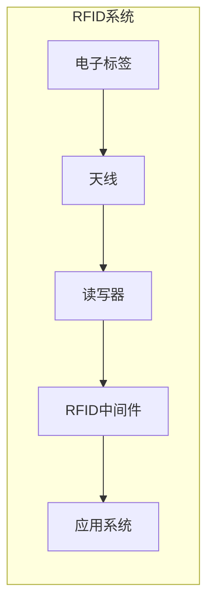
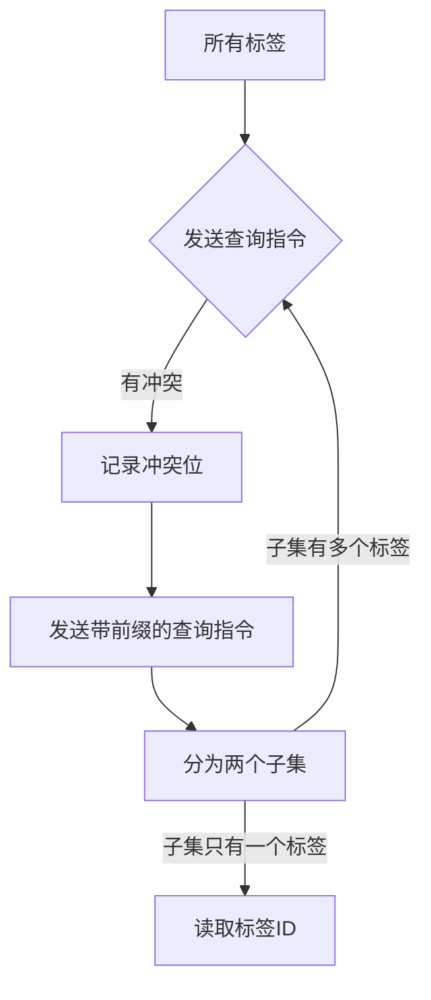

以下是基于RFID的病房区门禁系统的技术博客文章正文:

# 基于RFID的病房区门禁系统

## 1.背景介绍

### 1.1 医院安全问题

医院作为一个特殊的场所,安全问题一直是需要重点关注的。病人的隐私以及贵重医疗设备的保护,都需要合理的访问控制措施。传统的门禁方式如钥匙、门卡等存在一些缺陷,比如钥匙易被复制、门卡易被遗失等,给医院的安全防护带来隐患。

### 1.2 RFID技术概述  

RFID(Radio Frequency Identification,射频识别)是一种非接触式的自动识别技术。它通过射频信号自动识别目标对象,并获取相关数据,广泛应用于物流、资产管理、门禁控制等领域。RFID系统主要由读写器、天线和电子标签三部分组成。

### 1.3 RFID在医院应用的优势

RFID技术具有自动识别、数据读写、防伪和远程操作等优点,非常适合应用于医院的门禁控制系统中。与其他门禁方式相比,基于RFID的门禁系统具有以下优势:

- 自动识别,无需人工介入
- 数据读写方便,可记录访问日志
- 防伪性强,电子标签难以被复制
- 远程读写,识别距离较远
- 使用寿命长,标签使用年限长

## 2.核心概念与联系

### 2.1 RFID系统组成

一个完整的RFID系统通常包括以下几个核心组件:

- 电子标签(Tag)
- 读写器(Reader)
- 天线(Antenna)
- RFID中间件
- 应用系统



### 2.2 RFID工作原理

RFID系统的工作原理是基于射频信号的耦合原理。读写器通过天线发射能量信号,当电子标签进入有效范围时,标签芯片被激活并从能量信号中获取所需的工作能量。标签再将存储的数据通过天线以无线方式回传给读写器。读写器接收到标签信息后,经过解码处理,再传递给中间件进行数据交换和处理。

### 2.3 RFID在门禁系统中的应用

在医院门禁系统中,RFID技术可以这样应用:

- 医护人员和患者佩戴RFID电子标签
- 在需要门禁控制的区域安装RFID读写器
- 读写器识别合法标签后,自动开启门禁
- 同时将访问记录发送给门禁管理系统

通过这种方式,医院可以实现自动化、高效、安全的门禁管理。

## 3.核心算法原理具体操作步骤

### 3.1 RFID防冲突算法

在RFID系统中,当多个标签同时进入读写器的工作区域时,可能会发生标签之间的冲突,导致读写器无法正确识别标签。为解决这个问题,需要使用防冲突算法。

RFID防冲突算法主要有以下几种:

1. **ALOHA算法**
2. **二进制树遍历算法**
3. **查询树算法**

其中,查询树算法是目前使用较多的防冲突算法,具有较高的读取效率。

#### 3.1.1 查询树算法原理

查询树算法的核心思想是将标签的ID视为一个节点,按照特定的规则构建一个前缀树。读写器通过查询前缀,将工作区域内的标签分为多个子集,然后逐个读取每个子集中的标签。

具体操作步骤如下:

1. 读写器发送查询指令,所有空闲标签响应
2. 读写器接收标签响应,记录冲突位
3. 读写器发送带有前缀的查询指令,将标签分为两个子集
4. 重复步骤2和3,直到每个子集只有一个标签
5. 读写器读取剩余标签的ID



通过这种分治的方式,查询树算法可以高效地解决RFID系统中的标签冲突问题。

### 3.2 RFID标签防冲撞算法

在RFID门禁系统中,防止非法标签进入也是一个重要问题。为此,需要使用标签防冲撞算法来验证标签的合法性。

常见的RFID标签防冲撞算法包括:

1. **密码验证算法**
2. **哈希锁存算法**
3. **轻量级认证协议**

这些算法的基本思路是:标签存储密钥或哈希值,读写器根据事先约定的算法对标签进行认证,防止非法标签的访问。

#### 3.2.1 轻量级认证协议

轻量级认证协议(Lightweight Authentication Protocol)是一种常用的RFID标签防冲撞算法,具有较好的安全性和效率。

该协议的核心步骤如下:

1. 标签内置两个密钥:$K_1$和$K_2$
2. 读写器发送随机数$r_1$给标签
3. 标签计算$M_1 = r_1 \oplus K_1$,发送给读写器
4. 读写器验证$M_1$是否合法
5. 读写器发送随机数$r_2$给标签
6. 标签计算$M_2 = r_2 \oplus K_2$,发送给读写器
7. 读写器验证$M_2$是否合法
8. 双方通过认证,建立安全通信

该协议使用异或运算和随机数,具有较高的效率和一定的安全性,适合应用于低成本的RFID系统。

## 4.数学模型和公式详细讲解举例说明

### 4.1 RFID射频链路模型

RFID系统的射频链路是标签和读写器之间进行无线通信的基础,对系统的性能有重要影响。射频链路的数学模型可以用下面的链路方程来描述:

$$
P_r = P_t \cdot G_t \cdot G_r \cdot \left(\frac{\lambda}{4\pi R}\right)^2
$$

其中:
- $P_r$是读写器接收到的功率
- $P_t$是读写器发射功率
- $G_t$是读写器天线增益
- $G_r$是标签天线增益
- $\lambda$是工作波长
- $R$是读写器和标签之间的距离

根据链路方程,我们可以分析影响读写距离的主要因素:发射功率、天线增益和工作频率。通过优化这些参数,可以提高RFID系统的读写性能。

### 4.2 RFID防冲突概率模型

在使用ALOHA防冲突算法时,我们可以建立数学模型来估算标签冲突的概率。假设有$N$个标签,每个标签在时隙$T$内以概率$p$发送数据,则在一个时隙内有且只有一个标签发送数据的概率为:

$$
P_s = Np(1-p)^{N-1}
$$

如果我们希望$P_s$达到最大值,可以对$p$求导得到:

$$
p = \frac{1}{N}
$$

将$p$代入$P_s$可得:

$$
P_s = \frac{N}{N^N}(1-\frac{1}{N})^{N-1} \approx \frac{1}{e}
$$

也就是说,当每个标签以$\frac{1}{N}$的概率发送数据时,成功的概率约为$\frac{1}{e} \approx 0.368$。这为我们优化防冲突算法提供了理论依据。

## 5.项目实践:代码实例和详细解释说明

下面是一个基于Python的RFID门禁系统示例代码,使用了RFID-py库。

### 5.1 初始化RFID读写器

```python
import rfid

# 创建RFID读写器对象
reader = rfid.ReaderThread()

# 设置读写器连接参数
reader.connectToReader("tmr:///dev/ttyUSB0")

# 开启读写器
reader.start()
```

上述代码导入了rfid库,创建了ReaderThread对象作为RFID读写器,并连接到指定的串口设备。最后启动读写器线程。

### 5.2 读取RFID标签

```python
# 读取标签ID
tags = reader.getTagsInRange()

for tag in tags:
    print(f"Tag ID: {tag.epc}")
    
    # 验证标签合法性
    if tag.epc in authorized_tags:
        print("Access granted")
        # 执行门禁开启操作
    else:
        print("Access denied")
```

getTagsInRange()方法获取读写器范围内的所有标签对象。然后遍历每个标签,打印其ID。如果标签ID在授权列表中,则认为合法,执行门禁开启操作;否则拒绝访问。

### 5.3 写入RFID标签

```python
# 写入标签数据
tag = tags[0]
tag.writeData(0x01, b"Hello World")

# 读取标签数据
data = tag.readData(0x01)
print(data)
```

writeeData()方法可以向标签的指定存储区写入数据,readData()则从指定区域读取数据。上述代码向第一个标签写入"Hello World"字符串,然后读取并打印出来。

通过这些代码示例,我们可以看到如何使用Python对RFID读写器和标签进行操作,实现门禁系统的基本功能。

## 6.实际应用场景

基于RFID的门禁系统在医院有广泛的应用场景,主要包括:

### 6.1 病房区域门禁

通过为医护人员和患者佩戴RFID手环或卡片,可以实现对病房区域的出入控制。只有授权人员才能进入,从而保护患者的隐私和安全。

### 6.2 药品管理

将RFID标签贴附在药品包装上,可以对药品库存、流转过程进行自动化跟踪。这有助于防止药品失窃、过期等问题,提高药品管理的效率和安全性。

### 6.3 医疗设备管理

贵重医疗设备也可以使用RFID技术进行标识和管理。通过读写器监控设备的位置和使用情况,可以防止设备被盗窃或误用。

### 6.4 手术室门禁

手术室是医院中安全要求最高的区域之一。使用RFID门禁系统可以严格控制进出人员,确保手术安全。

### 6.5 婴儿防丢系统

给新生儿佩戴RFID手环,并在医院出口处设置读写器,一旦有未经授权的婴儿试图被带出医院,就会触发警报,防止婴儿被盗窃。

## 7.工具和资源推荐

在开发和部署RFID门禁系统时,可以使用以下工具和资源:

### 7.1 RFID开发工具包

- RFID-py (Python库)
- RFID-Tools (Java库)
- MFRC522 (Arduino RFID模块)

这些工具包提供了对RFID读写器和标签的操作接口,可以加快开发进度。

### 7.2 RFID硬件

- Impinj Speedway读写器
- Alien ALR-9900读写器
- NXP MFRC522读写器芯片
- 各种RFID标签(卡片、手环等)

选择合适的RFID硬件对系统的性能和成本都有重要影响。

### 7.3 在线资源

- RFID官方标准文档
- RFID技术论坛
- RFID相关博客和教程
- RFID供应商技术支持

利用这些在线资源,可以获取最新的技术信息和解决方案。

## 8.总结:未来发展趋势与挑战

### 8.1 发展趋势

RFID技术在未来将会有以下发展趋势:

1. **集成化**:RFID芯片将会越来越小型化,并集成到各种物品中。
2. **智能化**:RFID标签将具备更多的计算和存储能力,可执行简单的指令。
3. **物联网融合