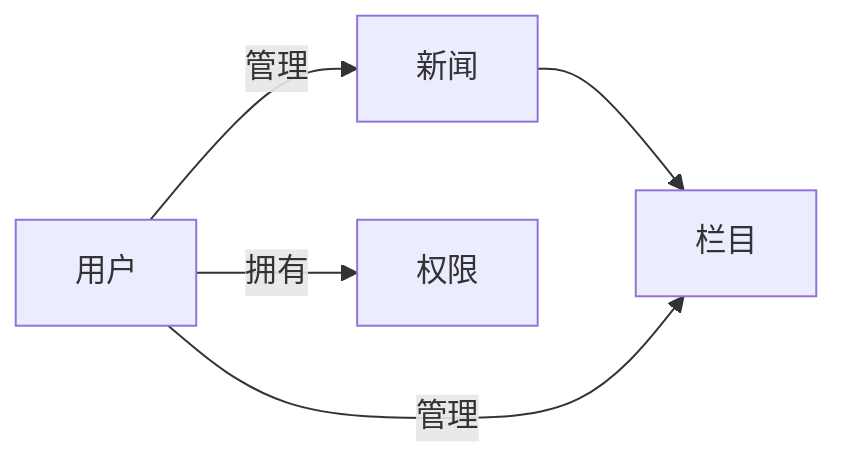

# 基于WEB的新闻管理系统详细设计与具体代码实现

## 1. 背景介绍

在当今信息时代,新闻已成为人们获取信息、了解世界的重要渠道之一。传统的新闻管理方式已无法满足快速变化的信息传播需求,因此开发一个高效、便捷的新闻管理系统显得尤为重要。本文将详细阐述基于WEB的新闻管理系统的设计与实现,为新闻行业的信息化建设提供参考。

### 1.1 新闻管理系统的必要性

- 传统新闻管理方式效率低下
- 信息时代对新闻传播提出更高要求  
- 新闻管理系统可提高新闻生产效率

### 1.2 基于WEB的新闻管理系统优势

- 跨平台、易访问
- 部署灵活、维护成本低
- 功能丰富、可扩展性强

### 1.3 新闻管理系统的主要功能

- 新闻采编与发布
- 新闻分类与检索  
- 用户权限管理
- 新闻统计与分析

## 2. 核心概念与联系

在设计新闻管理系统时,需要理解以下几个核心概念:

### 2.1 新闻(News)

新闻是系统的核心对象,包含标题、正文、作者、发布时间等属性。不同类型的新闻(如文字新闻、图片新闻、视频新闻等)可能包含不同的附加属性。

### 2.2 栏目(Column)

栏目是对新闻进行分类的重要依据,一般按照新闻主题(如时政、经济、娱乐等)设置。每个新闻都需要归属于特定栏目。

### 2.3 用户(User)  

用户是系统的使用主体,可分为管理员、编辑、记者等不同角色,拥有不同的权限。用户通过账号密码登录系统。

### 2.4 权限(Permission)

权限是对用户能够执行的操作的控制,如新闻的添加、修改、删除、发布等。不同角色的用户拥有不同的权限。

以下是这些核心概念之间的关系图:



## 3. 核心算法原理与具体操作步骤

新闻管理系统涉及的核心算法主要包括:

### 3.1 新闻检索算法

新闻检索是系统的重要功能之一,常用的检索算法包括:

- 顺序查找:逐条对比,适用于数据量较小的情况。
- 二分查找:先排序,再折半查找,适用于静态数据。
- 索引查找:为关键词建立索引,提高检索效率。

以下是二分查找的具体步骤:

1. 将新闻按关键字排序
2. 将查找范围的中间记录作为比较对象
3. 若给定值与中间记录的关键字相等,则查找成功
4. 若给定值小于中间记录的关键字,则在前半部分继续查找  
5. 若给定值大于中间记录的关键字,则在后半部分继续查找
6. 重复步骤2~5,直到找到或查找范围为空

### 3.2 用户密码加密算法

为保证用户信息安全,密码需要进行加密存储,常用的加密算法有:

- MD5:将任意长度的信息转换为128位的散列值,不可逆。
- SHA-1:生成160位的散列值,安全性高于MD5。
- PBKDF2:基于密码的密钥派生函数,可设置迭代次数。

以下是PBKDF2的算法步骤:

1. 选择伪随机函数PRF,如HMAC-SHA256
2. 设置盐值Salt和迭代次数c 
3. 将密码和盐值进行PRF运算,得到中间值U1
4. 将中间值再次进行PRF运算,得到U2
5. 重复步骤4 c次,得到最终密钥
6. 将盐值和迭代次数与密文一同存储

## 4. 数学模型和公式详细讲解举例说明

在新闻管理系统中,可利用数学模型对新闻进行自动分类和推荐。以下是几种常用的模型:

### 4.1 TF-IDF模型

TF-IDF(Term Frequency–Inverse Document Frequency)是一种用于评估词语在文档中重要性的统计方法。其中TF表示词频,IDF表示逆文档频率。

- 词频TF(t,d)表示词语t在文档d中出现的频率:

$TF(t,d) = \frac{n_{t,d}}{\sum_k n_{k,d}}$

其中$n_{t,d}$为t在d中出现的次数,$\sum_k n_{k,d}$为d中所有词语出现的次数之和。

- 逆文档频率IDF(t,D)表示包含词语t的文档数与总文档数的比值的对数:

$IDF(t,D) = \log \frac{|D|}{|\{d \in D: t \in d\}|}$

其中|D|为语料库中文档总数,$|\{d \in D: t \in d\}|$为包含t的文档数。

将TF和IDF相乘,即得到TF-IDF值:

$TFIDF(t,d,D) = TF(t,d) \times IDF(t, D)$

TF-IDF值越高,表示词语t对文档d的重要性越高。利用各词语的TF-IDF值,可将新闻表示为向量,进而进行分类。

### 4.2 朴素贝叶斯模型

朴素贝叶斯是一种基于贝叶斯定理的分类方法,其核心思想是:已知文档属性,求文档属于某类别的概率。

设x为文档的属性向量,C为类别,则文档d属于类别C的概率为:

$P(C|x) = \frac{P(x|C)P(C)}{P(x)}$

其中P(C)为类别C的先验概率,P(x|C)为类别C产生属性x的概率,P(x)为属性x出现的概率。

进一步假设各属性相互独立,则有:

$P(x|C) = \prod_{i=1}^n P(x_i|C)$

其中n为属性数,$x_i$为第i个属性。

最终,新闻d的分类结果为:

$C^* = \arg\max_{C \in Y} P(C) \prod_{i=1}^n P(x_i|C)$

其中Y为所有可能的类别集合。

## 5. 项目实践:代码实例和详细解释说明

以下是使用Python+Django实现新闻管理系统的部分代码:

### 5.1 新闻模型(news/models.py)

```python
from django.db import models

class Column(models.Model):
    """栏目模型"""
    name = models.CharField(max_length=256)
    
    def __str__(self):
        return self.name

class News(models.Model):
    """新闻模型"""
    title = models.CharField(max_length=256) 
    content = models.TextField()
    pub_date = models.DateTimeField(auto_now_add=True)
    update_time = models.DateTimeField(auto_now=True)
    column = models.ForeignKey(Column, on_delete=models.CASCADE)
    author = models.ForeignKey('auth.User', on_delete=models.CASCADE) 
    
    def __str__(self):
        return self.title
```

这里定义了两个模型:栏目(Column)和新闻(News),并设置了它们之间的外键关联。News模型中的author字段关联到Django内置的用户模型。

### 5.2 新闻列表视图(news/views.py)

```python
from django.shortcuts import render
from .models import News

def news_list(request):
    """新闻列表页"""
    news_list = News.objects.all().order_by('-pub_date')
    context = {'news_list': news_list}
    return render(request, 'news/news_list.html', context)
```

这里定义了新闻列表页的视图函数,从数据库中查询所有新闻,按发布时间倒序排列,并渲染模板。

### 5.3 新闻列表模板(templates/news/news_list.html)

```html



<h1>新闻列表</h1>
<ul>
    
    <li>
        <a href="">{{ news.title }}</a>
        <span>{{ news.pub_date|date:'Y-m-d H:i:s' }}</span>
    </li>
    
    <li>暂无新闻</li>
    
</ul>

```

这是新闻列表页的模板,使用了Django模板语言。它继承自基础模板,并在内容块中展示新闻列表。通过``标签遍历新闻,生成链接和发布时间。

## 6. 实际应用场景

新闻管理系统可应用于以下场景:

- 新闻网站:管理海量新闻,提供分类浏览和检索功能。
- 企业官网:发布公司新闻动态,展示企业形象。
- 政府门户:及时发布政策信息,方便群众查阅。
- 个人博客:撰写和管理个人文章,分享见解。

不同场景下,可根据需求调整系统功能和界面设计。

## 7. 工具和资源推荐

开发新闻管理系统可使用以下工具和资源:

- 开发语言:Python、Java、PHP等
- Web框架:Django、Spring Boot、Laravel等
- 数据库:MySQL、PostgreSQL、SQLite等
- 前端框架:Vue.js、React、Angular等
- 富文本编辑器:CKEditor、TinyMCE、UEditor等
- 缓存系统:Redis、Memcached等
- 版本控制:Git、SVN等
- 服务器:Nginx、Apache等

根据项目规模和团队情况,选择合适的技术栈。建议多参考优秀开源项目,站在巨人的肩膀上开发。

## 8. 总结:未来发展趋势与挑战

随着人工智能和大数据技术的发展,新闻管理系统也面临新的机遇和挑战:

- 个性化推荐:利用机器学习算法,为用户推荐感兴趣的新闻。
- 智能写作:自动生成新闻摘要和简单报道,提高编辑效率。
- 假新闻识别:通过自然语言处理技术,甄别虚假和夸大新闻。
- 多媒体融合:集成音频、视频、VR等多种形式,丰富新闻呈现方式。
- 社交化互动:接入社交网络,鼓励用户评论、分享,增强用户粘性。

新闻管理系统需要与时俱进,不断拥抱新技术,以满足用户日益增长的需求。同时也要注重内容质量,坚守新闻专业主义,传播真实、客观、有价值的信息。

## 9. 附录:常见问题与解答

### 9.1 如何提高新闻检索的效率?

可采取以下措施:
- 对新闻标题、正文分词,建立倒排索引
- 使用全文搜索引擎,如Elasticsearch、Solr等
- 设置合理的数据库索引,优化查询语句
- 利用缓存机制,减少数据库查询次数

### 9.2 如何实现新闻的自动分类?

常用的新闻自动分类方法有:
- 基于规则:人工总结分类规则,编写分类脚本
- 机器学习:使用SVM、朴素贝叶斯等算法,训练分类模型
- 深度学习:利用CNN、RNN等神经网络,提取新闻特征

需准备足够的训练数据,不断优化模型和算法。

### 9.3 如何防止新闻管理系统被恶意攻击?

需采取以下安全措施:
- 用户输入验证,防止SQL注入、XSS等攻击
- 用户密码加密存储,定期更新加密算法
- 使用HTTPS协议,保证数据传输安全
- 定期备份数据,制定应急预案
- 限制重要操作的访问权限,及时关闭不必要的端口

网络安全无小事,需开发者提高安全意识,从代码到运维多管齐下。

作者：禅与计算机程序设计艺术 / Zen and the Art of Computer Programming