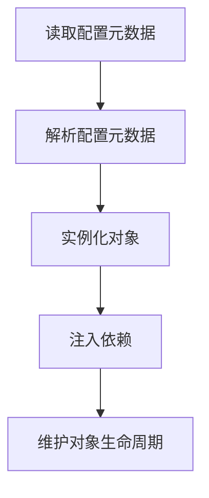
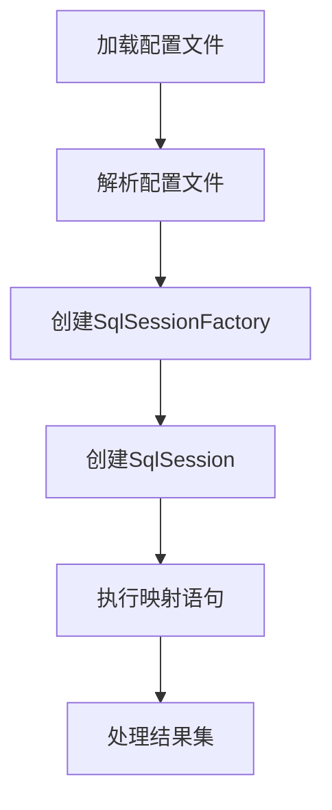
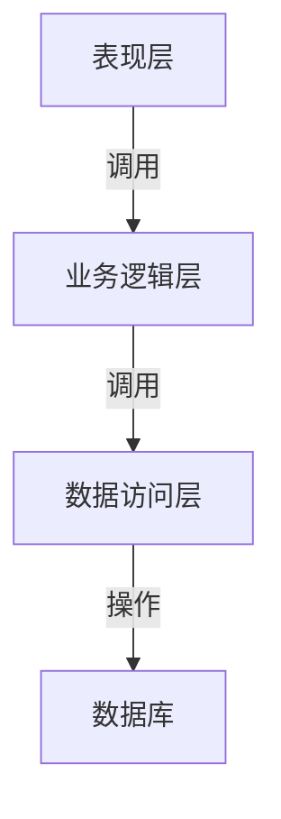

# 基于SSM的在线课程管理系统

## 1.背景介绍

随着互联网技术的不断发展和教育信息化进程的加快,在线课程管理系统应运而生。传统的教学模式已经无法满足现代教育的需求,线上教学成为了一种新的趋势。在线课程管理系统可以实现课程资源共享、师生互动、自主学习等功能,为教师和学生提供了一个高效便捷的教学平台。

基于SSM(Spring、SpringMVC、MyBatis)框架开发的在线课程管理系统,是一种典型的B/S架构应用程序。它将系统功能按照不同的角色进行划分,包括管理员、教师和学生三个角色。系统主要模块有课程管理、资源管理、考试管理、成绩管理等,可以满足在线教学的基本需求。

## 2.核心概念与联系

### 2.1 SSM框架

SSM框架是指Spring+SpringMVC+MyBatis三个开源框架的集合,它们分别负责不同的系统层:

- Spring: 负责系统的整体架构,提供IOC和AOP功能。
- SpringMVC: 负责系统的Web层,实现请求的接收、处理和响应。
- MyBatis: 负责系统的持久层,实现对数据库的操作。

三个框架相互配合,形成了一个高效、灵活的企业级应用开发框架。

### 2.2 B/S架构

B/S(Browser/Server)架构是一种典型的客户机/服务器模式,客户端只需要一个浏览器,服务器端负责处理所有的业务逻辑和数据访问。B/S架构具有跨平台性、易于维护和升级等优点,适合于互联网应用的开发。

### 2.3 三层架构

在线课程管理系统采用经典的三层架构设计,分为表现层(Web层)、业务逻辑层(Service层)和数据访问层(DAO层)。这种架构有利于代码的复用和系统的可维护性。

## 3.核心算法原理具体操作步骤

### 3.1 Spring IOC容器

Spring IOC容器是Spring框架的核心,它负责对象的创建、初始化和装配。Spring IOC容器通过读取配置元数据,使用反射机制实例化对象,并维护对象之间的依赖关系。

IOC容器的具体工作流程如下:



1. 读取配置元数据: Spring IOC容器会读取XML、注解或Java配置类中的配置元数据。
2. 解析配置元数据: 容器会解析配置元数据,识别出需要实例化的对象以及对象之间的依赖关系。
3. 实例化对象: 容器会使用反射机制实例化配置元数据中指定的对象。
4. 注入依赖: 容器会根据配置元数据中的依赖关系,将相关对象注入到已实例化的对象中。
5. 维护对象生命周期: 容器会维护对象的整个生命周期,包括初始化、使用和销毁等阶段。

### 3.2 MyBatis映射机制

MyBatis是一个半自动化的ORM(对象关系映射)框架,它通过XML或注解的方式将Java对象映射到数据库表,实现数据的持久化操作。

MyBatis的映射机制主要包括以下步骤:



1. 加载配置文件: MyBatis会加载mybatis-config.xml配置文件,该文件包含了数据源、映射器等配置信息。
2. 解析配置文件: MyBatis会解析配置文件,构建内部的配置对象。
3. 创建SqlSessionFactory: 根据配置对象,MyBatis会创建SqlSessionFactory对象,用于生成SqlSession对象。
4. 创建SqlSession: 通过SqlSessionFactory创建SqlSession对象,SqlSession是MyBatis的核心接口,用于执行映射语句。
5. 执行映射语句: 通过SqlSession执行映射语句,该语句可以是XML映射文件中定义的SQL语句,也可以是注解方式定义的映射语句。
6. 处理结果集: MyBatis会自动将查询结果集映射为Java对象,或将Java对象映射为SQL语句参数。

## 4.数学模型和公式详细讲解举例说明

在线课程管理系统中,成绩管理模块需要计算学生的平均分、最高分、最低分等统计数据。这里我们介绍一下常用的数学公式:

1. 平均分公式:

$$\overline{x} = \frac{\sum_{i=1}^{n}x_i}{n}$$

其中,$\overline{x}$表示平均分,$x_i$表示第i个学生的分数,n表示学生总数。

2. 最高分公式:

$$x_{max} = max(x_1, x_2, \cdots, x_n)$$

其中,$x_{max}$表示最高分,$(x_1, x_2, \cdots, x_n)$表示所有学生的分数集合。

3. 最低分公式:

$$x_{min} = min(x_1, x_2, \cdots, x_n)$$

其中,$x_{min}$表示最低分,$(x_1, x_2, \cdots, x_n)$表示所有学生的分数集合。

4. 标准差公式:

$$s = \sqrt{\frac{\sum_{i=1}^{n}(x_i - \overline{x})^2}{n-1}}$$

其中,s表示标准差,$x_i$表示第i个学生的分数,$\overline{x}$表示平均分,n表示学生总数。

标准差可以反映数据的离散程度,值越大说明数据越分散。

以上公式在成绩统计和分析中有着广泛的应用,可以帮助教师更好地了解学生的学习情况。

## 5.项目实践:代码实例和详细解释说明

### 5.1 系统架构

在线课程管理系统采用典型的三层架构设计,分为表现层(Web层)、业务逻辑层(Service层)和数据访问层(DAO层)。各层之间通过接口和实现类相互调用,实现了层与层之间的解耦。



- 表现层(Web层): 负责接收用户请求,调用业务逻辑层完成业务处理,并将结果返回给用户。主要由SpringMVC控制器组成。
- 业务逻辑层(Service层): 负责处理系统的业务逻辑,包括课程管理、资源管理、考试管理等模块。由Spring管理的服务类组成。
- 数据访问层(DAO层): 负责与数据库进行交互,执行增删改查操作。由MyBatis映射器组成。

### 5.2 课程管理模块

课程管理模块是系统的核心模块之一,它提供了课程的增删改查功能。下面是课程管理模块的部分代码示例:

#### 5.2.1 CourseController

```java
@Controller
@RequestMapping("/course")
public class CourseController {

    @Autowired
    private CourseService courseService;

    @RequestMapping("/list")
    public String listCourses(Model model) {
        List<Course> courses = courseService.findAllCourses();
        model.addAttribute("courses", courses);
        return "course/list";
    }

    // 其他方法省略
}
```

CourseController是课程管理模块的控制器,它接收用户请求,调用CourseService完成业务逻辑处理,并将结果返回给视图。

#### 5.2.2 CourseService

```java
@Service
public class CourseServiceImpl implements CourseService {

    @Autowired
    private CourseMapper courseMapper;

    @Override
    public List<Course> findAllCourses() {
        return courseMapper.selectAllCourses();
    }

    // 其他方法省略
}
```

CourseService是课程管理模块的服务层,它负责处理业务逻辑,如查询所有课程、添加课程等。它调用CourseMapper完成数据访问操作。

#### 5.2.3 CourseMapper

```xml
<mapper namespace="com.example.mapper.CourseMapper">
    <select id="selectAllCourses" resultType="com.example.entity.Course">
        SELECT * FROM course
    </select>

    <!-- 其他映射语句省略 -->
</mapper>
```

CourseMapper是课程管理模块的数据访问层,它定义了与数据库交互的映射语句。上面的映射语句用于查询所有课程记录。

通过上述代码示例,我们可以看到SSM框架在系统各层之间的协作方式。控制器接收请求,调用服务层处理业务逻辑,服务层调用映射器执行数据库操作。这种分层设计提高了代码的可维护性和可扩展性。

## 6.实际应用场景

在线课程管理系统可以应用于各种教育机构,如学校、培训机构、企业内部培训等场景。它为教师和学生提供了一个高效便捷的教学平台,具有以下优势:

1. 突破时空限制: 教师和学生可以在任何时间、任何地点进行教学和学习,不受地理位置的限制。
2. 资源共享: 系统中的课程资源可以被多个用户共享,避免了重复制作的浪费。
3. 个性化学习: 学生可以根据自己的学习进度和水平选择合适的课程,实现个性化学习。
4. 师生互动: 系统提供了在线答疑、讨论区等功能,促进了师生之间的互动交流。
5. 考试管理: 系统可以自动组织和评阅在线考试,减轻了教师的工作量。
6. 数据统计: 系统可以统计学生的学习情况,包括课程进度、考试成绩等,方便教师掌握学生的学习状态。

在线课程管理系统可以广泛应用于各级各类教育机构,为现代化教学提供有力支持。

## 7.工具和资源推荐

在开发在线课程管理系统时,可以使用以下工具和资源:

1. **开发工具**:
   - IDE: IntelliJ IDEA、Eclipse等集成开发环境
   - 版本控制: Git、SVN等版本控制工具
   - 构建工具: Maven、Gradle等构建工具
   - 数据库: MySQL、Oracle、PostgreSQL等关系型数据库

2. **框架和库**:
   - Spring框架: 提供IOC和AOP功能
   - SpringMVC框架: 实现Web层的请求处理
   - MyBatis框架: 实现对象关系映射和数据持久化
   - Shiro安全框架: 提供认证、授权等安全功能
   - Quartz任务调度框架: 实现定时任务的调度
   - FreeMarker模板引擎: 生成动态HTML页面

3. **在线资源**:
   - Spring官方文档: https://spring.io/projects/spring-framework
   - MyBatis官方文档: https://mybatis.org/mybatis-3/
   - Bootstrap前端框架: https://getbootstrap.com/
   - StackOverflow问答社区: https://stackoverflow.com/

利用上述工具和资源,可以更高效地开发出功能完善、性能优秀的在线课程管理系统。

## 8.总结:未来发展趋势与挑战

在线教育是一种不可逆的发展趋势,在线课程管理系统也将随之不断演进和完善。未来,在线课程管理系统可能会朝着以下方向发展:

1. **人工智能辅助教学**: 利用人工智能技术,如自然语言处理、知识图谱等,实现智能化的课程推荐、自动评分、智能答疑等功能,提高教学效率。

2. **虚拟现实/增强现实技术**: 将VR/AR技术应用于在线课程,为学生提供身临其境的学习体验,如虚拟实验室、场景仿真等。

3. **大数据分析**: 通过对学习行为数据进行分析,发现学习规律,优化教学策略,实现个性化教学。

4. **微课程/慕课**: 将传统课程拆分为多个微课程或慕课(MOOC),满足学习者的碎片化学习需求。

5. **社交化学习**: 融入社交元素,如建立学习社区、分享学习心得等,促进学习者之间的交流和协作。

6. **移动化学习**: 适配移动终端,让学习随时随地进行,提高学习的{"msg_type":"generate_answer_finish","data":"","from_module":null,"from_unit":null}