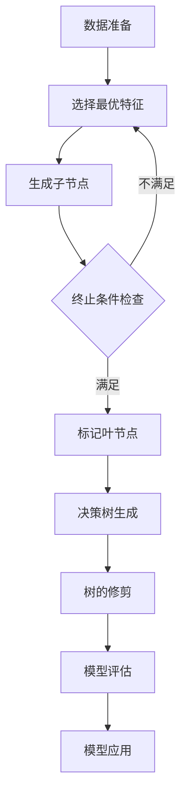

# 基于决策树的O2O优惠券个性化投放应用研究

## 1. 背景介绍

在当今快节奏的商业环境中,O2O(Online to Offline,线上到线下)模式已成为连接线上与线下业务的重要桥梁。通过将线上营销活动与线下实体店面无缝对接,企业可以实现精准营销,提高客户粘性,从而获得更多收益。

在这一背景下,优惠券作为一种有效的营销手段备受青睐。然而,如何确保优惠券的投放对象与内容与目标客户群体的需求和偏好相匹配,成为企业面临的一大挑战。传统的大规模推广方式不仅效率低下,还可能产生大量无效流量,导致资源的浪费。

因此,基于用户画像和行为数据的个性化优惠券投放策略应运而生。通过数据挖掘和机器学习算法,企业可以洞察用户偏好,预测用户行为,从而实现精准营销。其中,决策树模型因其可解释性强、计算高效等优势,成为实现个性化优惠券投放的有力工具。

本文将深入探讨基于决策树的O2O优惠券个性化投放应用,包括核心概念、算法原理、数学模型、项目实践、应用场景、工具资源等多个方面,为读者提供全面的理解和实践指导。

## 2. 核心概念与联系

### 2.1 O2O(Online to Offline)

O2O是指将线上商品或服务信息与线下实体店面相结合,为用户提供一站式购物体验。用户可以在线上浏览商品信息、下单支付,然后到线下实体店领取商品或享受服务。这种模式打破了线上线下的壁垒,为企业创造了新的商机。

### 2.2 优惠券营销

优惠券营销是指企业通过发放优惠券来吸引潜在客户,促进销售的一种营销策略。优惠券可以采取多种形式,如折扣券、代金券、满减券等。发放渠道包括线上(如APP、微信公众号)和线下(如实体门店)。

### 2.3 个性化营销

个性化营销是指根据用户的个人特征(如人口统计学特征、兴趣爱好、购买行为等)推送定制化的营销内容和产品服务。通过挖掘用户数据,企业可以更精准地锁定目标客户群体,提高营销转化率。

### 2.4 决策树

决策树是一种常用的监督学习算法,通过构建决策树模型对数据进行分类或回归预测。它的工作原理是根据特征值将数据集逐步划分为更小的子集,直到每个子集内的样本属于同一类别或满足某种条件为止。决策树具有可解释性强、计算高效等优势,广泛应用于金融风控、推荐系统等领域。

上述概念相互关联,构成了本文探讨的核心内容。O2O模式为优惠券营销提供了新的场景,而个性化营销则是提高优惠券投放效率的关键手段。决策树作为一种强大的机器学习算法,可以有效挖掘用户数据,实现优惠券的精准投放。

## 3. 核心算法原理具体操作步骤

决策树算法的核心思想是通过特征选择,将数据集逐步划分为更小的子集,直到每个子集内的样本属于同一类别或满足某种条件为止。常用的决策树算法包括ID3、C4.5和CART等。以下是基于CART算法的决策树构建步骤:

1. **数据准备**:收集并清洗待分析的数据集,包括输入特征(如用户年龄、性别、购买记录等)和目标变量(是否接受优惠券)。

2. **选择最优特征**:计算每个特征对数据集的熵减小程度(信息增益),选择信息增益最大的特征作为当前节点。

3. **生成子节点**:根据所选特征的不同取值,将当前数据集划分为若干子集,作为下一层节点。

4. **终止条件检查**:对于每个子节点,判断是否满足终止条件(如子节点中样本属于同一类别,或者没有剩余特征可供划分)。若满足,则将该子节点标记为叶节点,否则回到步骤2,继续对子节点进行特征选择和划分。

5. **决策树生成**:重复步骤2-4,直到所有子节点都标记为叶节点,即完成决策树的构建。

6. **树的修剪**:为防止过拟合,可以对生成的决策树进行修剪,移除一些不重要的分支和节点。

7. **模型评估**:使用测试数据集对决策树模型进行评估,计算准确率、召回率等指标。

8. **模型应用**:将训练好的决策树模型应用于实际的优惠券投放场景,对用户进行分类,并推送相应的优惠券。

上述步骤可以通过流程图更直观地展示:



通过上述步骤,决策树算法可以有效地从海量用户数据中挖掘出有价值的模式,为优惠券的个性化投放提供决策依据。

## 4. 数学模型和公式详细讲解举例说明

决策树算法的核心在于特征选择,即如何选取对数据集划分贡献最大的特征作为当前节点。常用的特征选择标准是信息增益,其数学模型和公式如下:

首先,我们需要定义**熵(Entropy)**,它描述了数据集的纯度或无序程度。对于二分类问题,熵的公式为:

$$
H(X) = -\sum_{i=1}^{c}p(x_i)\log_2 p(x_i)
$$

其中,c是类别数,通常为2; $p(x_i)$是样本属于第i类的概率。

当数据集越纯(即大部分样本属于同一类别),熵值越小;反之,当数据集越混乱(即各类别样本分布均匀),熵值越大。

接下来,我们定义**条件熵(Conditional Entropy)**,它描述了在已知某个特征值的条件下,数据集的无序程度:

$$
H(X|Y) = \sum_{j=1}^{v}p(y_j)H(X|Y=y_j)
$$

其中,v是特征Y的取值个数; $p(y_j)$是特征Y取值为$y_j$的概率; $H(X|Y=y_j)$是在特征Y取值为$y_j$时,X的熵值。

最后,我们定义**信息增益(Information Gain)**,它描述了使用特征Y对数据集X进行划分所获得的信息增量:

$$
IG(X,Y) = H(X) - H(X|Y)
$$

信息增益越大,说明特征Y对数据集X的划分效果越好。因此,在决策树算法中,我们选择信息增益最大的特征作为当前节点进行数据划分。

举例说明:假设我们有一个包含5个样本的数据集,其中3个样本属于正类(接受优惠券),2个样本属于负类(不接受优惠券)。现在我们考虑使用"年龄"这一特征对数据集进行划分,其中3个样本年龄小于30岁,2个样本年龄大于等于30岁。

首先计算数据集X的熵:

$$
\begin{aligned}
H(X) &= -\sum_{i=1}^{2}p(x_i)\log_2 p(x_i) \\
     &= -\left(\frac{3}{5}\log_2\frac{3}{5} + \frac{2}{5}\log_2\frac{2}{5}\right) \\
     &= 0.971
\end{aligned}
$$

然后计算条件熵:

$$
\begin{aligned}
H(X|Y) &= \sum_{j=1}^{2}p(y_j)H(X|Y=y_j) \\
       &= \frac{3}{5}\left(-\frac{2}{3}\log_2\frac{2}{3} - \frac{1}{3}\log_2\frac{1}{3}\right) + \frac{2}{5}\left(-\log_2 1 - 0\log_2 0\right) \\
       &= 0.694
\end{aligned}
$$

最后计算信息增益:

$$
\begin{aligned}
IG(X,Y) &= H(X) - H(X|Y) \\
        &= 0.971 - 0.694 \\
        &= 0.277
\end{aligned}
$$

可以看出,使用"年龄"这一特征对数据集进行划分,可以获得0.277的信息增益。如果我们尝试其他特征(如性别、职业等),并计算相应的信息增益,就可以选择信息增益最大的特征作为当前节点,进行数据划分。

通过上述数学模型和公式,我们可以清晰地理解决策树算法的核心思想,并指导实际的特征选择和数据划分过程。

## 5. 项目实践:代码实例和详细解释说明

为了更好地理解决策树算法在优惠券个性化投放中的应用,我们以Python中的scikit-learn库为例,展示一个基于决策树的优惠券投放项目实践。

### 5.1 数据准备

首先,我们需要准备一个包含用户特征和优惠券接受情况的数据集。这里我们使用UCI机器学习库中的一个示例数据集,它包含了年龄、收入、学历等特征,以及用户是否接受优惠券的标签。

```python
import pandas as pd

# 加载数据集
data = pd.read_csv('coupon.csv')

# 查看数据集基本信息
print(data.head())
print(data.info())
```

### 5.2 数据预处理

接下来,我们需要对数据进行预处理,包括填充缺失值、编码分类特征等。

```python
# 填充缺失值
data = data.fillna(data.mean())

# 编码分类特征
from sklearn.preprocessing import LabelEncoder
le = LabelEncoder()
data['Gender'] = le.fit_transform(data['Gender'])

# 划分特征和标签
X = data.drop('AcceptedCoupon', axis=1)
y = data['AcceptedCoupon']
```

### 5.3 构建决策树模型

使用scikit-learn库中的`DecisionTreeClassifier`类构建决策树模型,并对模型进行训练。

```python
from sklearn.tree import DecisionTreeClassifier
from sklearn.model_selection import train_test_split

# 划分训练集和测试集
X_train, X_test, y_train, y_test = train_test_split(X, y, test_size=0.2, random_state=42)

# 构建决策树模型
dt = DecisionTreeClassifier(max_depth=5, random_state=42)

# 训练模型
dt.fit(X_train, y_train)
```

### 5.4 模型评估

使用测试集对训练好的决策树模型进行评估,计算准确率等指标。

```python
from sklearn.metrics import accuracy_score, precision_score, recall_score

# 模型预测
y_pred = dt.predict(X_test)

# 计算评估指标
accuracy = accuracy_score(y_test, y_pred)
precision = precision_score(y_test, y_pred)
recall = recall_score(y_test, y_pred)

print(f'Accuracy: {accuracy:.2f}')
print(f'Precision: {precision:.2f}')
print(f'Recall: {recall:.2f}')
```

### 5.5 模型可视化

为了更直观地理解决策树的结构,我们可以使用graphviz库将其可视化。

```python
import graphviz

# 创建决策树可视化对象
dot_data = export_graphviz(dt, out_file=None,
                            feature_names=X.columns,
                            class_names=['Not Accepted', 'Accepted'],
                            filled=True, rounded=True,
                            special_characters=True)

# 渲染决策树图像
graph = graphviz.Source(dot_data)
graph.render("decision_tree")
```

通过上述代码,我们成功构建了一个基于决策树的优惠券投放模型。在实际应用中,我们可以将训练好的模型部署到生产环境,对新的用户数据进行预测,从而实现优惠券的个性化投放。

## 6. 实际应用场景

基于决策树的优惠券个性化投放策略在多个行业和场景中都有广泛的应用,包括但不限于:

### 