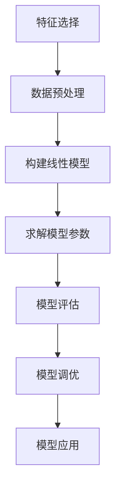

# 基于线性回归的股票走势分析

## 1. 背景介绍

### 1.1 股票市场的重要性

股票市场是金融体系的重要组成部分,反映了一个国家的经济发展状况。股票价格的波动不仅影响投资者的收益,也关系到企业的融资能力和国家的经济增长。因此,对股票走势的准确分析和预测具有重大意义。

### 1.2 股票走势分析的挑战

股票价格的变化受到诸多复杂因素的影响,例如公司业绩、行业发展前景、宏观经济政策等。这些因素的相互作用使得股票价格表现出高度的不确定性和波动性,给股票走势分析带来了巨大挑战。

### 1.3 线性回归在股票分析中的应用

线性回归是一种经典的机器学习算法,广泛应用于金融领域。通过构建线性模型,可以探究股票价格与影响因素之间的关系,从而对未来股价走势进行预测和分析。

## 2. 核心概念与联系

### 2.1 线性回归模型

线性回归模型旨在找到自变量(特征)和因变量(目标值)之间的线性关系,通过最小化残差平方和来拟合最优直线。线性回归的数学表达式为:

$$
y = \theta_0 + \theta_1x_1 + \theta_2x_2 + ... + \theta_nx_n
$$

其中,y 是因变量(股票价格),x 是自变量(影响因素),θ 是模型参数。

### 2.2 特征工程

在股票走势分析中,选择合适的特征对于模型的性能至关重要。常用的特征包括:

- 技术指标(移动平均线、相对强弱指数等)
- 基本面指标(市盈率、市净率等)
- 市场数据(大盘指数、行业指数等)
- 情绪指标(新闻情绪分析等)

### 2.3 模型评估

模型评估是衡量线性回归模型性能的关键步骤。常用的评估指标包括:

- 均方根误差(RMSE)
- 决定系数(R^2)
- 平均绝对误差(MAE)

## 3. 核心算法原理具体操作步骤

线性回归算法的核心步骤如下:



1. **特征选择**: 根据领域知识和数据分析,选择与股票价格相关的特征作为模型输入。

2. **数据预处理**: 对原始数据进行清洗、标准化等预处理,以满足模型的输入要求。

3. **构建线性模型**: 根据选定的特征和目标变量,构建线性回归模型的数学表达式。

4. **求解模型参数**: 通过最小化残差平方和的方法,求解线性回归模型的参数θ。常用的优化算法包括梯度下降法、最小二乘法等。

5. **模型评估**: 使用测试数据集,计算模型的评估指标,如RMSE、R^2等,判断模型的拟合效果。

6. **模型调优**: 根据模型评估结果,通过特征选择、正则化等方法,对模型进行优化和改进。

7. **模型应用**: 将训练好的模型应用于实际的股票走势预测和分析任务。

## 4. 数学模型和公式详细讲解举例说明

### 4.1 线性回归的数学模型

线性回归模型的目标是找到一条最佳拟合直线,使得样本点到直线的残差平方和最小。设有 n 个样本 $(x_i, y_i)$,其中 $x_i$ 是 $d$ 维特征向量,线性回归模型可表示为:

$$
y_i = \theta_0 + \theta_1x_{i1} + \theta_2x_{i2} + ... + \theta_dx_{id} + \epsilon_i
$$

其中 $\theta_j$ 是模型参数, $\epsilon_i$ 是随机误差项。我们需要求解参数 $\theta$,使得残差平方和最小:

$$
J(\theta) = \sum_{i=1}^{n}(y_i - \hat{y_i})^2 = \sum_{i=1}^{n}(y_i - \theta_0 - \sum_{j=1}^{d}\theta_jx_{ij})^2
$$

### 4.2 最小二乘法求解参数

最小二乘法是求解线性回归参数的经典方法。通过对 $J(\theta)$ 关于每个 $\theta_j$ 求偏导数并令其等于 0,可以得到normal方程组:

$$
\begin{cases}
\sum_{i=1}^{n}(y_i - \theta_0 - \sum_{j=1}^{d}\theta_jx_{ij}) = 0\\
\sum_{i=1}^{n}x_{ij}(y_i - \theta_0 - \sum_{j=1}^{d}\theta_jx_{ij}) = 0 \quad (j = 1, 2, ..., d)
\end{cases}
$$

上式可以用矩阵形式表示为:

$$
\begin{bmatrix}
n & \sum_{i=1}^{n}x_{i1} & \cdots & \sum_{i=1}^{n}x_{id}\\
\sum_{i=1}^{n}x_{i1} & \sum_{i=1}^{n}x_{i1}^2 & \cdots & \sum_{i=1}^{n}x_{i1}x_{id}\\
\vdots & \vdots & \ddots & \vdots\\
\sum_{i=1}^{n}x_{id} & \sum_{i=1}^{n}x_{id}x_{i1} & \cdots & \sum_{i=1}^{n}x_{id}^2
\end{bmatrix}
\begin{bmatrix}
\theta_0\\
\theta_1\\
\vdots\\
\theta_d
\end{bmatrix} =
\begin{bmatrix}
\sum_{i=1}^{n}y_i\\
\sum_{i=1}^{n}x_{i1}y_i\\
\vdots\\
\sum_{i=1}^{n}x_{id}y_i
\end{bmatrix}
$$

求解该方程组即可得到模型参数 $\theta$。

### 4.3 梯度下降法求解参数

除了最小二乘法,我们还可以使用梯度下降法来求解线性回归的参数。梯度下降法的基本思路是沿着目标函数梯度的反方向更新参数,直至收敛。对于线性回归问题,参数的更新规则为:

$$
\theta_j := \theta_j - \alpha \frac{\partial J(\theta)}{\partial \theta_j} \quad (j = 0, 1, ..., d)
$$

其中 $\alpha$ 是学习率,决定了每次更新的步长。对于 $J(\theta)$,我们有:

$$
\begin{aligned}
\frac{\partial J(\theta)}{\partial \theta_0} &= -2\sum_{i=1}^{n}(y_i - \theta_0 - \sum_{j=1}^{d}\theta_jx_{ij})\\
\frac{\partial J(\theta)}{\partial \theta_j} &= -2\sum_{i=1}^{n}x_{ij}(y_i - \theta_0 - \sum_{j=1}^{d}\theta_jx_{ij}) \quad (j = 1, 2, ..., d)
\end{aligned}
$$

根据上述公式,我们可以不断更新参数 $\theta$,直至收敛。

### 4.4 正则化线性回归

为了防止过拟合,我们可以在线性回归模型中引入正则化项。具体来说,我们优化的目标函数变为:

$$
J(\theta) = \sum_{i=1}^{n}(y_i - \hat{y_i})^2 + \lambda \sum_{j=1}^{d}\theta_j^2
$$

其中 $\lambda \geq 0$ 是正则化系数,控制着正则化的强度。当 $\lambda = 0$ 时,就是普通的线性回归;当 $\lambda > 0$ 时,会使参数 $\theta$ 趋向于更小的值,从而达到防止过拟合的效果。

我们可以类似地使用最小二乘法或梯度下降法求解正则化线性回归的参数。

### 4.5 实例分析

假设我们有一只股票的历史数据,包括每天的收盘价、最高价、最低价、成交量等特征,以及当天的涨跌幅作为目标值。我们可以构建如下的线性回归模型:

$$
y = \theta_0 + \theta_1 \times \text{收盘价} + \theta_2 \times \text{最高价} + \theta_3 \times \text{最低价} + \theta_4 \times \text{成交量}
$$

其中 $y$ 是涨跌幅, $\theta$ 是待求的模型参数。通过上述方法求解参数后,我们就可以根据新的特征数据预测该股票未来的涨跌情况。

## 5. 项目实践: 代码实例和详细解释说明

为了更好地理解线性回归在股票走势分析中的应用,我们以Python的Scikit-learn库为例,展示了一个完整的项目实践过程。

### 5.1 导入相关库

```python
import pandas as pd
import numpy as np
from sklearn.linear_model import LinearRegression
from sklearn.model_selection import train_test_split
from sklearn.metrics import mean_squared_error, r2_score
```

### 5.2 加载数据

我们使用一个虚构的股票数据集,包含了开盘价、收盘价、最高价、最低价、成交量等特征,以及未来一天的涨跌幅作为标签。

```python
data = pd.read_csv('stock_data.csv')
X = data.drop('future_return', axis=1)
y = data['future_return']
```

### 5.3 数据预处理

对特征数据进行标准化处理,使其均值为0、方差为1,这有助于提高模型的收敛速度和数值稳定性。

```python
from sklearn.preprocessing import StandardScaler
scaler = StandardScaler()
X_scaled = scaler.fit_transform(X)
```

### 5.4 训练测试集划分

我们将数据集划分为训练集和测试集,用于模型的训练和评估。

```python
X_train, X_test, y_train, y_test = train_test_split(X_scaled, y, test_size=0.2, random_state=42)
```

### 5.5 模型训练

使用Scikit-learn的LinearRegression类训练线性回归模型。

```python
model = LinearRegression()
model.fit(X_train, y_train)
```

### 5.6 模型评估

在测试集上评估模型的性能,包括均方根误差(RMSE)和决定系数(R^2)。

```python
y_pred = model.predict(X_test)
rmse = np.sqrt(mean_squared_error(y_test, y_pred))
r2 = r2_score(y_test, y_pred)
print(f'RMSE: {rmse:.4f}')
print(f'R^2: {r2:.4f}')
```

### 5.7 模型应用

使用训练好的模型对新的股票数据进行预测。

```python
new_data = pd.DataFrame({
    'open': [100.5, 101.2, ...],
    'close': [101.1, 100.8, ...],
    ...
})
new_data_scaled = scaler.transform(new_data)
future_returns = model.predict(new_data_scaled)
```

通过上述代码示例,我们可以清晰地了解如何使用Python和Scikit-learn库实现线性回归模型的构建、训练、评估和应用,为股票走势分析提供有力的工具支持。

## 6. 实际应用场景

线性回归在股票走势分析中有着广泛的应用,包括但不限于以下几个方面:

### 6.1 股价预测

通过构建线性回归模型,我们可以预测未来一段时间内股票的价格走势。这对于投资者的决策非常有帮助,可以帮助他们把握买入卖出的时机,实现更好的投资回报。

### 6.2 因子分析

线性回归模型可以揭示股票价格与各种影响因素之间的关系,从而进行因子分析。投资者可以根据这些因素的变化情况,调整投资策略和资产配置。

### 6.3 风险管理

股票价格的波动会带来一定的风险。通过线性回归模型,我们可以预测股价的波动范围,从而制定相应的风险管理策略,控制投资风险在可接受的范围内。

### 6.4 量化投资

量化投资是当前金融领域的一个热点方向。线性回归模型可以作为量化投资策略的重要组成部分,为投资决策提供数据支持和分