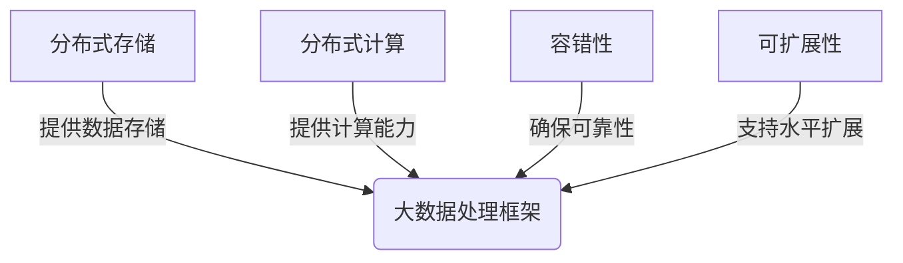
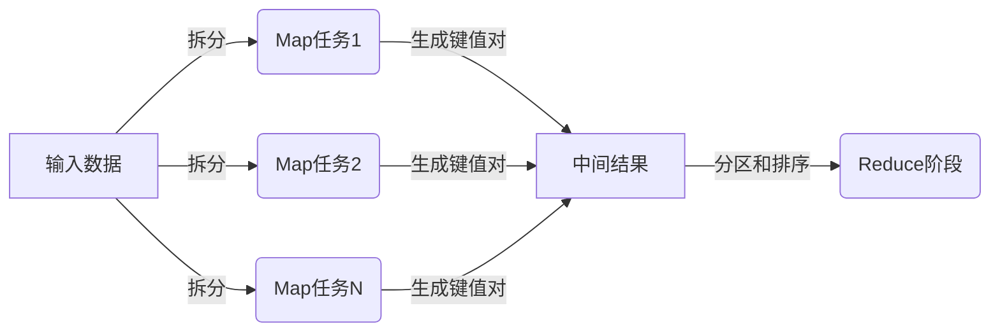
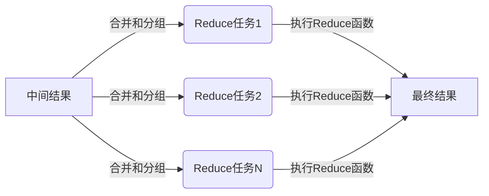

# 大数据处理框架原理与代码实战案例讲解

## 1. 背景介绍

### 1.1 大数据时代的来临

在当今时代,随着互联网、移动设备和物联网的快速发展,海量的数据正以前所未有的规模和速度被产生。这些数据来源于各种渠道,包括社交媒体、在线交易、物联网设备等。传统的数据处理系统已经无法有效地处理如此庞大的数据量。因此,大数据处理技术应运而生,旨在解决存储、管理和分析这些海量数据的挑战。

### 1.2 大数据处理的挑战

大数据处理面临着诸多挑战,包括:

1. **数据量大**:需要处理PB级别的海量数据。
2. **数据种类多**:需要处理结构化、半结构化和非结构化数据。
3. **数据产生速度快**:需要实时处理持续产生的数据流。
4. **数据价值密度低**:需要从海量数据中挖掘出有价值的信息。

### 1.3 大数据处理框架的作用

为了应对上述挑战,出现了多种大数据处理框架,如Apache Hadoop、Apache Spark等。这些框架提供了分布式计算、存储和处理海量数据的能力,使得大数据处理变得更加高效和可扩展。

## 2. 核心概念与联系

### 2.1 大数据处理框架的核心概念

1. **分布式存储**:将数据分散存储在多个节点上,提高可靠性和可扩展性。
2. **分布式计算**:将计算任务分解为多个小任务,并行执行在多个节点上。
3. **容错性**:能够自动检测和处理节点故障,确保计算的持续进行。
4. **可扩展性**:能够通过添加更多节点来线性扩展计算和存储能力。

### 2.2 核心概念之间的联系

这些核心概念相互关联,共同构建了大数据处理框架的基础架构。



## 3. 核心算法原理具体操作步骤

大数据处理框架通常采用**MapReduce**算法模型来实现分布式计算。MapReduce包含两个主要阶段:Map阶段和Reduce阶段。

### 3.1 Map阶段

1. 输入数据被拆分为多个数据块,分发到不同的Map任务中。
2. 每个Map任务并行处理其数据块,生成键值对序列作为中间结果。
3. 中间结果根据键进行分区和排序,准备传递给Reduce阶段。



### 3.2 Reduce阶段

1. 来自Map阶段的中间结果被合并和分组,传递给对应的Reduce任务。
2. 每个Reduce任务处理一组键及其相关值,执行用户自定义的Reduce函数。
3. Reduce函数的输出作为最终结果被持久化存储。



## 4. 数学模型和公式详细讲解举例说明

在大数据处理中,常常需要对数据进行统计和分析。以下是一些常用的数学模型和公式:

### 4.1 平均值

平均值是一组数据的算术平均,用于衡量数据的中心趋势。对于一个数据集 $X = \{x_1, x_2, \ldots, x_n\}$,平均值的计算公式为:

$$\overline{x} = \frac{1}{n}\sum_{i=1}^{n}x_i$$

### 4.2 方差和标准差

方差和标准差用于衡量数据的离散程度。对于一个数据集 $X = \{x_1, x_2, \ldots, x_n\}$,方差的计算公式为:

$$s^2 = \frac{1}{n}\sum_{i=1}^{n}(x_i - \overline{x})^2$$

标准差是方差的算术平方根:

$$s = \sqrt{s^2}$$

### 4.3 线性回归

线性回归是一种常用的机器学习算法,用于建立自变量和因变量之间的线性关系模型。对于一个数据集 $\{(x_1, y_1), (x_2, y_2), \ldots, (x_n, y_n)\}$,线性回归模型可以表示为:

$$y = \beta_0 + \beta_1x + \epsilon$$

其中 $\beta_0$ 和 $\beta_1$ 是需要估计的参数,可以通过最小二乘法求解:

$$\begin{aligned}
\beta_1 &= \frac{\sum_{i=1}^{n}(x_i - \overline{x})(y_i - \overline{y})}{\sum_{i=1}^{n}(x_i - \overline{x})^2} \\
\beta_0 &= \overline{y} - \beta_1\overline{x}
\end{aligned}$$

### 4.4 示例: 用户访问量分析

假设我们有一个电子商务网站,需要分析用户访问量的统计数据。我们可以使用大数据处理框架来处理这些数据,并应用上述数学模型进行分析。

1. 计算每天的平均访问量:

```python
# Map阶段
def map(date, visits):
    yield date, visits

# Reduce阶段
def reduce(date, visits):
    total = sum(visits)
    count = len(visits)
    avg = total / count
    yield date, avg
```

2. 计算访问量的方差和标准差:

```python
# Map阶段
def map(date, visits):
    avg = sum(visits) / len(visits)
    for visit in visits:
        yield date, (visit - avg) ** 2

# Reduce阶段
def reduce(date, squared_diffs):
    total = sum(squared_diffs)
    count = len(squared_diffs)
    variance = total / count
    std_dev = math.sqrt(variance)
    yield date, (variance, std_dev)
```

3. 建立访问量与营收之间的线性回归模型:

```python
# Map阶段
def map(date, record):
    visits = record[0]
    revenue = record[1]
    yield visits, revenue

# Reduce阶段
def reduce(visits, revenues):
    n = len(revenues)
    sum_x = sum(visits)
    sum_y = sum(revenues)
    sum_xx = sum(x ** 2 for x in visits)
    sum_xy = sum(x * y for x, y in zip(visits, revenues))
    
    mean_x = sum_x / n
    mean_y = sum_y / n
    
    numerator = sum_xy - n * mean_x * mean_y
    denominator = sum_xx - n * mean_x ** 2
    
    beta_1 = numerator / denominator
    beta_0 = mean_y - beta_1 * mean_x
    
    yield beta_0, beta_1
```

通过这些示例,我们可以看到如何将数学模型应用于大数据处理中,从而获得有价值的洞察和分析结果。

## 5. 项目实践: 代码实例和详细解释说明

在本节中,我们将通过一个实际项目案例来展示如何使用大数据处理框架进行数据处理和分析。我们将使用Apache Spark作为大数据处理框架,并基于Python语言进行编程。

### 5.1 项目概述

我们将分析一个电子商务网站的用户行为数据,包括用户浏览记录、购买记录等。目标是从这些数据中挖掘出有价值的信息,例如:

1. 分析用户的浏览习惯和购买模式
2. 发现热门商品和畅销品类
3. 进行用户细分和个性化推荐

### 5.2 数据准备

我们将使用一个模拟的数据集,包含以下几个文件:

- `browsing.txt`: 用户浏览记录,格式为 `user_id,product_id,timestamp`
- `purchases.txt`: 用户购买记录,格式为 `user_id,product_id,price,timestamp`
- `products.txt`: 产品信息,格式为 `product_id,category,name,description`

我们首先需要将这些文件加载到Spark中,作为RDD (Resilient Distributed Dataset)或DataFrame进行处理。

```python
from pyspark.sql import SparkSession

spark = SparkSession.builder.appName("E-Commerce Analysis").getOrCreate()

browsing = spark.read.text("browsing.txt")
purchases = spark.read.text("purchases.txt")
products = spark.read.text("products.txt")
```

### 5.3 数据处理和分析

#### 5.3.1 用户浏览习惯分析

我们可以统计每个用户的浏览次数,并找出浏览量最多的前10名用户。

```python
browsing_counts = browsing.rdd.map(lambda row: row.value.split(",")[0]).countByValue()
top_browsers = sorted(browsing_counts.items(), key=lambda x: x[1], reverse=True)[:10]

for user, count in top_browsers:
    print(f"User {user} browsed {count} times")
```

#### 5.3.2 热门商品分析

我们可以统计每个商品的购买次数,并找出销量最高的前10种商品。

```python
purchase_counts = purchases.rdd.map(lambda row: row.value.split(",")[1]).countByValue()
top_products = sorted(purchase_counts.items(), key=lambda x: x[1], reverse=True)[:10]

for product, count in top_products:
    product_name = products.rdd.filter(lambda row: row.value.split(",")[0] == product).map(lambda row: row.value.split(",")[2]).collect()[0]
    print(f"Product {product_name} was purchased {count} times")
```

#### 5.3.3 用户细分和推荐

我们可以基于用户的浏览和购买记录,对用户进行细分和个性化推荐。例如,我们可以找出购买过同一类别商品的用户群体,并为他们推荐相似的商品。

```python
# 将购买记录与产品信息关联
purchases_with_products = purchases.rdd.map(lambda row: row.value.split(",")) \
                                  .map(lambda x: (x[0], x[1], float(x[2]), x[3])) \
                                  .join(products.rdd.map(lambda row: (row.value.split(",")[0], row.value))) \
                                  .map(lambda x: (x[0], x[1][0][0], x[1][0][1], x[1][0][2], x[1][1].split(",")[1], x[1][1].split(",")[2]))

# 找出购买过同一类别商品的用户群体
category_purchases = purchases_with_products.map(lambda x: ((x[4], x[0]), x[2])) \
                                            .reduceByKey(lambda a, b: a + b) \
                                            .map(lambda x: (x[0][0], (x[0][1], x[1]))) \
                                            .groupByKey() \
                                            .mapValues(list)

# 为每个用户推荐相似的商品
for category, user_purchases in category_purchases.collect():
    print(f"For users who purchased products in category '{category}', we recommend:")
    for user, total_spent in user_purchases:
        print(f"  User {user} (spent ${total_spent:.2f})")
        
        # 找出该用户未购买的同类别商品
        purchased_products = set(p[0] for p in user_purchases if p[0] == user)
        recommended_products = products.rdd.filter(lambda row: row.value.split(",")[1] == category) \
                                           .filter(lambda row: row.value.split(",")[0] not in purchased_products) \
                                           .map(lambda row: row.value.split(",")[2]) \
                                           .collect()
        
        for product in recommended_products:
            print(f"    - {product}")
```

通过这个项目案例,我们展示了如何使用大数据处理框架进行数据处理和分析,以及如何从中获取有价值的洞察和信息。代码实例包括了数据加载、转换、聚合和推荐等多个步骤,涵盖了大数据处理的典型场景和操作。

## 6. 实际应用场景

大数据处理框架在各个领域都有广泛的应用,以下是一些典型的应用场景:

### 6.1 电子商务和零售

在电子商务和零售领域,大数据处理框架可以用于分析用户行为、发