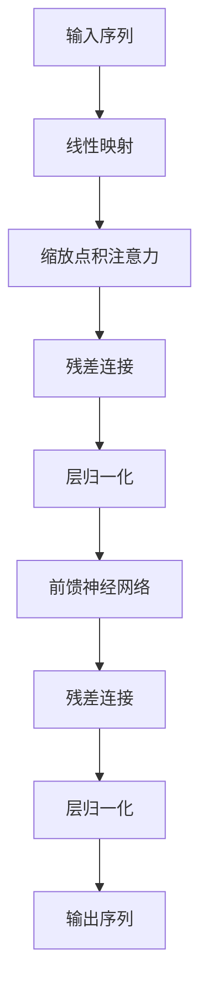

# 大语言模型原理基础与前沿 对齐语言模型与人类偏好

## 1. 背景介绍

### 1.1 人工智能的发展历程

人工智能的发展经历了几个重要的阶段。早期的人工智能系统主要基于规则和逻辑推理,但存在知识获取困难、推理能力有限等问题。20世纪90年代,机器学习算法的兴起,特别是深度学习的发展,使得人工智能系统能够从大量数据中自主学习,极大提高了系统的性能。

### 1.2 语言模型的重要性

语言是人类思维和交流的核心工具,语言模型是自然语言处理领域的基础。传统的语言模型主要基于统计方法,如N-gram模型,但存在上下文利用不足、难以捕捉长距离依赖等缺陷。近年来,基于深度学习的神经网络语言模型取得了长足进步,能够更好地建模语言的复杂性。

### 1.3 大语言模型的兴起

随着计算能力和数据量的不断增长,训练大规模语言模型成为可能。2018年,谷歌发布了Transformer模型,展示了自注意力机制在捕捉长距离依赖方面的优越性。2020年,OpenAI发布了GPT-3大型语言模型,其强大的文本生成能力引起了广泛关注。此后,越来越多的大型语言模型应运而生,如PaLM、ChatGPT等,展现出令人惊叹的语言理解和生成能力。

## 2. 核心概念与联系

### 2.1 自注意力机制



自注意力机制是大语言模型的核心,它允许模型在计算每个单词表示时,关注整个输入序列的不同部分。这种灵活的注意力机制有助于捕捉长距离依赖,提高了模型的表现力。

### 2.2 Transformer架构

Transformer架构完全基于自注意力机制,摒弃了传统的循环神经网络和卷积神经网络结构。它由编码器和解码器组成,编码器捕获输入序列的上下文信息,解码器则生成目标序列。多头注意力和位置编码等技术进一步增强了Transformer的建模能力。

### 2.3 预训练与微调

大语言模型通常采用预训练与微调的范式。首先在大规模无监督语料库上预训练模型,获得通用的语言表示能力。然后针对特定的下游任务(如机器翻译、问答等),对预训练模型进行微调,使其适应特定任务的数据分布和目标。这种迁移学习方式大幅降低了训练成本,提高了模型性能。

### 2.4 对齐语言模型与人类偏好

虽然大语言模型展现出强大的语言能力,但它们生成的内容可能存在偏差、不确定性或不符合人类期望。因此,需要对语言模型的输出进行调整,使其更好地对齐人类的偏好和价值观。这可以通过对抗性训练、规则约束、人类反馈等方式实现。

## 3. 核心算法原理具体操作步骤

### 3.1 Transformer编码器

1) 将输入序列映射为嵌入向量
2) 添加位置编码,赋予每个位置不同的位置信息
3) 通过多头自注意力层捕捉单词之间的依赖关系
4) 进行残差连接和层归一化,保持梯度稳定
5) 通过前馈神经网络进一步提取特征
6) 重复3-5步骤,构建深层编码器

### 3.2 Transformer解码器

1) 将输入序列编码为上下文向量
2) 将目标序列映射为嵌入向量,添加位置编码
3) 通过掩码多头自注意力层,只关注当前位置之前的单词
4) 通过编码器-解码器注意力层,将目标序列与编码器输出相关联
5) 进行残差连接和层归一化
6) 通过前馈神经网络进一步提取特征
7) 重复3-6步骤,构建深层解码器
8) 对解码器输出进行线性映射和softmax,生成下一个单词的概率分布

### 3.3 预训练与微调

1) 收集大规模无监督语料库,如网页、书籍等
2) 设计预训练任务,如掩码语言模型、下一句预测等
3) 在预训练任务上训练Transformer模型,获得通用的语言表示能力
4) 针对特定的下游任务,如机器翻译、问答等
5) 在下游任务的监督数据上微调预训练模型
6) 在测试集上评估模型性能,根据需要进行多轮迭代训练

## 4. 数学模型和公式详细讲解举例说明

### 4.1 缩放点积注意力

缩放点积注意力是Transformer中自注意力机制的核心。给定查询向量 $\mathbf{q}$、键向量 $\mathbf{K}$ 和值向量 $\mathbf{V}$,注意力权重计算如下:

$$\text{Attention}(\mathbf{Q}, \mathbf{K}, \mathbf{V}) = \text{softmax}\left(\frac{\mathbf{Q}\mathbf{K}^\top}{\sqrt{d_k}}\right)\mathbf{V}$$

其中 $d_k$ 是缩放因子,用于防止点积过大导致softmax函数的梯度较小。

### 4.2 多头注意力

多头注意力机制允许模型从不同的子空间捕捉不同的依赖关系,提高了模型的表现力。给定查询 $\mathbf{Q}$、键 $\mathbf{K}$ 和值 $\mathbf{V}$,多头注意力计算如下:

$$\text{MultiHead}(\mathbf{Q}, \mathbf{K}, \mathbf{V}) = \text{Concat}(\text{head}_1, \dots, \text{head}_h)\mathbf{W}^O$$
$$\text{where } \text{head}_i = \text{Attention}(\mathbf{Q}\mathbf{W}_i^Q, \mathbf{K}\mathbf{W}_i^K, \mathbf{V}\mathbf{W}_i^V)$$

其中 $\mathbf{W}_i^Q$、$\mathbf{W}_i^K$、$\mathbf{W}_i^V$ 和 $\mathbf{W}^O$ 是可学习的线性映射。

### 4.3 位置编码

由于Transformer没有循环或卷积结构,因此需要显式地为每个位置赋予不同的位置信息。位置编码通常采用正弦和余弦函数编码位置,具体公式如下:

$$\text{PE}_{(pos, 2i)} = \sin\left(pos / 10000^{2i / d_\text{model}}\right)$$
$$\text{PE}_{(pos, 2i+1)} = \cos\left(pos / 10000^{2i / d_\text{model}}\right)$$

其中 $pos$ 是位置索引, $i$ 是维度索引, $d_\text{model}$ 是模型维度。

### 4.4 交叉熵损失

在预训练和微调过程中,常用交叉熵损失函数作为优化目标。给定真实标签 $y$ 和模型预测的概率分布 $\hat{y}$,交叉熵损失定义为:

$$\mathcal{L}(y, \hat{y}) = -\sum_{i=1}^{N} y_i \log \hat{y}_i$$

其中 $N$ 是类别数量。在序列生成任务中,通常采用teacher forcing策略,将上一时刻的真实标签作为当前时刻的输入。

## 5. 项目实践: 代码实例和详细解释说明

以下是使用PyTorch实现Transformer模型的简化代码示例,包括编码器、解码器和注意力机制的核心部分。

```python
import torch
import torch.nn as nn
import math

# 缩放点积注意力
class ScaledDotProductAttention(nn.Module):
    def __init__(self):
        super().__init__()

    def forward(self, Q, K, V, mask=None):
        scores = torch.matmul(Q, K.transpose(-2, -1)) / math.sqrt(Q.size(-1))
        if mask is not None:
            scores = scores.masked_fill(mask == 0, -1e9)
        attn = nn.Softmax(dim=-1)(scores)
        output = torch.matmul(attn, V)
        return output, attn

# 多头注意力
class MultiHeadAttention(nn.Module):
    def __init__(self, d_model, n_heads):
        super().__init__()
        self.n_heads = n_heads
        self.d_model = d_model
        self.d_k = d_model // n_heads
        self.W_Q = nn.Linear(d_model, d_model)
        self.W_K = nn.Linear(d_model, d_model)
        self.W_V = nn.Linear(d_model, d_model)
        self.W_O = nn.Linear(d_model, d_model)

    def forward(self, Q, K, V, mask=None):
        batch_size = Q.size(0)
        q = self.W_Q(Q).view(batch_size, -1, self.n_heads, self.d_k).transpose(1, 2)
        k = self.W_K(K).view(batch_size, -1, self.n_heads, self.d_k).transpose(1, 2)
        v = self.W_V(V).view(batch_size, -1, self.n_heads, self.d_k).transpose(1, 2)
        attn, _ = ScaledDotProductAttention()(q, k, v, mask)
        attn = attn.transpose(1, 2).contiguous().view(batch_size, -1, self.d_model)
        output = self.W_O(attn)
        return output

# 编码器层
class EncoderLayer(nn.Module):
    def __init__(self, d_model, n_heads):
        super().__init__()
        self.attn = MultiHeadAttention(d_model, n_heads)
        self.ffn = nn.Sequential(
            nn.Linear(d_model, d_model * 4),
            nn.ReLU(),
            nn.Linear(d_model * 4, d_model)
        )
        self.norm1 = nn.LayerNorm(d_model)
        self.norm2 = nn.LayerNorm(d_model)

    def forward(self, x, mask=None):
        x_norm = self.norm1(x)
        attn_output = self.attn(x_norm, x_norm, x_norm, mask)
        x = x + attn_output
        x_norm = self.norm2(x)
        ffn_output = self.ffn(x_norm)
        x = x + ffn_output
        return x

# 解码器层
class DecoderLayer(nn.Module):
    def __init__(self, d_model, n_heads):
        super().__init__()
        self.self_attn = MultiHeadAttention(d_model, n_heads)
        self.enc_attn = MultiHeadAttention(d_model, n_heads)
        self.ffn = nn.Sequential(
            nn.Linear(d_model, d_model * 4),
            nn.ReLU(),
            nn.Linear(d_model * 4, d_model)
        )
        self.norm1 = nn.LayerNorm(d_model)
        self.norm2 = nn.LayerNorm(d_model)
        self.norm3 = nn.LayerNorm(d_model)

    def forward(self, x, enc_output, src_mask, tgt_mask):
        x_norm = self.norm1(x)
        self_attn_output = self.self_attn(x_norm, x_norm, x_norm, tgt_mask)
        x = x + self_attn_output
        x_norm = self.norm2(x)
        enc_attn_output = self.enc_attn(x_norm, enc_output, enc_output, src_mask)
        x = x + enc_attn_output
        x_norm = self.norm3(x)
        ffn_output = self.ffn(x_norm)
        x = x + ffn_output
        return x
```

上述代码实现了Transformer的核心组件,包括缩放点积注意力、多头注意力、编码器层和解码器层。具体用法如下:

1. 初始化编码器层和解码器层
2. 将输入序列传入编码器,获得编码器输出
3. 将目标序列和编码器输出传入解码器,生成预测序列
4. 计算预测序列与真实标签之间的损失,反向传播更新模型参数

需要注意的是,在实际应用中还需要处理输入数据、生成掩码、添加位置编码等步骤。此外,还可以添加残差连接、层归一化等技术,以提高模型性能和收敛速度。

## 6. 实际应用场景

大语言模型在自然语言处理领域有广