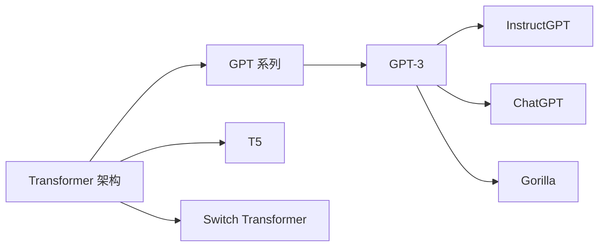

# 大语言模型应用指南：Gorilla

## 1. 背景介绍

近年来,随着深度学习技术的快速发展,大语言模型(Large Language Model,LLM)取得了突破性进展。LLM 通过在海量文本数据上进行无监督预训练,能够学习到丰富的语言知识和常识,具备强大的语言理解和生成能力。其中,以 GPT-3、PaLM、LaMDA 等为代表的通用大语言模型,更是展现出了令人惊叹的"涌现能力(emergent abilities)",在许多自然语言处理任务上取得了超越人类的表现。

作为 LLM 家族的新成员,Gorilla(General Oriented Representation for Internet Language with Large-scale Aggregation)由 Anthropic 公司开发,旨在进一步提升 LLM 的性能和适用性。Gorilla 基于 GPT-3 架构,通过引入更大规模的参数、更多样化的预训练数据以及创新的训练技术,力求在通用性、鲁棒性、可控性等方面取得新的突破。

本文将全面介绍 Gorilla 模型的技术原理和应用实践,帮助读者深入理解这一前沿的 LLM 技术,把握其应用价值和发展趋势。通过阅读本文,您将收获:

1. Gorilla 的核心概念、模型架构与训练技术
2. Gorilla 的数学原理与算法实现
3. 基于 Gorilla 的项目实践与代码解析 
4. Gorilla 的实际应用场景与案例分享
5. Gorilla 相关的开发工具与学习资源推荐
6. Gorilla 未来的发展方向与挑战
7. Gorilla 常见问题解答与专家点评

## 2. 核心概念与联系

### 2.1 大语言模型(LLM)

大语言模型是指参数量达到数十亿、数百亿乃至更高数量级的超大规模语言模型。它通过在海量无标注文本语料上进行自监督学习,构建起强大的语言理解和生成能力。当前主流的 LLM 多基于 Transformer 架构,如 GPT 系列、T5、Switch Transformer 等。

### 2.2 预训练(Pre-training)

预训练是指在大规模无标注语料上对模型进行自监督学习,使其习得通用的语言知识和表征能力。常见的预训练任务包括语言模型、去噪自编码、对比学习等。预训练使得模型能够有效地从海量数据中学习,为下游任务提供良好的初始化参数。

### 2.3 微调(Fine-tuning)

微调是指在特定任务的标注数据上,以较小的学习率在预训练模型的基础上进行监督学习,使模型适应具体任务。相比从头训练,微调能够显著减少所需标注数据量和训练时间,快速适配到不同任务。微调是 LLM 应用于垂直领域的重要手段。

### 2.4 提示学习(Prompt Learning)

提示学习是一种新兴的 LLM 应用范式,无需微调,直接利用自然语言指令来引导 LLM 执行具体任务。通过设计巧妙的提示模板,可以激发 LLM 的涌现能力,在零样本或少样本场景下完成复杂任务。GPT-3 的 few-shot learning 能力正是基于提示学习实现的。

### 2.5 Gorilla 的定位

Gorilla 是在 GPT-3 等先进 LLM 基础上的进一步探索和创新。它的目标是通过规模化、多样化、鲁棒化,打造一个通用性更强、适用性更广、可控性更高的新一代 LLM 范式。Gorilla 在保留 GPT-3 优势的同时,力求在效率、安全、伦理等维度取得新的突破。

下图展示了 Gorilla 与其他主流 LLM 的关系:



## 3. 核心算法原理具体操作步骤

### 3.1 模型架构

Gorilla 采用了 Transformer 的 Decoder 结构作为骨干网络,通过堆叠多层 Transformer Block 来建模文本序列。每个 Transformer Block 包含两个子层:Multi-Head Self-Attention 和 Position-wise Feed-Forward Network。

具体来说,Gorilla 的基本架构如下:

1. Input Embedding:将输入的文本 token 映射为连续向量表示。
2. Positional Encoding:加入位置编码,引入序列中 token 的相对位置信息。
3. Transformer Decoder:堆叠 N 个 Transformer Block,每个 block 内部结构为:
   - Multi-Head Self-Attention:捕捉 token 之间的依赖关系
   - Layer Normalization
   - Position-wise Feed-Forward Network:引入非线性变换,增强特征交互
   - Residual Connection:辅以残差连接,缓解深层网络的优化难题
4. Output Embedding:将 Transformer 的输出向量映射到词表空间,用于预测下一个 token。

在此基础上,Gorilla 还引入了一些改进:
- 更深的网络:将 Transformer Block 的层数增加到 128 层,显著提升模型容量。
- 更宽的维度:将 Self-Attention 和 FFN 的隐藏层维度扩大到 12288,增强特征表示能力。 
- 稀疏注意力:引入可训练的稀疏注意力模式,在保留全局依赖建模能力的同时提升计算效率。
- 相对位置编码:采用相对位置编码替代绝对位置编码,更好地建模长程依赖。
- 循环层正则化:在 Transformer Block 之间共享参数,并施加正则化,缓解过拟合。

### 3.2 预训练方法

Gorilla 采用了多任务自监督预训练范式,在多个无监督任务上联合训练模型,从而习得更加通用和鲁棒的语言理解能力。具体来说,Gorilla 的预训练任务包括:

1. 传统语言模型:基于 token 的概率建模,最大化序列的似然概率。
2. 去噪目标检测:随机对输入 token 进行掩码、替换、删除等噪声处理,训练模型恢复原始序列。
3. 对比学习:将同一文档的不同片段视为正样本,不同文档的片段视为负样本,最大化正样本的相似度,最小化负样本的相似度。
4. 句子排列:打乱句子的顺序,训练模型重建原始的句子排列。
5. 文档分类:根据输入序列预测所属的文档类别,引入高层语义信息。

在训练过程中,这些任务以一定比例混合,交替进行梯度更新。多任务学习有助于提升模型的泛化性能和鲁棒性。

此外,Gorilla 还采用了一些训练技巧,如:
- 大批量训练:采用高达 4096 的超大 batch size,有利于优化收敛。
- 学习率热身:在初始阶段采用较小的学习率,逐渐提高到预设值,缓解早期不稳定性。
- 梯度裁剪:限制梯度的范数,避免梯度爆炸。
- 权重衰减:施加 L2 正则化,控制模型复杂度。
- 混合精度训练:采用 FP16/FP32 混合精度,在提速的同时保证数值稳定性。

### 3.3 微调和提示学习

在下游任务应用中,Gorilla 支持微调和提示学习两种范式。

微调范式下,在预训练好的 Gorilla 模型上添加特定任务的输出层,然后在任务标注数据上进行梯度下降,更新整个模型的参数。微调通常能够获得较好的任务性能,但需要一定的标注数据和训练时间。

提示学习范式下,无需重新训练模型,而是巧妙地设计输入的提示模板,引导模型进行任务求解。例如,对于情感分类任务,可以设计如下的提示:

```
请判断以下文本的情感倾向:
文本:"这部电影太棒了,我看得如痴如醉!"
情感倾向:
```

Gorilla 可以根据提示直接生成"积极"的结果。提示学习充分利用了预训练模型的语言理解和生成能力,实现了零样本/少样本学习。但设计优质的提示需要一定的经验和技巧。

Anthropic 开源了一系列的提示模板和使用示例,方便用户快速上手 Gorilla 的提示学习应用。未来,如何自动化和优化提示设计,是进一步提升 Gorilla 易用性的关键。

## 4. 数学模型和公式详细讲解举例说明

Gorilla 的核心数学原理可以用 Transformer 架构的公式来表示。以下我们对 Transformer 的关键组件进行详细推导。

### 4.1 Self-Attention

Self-Attention 是 Transformer 的核心组件,用于捕捉序列内部的依赖关系。给定输入序列的表示 $\mathbf{X} \in \mathbb{R}^{n \times d}$,其中 $n$ 为序列长度,$d$ 为特征维度,Self-Attention 的计算过程如下:

1. 根据输入 $\mathbf{X}$,计算 query、key、value 矩阵:

$$
\mathbf{Q} = \mathbf{X} \mathbf{W}_q \\
\mathbf{K} = \mathbf{X} \mathbf{W}_k \\
\mathbf{V} = \mathbf{X} \mathbf{W}_v
$$

其中 $\mathbf{W}_q, \mathbf{W}_k, \mathbf{W}_v \in \mathbb{R}^{d \times d_k}$ 为可学习的投影矩阵。

2. 计算 query 与 key 的相似度得分:

$$
\mathbf{A} = \text{softmax}(\frac{\mathbf{Q}\mathbf{K}^T}{\sqrt{d_k}})
$$

其中 $\mathbf{A} \in \mathbb{R}^{n \times n}$ 为注意力矩阵,$\sqrt{d_k}$ 为缩放因子,用于控制梯度的稳定性。

3. 根据注意力矩阵 $\mathbf{A}$ 对 value 进行加权求和,得到输出表示:

$$
\text{Attention}(\mathbf{Q}, \mathbf{K}, \mathbf{V}) = \mathbf{A} \mathbf{V}
$$

直观地理解,Self-Attention 实现了序列中每个位置对其他位置的依赖建模,注意力矩阵 $\mathbf{A}$ 刻画了不同位置之间的相关性。

在实践中,Transformer 采用了 Multi-Head Self-Attention,即将 query、key、value 映射到 $h$ 个不同的子空间,并行计算 $h$ 组 Self-Attention,然后拼接结果并投影得到最终输出:

$$
\begin{aligned}
\text{MultiHead}(\mathbf{Q}, \mathbf{K}, \mathbf{V}) &= \text{Concat}(\text{head}_1, ..., \text{head}_h) \mathbf{W}^O \\
\text{head}_i &= \text{Attention}(\mathbf{Q}\mathbf{W}_i^Q, \mathbf{K}\mathbf{W}_i^K, \mathbf{V}\mathbf{W}_i^V)
\end{aligned}
$$

其中 $\mathbf{W}_i^Q \in \mathbb{R}^{d \times d_k}, \mathbf{W}_i^K \in \mathbb{R}^{d \times d_k}, \mathbf{W}_i^V \in \mathbb{R}^{d \times d_v}, \mathbf{W}^O \in \mathbb{R}^{hd_v \times d}$。

Multi-Head Attention 允许模型在不同的子空间内捕捉不同的依赖模式,增强了模型的表示能力。

### 4.2 Position-wise Feed-Forward Network

除了 Self-Attention 子层,Transformer Block 中还包含 Position-wise Feed-Forward Network(FFN)子层,用于对特征进行非线性变换。FFN 独立作用于序列的每个位置,其公式为:

$$
\text{FFN}(\mathbf{x}) = \text{ReLU}(\mathbf{x}\mathbf{W}_1 + \mathbf{b}_1) \mathbf{W}_2 + \mathbf{b}_2
$$

其中 $\mathbf{x} \in \mathbb{R}^d$ 为输入向量,$