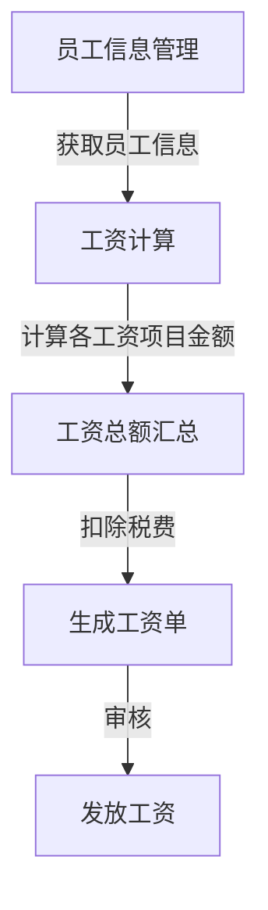

# 工资管理系统详细设计与具体代码实现

## 1.背景介绍

工资管理系统是企业内部人力资源管理系统的重要组成部分,旨在实现对员工工资计算、发放和管理的自动化和信息化。随着企业规模的不断扩大,传统的手工计算和管理方式已经无法满足现代化企业对工资管理的高效性和准确性要求。因此,构建一个高效、安全、可靠的工资管理系统对于企业的人力资源管理至关重要。

## 2.核心概念与联系

工资管理系统涉及以下几个核心概念:

1. **员工信息管理**: 维护员工的基本信息、工作信息、薪酬信息等,为工资计算提供数据支持。

2. **工资项目设置**: 根据企业实际情况设置各类工资项目,包括基本工资、绩效工资、补贴、奖金等。

3. **工资计算规则**: 制定工资计算的规则和流程,确保工资计算的准确性和一致性。

4. **工资发放管理**: 完成工资的计算、审核、发放等环节,确保按时足额发放员工工资。

5. **报表统计分析**: 生成各类工资报表,为企业决策提供数据支持。

这些核心概念相互关联,共同构成了一个完整的工资管理体系。

## 3.核心算法原理具体操作步骤

工资管理系统的核心算法主要包括以下几个步骤:

### 3.1 获取员工信息

首先需要从员工信息表中获取所有员工的基本信息、工作信息和薪酬信息,作为工资计算的基础数据。

### 3.2 确定适用的工资项目

根据企业的工资政策和员工的实际情况,确定每个员工适用的工资项目,包括基本工资、绩效工资、补贴、奖金等。

### 3.3 计算各工资项目金额

对于每个工资项目,根据相应的计算规则和员工的具体情况,计算出该项目的金额。例如,基本工资可以根据员工的职级和工龄确定;绩效工资可以根据员工的绩效考核结果计算;补贴和奖金则根据企业的具体政策进行计算。

### 3.4 汇总工资总额

将所有工资项目的金额相加,得到员工的工资总额。

### 3.5 扣除相关税费

根据国家和地区的相关法规,从工资总额中扣除个人所得税、社会保险费等税费。

### 3.6 生成工资单

将计算结果生成工资单,包括员工基本信息、各工资项目明细、扣除项目明细和实发工资等内容。

### 3.7 审核和发放工资

工资单需要经过审核流程,确保计算无误后方可发放工资。发放工资可以采用现金或银行转账等方式。

## 4.数学模型和公式详细讲解举例说明

在工资管理系统中,常见的数学模型和公式包括:

### 4.1 个人所得税计算

个人所得税的计算通常采用超额累进税率的方式,可以用以下公式表示:

$$
税额 = \sum_{i=1}^{n}(纳税所得额_i - 速算扣除数_i) \times 税率_i - 速算扣除数_{i-1}
$$

其中:
- $n$ 表示级数的数量
- $纳税所得额_i$ 表示的是对应级数的应纳税所得额
- $速算扣除数_i$ 表示的是对应级数的速算扣除数
- $税率_i$ 表示的是对应级数的税率

例如,某员工的年收入为20万元,根据2023年个人所得税税率表,其应缴纳的个人所得税为:

```
全年应纳税所得额 = 200000元
适用税率为: (0, 36000, 3%), (36000, 144000, 10%), (144000, 300000, 20%)
计算过程:
(36000 - 0) * 3% = 1080
(144000 - 36000) * 10% = 10800
(200000 - 144000) * 20% = 11200
个人所得税总额 = 1080 + 10800 + 11200 = 23080元
```

### 4.2 社会保险费计算

社会保险费通常包括养老保险、医疗保险、失业保险、工伤保险和生育保险等几个部分,每个部分的计算方式都有所不同。以养老保险为例,计算公式如下:

$$
养老保险费 = 缴费工资基数 \times 费率
$$

其中:
- $缴费工资基数$ 通常是员工上年度月平均收入,但有最高基数限制
- $费率$ 由当地政府规定,通常包括单位和个人两部分

例如,某员工的上年度月平均收入为8000元,单位养老保险费率为16%,个人养老保险费率为8%,则该员工的月养老保险费为:

```
缴费工资基数 = 8000元
单位养老保险费 = 8000 * 16% = 1280元
个人养老保险费 = 8000 * 8% = 640元
月养老保险费合计 = 1280 + 640 = 1920元
```

### 4.3 绩效工资计算

绩效工资的计算模型通常根据企业的绩效考核体系而定,可以采用加权求和、分数对应系数等方式。以加权求和为例,计算公式如下:

$$
绩效工资 = \sum_{i=1}^{n}w_i \times s_i
$$

其中:
- $n$ 表示考核指标的数量
- $w_i$ 表示第 $i$ 个指标的权重
- $s_i$ 表示第 $i$ 个指标的得分

例如,某员工的绩效考核包括工作质量、工作效率和团队合作三个指标,权重分别为0.4、0.3和0.3,得分分别为90、85和92,则该员工的绩效工资为:

```
绩效工资 = 0.4 * 90 + 0.3 * 85 + 0.3 * 92 = 88.5 (满分为100)
```

## 5.项目实践:代码实例和详细解释说明

下面是一个使用Python编写的简单工资管理系统的代码示例,包括员工信息管理、工资计算和工资单生成等功能。

### 5.1 员工信息管理

```python
class Employee:
    def __init__(self, id, name, department, position, base_salary):
        self.id = id
        self.name = name
        self.department = department
        self.position = position
        self.base_salary = base_salary

    def __str__(self):
        return f"ID: {self.id}, Name: {self.name}, Department: {self.department}, Position: {self.position}, Base Salary: {self.base_salary}"

employees = [
    Employee(1, "Alice", "Sales", "Manager", 8000),
    Employee(2, "Bob", "IT", "Developer", 6000),
    Employee(3, "Charlie", "Finance", "Accountant", 5500),
    Employee(4, "David", "HR", "Specialist", 5000)
]
```

这段代码定义了一个 `Employee` 类,用于存储员工的基本信息,包括员工ID、姓名、部门、职位和基本工资。然后创建了一个包含4个员工对象的列表 `employees`。

### 5.2 工资计算

```python
def calculate_salary(employee):
    base_salary = employee.base_salary
    performance_bonus = 0
    if employee.position == "Manager":
        performance_bonus = base_salary * 0.2
    elif employee.position == "Developer":
        performance_bonus = base_salary * 0.15
    else:
        performance_bonus = base_salary * 0.1

    total_salary = base_salary + performance_bonus
    return total_salary

for employee in employees:
    total_salary = calculate_salary(employee)
    print(f"{employee.name}'s total salary: {total_salary}")
```

这段代码定义了一个 `calculate_salary` 函数,用于计算员工的总工资。总工资由基本工资和绩效奖金两部分组成。绩效奖金的计算方式根据员工的职位不同而有所差异。

函数首先获取员工的基本工资,然后根据职位计算相应的绩效奖金。最后将基本工资和绩效奖金相加,得到员工的总工资。

代码遍历 `employees` 列表,对每个员工调用 `calculate_salary` 函数计算总工资,并打印输出结果。

### 5.3 工资单生成

```python
def generate_payslip(employee, total_salary):
    payslip = f"""
Payslip for {employee.name}:
ID: {employee.id}
Department: {employee.department}
Position: {employee.position}
Base Salary: {employee.base_salary}
Performance Bonus: {total_salary - employee.base_salary}
Total Salary: {total_salary}
    """
    return payslip

for employee in employees:
    total_salary = calculate_salary(employee)
    payslip = generate_payslip(employee, total_salary)
    print(payslip)
```

这段代码定义了一个 `generate_payslip` 函数,用于生成员工的工资单。工资单包含员工的基本信息、基本工资、绩效奖金和总工资等内容。

函数接受两个参数:员工对象 `employee` 和总工资 `total_salary`。它使用 Python 的多行字符串格式化输出工资单的内容。

代码遍历 `employees` 列表,对每个员工调用 `calculate_salary` 函数计算总工资,然后调用 `generate_payslip` 函数生成工资单,并打印输出结果。

### 5.4 系统流程图

以下是工资管理系统的核心流程图:



该流程图展示了工资管理系统的主要步骤:

1. 从员工信息管理模块获取员工的基本信息、工作信息和薪酬信息。
2. 根据获取的员工信息,计算各个工资项目的金额,如基本工资、绩效工资、补贴和奖金等。
3. 将所有工资项目的金额相加,得到员工的工资总额。
4. 从工资总额中扣除个人所得税、社会保险费等税费。
5. 根据计算结果生成工资单。
6. 工资单经过审核流程后,发放工资给员工。

## 6.实际应用场景

工资管理系统在现实中有广泛的应用场景,包括但不限于:

1. **企业内部使用**: 各类企业都需要管理员工的工资,工资管理系统可以提高工资计算和发放的效率和准确性,减轻人力资源部门的工作负担。

2. **外包服务**: 一些专业的人力资源服务公司可以将工资管理系统作为一项外包服务,为客户企业提供工资计算和发放服务。

3. **政府机构**: 政府机构也需要管理公务员和事业单位员工的工资,可以使用工资管理系统实现自动化管理。

4. **学校和非营利组织**: 学校和非营利组织同样需要管理员工的工资,工资管理系统可以帮助他们更好地控制成本和管理资金。

5. **个人理财**: 一些个人理财软件也可以集成工资管理功能,帮助个人更好地管理和规划自己的收入和支出。

## 7.工具和资源推荐

在开发和使用工资管理系统时,以下工具和资源可能会有所帮助:

1. **编程语言和框架**: 根据具体需求选择合适的编程语言和框架,如 Python、Java、.NET、Ruby on Rails 等。

2. **数据库管理系统**: 如 MySQL、PostgreSQL、Oracle、SQL Server 等,用于存储员工信息和工资数据。

3. **报表工具**: 如 Crystal Reports、Jasper Reports、BIRT 等,用于生成各种工资报表。

4. **安全和加密工具**: 如 SSL/TLS、数据加密、访问控制等,确保工资数据的安全性和隐私性。

5. **版本控制工具**: 如 Git、SVN 等,用于管理代码的版本和协作开发。

6. **测试工具**: 如 JUnit、Selenium、Appium 等,用于进行单元测试和自动化测试。

7. **项目管理工具**: 如 Jira、Trello、Asana 等,用于管理项目进度和任务分配。

8. **在线资源**: 如 Stack Overflow、技术博客、开源项目等,可以获取更多的技术支持和最佳实践。

## 8.总结