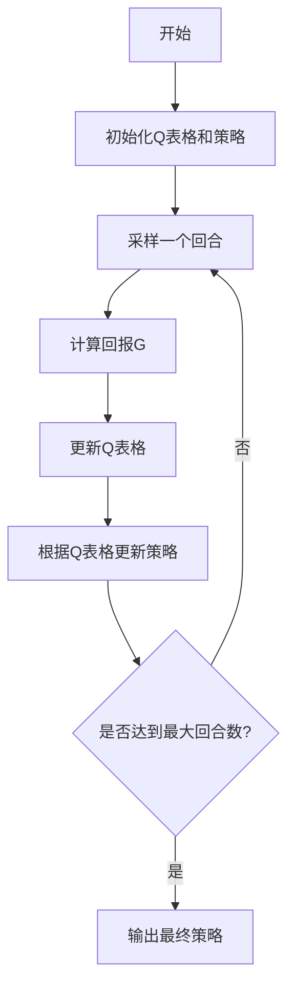

# 强化学习Reinforcement Learning中的蒙特卡洛方法实战技巧

## 1.背景介绍

### 1.1 什么是强化学习

强化学习(Reinforcement Learning, RL)是机器学习的一个重要分支,它研究如何基于环境反馈来学习行为策略,以最大化一定时间段内的预期奖励。与监督学习和无监督学习不同,强化学习没有提供标签数据,而是通过与环境进行交互来学习。

### 1.2 强化学习的应用

强化学习已被广泛应用于多个领域,如机器人控制、游戏AI、自动驾驶、智能调度等。其中,AlphaGo使用深度强化学习战胜了人类顶尖棋手,展现了强化学习在复杂决策问题上的优越性。

### 1.3 蒙特卡洛方法在强化学习中的作用

蒙特卡洛方法(Monte Carlo methods)是强化学习中的一种策略评估和改进方法。它通过采样实际体验的回报,来估计给定策略的价值函数,并据此对策略进行改进。蒙特卡洛方法具有无偏性、高效率等优点,在强化学习实践中扮演重要角色。

## 2.核心概念与联系

### 2.1 马尔可夫决策过程

强化学习问题通常建模为马尔可夫决策过程(Markov Decision Process, MDP),它是一个离散时间随机控制过程。MDP由以下几个要素组成:

- 状态集合S
- 动作集合A 
- 转移概率P(s'|s,a)
- 奖励函数R(s,a,s')

马尔可夫性质使得系统的未来状态只依赖于当前状态和动作,而与历史无关。

### 2.2 策略和价值函数

策略π(a|s)是一个从状态到动作的映射函数,表示在状态s下选择动作a的概率。价值函数V(s)表示从状态s开始后,按策略π执行所能获得的预期回报。Q(s,a)表示在状态s执行动作a后,按策略π执行所能获得的预期回报。

### 2.3 蒙特卡洛估计

蒙特卡洛估计是通过采样平均实际回报,来近似价值函数或者动作价值函数。对于一个完整的状态-动作-奖励序列,我们可以计算:

$$V(s) \approx \frac{1}{N}\sum_{i=1}^{N}G_i(s)$$

其中,N是从状态s出发的序列数量,G是该序列的总奖励。Q(s,a)的估计类似。

### 2.4 蒙特卡洛控制

蒙特卡洛控制是在策略评估的基础上,对策略进行改进的过程。常用的是每次访问一个状态-动作对时,就增大该动作的概率,从而逐步收敛到最优策略。

## 3.核心算法原理具体操作步骤  

蒙特卡洛方法在强化学习中的核心算法有:

### 3.1 每次访问蒙特卡洛预测(Every-Visit Monte Carlo Prediction)

该算法用于估计给定策略下的状态价值函数V(s)。算法步骤如下:

1. 初始化所有状态的V(s)为任意值,并记录每个状态被访问的次数N(s)为0
2. 获取一个完整的状态-奖励序列
3. 对于序列中的每个时间步t,计算从t开始的回报G
4. 对于序列中的每个状态s,增量式更新V(s):

$$V(s) \leftarrow V(s) + \frac{1}{N(s)}[G - V(s)]$$

5. 重复步骤2-4,直到收敛

该算法可以无偏估计真实的V(s)。

### 3.2 每次访问蒙特卡洛控制(Every-Visit Monte Carlo Control)

该算法在每次访问蒙特卡洛预测的基础上,同时学习策略π。算法步骤如下:

1. 初始化所有状态-动作对的Q(s,a)为任意值,并记录每个状态-动作对被访问的次数N(s,a)为0
2. 获取一个完整的状态-动作-奖励序列
3. 对于序列中的每个时间步t,计算从t开始的回报G
4. 对于序列中的每个状态-动作对(s,a),增量式更新Q(s,a):  

$$Q(s,a) \leftarrow Q(s,a) + \frac{1}{N(s,a)}[G - Q(s,a)]$$

5. 对于序列中的每个状态s,更新策略π(s)为使Q(s,a)最大的动作a
6. 重复步骤2-5,直到收敛

该算法通过不断探索和利用,最终收敛到最优策略和动作价值函数。

### 3.3 首次访问蒙特卡洛方法

除了每次访问方法,还有首次访问蒙特卡洛(First-Visit Monte Carlo)方法。它只在序列中第一次访问某个状态或状态-动作对时,才进行价值估计更新。这种方法通常收敛更快,但需要更多内存来存储访问标记。

## 4.数学模型和公式详细讲解举例说明

### 4.1 马尔可夫奖励过程

马尔可夫奖励过程(Markov Reward Process, MRP)是强化学习问题的数学模型,由一个无决策的马尔可夫链和一个奖励模型组成。MRP可以形式化描述为:

$$\langle S, P, R, \gamma\rangle$$

其中:
- S是有限状态集合
- P是状态转移概率矩阵,P_{ss'}给出了从状态s转移到s'的概率
- R是奖励函数,R(s)给出了在状态s获得的期望奖励
- $\gamma \in [0, 1)$是折扣因子,用于权衡未来奖励的重要性

### 4.2 价值函数和贝尔曼方程

在MRP中,我们定义状态价值函数V(s)为从状态s开始获得的折扣累计奖励的期望值:

$$V(s) = \mathbb{E}\left[\sum_{k=0}^{\infty}\gamma^{k}R_{t+k+1} \middle| S_t = s\right]$$

V(s)必须满足贝尔曼方程(Bellman Equation):

$$V(s) = R(s) + \gamma\sum_{s' \in S}P_{ss'}V(s')$$

这个方程给出了一种计算V(s)的递推方式,被称为价值迭代(Value Iteration)算法。

### 4.3 蒙特卡洛估计公式推导

我们来推导蒙特卡洛估计公式。假设有一个状态序列$\{S_t\}_{t \geq 0}$,其对应的奖励序列为$\{R_t\}_{t \geq 0}$,则从时间步t开始的回报为:

$$G_t = \sum_{k=0}^{\infty}\gamma^{k}R_{t+k+1}$$

由于V(S_t)的定义,我们有:

$$V(S_t) = \mathbb{E}[G_t]$$

如果我们有N条从同一状态S_t出发的序列,其回报分别为$G_t^{(1)}, G_t^{(2)}, \cdots, G_t^{(N)}$,则可得:

$$V(S_t) \approx \frac{1}{N}\sum_{i=1}^{N}G_t^{(i)}$$

这就是蒙特卡洛估计的公式,通过采样平均回报来估计价值函数。

### 4.4 策略改进公式

在蒙特卡洛控制中,我们需要基于动作价值函数Q(s,a)来改进策略π。具体地,对于任意状态s,我们希望选择能最大化Q(s,a)的动作:

$$\pi(s) = \arg\max_{a}Q(s,a)$$

这样的贪婪策略能够保证在有限的马尔可夫决策过程中收敛到最优策略。

## 5.项目实践：代码实例和详细解释说明

下面是一个使用Python实现的蒙特卡洛控制示例,应用于小型网格世界环境。

### 5.1 环境设置

```python
import numpy as np

# 网格世界的大小
WORLD_SIZE = 5

# 奖励的四种情况
REWARD_MAP = {
    'win': 1,
    'loss': -1,
    'live': 0,
    'hole': -0.5
}

# 初始化网格世界
world = np.zeros((WORLD_SIZE, WORLD_SIZE))

# 目标状态
world[0, 0] = REWARD_MAP['win']

# 陷阱状态
world[1, 1] = REWARD_MAP['hole']
world[1, 3] = REWARD_MAP['hole']
world[3, 1] = REWARD_MAP['hole']

# 初始状态
START_STATE = (WORLD_SIZE - 1, WORLD_SIZE - 1)
```

这里我们定义了一个5x5的网格世界,包含一个目标状态、三个陷阱状态和一个起始状态。每个状态有相应的奖励值。

### 5.2 蒙特卡洛采样

```python
import random

def sample_episode(policy):
    """根据策略采样一个回合"""
    state = START_STATE
    states = [state]
    rewards = [0]
    while world[state] not in (REWARD_MAP['win'], REWARD_MAP['loss']):
        action = policy[state]
        next_state = move(state, action)
        reward = world[next_state]
        states.append(next_state)
        rewards.append(reward)
        state = next_state
    return states, rewards

def move(state, action):
    """执行动作,返回新状态"""
    row, col = state
    if action == 'up':
        row = max(0, row - 1)
    elif action == 'down':
        row = min(WORLD_SIZE - 1, row + 1)
    elif action == 'left':
        col = max(0, col - 1)
    elif action == 'right':
        col = min(WORLD_SIZE - 1, col + 1)
    return (row, col)
```

`sample_episode`函数根据给定的策略π采样一个状态-奖励序列,直到到达终止状态。`move`函数执行具体的动作,返回新的状态。

### 5.3 蒙特卡洛控制算法

```python
import collections

# 初始化Q(s,a)表格
Q_table = collections.defaultdict(lambda: collections.defaultdict(float))

# 初始化策略π
policy = collections.defaultdict(lambda: random.choice(['up', 'down', 'left', 'right']))

# 蒙特卡洛控制算法
for episode in range(10000):
    states, rewards = sample_episode(policy)
    returns = []
    G = 0
    for t in range(len(states) - 1, -1, -1):
        r = rewards[t]
        G = r + 0.9 * G
        state = states[t]
        action = policy[state]
        returns.append(G)
        Q_table[state][action] += (G - Q_table[state][action]) / (episode + 1)
    
    # 根据Q(s,a)更新策略π
    for t, state in enumerate(states):
        action_values = [Q_table[state][a] for a in ['up', 'down', 'left', 'right']]
        policy[state] = random.choice([a for a, q in zip(['up', 'down', 'left', 'right'], action_values) if q == max(action_values)])
```

这段代码实现了蒙特卡洛控制算法的核心逻辑。首先,我们初始化了Q表格和随机策略π。然后,对每个回合采样的序列,我们反向计算回报G,并更新Q表格中对应的Q(s,a)值。最后,根据更新后的Q(s,a),我们对策略π进行贪婪改进。

经过足够多的迭代,策略π将收敛到最优策略。我们可以打印出最终的Q表格和策略,观察结果。

### 5.4 Mermaid流程图

以下是蒙特卡洛控制算法的Mermaid流程图:



## 6.实际应用场景

蒙特卡洛方法在强化学习的实际应用中扮演着重要角色,下面列举一些典型场景:

1. **棋类游戏AI**:蒙特卡洛树搜索(Monte Carlo Tree Search, MCTS)是目前最强大的策略,被广泛应用于国际象棋、围棋、扑克等游戏AI中。AlphaGo就使用