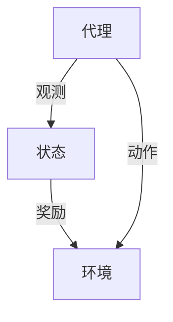
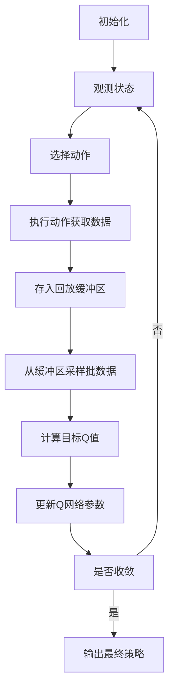

# 强化学习：在媒体行业中的应用

## 1.背景介绍

### 1.1 媒体行业的挑战

在当今快节奏的数字时代,媒体行业面临着前所未有的挑战。用户对个性化、高质量内容的需求与日俱增,同时内容创作者和平台也在不断寻求提高用户参与度和收益的方式。传统的内容推荐和定价策略很难满足这种多元化的需求。因此,需要一种更加智能、高效的方法来优化内容创作、分发和货币化。

### 1.2 强化学习的优势

强化学习(Reinforcement Learning)作为机器学习的一个重要分支,通过与环境的交互来学习如何做出最优决策,从而实现特定目标。它不需要大量标记数据,而是通过试错来学习,因此非常适合应用于复杂、动态的环境。在媒体行业中,强化学习可以帮助内容创作者和平台更好地了解用户行为,优化内容策略,从而提高用户体验和收益。

## 2.核心概念与联系

### 2.1 强化学习基本概念

强化学习系统由四个核心要素组成:

- **代理(Agent)**: 做出决策并与环境交互的主体。
- **环境(Environment)**: 代理所处的虚拟或现实世界。
- **状态(State)**: 描述环境当前情况的一组信息。
- **奖励(Reward)**: 代理执行某个动作后,环境给予的反馈信号。

代理的目标是通过与环境交互,学习一个策略(Policy),使得在给定状态下采取的行动能最大化预期的长期累积奖励。



### 2.2 强化学习在媒体行业中的应用

在媒体行业中,强化学习可以应用于以下几个方面:

- **内容推荐系统**: 根据用户行为数据,学习推荐策略,为用户提供个性化的内容推荐。
- **内容定价策略**: 通过试错,学习最优的内容定价策略,平衡用户体验和收益。
- **广告投放策略**: 优化广告投放时机和位置,提高广告点击率和转化率。
- **内容创作辅助**: 分析用户反馈,优化内容创作策略,提高内容质量和用户参与度。

## 3.核心算法原理具体操作步骤

强化学习算法主要分为三大类:基于价值(Value-based)、基于策略(Policy-based)和Actor-Critic。下面将介绍其中一种广泛使用的算法——深度Q网络(Deep Q-Network, DQN)的原理和实现步骤。

### 3.1 Q-Learning算法

Q-Learning是一种基于价值的强化学习算法,其核心思想是学习一个Q函数,用于估计在给定状态下采取某个动作的长期累积奖励。Q函数定义如下:

$$Q(s, a) = \mathbb{E}[R_t + \gamma R_{t+1} + \gamma^2 R_{t+2} + \cdots | s_t = s, a_t = a, \pi]$$

其中:
- $s$是状态
- $a$是动作
- $R_t$是时间步$t$的即时奖励
- $\gamma$是折现因子,控制未来奖励的重要程度
- $\pi$是策略

Q-Learning通过不断更新Q函数,使其逼近真实的Q值,从而学习到最优策略。

### 3.2 Deep Q-Network (DQN)

传统的Q-Learning使用表格来存储Q值,当状态和动作空间较大时,存储和计算开销将变得不可接受。Deep Q-Network (DQN)通过使用深度神经网络来近似Q函数,从而解决了这个问题。DQN算法的主要步骤如下:

1. **初始化回放缓冲区(Replay Buffer)和Q网络**
2. **观测初始状态$s_0$**
3. **对于每个时间步$t$:**
    a. 根据$\epsilon$-贪婪策略,选择动作$a_t$
    b. 执行动作$a_t$,观测到新状态$s_{t+1}$和即时奖励$r_t$
    c. 将$(s_t, a_t, r_t, s_{t+1})$存入回放缓冲区
    d. 从回放缓冲区中采样一批数据
    e. 计算目标Q值:$y_j = r_j + \gamma \max_{a'} Q(s_{j+1}, a'; \theta^-)$
    f. 更新Q网络参数$\theta$,使得$Q(s_j, a_j; \theta) \approx y_j$
4. **重复步骤3,直到收敛**

其中,回放缓冲区用于存储代理与环境的交互数据,以打破数据之间的相关性;$\epsilon$-贪婪策略用于在探索(exploration)和利用(exploitation)之间达成平衡;目标Q网络参数$\theta^-$是Q网络参数$\theta$的滞后版本,用于增加训练稳定性。



## 4.数学模型和公式详细讲解举例说明

在强化学习中,代理的目标是最大化其预期的长期累积奖励,即:

$$\max_\pi \mathbb{E}_\pi \left[ \sum_{t=0}^\infty \gamma^t R_t \right]$$

其中$\pi$是代理的策略,$R_t$是时间步$t$的即时奖励,$\gamma$是折现因子,控制未来奖励的重要程度。

为了解决这个最优化问题,我们可以定义一个价值函数$V^\pi(s)$,表示在策略$\pi$下,从状态$s$开始执行,预期的长期累积奖励:

$$V^\pi(s) = \mathbb{E}_\pi \left[ \sum_{t=0}^\infty \gamma^t R_t | s_0 = s \right]$$

类似地,我们可以定义一个Q函数$Q^\pi(s, a)$,表示在策略$\pi$下,从状态$s$开始执行动作$a$,预期的长期累积奖励:

$$Q^\pi(s, a) = \mathbb{E}_\pi \left[ \sum_{t=0}^\infty \gamma^t R_t | s_0 = s, a_0 = a \right]$$

Q函数和价值函数之间存在以下关系:

$$Q^\pi(s, a) = \mathbb{E}_\pi \left[ R_t + \gamma V^\pi(s_{t+1}) | s_t = s, a_t = a \right]$$

这个方程被称为Bellman方程,是强化学习算法的基础。

以内容推荐系统为例,假设我们有一个包含10篇文章的网站,用户可以选择阅读或跳过每篇文章。我们的目标是最大化用户的总体满意度(即累积奖励)。

设:
- 状态$s$表示用户当前已阅读的文章集合
- 动作$a$表示推荐给用户的下一篇文章
- 奖励$R(s, a)$表示用户阅读文章$a$后的满意度

那么,在状态$s$下选择动作$a$的Q值可以表示为:

$$Q(s, a) = R(s, a) + \gamma \max_{a'} Q(s', a')$$

其中$s'$是执行动作$a$后的新状态。

我们可以使用DQN算法来学习这个Q函数,从而获得一个优化的内容推荐策略。

## 5.项目实践:代码实例和详细解释说明

以下是一个使用PyTorch实现的简单DQN代理,用于解决一个基于网格的导航问题。代理的目标是从起点到达终点,同时避免障碍物。

```python
import torch
import torch.nn as nn
import torch.optim as optim
import numpy as np

# 定义Q网络
class QNetwork(nn.Module):
    def __init__(self, state_dim, action_dim):
        super(QNetwork, self).__init__()
        self.fc1 = nn.Linear(state_dim, 64)
        self.fc2 = nn.Linear(64, action_dim)

    def forward(self, x):
        x = torch.relu(self.fc1(x))
        x = self.fc2(x)
        return x

# 定义DQN代理
class DQNAgent:
    def __init__(self, state_dim, action_dim):
        self.device = torch.device("cuda" if torch.cuda.is_available() else "cpu")
        self.q_network = QNetwork(state_dim, action_dim).to(self.device)
        self.target_network = QNetwork(state_dim, action_dim).to(self.device)
        self.optimizer = optim.Adam(self.q_network.parameters(), lr=0.001)
        self.replay_buffer = []
        self.batch_size = 64
        self.gamma = 0.99

    def get_action(self, state, epsilon):
        if np.random.rand() < epsilon:
            return np.random.randint(action_dim)
        else:
            state = torch.from_numpy(state).float().unsqueeze(0).to(self.device)
            q_values = self.q_network(state)
            return torch.argmax(q_values).item()

    def update(self):
        if len(self.replay_buffer) < self.batch_size:
            return

        batch = random.sample(self.replay_buffer, self.batch_size)
        states, actions, rewards, next_states, dones = zip(*batch)

        states = torch.from_numpy(np.array(states)).float().to(self.device)
        actions = torch.from_numpy(np.array(actions)).long().to(self.device)
        rewards = torch.from_numpy(np.array(rewards)).float().to(self.device)
        next_states = torch.from_numpy(np.array(next_states)).float().to(self.device)
        dones = torch.from_numpy(np.array(dones)).float().to(self.device)

        q_values = self.q_network(states).gather(1, actions.unsqueeze(1)).squeeze(1)
        next_q_values = self.target_network(next_states).max(1)[0]
        expected_q_values = rewards + self.gamma * next_q_values * (1 - dones)

        loss = nn.MSELoss()(q_values, expected_q_values)
        self.optimizer.zero_grad()
        loss.backward()
        self.optimizer.step()

        if len(self.replay_buffer) > 10000:
            self.replay_buffer.pop(0)

    def update_target_network(self):
        self.target_network.load_state_dict(self.q_network.state_dict())
```

这段代码定义了一个简单的Q网络和DQN代理。Q网络是一个小型的全连接神经网络,输入为当前状态,输出为每个动作的Q值。DQN代理包含以下主要组件:

- `q_network`: 用于近似Q函数的Q网络。
- `target_network`: 目标Q网络,用于计算目标Q值,增加训练稳定性。
- `optimizer`: 用于更新Q网络参数的优化器。
- `replay_buffer`: 回放缓冲区,用于存储代理与环境的交互数据。
- `get_action`: 根据当前状态和$\epsilon$-贪婪策略选择动作。
- `update`: 从回放缓冲区中采样批数据,计算目标Q值,并更新Q网络参数。
- `update_target_network`: 将Q网络的参数复制到目标Q网络。

在训练过程中,代理与环境交互,将经验存入回放缓冲区。每隔一定步数,从回放缓冲区中采样一批数据,计算目标Q值,并使用均方误差损失函数更新Q网络参数。同时,定期将Q网络的参数复制到目标Q网络,以增加训练稳定性。

通过不断地与环境交互和更新网络参数,DQN代理最终会学习到一个近似最优的策略。

## 6.实际应用场景

强化学习在媒体行业中有着广泛的应用前景,下面列举了一些具体的应用场景:

### 6.1 内容推荐系统

内容推荐系统是强化学习在媒体行业中最典型的应用场景之一。传统的协同过滤和基于内容的推荐算法很难满足用户不断变化的需求,而强化学习可以通过与用户的交互来动态地学习和优化推荐策略。

例如,YouTube可以将用户观看视频的行为作为状态,推荐的视频作为动作,用户的观看时长和点赞数作为奖励,从而学习一个个性化的推荐策略,提高用户体验和参与度。

### 6.2 内容定价策略