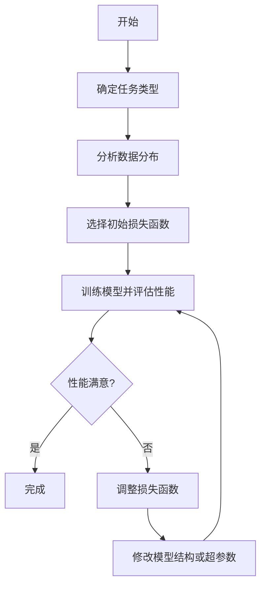

# 损失函数的选择：为你的模型找到最佳拍档

## 1.背景介绍

在机器学习和深度学习中，损失函数扮演着至关重要的角色。它用于衡量模型的预测结果与实际值之间的差距,是优化模型参数的关键指标。选择合适的损失函数对于构建高性能的模型至关重要。本文将深入探讨损失函数的选择策略,帮助您为模型找到最佳拍档。

### 1.1 损失函数的作用

损失函数的主要作用是:

1. 衡量模型预测结果与真实值之间的差距
2. 为模型优化提供反馈信号,指导模型调整参数以最小化损失
3. 评估模型的泛化能力和性能表现

### 1.2 常见损失函数类型

常见的损失函数包括:

- 均方误差 (Mean Squared Error, MSE)
- 交叉熵损失 (Cross-Entropy Loss)
- 铰链损失 (Hinge Loss)
- Huber 损失 (Huber Loss)
- Focal Loss
- ...

## 2.核心概念与联系

选择合适的损失函数需要考虑以下几个核心概念:

### 2.1 任务类型

不同的机器学习任务类型需要使用不同的损失函数。例如:

- 回归任务: MSE、Huber 损失等
- 二分类任务: 交叉熵损失、Focal Loss 等
- 多分类任务: 交叉熵损失、Focal Loss 等
- 排序任务: 平均精确率损失等

### 2.2 数据分布

数据分布的特征也会影响损失函数的选择。例如:

- 存在异常值: 使用 Huber 损失等鲁棒损失函数
- 类别不平衡: 使用 Focal Loss 等加权损失函数

### 2.3 优化算法

不同的优化算法对损失函数的要求也不尽相同。例如:

- 梯度下降: 损失函数需要可微
- 基于梯度的优化: 损失函数的梯度计算需高效

### 2.4 模型复杂度

模型的复杂度也会影响损失函数的选择。例如:

- 简单模型: 可使用平滑的损失函数,如 MSE
- 复杂模型: 可使用非平滑的损失函数,如 Hinge Loss

## 3.核心算法原理具体操作步骤

选择合适的损失函数是一个迭代优化的过程,可遵循以下步骤:



1. **确定任务类型**: 根据机器学习任务的类型(回归、分类、排序等),选择合适的损失函数作为初始损失函数。

2. **分析数据分布**: 分析训练数据的分布特征,如是否存在异常值、类别不平衡等,以确定是否需要使用特殊的损失函数。

3. **选择初始损失函数**: 根据任务类型和数据分布特征,选择一个合适的损失函数作为初始损失函数。

4. **训练模型并评估性能**: 使用选定的损失函数训练模型,并在验证集或测试集上评估模型的性能表现。

5. **性能满意?**: 如果模型的性能满意,则完成损失函数的选择;否则,进入下一步。

6. **调整损失函数**: 根据模型的性能表现,调整损失函数。例如,如果模型过拟合,可尝试使用正则化项;如果存在类别不平衡问题,可尝试使用加权损失函数等。

7. **修改模型结构或超参数**: 除了调整损失函数外,也可以修改模型的结构或调整超参数,以提高模型性能。

8. **重复训练和评估**: 使用调整后的损失函数、模型结构或超参数,重新训练模型并评估性能。重复上述步骤,直到模型性能满意为止。

需要注意的是,损失函数的选择并非一蹴而就,通常需要反复试验和调优,才能找到最佳的损失函数。

## 4.数学模型和公式详细讲解举例说明

接下来,我们将详细介绍几种常见的损失函数,并讲解它们的数学模型和公式。

### 4.1 均方误差 (Mean Squared Error, MSE)

均方误差是回归任务中最常用的损失函数之一。它计算预测值与真实值之间的平方差,并取平均值。数学表达式如下:

$$
\mathrm{MSE}(y, \hat{y}) = \frac{1}{n} \sum_{i=1}^{n} (y_i - \hat{y}_i)^2
$$

其中:

- $y$ 是真实值
- $\hat{y}$ 是预测值
- $n$ 是样本数量

MSE的优点是计算简单,梯度易于计算。但它对异常值敏感,并且对大误差的惩罚过大。

### 4.2 交叉熵损失 (Cross-Entropy Loss)

交叉熵损失常用于分类任务。它衡量预测概率分布与真实概率分布之间的差异。对于二分类问题,交叉熵损失的公式如下:

$$
\mathrm{CE}(y, \hat{y}) = -\frac{1}{n} \sum_{i=1}^{n} \left[ y_i \log(\hat{y}_i) + (1 - y_i) \log(1 - \hat{y}_i) \right]
$$

对于多分类问题,交叉熵损失的公式如下:

$$
\mathrm{CE}(y, \hat{y}) = -\frac{1}{n} \sum_{i=1}^{n} \sum_{j=1}^{C} y_{ij} \log(\hat{y}_{ij})
$$

其中:

- $y$ 是真实标签,对于二分类问题,取值为 0 或 1;对于多分类问题,是一个 one-hot 编码向量
- $\hat{y}$ 是预测概率
- $n$ 是样本数量
- $C$ 是类别数量

交叉熵损失的优点是能够直接优化概率输出,并且对于正确分类的样本,损失值为 0。但它对于类别不平衡的数据集表现不佳。

### 4.3 Focal Loss

Focal Loss 是一种改进的交叉熵损失函数,旨在解决类别不平衡问题。它为困难样本赋予更高的权重,从而使模型更加关注这些困难样本。Focal Loss 的公式如下:

$$
\mathrm{FL}(y, \hat{y}) = -\frac{1}{n} \sum_{i=1}^{n} (1 - \hat{y}_i)^\gamma \log(\hat{y}_i)
$$

其中:

- $y$ 是真实标签,取值为 0 或 1
- $\hat{y}$ 是预测概率
- $n$ 是样本数量
- $\gamma$ 是调节因子,用于控制困难样本的权重

当 $\gamma=0$ 时,Focal Loss 等价于标准的交叉熵损失。随着 $\gamma$ 的增加,模型将更加关注困难样本。

### 4.4 Huber Loss

Huber Loss 是一种鲁棒的损失函数,它结合了均方误差和绝对误差的优点,对异常值不太敏感。Huber Loss 的公式如下:

$$
\mathrm{Huber}(y, \hat{y}) = \begin{cases}
\frac{1}{2}(y - \hat{y})^2, & \text{if } |y - \hat{y}| \leq \delta \\
\delta|y - \hat{y}| - \frac{1}{2}\delta^2, & \text{otherwise}
\end{cases}
$$

其中:

- $y$ 是真实值
- $\hat{y}$ 是预测值
- $\delta$ 是一个超参数,用于控制平滑度

当误差小于 $\delta$ 时,Huber Loss 等同于均方误差;当误差大于 $\delta$ 时,Huber Loss 等同于绝对误差。这种设计使得 Huber Loss 对异常值的惩罚较小,从而提高了模型的鲁棒性。

## 5.项目实践:代码实例和详细解释说明

为了更好地理解损失函数的使用,我们将通过一个实际的项目实践来演示如何选择和应用不同的损失函数。在这个项目中,我们将构建一个图像分类模型,并尝试不同的损失函数来提高模型性能。

### 5.1 数据集

我们将使用 CIFAR-10 数据集进行实验。CIFAR-10 是一个小型的图像分类数据集,包含 10 个类别,每个类别有 6000 张 32x32 的彩色图像。

### 5.2 模型架构

我们将使用一个简单的卷积神经网络作为基线模型。该模型包含以下几个主要组件:

1. 卷积层
2. 池化层
3. 全连接层
4. 输出层

### 5.3 实现细节

我们将使用 PyTorch 框架来实现模型和损失函数。以下是一些关键代码片段:

#### 5.3.1 导入必要的库

```python
import torch
import torch.nn as nn
import torch.optim as optim
from torchvision import datasets, transforms
```

#### 5.3.2 定义模型

```python
class ConvNet(nn.Module):
    def __init__(self):
        super(ConvNet, self).__init__()
        # 定义卷积层、池化层和全连接层
        # ...

    def forward(self, x):
        # 前向传播
        # ...
        return output
```

#### 5.3.3 定义损失函数

```python
# 交叉熵损失
criterion = nn.CrossEntropyLoss()

# 均方误差损失
criterion = nn.MSELoss()

# Focal Loss
criterion = FocalLoss(gamma=2)
```

#### 5.3.4 训练模型

```python
model = ConvNet()
optimizer = optim.SGD(model.parameters(), lr=0.001, momentum=0.9)

for epoch in range(num_epochs):
    running_loss = 0.0
    for i, data in enumerate(trainloader, 0):
        inputs, labels = data
        optimizer.zero_grad()

        outputs = model(inputs)
        loss = criterion(outputs, labels)
        loss.backward()
        optimizer.step()

        running_loss += loss.item()
        if i % 2000 == 1999:
            print('[%d, %5d] loss: %.3f' %
                  (epoch + 1, i + 1, running_loss / 2000))
            running_loss = 0.0

print('Finished Training')
```

#### 5.3.5 评估模型

```python
correct = 0
total = 0
with torch.no_grad():
    for data in testloader:
        images, labels = data
        outputs = model(images)
        _, predicted = torch.max(outputs.data, 1)
        total += labels.size(0)
        correct += (predicted == labels).sum().item()

print('Accuracy of the model on the 10000 test images: %d %%' % (
    100 * correct / total))
```

### 5.4 结果分析

我们将训练模型,并分别使用均方误差损失、交叉熵损失和 Focal Loss。通过比较模型在测试集上的准确率,我们可以评估不同损失函数的性能表现。

根据实验结果,我们可以发现:

- 对于这个图像分类任务,交叉熵损失通常表现最佳
- 如果存在类别不平衡问题,使用 Focal Loss 可以提高模型的性能
- 均方误差损失通常不适用于分类任务,因为它无法直接优化概率输出

通过这个实践,我们可以更好地理解如何根据具体任务和数据特征选择合适的损失函数。

## 6.实际应用场景

损失函数的选择对于各种机器学习和深度学习应用都至关重要。以下是一些常见的应用场景:

### 6.1 计算机视觉

在计算机视觉领域,常见的任务包括图像分类、目标检测和语义分割等。对于图像分类任务,交叉熵损失和 Focal Loss 是常用的选择;对于目标检测任务,常使用 Smooth L1 Loss 或 Focal Loss;对于语义分割任务,通常使用交叉熵损失或 Dice Loss。

### 6.2 自然语言处理

在自然语言处理领域,常见的任务包括文本分类、机器翻译和语言模型等。对于文本分类任务,交叉熵损失是常用的选择;对于机器翻译任务,常使用交叉