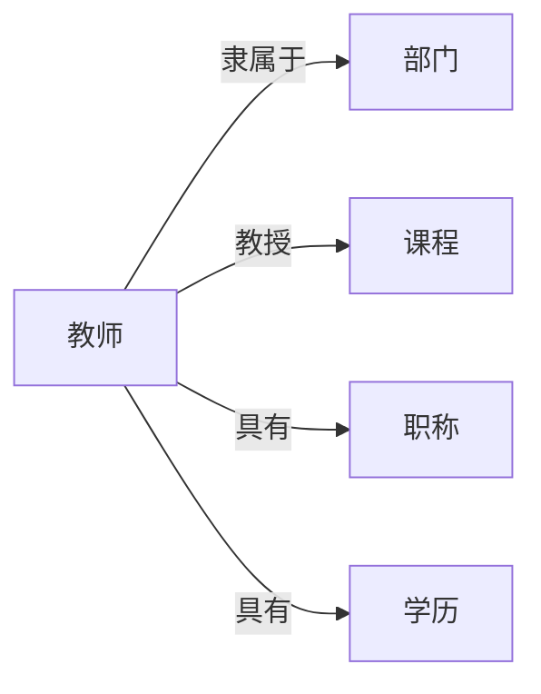

# 教师信息管理系统详细设计与具体代码实现

## 1. 背景介绍

在现代化的教育管理中,教师信息管理系统扮演着至关重要的角色。一个高效、可靠、易用的教师信息管理系统能够极大地提高学校的管理效率,减轻教务人员的工作负担,为学校的决策提供数据支持。本文将详细介绍教师信息管理系统的设计思路和具体实现过程,探讨其中涉及的核心概念、算法原理、数学模型以及实际应用场景,并给出完整的代码实例。

### 1.1 教师信息管理系统的意义
#### 1.1.1 提高管理效率
#### 1.1.2 减轻工作负担 
#### 1.1.3 为决策提供支持

### 1.2 教师信息管理系统的功能需求
#### 1.2.1 教师信息的录入与维护
#### 1.2.2 教师信息的查询与统计
#### 1.2.3 教师考勤管理
#### 1.2.4 教师绩效考核

## 2. 核心概念与联系

在教师信息管理系统中,涉及到以下几个核心概念:

- 教师:学校的教学人员,包括专任教师、兼职教师等。
- 部门:学校的组织机构,如院系、教研室等。
- 课程:学校开设的各类课程,如专业课、公共课等。
- 职称:教师的专业技术等级,如助教、讲师、副教授、教授等。
- 学历:教师的最高学历,如本科、硕士、博士等。

这些概念之间存在着一定的关联关系。例如,每个教师都隶属于某个部门,每个教师可以教授多门课程,每个教师都有特定的职称和学历。在系统设计时,需要充分考虑这些关联关系,合理设计数据库表结构。

下面是一个简单的 Mermaid 图,展示了这些概念之间的关系:



## 3. 核心算法原理具体操作步骤

在教师信息管理系统中,涉及到一些常用的算法,如查询算法、排序算法、统计算法等。下面以查询算法为例,介绍其基本原理和操作步骤。

### 3.1 顺序查找法
顺序查找法是最简单的查找算法,其基本思想是从表的一端开始,逐个将记录的关键字与给定值进行比较,直到找到为止。

具体步骤如下:
1. 从表的第一个记录开始,逐个取出记录
2. 将记录的关键字与给定值进行比较
3. 若相等,则查找成功,返回该记录
4. 若不等,则取下一个记录,重复步骤2-4
5. 若直到最后一个记录都不等,则查找失败

顺序查找法适用于顺序存储和链式存储的线性表,算法复杂度为O(n)。

### 3.2 二分查找法
二分查找法又称折半查找法,适用于有序表的查找。其基本思想是将表一分为二,将给定值与表中间位置的记录进行比较,若相等则查找成功;若不等,再根据大小关系确定下一步查找的范围,直到找到或查找失败。

具体步骤如下:
1. 确定待查找记录所在的范围,初始为整个表 
2. 将表从中间位置一分为二,取中间位置的记录作为比较对象
3. 将给定值与中间位置记录的关键字进行比较
4. 若相等,则查找成功,返回该记录 
5. 若不等,则根据大小关系缩小查找范围,重复步骤2-5
6. 若查找范围为空,则查找失败

二分查找法的时间复杂度为O(logn),效率较高,但要求线性表必须采用顺序存储,而且表中元素按关键字有序排列。

## 4. 数学模型和公式详细讲解举例说明

在教师信息管理系统中,可能涉及到一些数学模型和公式,如教师绩效考核模型、教学质量评估模型等。下面以教师绩效考核模型为例,进行详细讲解。

教师绩效考核是评估教师工作表现的重要手段,通常采用加权求和模型,即将各项考核指标的得分乘以相应的权重,然后求和得到总分。设考核指标有n项,第i项的得分为$s_i$,权重为$w_i$,则教师绩效考核总分S可表示为:

$$S=\sum_{i=1}^n w_i s_i$$

其中,$\sum_{i=1}^n w_i=1$,即权重之和为1。

举例说明,假设某学校的教师绩效考核包括教学工作、科研工作、社会服务三项,权重分别为0.6、0.3、0.1,某教师三项得分分别为90、80、85,则其绩效考核总分为:

$S=0.6\times 90+0.3\times 80+0.1\times 85=86.5$

可见,该教师的绩效考核总分为86.5分。在实际应用中,可以根据总分的高低对教师进行排名,或者设定等级标准(如优秀、良好、合格、不合格),对教师进行评级。

## 5. 项目实践:代码实例和详细解释说明

下面给出一个简单的教师信息管理系统的代码实例,使用Python语言和SQLite数据库实现。

### 5.1 数据库设计
首先设计数据库表结构,包括教师表、部门表和课程表,其中教师表与部门表是多对一关系,教师表与课程表是多对多关系。

```sql
-- 部门表
CREATE TABLE department (
    id INTEGER PRIMARY KEY AUTOINCREMENT,
    name VARCHAR(50) NOT NULL
);

-- 教师表
CREATE TABLE teacher (
    id INTEGER PRIMARY KEY AUTOINCREMENT,
    name VARCHAR(50) NOT NULL,
    gender VARCHAR(10) NOT NULL,
    birthday DATE,
    dept_id INTEGER NOT NULL,
    title VARCHAR(50),
    degree VARCHAR(50),
    FOREIGN KEY (dept_id) REFERENCES department(id)
);

-- 课程表
CREATE TABLE course (
    id INTEGER PRIMARY KEY AUTOINCREMENT,
    name VARCHAR(50) NOT NULL,
    credit INTEGER
);

-- 教师课程关系表
CREATE TABLE teacher_course (
    teacher_id INTEGER NOT NULL,
    course_id INTEGER NOT NULL,
    PRIMARY KEY (teacher_id, course_id),
    FOREIGN KEY (teacher_id) REFERENCES teacher(id),
    FOREIGN KEY (course_id) REFERENCES course(id)
);
```

### 5.2 数据操作
接下来实现对数据库的增删改查操作,以教师信息为例。

```python
import sqlite3

# 连接数据库
conn = sqlite3.connect('school.db')

# 添加教师信息
def add_teacher(name, gender, birthday, dept_id, title, degree):
    sql = 'INSERT INTO teacher (name, gender, birthday, dept_id, title, degree) VALUES (?, ?, ?, ?, ?, ?)'
    conn.execute(sql, (name, gender, birthday, dept_id, title, degree))
    conn.commit()

# 删除教师信息
def delete_teacher(teacher_id):
    sql = 'DELETE FROM teacher WHERE id = ?'
    conn.execute(sql, (teacher_id,))
    conn.commit()

# 修改教师信息
def update_teacher(teacher_id, name, gender, birthday, dept_id, title, degree):
    sql = 'UPDATE teacher SET name = ?, gender = ?, birthday = ?, dept_id = ?, title = ?, degree = ? WHERE id = ?'
    conn.execute(sql, (name, gender, birthday, dept_id, title, degree, teacher_id))
    conn.commit()

# 查询教师信息
def query_teacher(teacher_id):
    sql = 'SELECT * FROM teacher WHERE id = ?'
    cursor = conn.execute(sql, (teacher_id,))
    return cursor.fetchone()
```

在实际应用中,还需要实现部门信息、课程信息的管理,以及教师与课程的关联管理等功能。此外,还可以实现一些高级功能,如数据的导入导出、数据的可视化分析等。

## 6. 实际应用场景

教师信息管理系统可应用于各级各类学校,如中小学、大学、培训机构等。它可以帮助学校实现教师信息的电子化管理,提高工作效率,为教学管理决策提供数据支持。

### 6.1 中小学
在中小学,教师信息管理系统可以用于:
- 教师档案管理:记录教师的基本信息、教育背景、工作经历等
- 教师考勤管理:记录教师的出勤情况,自动生成考勤报表
- 教师绩效考核:根据考核指标进行数据采集和计算,生成考核结果

### 6.2 高等院校
在高等院校,教师信息管理系统可以用于:
- 师资队伍建设:分析教师队伍的学历结构、职称结构、年龄结构等,为人才引进提供决策支持
- 教学任务安排:根据教师的专业特长、授课经验等合理安排教学任务
- 科研管理:记录教师的科研项目、论文发表、专利申请等情况,统计科研成果

### 6.3 培训机构
在培训机构,教师信息管理系统可以用于:
- 教师资源管理:建立教师人才库,为培训项目匹配合适的师资
- 教学质量评估:根据学员反馈、上课表现等对教师进行评估,提高教学质量
- 教师薪酬管理:根据教师的课时量、学员评价等计算教师薪酬,实现绩效工资

## 7. 工具和资源推荐

在开发教师信息管理系统时,可以使用以下工具和资源:

- 开发语言:Java、Python、C#等
- 数据库:MySQL、Oracle、SQL Server等
- Web框架:Spring Boot、Django、ASP.NET等
- 前端框架:Vue、React、Angular等
- 报表工具:FineReport、Jasperreports等
- 集成开发环境:Eclipse、PyCharm、Visual Studio等
- 版本控制工具:Git、SVN等
- 项目管理工具:Jira、Redmine等

此外,还可以参考一些开源项目,如:
- 教务管理系统:https://github.com/JustinWang24/psi
- 学生信息管理系统:https://github.com/wangyuesong/student-information-management-system
- 教师工作量管理系统:https://github.com/zhangxishuo/workload

这些项目可以为我们的开发提供思路和参考。

## 8. 总结:未来发展趋势与挑战

教师信息管理系统是学校信息化建设的重要组成部分,未来还将不断发展和完善。

### 8.1 未来发展趋势
- 移动化:支持手机、平板等移动设备访问,实现移动办公
- 智能化:利用人工智能技术,实现数据分析、决策支持等智能化功能
- 个性化:根据不同学校、不同用户的需求,提供个性化的功能和界面
- 集成化:与学校的其他系统(如教务系统、科研系统等)进行集成,实现数据共享和业务协同

### 8.2 面临的挑战
- 数据安全:涉及教师的个人隐私数据,需要严格的数据安全保护措施
- 系统性能:随着数据量的增加,系统的性能可能会下降,需要进行性能优化
- 用户体验:系统的操作界面要简洁友好,符合用户的使用习惯,减少学习成本
- 业务变化:学校的业务流程可能会发生变化,系统需要及时进行调整和升级

总之,教师信息管理系统是一个复杂的系统工程,需要从技术、业务、管理等多个方面进行综合考虑,不断优化和完善,以适应学校管理的需要。

## 9. 附录:常见问题与解答

### 9.1 如何保证数据安全?
- 使用安全的数据库,如Oracle、SQL Server等
- 对敏感数据进行加密存储,如教师的身份证号、联系方式等
- 严格控制数据访问权限,根据用户角色设置不同的操作权限
- 定期进行数据备份,防止数据丢失

### 9.2 如何提高系统性能?
- 优化数据库设计,如建立索引、分表分库等
- 使用缓存技术,如Redis、Memcached等
- 优化代码,避免死循环、内存泄漏等
- 使用负载均衡、分布式部署等架构,提高并发处理能力

### 9.3 如何进行系统测试?
- 编写