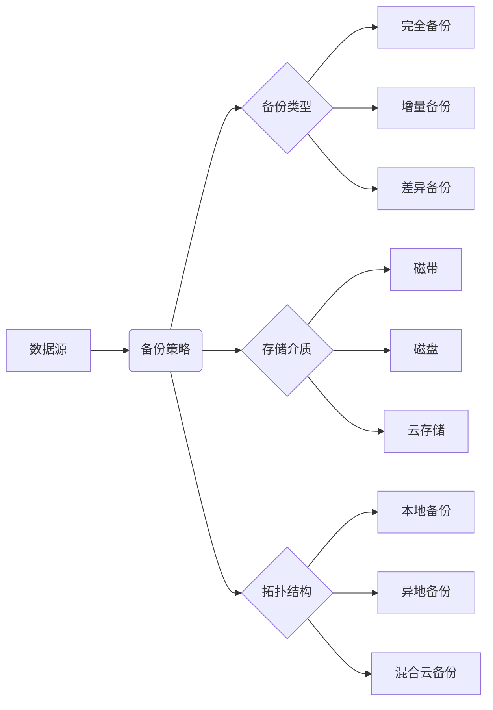

# 数据备份与恢复：未雨绸缪，防患于未然

## 1. 背景介绍
在当今数字化时代,数据已成为企业和组织最宝贵的资产之一。然而,各种意外事件如硬件故障、软件错误、网络攻击、自然灾害等都可能导致数据丢失或损坏,给企业造成巨大损失。因此,建立完善的数据备份与恢复策略至关重要。本文将深入探讨数据备份与恢复的核心概念、关键技术、最佳实践以及未来发展趋势,为企业构建稳健的数据保护体系提供参考。

### 1.1 数据备份与恢复的重要性
#### 1.1.1 保护关键业务数据
#### 1.1.2 确保业务连续性
#### 1.1.3 满足合规性要求

### 1.2 数据丢失的常见原因
#### 1.2.1 硬件故障
#### 1.2.2 软件错误和数据损坏
#### 1.2.3 人为失误
#### 1.2.4 网络攻击和恶意软件
#### 1.2.5 自然灾害

## 2. 核心概念与联系
### 2.1 数据备份
#### 2.1.1 完全备份
#### 2.1.2 增量备份
#### 2.1.3 差异备份

### 2.2 数据恢复
#### 2.2.1 即时恢复
#### 2.2.2 裸机恢复
#### 2.2.3 应用级恢复

### 2.3 RPO与RTO
#### 2.3.1 恢复点目标(RPO)
#### 2.3.2 恢复时间目标(RTO)
#### 2.3.3 RPO与RTO的平衡

### 2.4 备份存储介质
#### 2.4.1 磁带
#### 2.4.2 磁盘
#### 2.4.3 云存储

### 2.5 备份拓扑结构
#### 2.5.1 本地备份
#### 2.5.2 异地备份
#### 2.5.3 混合云备份



## 3. 核心算法原理具体操作步骤
### 3.1 增量备份算法
#### 3.1.1 文件级增量备份
#### 3.1.2 块级增量备份
#### 3.1.3 增量备份的优缺点

### 3.2 差异备份算法 
#### 3.2.1 差异备份原理
#### 3.2.2 差异备份的优缺点

### 3.3 合成完全备份
#### 3.3.1 合成完全备份原理
#### 3.3.2 合成完全备份的优势

### 3.4 重复数据删除
#### 3.4.1 重复数据删除原理
#### 3.4.2 固定长度分块与可变长度分块
#### 3.4.3 重复数据删除的优势

### 3.5 持续数据保护(CDP)
#### 3.5.1 CDP原理
#### 3.5.2 CDP与传统备份的区别
#### 3.5.3 CDP的优势与局限性

## 4. 数学模型和公式详细讲解举例说明
### 4.1 备份存储容量估算
假设数据增长率为 $r$,备份保留时间为 $t$,初始数据量为 $D_0$,则第 $n$ 个备份时间点的数据总量 $D_n$ 可表示为:

$$D_n = D_0 \times (1+r)^n$$

若采用完全备份+增量备份的策略,且增量备份的平均压缩率为 $c$,则总备份存储容量 $S$ 为:

$$S = D_0 + \sum_{i=1}^{t/n}D_0 \times r \times n \times c^i$$

### 4.2 数据传输时间估算
假设网络带宽为 $B$,数据量为 $D$,数据传输时间 $T$ 可表示为:

$$T = \frac{D}{B}$$

若考虑网络抖动和延迟等因素,实际传输时间 $T'$ 可表示为:

$$T' = T \times (1+\alpha)$$

其中 $\alpha$ 为网络抖动系数,一般取值为 0.1~0.5。

## 5. 项目实践：代码实例和详细解释说明
### 5.1 使用rsync进行增量备份
```bash
#!/bin/bash
# 源目录
src_dir="/data/src"
# 备份目录 
dst_dir="/data/backup"
# 使用rsync进行增量备份
rsync -avz --delete $src_dir $dst_dir
```

rsync是一个快速增量文件传输工具,通过比较源目录和目标目录的文件差异,只同步发生变化的文件,从而实现高效的增量备份。其中:
- `-a` : 以归档模式传输,保留文件属性
- `-v` : 输出详细信息
- `-z` : 启用压缩传输
- `--delete` : 删除目标目录中源目录不存在的文件,保持两者一致

### 5.2 使用Python实现重复数据删除
```python
import hashlib

def chunk_file(file_path, chunk_size=4096):
    """按固定块大小分割文件"""
    with open(file_path, "rb") as f:
        while True:
            chunk = f.read(chunk_size)
            if not chunk:
                break
            yield chunk

def deduplicate(file_path, hash_dict):
    """重复数据删除"""
    for chunk in chunk_file(file_path):
        chunk_hash = hashlib.md5(chunk).hexdigest()
        if chunk_hash not in hash_dict:
            hash_dict[chunk_hash] = chunk
    return hash_dict

# 去重示例
hash_dict = {}
deduplicate("file1.txt", hash_dict)
deduplicate("file2.txt", hash_dict)
```

上述代码实现了一个简单的重复数据删除功能:
1. 将文件按固定块大小(如4KB)分割成多个数据块
2. 对每个数据块计算MD5哈希值
3. 将哈希值作为key,数据块作为value存入字典
4. 对多个文件重复上述步骤,最终得到去重后的数据块字典

实际应用中,还需考虑可变长度分块、哈希冲突处理、数据块存储等优化措施。

## 6. 实际应用场景
### 6.1 数据库备份与恢复
#### 6.1.1 全量备份与日志备份
#### 6.1.2 数据库复制与高可用
#### 6.1.3 数据库容灾与异地恢复

### 6.2 虚拟机备份与恢复
#### 6.2.1 虚拟机快照
#### 6.2.2 虚拟机复制与迁移
#### 6.2.3 虚拟化平台灾备

### 6.3 云数据备份与恢复
#### 6.3.1 云存储快照与版本控制
#### 6.3.2 云数据库备份与恢复
#### 6.3.3 云灾备与跨区域复制

### 6.4 移动终端数据备份与恢复
#### 6.4.1 移动设备云备份
#### 6.4.2 移动应用数据备份与同步
#### 6.4.3 移动终端容灾与数据恢复

## 7. 工具和资源推荐
### 7.1 开源备份工具
- Amanda: 自动化网络备份系统
- Bacula: 企业级网络备份解决方案
- Duplicati: 基于块级重复数据删除的备份工具

### 7.2 商业备份软件
- Veritas NetBackup: 跨平台企业级数据保护平台
- Commvault: 智能化数据管理与保护
- IBM Spectrum Protect: 统一数据保护解决方案

### 7.3 云备份服务
- AWS Backup: 基于AWS云平台的集中化备份服务
- Azure Backup: 基于Azure云平台的备份即服务
- Google Cloud Backup: 基于Google Cloud的备份与灾难恢复服务

### 7.4 行业标准与最佳实践
- ISO/IEC 27040:2015 存储安全标准
- NIST SP 800-34 应急规划指南
- 3-2-1备份原则: 至少3份副本,2种存储介质,1份异地存放

## 8. 总结：未来发展趋势与挑战
### 8.1 云原生数据保护
#### 8.1.1 容器化备份
#### 8.1.2 无服务器备份
#### 8.1.3 云存储快照编排

### 8.2 人工智能与机器学习
#### 8.2.1 智能化备份策略
#### 8.2.2 异常检测与预测性维护
#### 8.2.3 自动化恢复流程

### 8.3 区块链与数据安全
#### 8.3.1 基于区块链的数据验证
#### 8.3.2 不可篡改的数据备份
#### 8.3.3 去中心化数据存储

### 8.4 备份即服务的发展
#### 8.4.1 多云与混合云备份
#### 8.4.2 备份服务API化
#### 8.4.3 按需付费与弹性扩展

### 8.5 数据隐私与合规挑战
#### 8.5.1 数据跨境传输与数据主权
#### 8.5.2 数据脱敏与加密
#### 8.5.3 数据生命周期管理

随着数字化转型的不断深入,数据备份与恢复技术也在不断发展。云计算、人工智能、区块链等新兴技术为数据保护带来了新的机遇与挑战。企业需要与时俱进,采用先进的备份与恢复策略,并重视数据隐私保护与合规性,才能在数据时代立于不败之地。

## 9. 附录：常见问题与解答
### Q1: 备份频率应该设置多少?
A1: 备份频率取决于数据变更频率、业务 RTO/RPO 要求等因素。通常建议关键业务系统采用日备份+归档备份相结合的策略,一般业务系统可采用周备份+月备份的策略。

### Q2: 备份数据应该保留多长时间?
A2: 备份数据保留时间取决于行业法规、数据价值、存储成本等因素。一般而言,对于关键业务数据,建议至少保留1-3年;对于一般业务数据,可以根据实际需求确定保留时间,通常为3-6个月。

### Q3: 如何验证备份数据的有效性?
A3: 定期对备份数据进行恢复演练是验证备份有效性的最佳方式。此外,还可以采用抽样校验、一致性检查等技术手段来验证备份数据的完整性和正确性。

### Q4: 增量备份和差异备份如何选择?
A4: 增量备份每次只备份上次备份后的变化数据,恢复时需要依次应用所有增量备份,恢复速度较慢但备份速度快、存储空间小。差异备份每次备份自上次完全备份后的变化数据,恢复时只需完全备份+最新差异备份,恢复速度快但备份速度慢、存储空间大。可根据恢复速度、备份窗口、存储空间等因素进行权衡选择。

### Q5: 如何制定有效的灾难恢复计划?
A5: 灾难恢复计划需要考虑业务影响分析、风险评估、资源配置、流程设计、定期演练等方面。一个有效的灾难恢复计划应包括:
- 明确的 RTO 和 RPO 目标
- 详细的应急预案和恢复步骤
- 充足的硬件、软件、网络等资源准备
- 定期的演练和评估机制
- 与业务连续性计划的有效衔接

制定科学完善的灾难恢复计划,并落实到日常的备份与恢复管理中,是保障业务连续性的关键。

作者：禅与计算机程序设计艺术 / Zen and the Art of Computer Programming