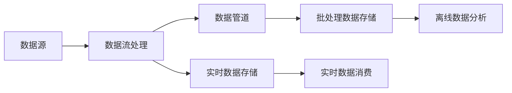

# 数据管道与数据流原理与代码实战案例讲解

## 1. 背景介绍

在当今大数据时代,数据已成为企业和组织最宝贵的资产之一。然而,原始数据通常分散在不同的系统和存储中,需要经过收集、转换、清洗等一系列处理才能为业务分析和决策提供支持。数据管道(Data Pipeline)和数据流(Data Stream)技术应运而生,旨在高效、自动化地完成数据的采集、处理和交付,为数据价值的释放提供了重要手段。

本文将深入探讨数据管道和数据流的核心概念和原理,并结合实际代码案例,讲解如何构建高效、可靠的数据处理流程。通过对数据管道和数据流技术的系统性介绍,帮助读者掌握数据处理的关键技能,更好地应对海量数据挖掘和分析的挑战。

## 2. 核心概念与联系

### 2.1 数据管道

数据管道是一种数据处理架构,用于将原始数据从源头传输到目标系统,并在传输过程中对数据进行转换、清洗和聚合等操作。一个典型的数据管道由以下几个关键组件构成:

- 数据源(Data Source):数据的来源,可以是数据库、文件系统、API接口等。
- 数据转换(Data Transformation):对原始数据进行结构化处理,如过滤、映射、聚合等。
- 数据存储(Data Storage):将处理后的数据持久化存储,常见的存储包括数据库、数据仓库、分布式文件系统等。
- 数据消费(Data Consumption):数据最终被应用程序或业务系统消费和使用。

### 2.2 数据流

数据流是一种持续不断的数据处理模式,数据以流的形式实时产生和处理。与数据管道偏重于批量数据处理不同,数据流强调实时性和连续性。数据流的关键特征包括:

- 实时性(Real-time):数据一经产生就立即被处理,延迟通常在毫秒级。
- 无界性(Unbounded):数据流是持续不断的,没有固定的起止边界。
- 乱序性(Out-of-order):由于数据来源的多样性,数据到达的顺序可能与产生顺序不一致。

### 2.3 数据管道与数据流的关系

数据管道和数据流并非完全独立的概念,它们在数据处理中互为补充:

- 数据管道侧重离线批处理,适合周期性、大批量的数据处理场景。
- 数据流侧重实时处理,适合对延迟敏感、持续产生的数据进行处理。
- 数据流的处理结果可作为数据管道的数据源,形成批流一体的数据处理架构。

下图展示了数据管道与数据流在整个数据处理架构中的位置和关系:



## 3. 核心算法原理与具体操作步骤

### 3.1 数据管道的核心算法

数据管道的核心算法主要涉及数据转换和聚合操作,常见的算法包括:

#### 3.1.1 ETL算法

ETL(Extract-Transform-Load)是数据管道的经典算法,包括数据抽取、转换和加载三个步骤:

1. 数据抽取:从源系统获取原始数据。
2. 数据转换:对原始数据进行清洗、结构化、格式转换等处理。
3. 数据加载:将转换后的数据加载到目标存储系统。

#### 3.1.2 增量处理算法

增量处理是指只对新增或变更的数据进行处理,避免重复处理全量数据,提高效率。常见的增量处理算法有:

- 基于时间戳的增量处理:根据数据的时间戳判断是否为新增或变更数据。
- 基于Binlog的增量处理:通过解析数据库的Binlog日志获取增量数据。
- 基于Snapshot的增量处理:周期性地对数据进行全量快照,通过快照比对获取增量数据。

### 3.2 数据流的核心算法

数据流的核心算法围绕实时计算展开,常见的算法包括:

#### 3.2.1 窗口算法

窗口是数据流处理的基本单位,将无界的数据流切分成有界的数据集合。常见的窗口类型有:

- 滚动窗口(Tumbling Window):固定大小,不重叠。
- 滑动窗口(Sliding Window):固定大小,可重叠。
- 会话窗口(Session Window):根据会话超时时间动态划分。

窗口的核心算子包括:

- 窗口聚合(Window Aggregation):对窗口内的数据进行聚合计算。
- 窗口关联(Window Join):对不同数据流的窗口进行关联操作。

#### 3.2.2 状态管理算法

在数据流处理中,需要维护计算过程的中间状态,常见的状态管理算法包括:

- 检查点(Checkpoint):定期将状态数据持久化,用于故障恢复。
- 状态后端(State Backend):状态存储的后端实现,如内存、文件系统、数据库等。

### 3.3 具体操作步骤

构建数据管道和数据流的一般步骤如下:

1. 明确数据处理需求,确定数据源和目标存储。
2. 选择适合的数据处理框架,如Apache Beam、Flink、Spark等。
3. 定义数据处理的逻辑和转换操作。
4. 配置数据源和目标存储的连接信息。
5. 启动数据处理作业,监控作业运行状态。
6. 对处理结果进行验证和分析,优化数据处理流程。

## 4. 数学模型和公式详细讲解举例说明

在数据管道和数据流的设计中,涉及到一些基础的数学模型和公式,下面举例说明。

### 4.1 数据采样模型

在大数据处理中,对全量数据进行分析成本较高,通常采用数据采样的方法。常见的采样模型包括:

- 简单随机采样(Simple Random Sampling):每个数据点被选中的概率相等。
  $P(x_i) = \frac{1}{N}, i=1,2,...,N$
  其中,$N$为数据总量,$x_i$为第$i$个数据点。

- 分层采样(Stratified Sampling):将数据集分为不重叠的子集(层),再从每个子集中进行随机采样。
  $P(x_{ij}) = \frac{1}{N_j}, i=1,2,...,N_j, j=1,2,...,M$
  其中,$N_j$为第$j$层的数据量,$M$为层的总数。

### 4.2 数据流窗口模型

在数据流处理中,窗口是一种常用的数据切分和聚合模型。以滑动窗口为例,其数学定义为:

$W(t, s, l) = \{e | e.timestamp \in [t-l, t), e \in S\}$

其中:
- $W$表示窗口。
- $t$表示窗口的结束时间。
- $s$表示滑动步长。
- $l$表示窗口长度。
- $e$表示数据流中的事件。
- $S$表示数据流。

例如,对于一个10分钟长度、5分钟滑动步长的滑动窗口,第一个窗口的时间范围为[00:00, 00:10),第二个窗口的时间范围为[00:05, 00:15)。

### 4.3 数据流关联模型

在数据流关联(Join)操作中,常用的关联模型有:

- 内关联(Inner Join):只输出匹配的数据对。
  $R \bowtie S = \{(r,s) | r \in R, s \in S, r.key = s.key\}$
  
- 左外关联(Left Outer Join):输出左流的所有数据,未匹配的右流数据填充为空。
  $R \bowtie_{left} S = \{(r,s) | r \in R, s \in S, r.key = s.key\} \cup \{(r, null) | r \in R, \nexists s \in S, r.key = s.key\}$

其中,$R$和$S$表示两个数据流,$r$和$s$表示数据流中的事件,$key$为关联的键。

## 5. 项目实践:代码实例和详细解释说明

下面以一个实际的数据处理案例,演示如何使用Apache Flink构建数据流处理应用。

### 5.1 案例背景

假设我们有一个实时的订单数据流,需要统计每个商品的销售总额。数据格式如下:

```json
{
  "orderId": "O001",
  "productId": "P001",
  "amount": 100.0,
  "timestamp": "2023-06-01T10:00:00"
}
```

### 5.2 代码实现

```java
import org.apache.flink.api.common.functions.AggregateFunction;
import org.apache.flink.streaming.api.datastream.DataStream;
import org.apache.flink.streaming.api.environment.StreamExecutionEnvironment;
import org.apache.flink.streaming.api.windowing.assigners.TumblingEventTimeWindows;
import org.apache.flink.streaming.api.windowing.time.Time;

public class SalesAnalysis {

    public static void main(String[] args) throws Exception {
        // 创建执行环境
        StreamExecutionEnvironment env = StreamExecutionEnvironment.getExecutionEnvironment();

        // 读取订单数据流
        DataStream<Order> orderStream = env.addSource(new OrderSource());

        // 按商品ID分组,并按10分钟的滚动窗口进行聚合
        DataStream<SalesResult> resultStream = orderStream
                .keyBy(Order::getProductId)
                .window(TumblingEventTimeWindows.of(Time.minutes(10)))
                .aggregate(new SalesAggregator());

        // 打印结果
        resultStream.print();

        // 执行作业
        env.execute("Sales Analysis");
    }

    // 自定义聚合函数,计算销售总额
    public static class SalesAggregator implements AggregateFunction<Order, Double, SalesResult> {
        @Override
        public Double createAccumulator() {
            return 0.0;
        }

        @Override
        public Double add(Order order, Double accumulator) {
            return accumulator + order.getAmount();
        }

        @Override
        public SalesResult getResult(Double accumulator) {
            return new SalesResult(accumulator);
        }

        @Override
        public Double merge(Double a, Double b) {
            return a + b;
        }
    }

    // 订单类
    public static class Order {
        private String orderId;
        private String productId;
        private double amount;
        private long timestamp;

        // 构造函数、getter和setter方法省略
    }

    // 销售结果类 
    public static class SalesResult {
        private double totalAmount;

        public SalesResult(double totalAmount) {
            this.totalAmount = totalAmount;
        }

        // getter和setter方法省略
    }
}
```

### 5.3 代码解释

1. 首先创建Flink的执行环境`StreamExecutionEnvironment`。
2. 通过`addSource`方法读取订单数据流。
3. 使用`keyBy`方法按商品ID对订单流进行分组。
4. 使用`window`方法定义10分钟的滚动窗口,将订单事件按窗口进行划分。
5. 使用`aggregate`方法对窗口内的订单进行聚合,计算销售总额。聚合逻辑在`SalesAggregator`类中实现。
6. 通过`print`方法将聚合结果输出到控制台。
7. 最后调用`execute`方法启动作业。

在`SalesAggregator`类中,实现了`AggregateFunction`接口,定义了销售总额的聚合逻辑:

- `createAccumulator`:创建初始的累加器,即销售总额的初始值为0。
- `add`:将每个订单的金额累加到累加器上。
- `getResult`:当窗口触发计算时,将累加器的值作为聚合结果返回。
- `merge`:合并两个累加器的值,在并行计算时使用。

通过以上代码,我们实现了一个实时的订单销售分析应用,能够每10分钟统计一次各个商品的销售总额。

## 6. 实际应用场景

数据管道和数据流技术在实际业务中有广泛的应用,下面列举几个典型场景:

### 6.1 实时推荐系统

在电商、内容平台等领域,实时推荐是提升用户体验和业务收益的重要手段。通过收集用户的行为数据(如浏览、点击、购买等),利用数据流处理技术进行实时特征工程